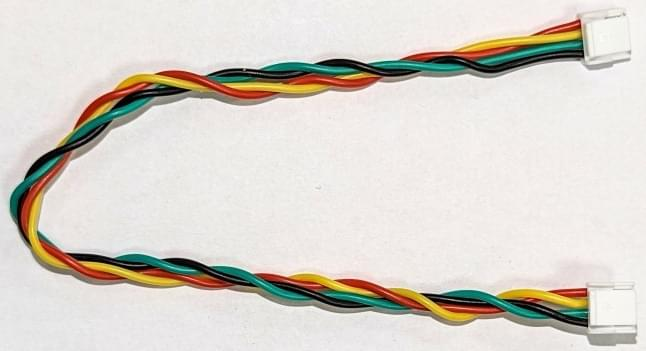
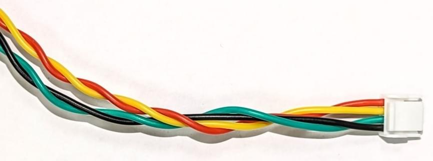
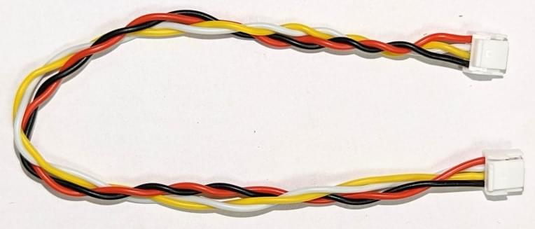

# Основи підключення дротів

Cables are a common source of [electromagnetic interference (EMI)](https://en.wikipedia.org/wiki/Electromagnetic_interference), which can cause problems including flyways, "toilet bowling" and generally poor flight.
Цих проблем можна уникнути, використовуючи відповідне кабелювання в БПЛА.

Слід пам'ятати наступні базові концепції при проектуванні кабелювання дрона:

- Кабелі високої потужності та сигнальні кабелі повинні бути розділені настільки, наскільки це практично.
- Довжина кабелів повинна бути мінімальною, достатньою для зручного оброблення провідних компонентів.
  The wire tension should be adequate to survive possible airframe deformations even in a crash landing
  (wires must not be the first thing to break).
- Петлі кабелів для зменшення зайвої довжини слід уникати - використовуйте коротші довжини!
- Для цифрових сигналів ви можете зменшити швидкість передачі даних, щоб зменшити випромінювану енергію та збільшити надійність передачі даних.
  Це означає, що ви можете використовувати більш довгі кабелі, коли високі швидкості передачі даних не потрібні.

## Проводка сигналу

Сигнальні протоколи мають різні характеристики, тому кабелі, що використовуються у кожному випадку, потребують трохи різних технічних характеристик.

This topic provides specific guidance of cabling for different signalling protocols, along with the [colour coding](#cable-colour-coding) used by a number different drone hardware vendors.

### Кабель I2C

The [I2C bus](https://en.wikipedia.org/wiki/I%C2%B2C) is widely used for connecting sensors.
Кольори кабелів від кількох постачальників вказані в наступній таблиці.

| Сигнал | Колір Pixhawk             | Кольори ThunderFly        | Кольори CUAV (I2C/CAN) |
| ------ | ------------------------- | ------------------------- | ----------------------------------------- |
| +5V    | ![red][rcircle] Red       | ![red][rcircle] Red       | ![red][rcircle] Red                       |
| SCL    | ![black][blkcircle] Black | ![yellow][ycircle] Yellow | ![white][wcircle] White                   |
| SDA    | ![black][blkcircle] Black | ![green][gcircle] Green   | ![yellow][ycircle] Yellow                 |
| GND    | ![black][blkcircle] Black | ![black][blkcircle] Black | ![black][blkcircle] Black                 |

The [Dronecode standard](https://github.com/pixhawk/Pixhawk-Standards/blob/master/DS-009%20Pixhawk%20Connector%20Standard.pdf) assumes a 1.5k ohm pull-up resistor on SDA and SCL signals in autopilot.

#### Cable twisting

Сигнал шини I2C та електромагнітна сумісність можуть бути значно покращені за допомогою належного скручування кабельних жил.
[Twisted pairs](https://en.wikipedia.org/wiki/Twisted_pair) is especially important for sensor wiring.

- 10 turns for each pair SCL/+5V and SDA/GND per 30cm cable length.
  
- 4 обертання обох пар разом на 30 см довжини кабелю.
  

При використанні відповідних скручених парних кабелів шина I²C, як правило, підходить для повітряних конструкцій масштабу підметра.
Для великих літаків використання інтерфейсу на основі CAN або іншої диференційної сигнальної передачі, як правило, є надійнішим.

:::info
This turns/cable-length recommendation has been successfully used with I2C sensors including the [ThunderFly TFSLOT airspeed sensor](../sensor/airspeed_tfslot.md) and [TFRPM01 Revolution Counter](../sensor/thunderfly_tachometer.md).
:::

#### Підтягуючі резистори

Підтяжки потрібні для всіх кінців шини I2C.
This acts both as [signal termination](https://en.wikipedia.org/wiki/Electrical_termination) and as bus idle signal generator.

Іноді для перевірки правильного значення підтяжних резисторів потрібне вимірювання осцилографом.
Сигнали на шині I2C повинні мати чіткі гострі прямокутні краї та амплітуду кількох вольт.
У випадку, якщо сигнал має низьку амплітуду, значення підтяжних резисторів занадто низьке і його слід зменшити.
У випадку закруглених сигналів, значення підтяжних резисторів занадто високе.

### Кабелі UAVCAN

| Сигнал                     | Pixhawk                   | ThunderFly                | Zubax                     | CUAV (I2C/CAN) |
| -------------------------- | ------------------------- | ------------------------- | ------------------------- | --------------------------------- |
| +5V                        | ![red][rcircle] Red       | ![red][rcircle] Red       | ![red][rcircle] Red       | ![red][rcircle] Red               |
| CAN_H | ![black][blkcircle] Black | ![white][wcircle] White   | ![white][wcircle] White   | ![white][wcircle] White           |
| CAN_L | ![black][blkcircle] Black | ![yellow][ycircle] Yellow | ![yellow][ycircle] Yellow | ![yellow][ycircle] Yellow         |
| GND                        | ![black][blkcircle] Black | ![black][blkcircle] Black | ![black][blkcircle] Black | ![black][blkcircle] Black         |

#### Cable Twisting

Кабелі CAN також повинні бути скручені, з точно такої ж причини, що і кабелі I2C.
Для CAN рекомендовано використовувати закручування:

- 10 turns for each pair GND/+5V and CAN_L/CAN_H per 30cm cable length.
  
- 4 обертання обох пар разом на 30 см довжини кабелю.

### SPI

[SPI](https://en.wikipedia.org/wiki/Serial_Peripheral_Interface) is synchronous serial communication interface used for connecting faster sensors and devices.
This protocol is commonly use is for connecting [optical flow](../sensor/optical_flow.md) sensors or special telemetry modems.

| Сигнал | Колір Pixhawk             | ThunderFly колір          |
| ------ | ------------------------- | ------------------------- |
| +5V    | ![red][rcircle] Red       | ![red][rcircle] Red       |
| SCK    | ![black][blkcircle] Black | ![yellow][ycircle] Yellow |
| MISO   | ![black][blkcircle] Black | ![blue][bluecircle] Blue  |
| MOSI   | ![black][blkcircle] Black | ![green][gcircle] Green   |
| CS!    | ![black][blkcircle] Black | ![white][wcircle] White   |
| CS2    | ![black][blkcircle] Black | ![blue][bluecircle] Blue  |
| GND    | ![black][blkcircle] Black | ![black][blkcircle] Black |

### UART

UART використовується для підключення периферійних пристроїв до автопілота.
За замовчуванням UART не підтримує мережу, тому він безпосередньо з'єднує два пристрої один з одним.
It is often used to connect an autopilot and a [radio modem](../telemetry/index.md).

CTS та RTS - це сигнали, які використовуються для позначення передачі даних на контактах TX/RX.
Цей механізм рукостискання збільшує надійність передачі даних.
CTS та RTS можуть залишатися вільними, коли їх не використовує пристрій.

Кабель підключення не перетнутий.
Отже, необхідно підключати лише автопілот та периферійні пристрої за допомогою цього прямого кабелю.
Пристрій повинен перетнути проводку внутрішньо, помінявши піни RX/TX та RTS/CTS.

| Сигнал | Колір Pixhawk             | ThunderFly колір          |
| ------ | ------------------------- | ------------------------- |
| +5V    | ![red][rcircle] Red       | ![red][rcircle] Red       |
| TX     | ![black][blkcircle] Black | ![white][wcircle] White   |
| RX     | ![black][blkcircle] Black | ![green][gcircle] Green   |
| CTS    | ![black][blkcircle] Black | ![blue][bluecircle] Blue  |
| RTS    | ![black][blkcircle] Black | ![yellow][ycircle] Yellow |
| GND    | ![black][blkcircle] Black | ![black][blkcircle] Black |

Сигнали UART є поширеними джерелами низькочастотних ЕМП, тому довжина кабелю повинна бути мінімізована настільки, наскільки це можливо. Для UART-кабелів не потрібно обертати кабель.

### GPS(UART) & SAFETY

[GPS receivers and magnetometers](../gps_compass/index.md) are generally very sensitive to EMI.
Тому їх слід монтувати подалі від джерел радіочастот (кабельного високовольтного живлення, регуляторів обертання, радіомодемів та їх антени).
Це може бути недостатньо, якщо кабельне з'єднання погано спроектоване.

| Сигнал                                                  | Колір Pixhawk             | ThunderFly колір          |
| ------------------------------------------------------- | ------------------------- | ------------------------- |
| +5V                                                     | ![red][rcircle] Red       | ![red][rcircle] Red       |
| TX                                                      | ![black][blkcircle] Black | ![white][wcircle] White   |
| RX                                                      | ![black][blkcircle] Black | ![green][gcircle] Green   |
| SCL                                                     | ![black][blkcircle] Black | ![yellow][ycircle] Yellow |
| SDA                                                     | ![black][blkcircle] Black | ![green][gcircle] Green   |
| SAFETY_SW                          | ![black][blkcircle] Black | ![white][wcircle] White   |
| SAFETY_SW_LED | ![black][blkcircle] Black | ![blue][bluecircle] Blue  |
| +3v3                                                    | ![black][blkcircle] Black | ![red][rcircle] Red       |
| BUZZER                                                  | ![black][blkcircle] Black | ![blue][bluecircle] Blue  |
| GND                                                     | ![black][blkcircle] Black | ![black][blkcircle] Black |

### GPS

| Сигнал | Колір Pixhawk             | ThunderFly колір          |
| ------ | ------------------------- | ------------------------- |
| +5V    | ![red][rcircle] Red       | ![red][rcircle] Red       |
| TX     | ![black][blkcircle] Black | ![white][wcircle] White   |
| RX     | ![black][blkcircle] Black | ![green][gcircle] Green   |
| SCL    | ![black][blkcircle] Black | ![yellow][ycircle] Yellow |
| SDA    | ![black][blkcircle] Black | ![green][gcircle] Green   |
| GND    | ![black][blkcircle] Black | ![black][blkcircle] Black |

Кабель GPS підключається як до шин UART, так і до шини I2C.
Оскільки скручування UART не застосовується, довжина кабелю повинна бути мінімізована настільки, наскільки це можливо.

### Аналоговий сигнал (модуль живлення)

| Сигнал  | Колір Pixhawk             | ThunderFly колір          | Колір CUAV                |
| ------- | ------------------------- | ------------------------- | ------------------------- |
| VCC     | ![red][rcircle] Red       | ![red][rcircle] Red       | ![red][rcircle] Red       |
| VCC     | ![black][blkcircle] Black | ![red][rcircle] Red       | ![red][rcircle] Red       |
| CURRENT | ![black][blkcircle] Black | ![white][wcircle] White   | ![white][wcircle] White   |
| VOLTAGE | ![black][blkcircle] Black | ![yellow][ycircle] Yellow | ![yellow][ycircle] Yellow |
| GND     | ![black][blkcircle] Black | ![black][blkcircle] Black | ![black][blkcircle] Black |
| GND     | ![black][blkcircle] Black | ![black][blkcircle] Black | ![black][blkcircle] Black |

Цей роз'єм - це приклад поєднання відносно високої потужності та низького напруги сигналізації.
На жаль, витягування застосовується лише для високовольтних дротів GND та VCC.
Це не дуже допомагає для шумного читання аналогових сигналів автопілотом.

### SAFETY

| Сигнал                                                  | Колір Pixhawk             | ThunderFly колір          |
| ------------------------------------------------------- | ------------------------- | ------------------------- |
| SAFE_VCC                           | ![red][rcircle] Red       | ![red][rcircle] Red       |
| SAFETY_SW_LED | ![black][blkcircle] Black | ![blue][bluecircle] Blue  |
| SAFETY_SW                          | ![black][blkcircle] Black | ![white][wcircle] White   |
| BUZZER                                                  | ![black][blkcircle] Black | ![blue][bluecircle] Blue  |
| +5V                                                     | ![black][blkcircle] Black | ![red][rcircle] Red       |
| GND                                                     | ![black][blkcircle] Black | ![black][blkcircle] Black |

## Високовольтне підключення

Для високовольтного проводування найважливішим критерієм проектування є належна товщина дроту, щоб забезпечити достатній струмовий потік.
Загальна вимога до перерізу - площа 1 мм² на кожні 8А струму проводу.

Хоча це рідко практично, корисно мати позитивні та негативні проводи скручені разом.

ЕМП від високовольтного кабелю має значний вплив на магнітометри.
З цієї причини завжди потрібно велике відокремлення між високовольтними кабелями та навігаційними магнітометрами.

### Кодування кольорів кабелю

Більшість виробників використовують червоний колір для лінії високої напруги та чорний для землі.
Інші кольори на власний розсуд виробника.
The [Pixhawk connector standard](https://github.com/pixhawk/Pixhawk-Standards/blob/master/DS-009%20Pixhawk%20Connector%20Standard.pdf) requires only that the Voltage Common Collector (VCC) pin/cable be red.

Кодування кольорів сигнальних проводів може допомогти визначити певні кабелі, що полегшить збирання вашого безпілотника.

Схема кодування кольорів, призначена для легкого ідентифікації кабелів, може дотримуватися наступних правил:

- Червоний і чорний кольори зарезервовані для живлення.
- Той самий тип сигналу повинен мати той самий колір.
- Колір сигналу не повторюється в роз'ємі для дротів, що прилягають один до одного.
- Проводові магістралі з однаковою кількістю контактів повинні мати унікальну послідовність кольорів.
  Це визначає тип кабелю.
  (Це особливо корисно для фотографій, які використовуються в посібнику).

Приклад кольорової позначки кабелю, розроблений згідно з цими правилами, є:

| Колір               | Назва   | Бажане використання                                           |
| ------------------- | ------- | ------------------------------------------------------------- |
| ![red][rcircle]     | Red     | Напруга живлення                                              |
| ![green][gcircle]   | Зелений | Загальний призначення сигнал                                  |
| ![white][wcircle]   | White   | Загальний призначення сигнал                                  |
| ![yellow][ycircle]  | Yellow  | Загальний призначення сигнал                                  |
| ![blue][bluecircle] | Синій   | Повернення живлення, Сигнал управління з відкритим колектором |
| ![black][blkcircle] | Black   | GND, Заземлення повернення живлення                           |

<!-- references for the image source.
This approach just allows more compact markdown -->

[ycircle]: ../../assets/hardware/cables/yellow.png
[rcircle]: ../../assets/hardware/cables/red.png
[gcircle]: ../../assets/hardware/cables/green.png
[wcircle]: ../../assets/hardware/cables/white.png
[bluecircle]: ../../assets/hardware/cables/blue.png
[blkcircle]: ../../assets/hardware/cables/black.png

:::info
The above rules were provided by Thunderfly and are used in their cable design.

Кодування кольорів кабелю для Thunderfly та деяких інших виробників наведено у розділах нижче.
Ярлики контактів відповідають роз'єму на боці автопілота.
Всі кабелі прямі (1:1).
Якщо вони потребують кросовер (наприклад, UART), це повинно бути вирішено внутрішнім з'єднанням пристроїв.
:::
