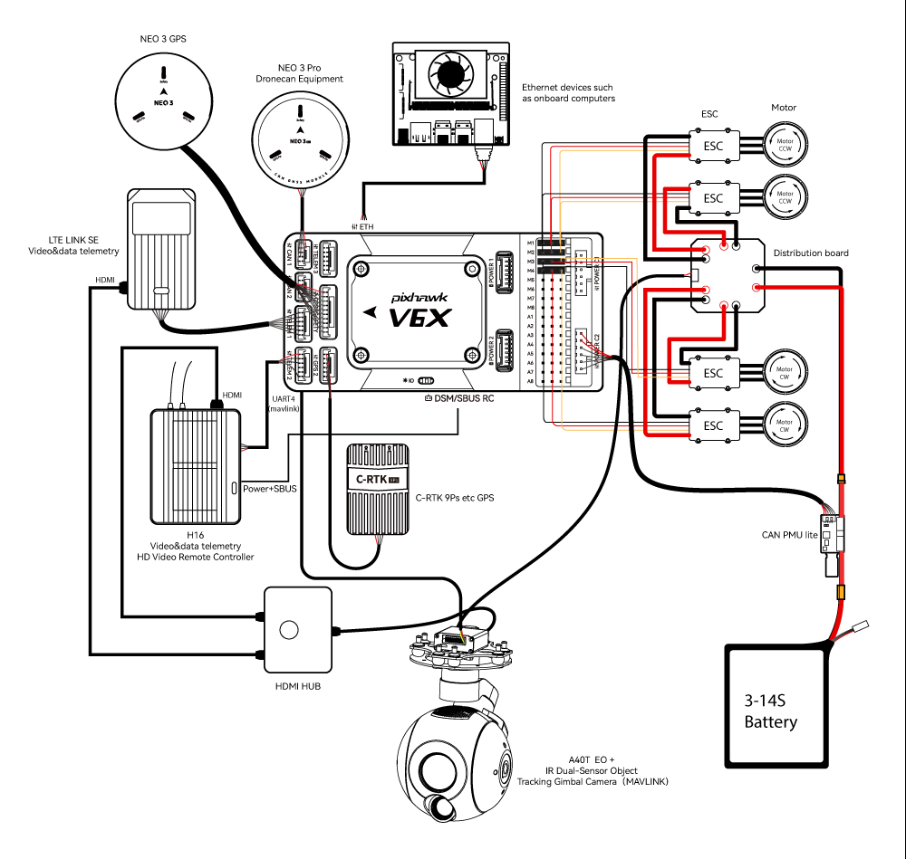
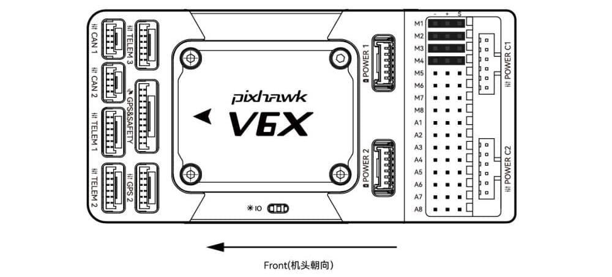
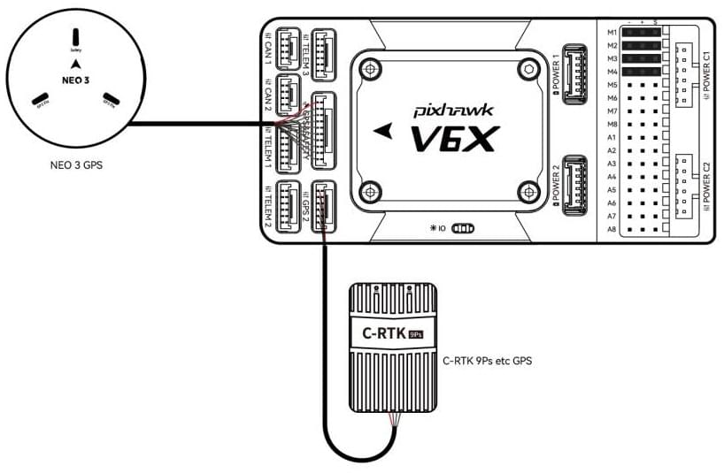
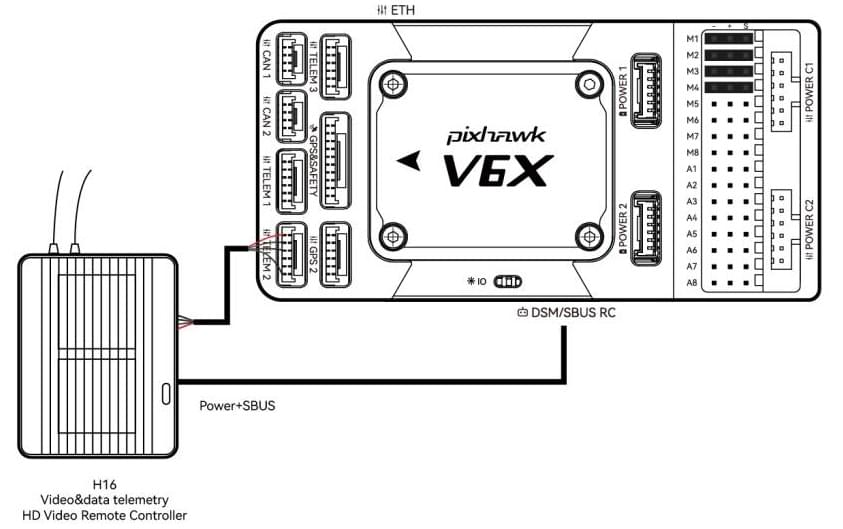
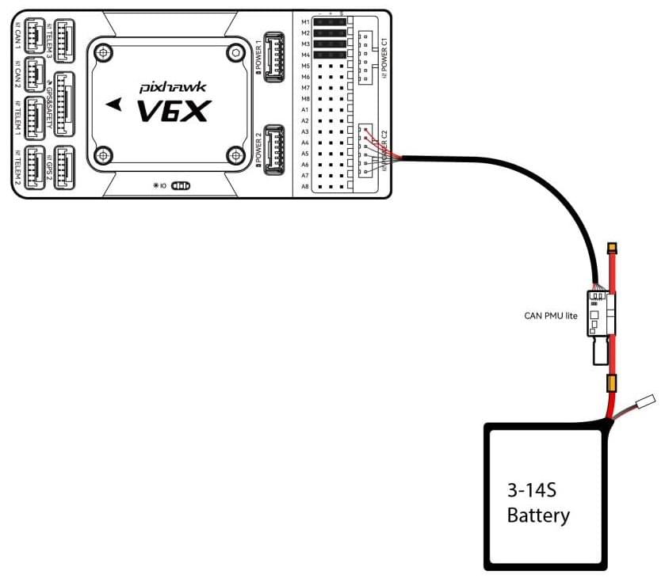
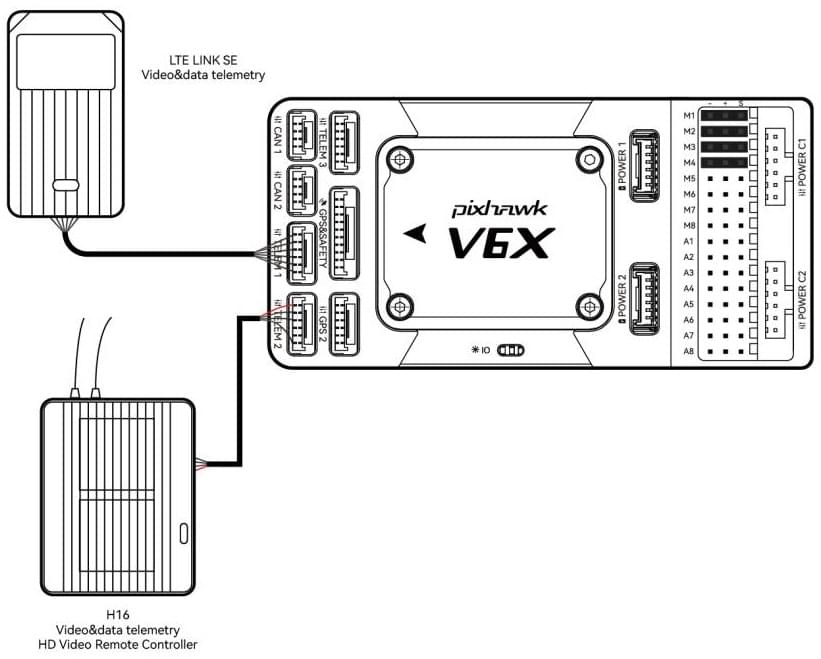
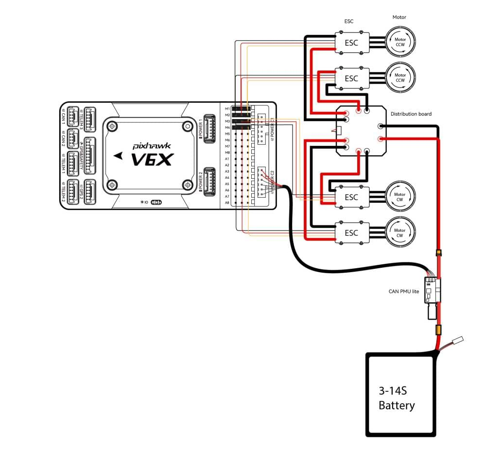
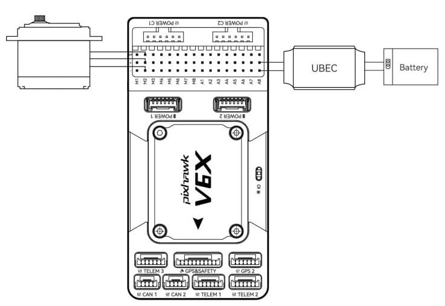
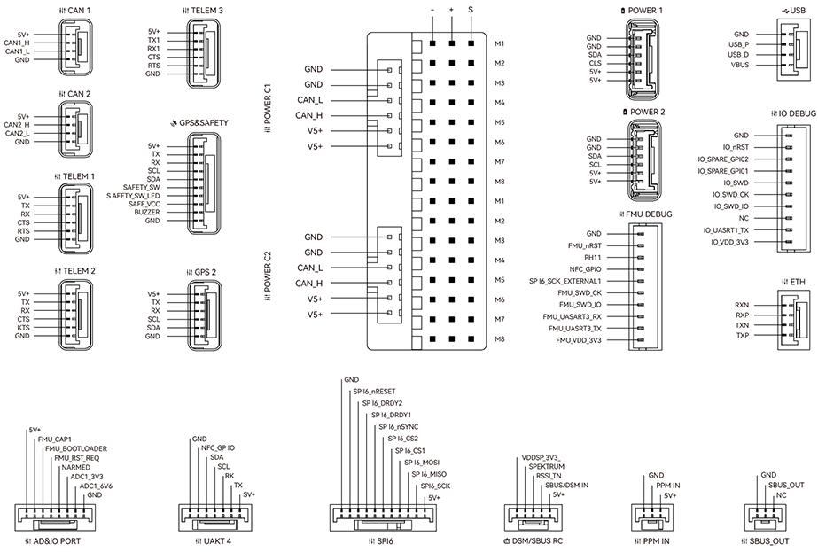

# Швидке підключення CUAV Pixhawk V6X

У цьому короткому посібнику показано, як увімкнути живлення польотного контролера [Pixhawk V6X&reg;](../flight_controller/cuav_pixhawk_v6x.md) та підключити до нього найважливіші периферійні пристрої.

## Огляд схеми підключення

На зображенні нижче показано, як під'єднати найважливіші датчики та периферійні пристрої (за винятком виходів мотора та сервоприводів).
Ми розглянемо кожну з них докладно в наступних розділах.

| Інтерфейс                        | **Function**                                                                                                                                                                                                                             |
| :------------------------------- | :--------------------------------------------------------------------------------------------------------------------------------------------------------------------------------------------------------------------------------------- |
| POWER C1                         | Підключіть CAN PMU SE до цього інтерфейсу; цей інтерфейс підключений до модуля живлення UAVCAN                                                                                                                                           |
| POWER C2                         | Підключіть CAN PMU SE до цього інтерфейсу; цей інтерфейс підключений до модуля живлення UAVCAN                                                                                                                                           |
| POWER 1                          | Підключіть модуль живлення SMbus (I2C)                                                                                                                                                                                |
| POWER 2                          | Підключіть модуль живлення SMbus (I2C)                                                                                                                                                                                |
| GPS&SAFETY   | Підключіть Neo серії GPS/C-RTK 9PS, включаючи GPS, запобіжний вимикач, інтерфейс зумера.                                                                                                                                 |
| GPS2                             | Підключіть модуль GPS/RTK                                                                                                                                                                                                                |
| UART 4                           | Користувацькі налаштування                                                                                                                                                                                                               |
| TELEM (1,2,3) | Підключіть телеметрію або пристрої MAVLink                                                                                                                                                                                               |
| TF CARD                          | Карта SD для зберігання журналів (карта попередньо вставлена на заводі).                                                                                                                              |
| M1~M8            | Вихідний IO PWM (для підключення до ESC і Servo)                                                                                                                                                                      |
| A1~A8            | FMU PWM вивід. Може бути визначено як PWM/GPIO; підтримує dshot; використовується для підключення затвора камери/гарячого черевика, сервоприводу тощо.                                                   |
| USB                              | Під'єднати до комп'ютера для зв'язку між контролером польоту та комп'ютером, наприклад, як завантаження прошивки.                                                                                                        |
| CAN1/CAN2                        | Підключає пристрої Dronecan/UAVCAN, такі як NEO3 Pro.                                                                                                                                                                    |
| DSM/SUB/RSSI                     | Включає інтерфейси введення сигналів DSM, SBUS, RSSI, інтерфейс DSM може бути підключений до супутникового приймача DSM, інтерфейс SBUS - до приймача дистанційного керування SBUS, RSSI - для модуля зворотного повернення сили сигналу |
| PPM                              | Підключення PPM RC Receiver                                                                                                                                                                                                              |
| ETH                              | Інтерфейс Ethernet. Підключіть пристрої Ethernet, такі як комп'ютери завдань                                                                                                                                             |
| AD&IO        | Є два аналогових входи (ADC3.3/ADC6.6); зазвичай не використовуються                                                                                                                  |

## Передній бампер

:::info
Якщо контролер не може бути змонтований у рекомендованому/стандартному положенні (наприклад, через обмеження місця), вам потрібно буде налаштувати програмне забезпечення автопілота з орієнтацією, яку ви фактично використовували: [Орієнтація контролера польоту](../config/flight_controller_orientation.md).
:::

## GPS + компас + зумер + захисний вимикач + світлодіод

Pixhawk® V6X можна придбати з GPS [NEO3](https://store.cuav.net/shop/neo-3/) (10-контактний роз'єм) та слід підключити до порту **GPS1**.
Ці модулі GNSS мають вбудований компас, безпечний перемикач, дзвіночок та світлодіод.

Якщо вам потрібно використовувати допоміжний GPS, підключіться до порту **GPS2**.

GPS/компас слід [монтувати на раму](../assembly/mount_gps_compass.md) якомога подалі від інших електронних пристроїв, з напрямком вперед транспортного засобу (відокремлення компаса від інших електронних пристроїв зменшить втручання).

:::info
Pixhawk V6X&reg; is not compatible with NEO V2 GPS built-in buzzer: you should use [NEO3/NEO 3Pro](https://store.cuav.net/shop/neo-3/) instead.
Вбудований безпечний вимикач в GPS-модулі увімкнений _за замовчуванням_ (коли включений, PX4 не дозволить вам готувати до польоту).
Щоб вимкнути безпеку, натисніть і утримуйте безпечний вимикач протягом 1 секунди.
Ви можете натиснути безпечний вимикач знову, щоб увімкнути безпеку та відключити транспортний засіб (це може бути корисно, якщо, з якихось причин, ви не можете вимкнути транспортний засіб за допомогою вашого пульта дистанційного керування або наземної станції).
:::

## Радіоуправління

Для того щоб керувати транспортним засобом _вручну_, потрібна система радіоуправління (RC) (PX4 не потребує системи радіоуправління для автономних режимів польоту).

Вам потрібно [вибрати сумісний передавач/приймач](../getting_started/rc_transmitter_receiver.md) і _зв'язати_ їх таким чином, щоб вони взаємодіяли (ознайомтеся з інструкціями, що додаються до вашого конкретного передавача/приймача).

- Приймачі Spektrum/DSM підключаються до входу **DSM/SBUS**.
- Приймачі PPM підключаються до вхідного порту **PPM**.

Для отримання додаткової інформації про вибір радіосистеми, сумісність приймача та зв'язок вашої передавача/приймача, див. статтю: [Пульт керування передавачів & приймачів](../getting_started/rc_transmitter_receiver.md).

## Power

Pixhawk V6X&reg; обладнаний модулем CAN PMU lite, який підтримує літійну батарею від 3 до 14s.
Connect the 6pin connector of the module to the flight control **Power C1** or **Power C2** interface.

Порт живлення _Pixhawk V6X_ отримує цифровий сигнал Dronecan від модуля живлення CAN PMU lite для напруги, поточного струму та даних про залишкову ємність батареї, лінія VCC повинна забезпечувати принаймні 3А постійного струму та за замовчуванням повинна бути 5,2 В.
Нижчий напруга 5V все ще прийнятний, але не рекомендується.

## Телеметрійна (радіо) система

[Телеметричні радіостанції](../telemetry/index.md) можуть використовуватися для зв'язку та управління транспортним засобом у польоті з наземної станції (наприклад, ви можете направляти БПЛА до певної позиції або завантажувати нове завдання).

Бортову радіостанцію слід підключити до порту **TELEM1**/**TELEM2**/**TELEM3**, як показано нижче (у разі підключення до **TELEM1**, подальша конфігурація не потрібна).
Інша радіостанція підключається до вашого комп'ютера або мобільного пристрою наземної станції (зазвичай за допомогою USB).

Ви також можете придбати телеметричні радіо з [магазину CUAV](https://store.cuav.net/uav-telemetry-module/).

## SD-карта

Картки SD настійно рекомендується, оскільки вони потрібні для [запису та аналізу даних польоту](../getting_started/flight_reporting.md), для виконання завдань та використання апаратного засобу UAVCAN bus.
Карта пам'яті SD вже встановлена на Pixhawk V6X&reg;, коли вона залишає фабрику.

:::tip
Для отримання додаткової інформації див. [Основні концепції > SD-карти (знімна пам'ять)](../getting_started/px4_basic_concepts.md#sd-cards-removable-memory).
:::

## Мотори/Сервоприводи

Двигуни/сервоприводи підключаються до портів **M1~M8** (**MAIN**) та **A1~A8** (**AUX**) в порядку, вказаному для вашого транспортного засобу в [Airframe Reference](../airframes/airframe_reference.md).

:::info
**Основні** виходи в ПЗ PX4 відображені на портах M1~M8 Pixhawk V6X (від IO), тоді як виходи **AUX** допоміжних функцій відображені на портах A1~A8 (від FMU).
Наприклад, **MAIN1** відображається на вивід M1, а **AUX1** відображається на вивід A1.
Цей довідник містить зіставлення портів виводу до моторів/сервоприводів для всіх підтримуваних повітряних та наземних шасі (якщо ваше шасі не вказане в довіднику, то використовуйте "загальний" планер відповідного типу).
:::

:::warning
Відображення не є однорідним для всіх конструкцій (наприклад, ви не можете покладатися на те, що ручка газу буде на тому ж вихідному порту для всіх повітряних конструкцій).
Переконайтеся, що ви використовуєте правильне зіставлення для вашого апарату.
:::

## Джерело живлення для сервоприводу

Pixhawk V6X&reg; не подає живлення на сервоприводи.
Якщо використовується літак або ровер, до будь-якої з контактів живлення (+) в M1~M8/A1~A8 потрібно підключити зовнішній BEC (наприклад, ESC з BEC або окремий BEC на 5 В або акумулятор LiPo на 2S) для керування сервоприводами.

:::info
Напруга шини живлення повинна бути відповідною для використаного сервоприводу!
:::

## Інші периферійні пристрої

Підключення та конфігурація додаткових/менш поширених компонентів описано в темах для окремих [периферійних пристроїв](../peripherals/index.md).

## Схема розташування виводів

## Налаштування

Загальну інформацію про конфігурацію описано в: [Конфігурація автопілота](../config/index.md).

Конкретні конфігурації QuadPlane тут: [QuadPlane VTOL налаштування](../config_vtol/vtol_quad_configuration.md)

## Подальша інформація

- [Документація CUAV](https://doc.cuav.net/) (CUAV)
- [Pixhawk V6X](../flight_controller/cuav_pixhawk_v6x.md) (Сторінка огляду документа PX4)
- [Pixhawk Автопілот FMUv6X Стандартний](https://github.com/pixhawk/Pixhawk-Standards/blob/master/DS-012%20Pixhawk%20Autopilot%20v6X%20Standard.pdf)
- [Стандарт шини автопілота Pixhawk](https://github.com/pixhawk/Pixhawk-Standards/blob/master/DS-010%20Pixhawk%20Autopilot%20Bus%20Standard.pdf)
- [Стандарт Pixhawk Connector Standard](https://github.com/pixhawk/Pixhawk-Standards/blob/master/DS-009%20Pixhawk%20Connector%20Standard.pdf)
