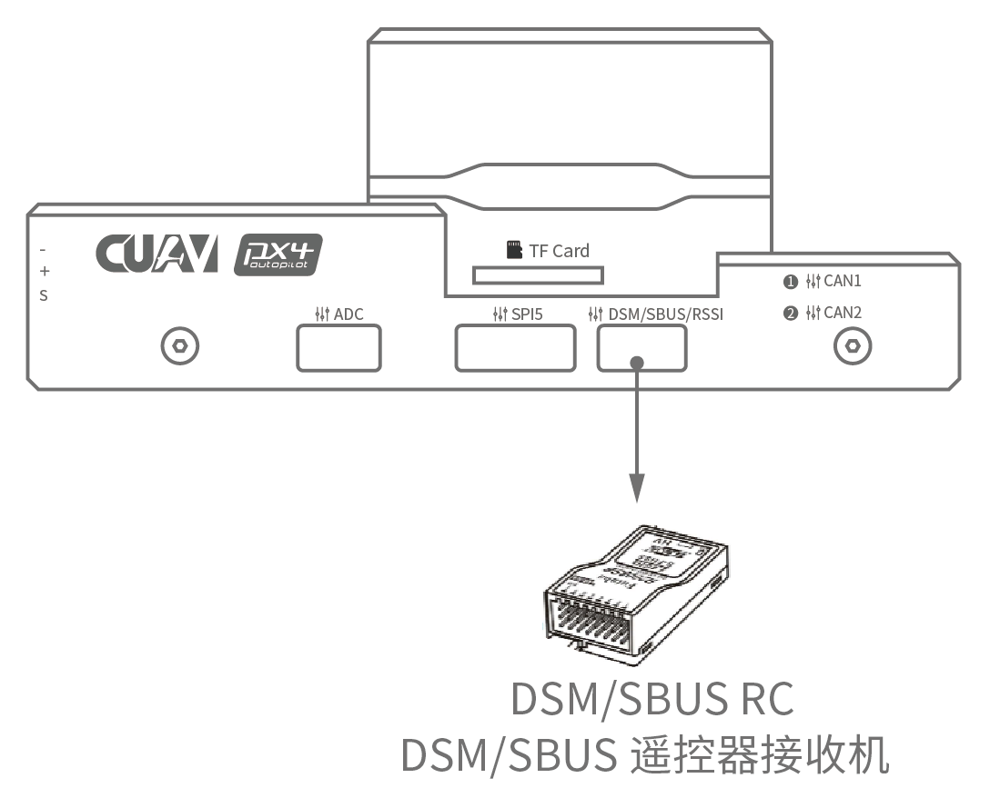

# Короткий посібник з підключення CUAV V5+

:::warning
PX4 не розробляє цей (або будь-який інший) автопілот.
Contact the [manufacturer](https://store.cuav.net/) for hardware support or compliance issues.
:::

This quick start guide shows how to power the [CUAV V5+](../flight_controller/cuav_v5_plus.md) flight controller and connect its most important peripherals.

## Огляд схеми підключення

На зображенні нижче показано, як під'єднати найважливіші датчики та периферійні пристрої (за винятком виходів мотора та сервоприводів).
Ми розглянемо кожну з них докладно в наступних розділах.

| Основний інтерфейс                 | Функція                                                                                                                                                                                                                                               |
| :--------------------------------- | :---------------------------------------------------------------------------------------------------------------------------------------------------------------------------------------------------------------------------------------------------- |
| Power1                             | Підключає модуль живлення. Power input with _analog_ voltage and current detection. Не використовуйте Digital PM на цьому роз'ємі!                                                                                    |
| Power2                             | Підключає i2c розумну батарею.                                                                                                                                                                                                        |
| TF CARD                            | Карта SD для зберігання журналів (карта попередньо вставлена на заводі).                                                                                                                                           |
| M1~M8              | PWM виходи. Може бути використаний для управління двигунами або сервоприводами.                                                                                                                                       |
| A1~A6              | PWM виходи. Може бути використаний для управління двигунами або сервоприводами.                                                                                                                                       |
| DSU7                               | Використовується для дебагінгу FMU, читання інформації щодо дебагінгу.                                                                                                                                                                |
| І2C1/I2C2                          | Підключає пристрій I2C, такий як зовнішній компас.                                                                                                                                                                                    |
| CAN1/CAN2                          | Підключає пристрої UAVCAN, такі як CAN GPS.                                                                                                                                                                                           |
| TYPE-C\(USB\) | Під'єднати до комп'ютера для зв'язку між контролером польоту та комп'ютером, наприклад, як завантаження прошивки.                                                                                                                     |
| SBUS OUT                           | Підключає пристрої SBUS (наприклад, камери з карданним підвісом).                                                                                                                                                  |
| GPS&SAFETY     | Приєднайтесь до Neo GPS, який містить GPS, перемикач безпеки, інтерфейс зумовлювача.                                                                                                                                                  |
| TELEM1/TELEM2                      | Під'єднатися до системи телеметрії.                                                                                                                                                                                                   |
| DSM/SBUS/RSSI                      | Включає інтерфейси введення сигналів DSM, SBUS, RSSI, інтерфейс DSM може бути підключений до приймача DSM-супутника, інтерфейс SBUS - до приймача дистанційного керування SBUS, RSSI - для модуля зворотного повернення сили сигналу. |

:::info
For more interface information, please read [V5+ Manual](http://manual.cuav.net/V5-Plus.pdf).
:::

:::info
If the controller cannot be mounted in the recommended/default orientation (e.g. due to space constraints) you will need to configure the autopilot software with the orientation that you actually used: [Flight Controller Orientation](../gps_compass/rtk_gps.md).
:::

## GPS + Компас + Безпечний вимикач + Світлодіоди

The recommended GPS module is the _Neo v2 GPS_, which contains GPS, compass, safety switch, buzzer, LED status light.

:::info
Other GPS modules may not work (see [this compatibility issue](../flight_controller/cuav_v5_nano.md#compatibility_gps)\)).
:::

The GPS/Compass module should be [mounted on the frame](../assembly/mount_gps_compass.md) as far away from other electronics as possible, with the direction marker towards the front of the vehicle (_Neo v2 GPS_ arrow is in the same direction as the flight control arrow).
Під'єднайтеся до інтерфейсу GPS контролера польоту за допомогою кабелю.

:::info
If you use the [NEO V2 PRO GNSS (CAN GPS)](http://doc.cuav.net/gps/neo-series-gnss/en/neo-v2-pro.html), please use the cable to connect to the flight control CAN interface.
:::

## Запобіжний перемикач

The dedicated safety switch that comes with the V5+ is only required if you are not using the recommended _Neo V2 GPS_ (which has an inbuilt safety switch).

If you are flying without the GPS you must attach the switch directly to the `GPS1` port in order to be able to arm the vehicle and fly (if you use the old 6-pin GPS, please read the definition of the bottom interface to change the line).

## Зумер

Якщо ви не використовуєте рекомендований GPS, зумер може не працювати.

## Радіоуправління

Для ручного керування вашим апаратом потрібна система дистанційного керування радіо (RC) (PX4 не вимагає наявності системи радіо для автономних режимів польоту).
Вам буде потрібно вибрати сумісний передавач/приймач та потім зв'язати їх, щоб вони взаємодіяли (прочитайте інструкції, що додаються до вашого конкретного передавача/приймача).

На малюнку нижче показано, як ви можете отримати доступ до вашого віддаленого приймача (знайдіть кабель SBUS у комплекті).

## Супутникові приймачі Spektrum

V5+ має присвячений кабель DSM.
Якщо використовується супутниковий приймач Spektrum, його слід підключити до інтерфейсу DSM/SBUS/RSSI контролера польоту.

## Power

The V5+ kit includes the _HV_PM_ module, which supports 2~14S LiPo batteries.
Connect the 6pin connector of the _HW_PM_ module to the flight control `Power1` interface.

:::warning
The supplied power module is unfused.
Power **must** be turned off while connecting peripherals.
:::

:::info
The power module is not a power source for peripherals connected to the PWM outputs.
Якщо ви підключаєте сервоприводи / приводи, вам потрібно окремо живити їх за допомогою BEC.
:::

## Система телеметрії (Опціонально)

Система телеметрії дозволяє вам спілкуватися, контролювати та управляти транспортним засобом у польоті з наземної станції (наприклад, ви можете направляти БПЛА до певної позиції або завантажувати нове завдання).

Канал зв'язку здійснюється через телеметричні радіостанції.
The vehicle-based radio should be connected to either the `TELEM1` or `TELEM2` port (if connected to these ports, no further configuration is required).
Інша радіостанція підключається до вашого комп'ютера або мобільного пристрою наземної станції (зазвичай через USB).

## SD-карта (Опціонально)

An [SD card](../getting_started/px4_basic_concepts.md#sd-cards-removable-memory) is inserted in the factory (you do not need to do anything).

## Двигуни

Motors/servos are connected to the MAIN and AUX ports in the order specified for your vehicle in the [Airframes Reference](../airframes/airframe_reference.md).

## Схема розташування виводів

Download **V5+** pinouts from [here](http://manual.cuav.net/V5-Plus.pdf).

## Подальша інформація

- [Airframe build-log using CUAV v5+ on a DJI FlameWheel450](../frames_multicopter/dji_f450_cuav_5plus.md)
- [CUAV V5+ Manual](http://manual.cuav.net/V5-Plus.pdf) (CUAV)
- [CUAV V5+ docs](http://doc.cuav.net/flight-controller/v5-autopilot/en/v5+.html) (CUAV)
- [FMUv5 reference design pinout](https://docs.google.com/spreadsheets/d/1-n0__BYDedQrc_2NHqBenG1DNepAgnHpSGglke-QQwY/edit#gid=912976165) (CUAV)
- [CUAV Github](https://github.com/cuav) (CUAV)
- [Base board design reference](https://github.com/cuav/hardware/tree/master/V5_Autopilot/V5%2B/V5%2BBASE) (CUAV)
