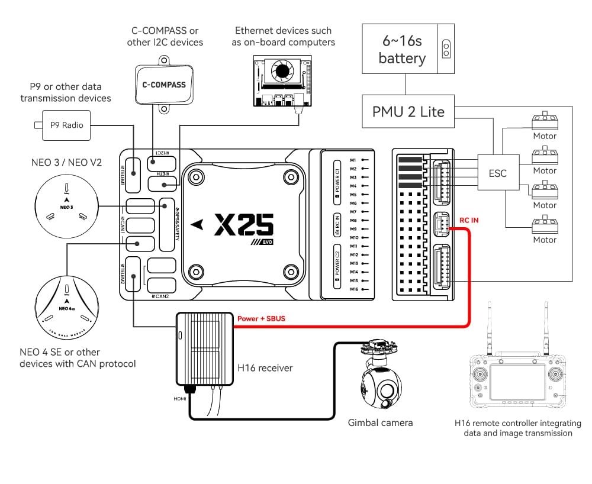
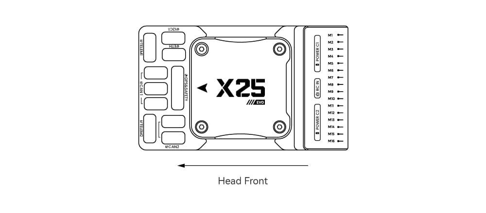
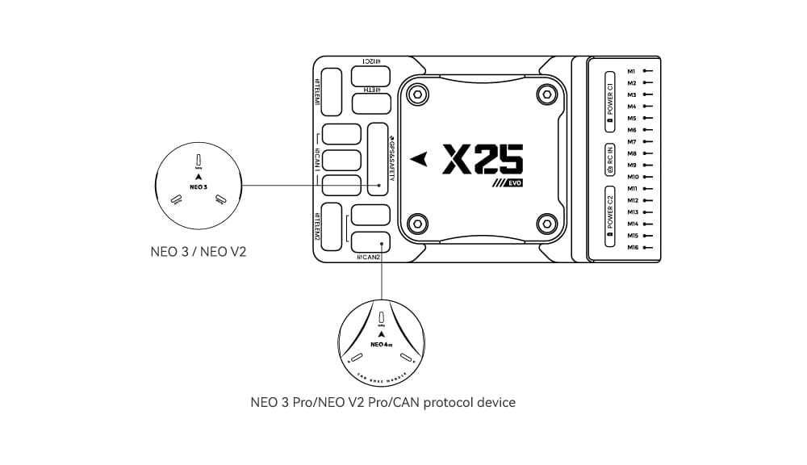
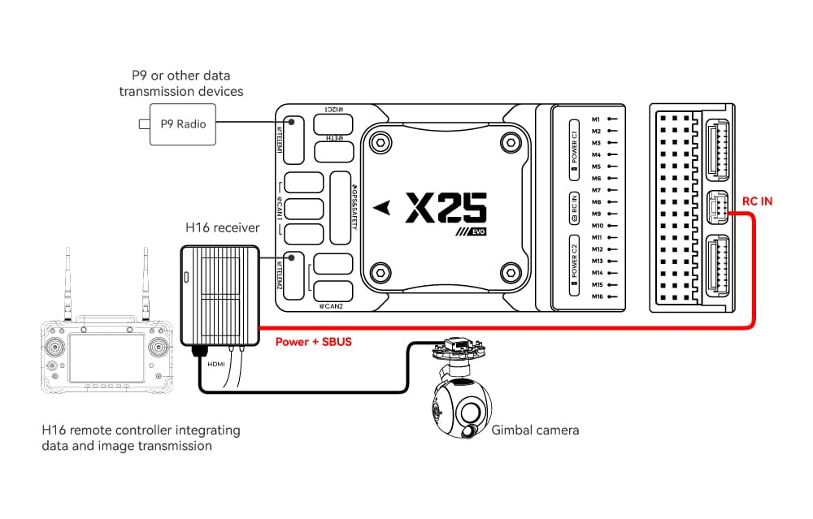
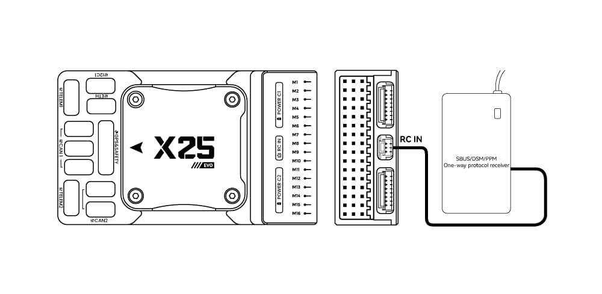
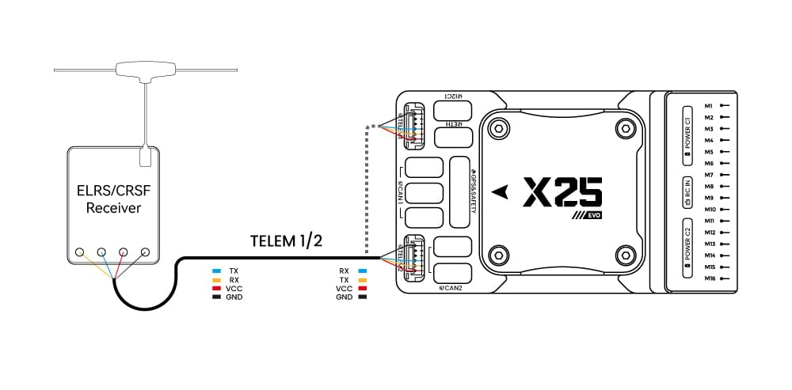
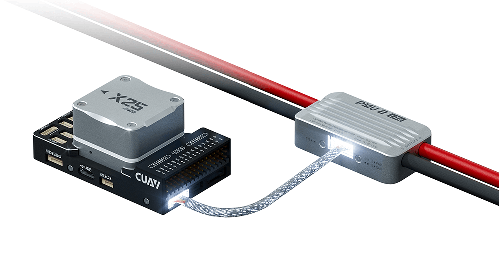
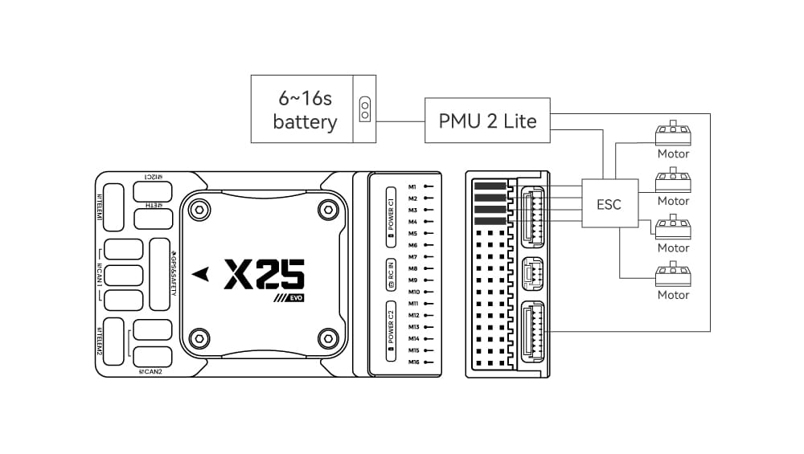
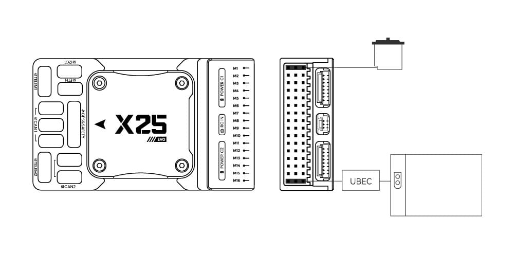

# CUAV X25 EVO Wiring Quick Start

:::warning
PX4 не розробляє цей (або будь-який інший) автопілот.
Contact the [manufacturer](https://store.cuav.net/) for hardware support or compliance issues.
:::

This quick start guide shows how to power the [X25 EVO](../flight_controller/cuav_x25-evo.md) flight controller and connect its most important peripherals.

:::info
The following flight controller models are applicable to this quick start guide.
[CUAV X25 SUPER](../flight_controller/cuav_x25-super.md)
:::

## Огляд схеми підключення

На зображенні нижче показано, як під'єднати найважливіші датчики та периферійні пристрої (за винятком виходів мотора та сервоприводів).
Ми розглянемо кожну з них докладно в наступних розділах.

| Інтерфейс                      | **Function**                                                                                                                                                                                                                                    |
| :----------------------------- | :---------------------------------------------------------------------------------------------------------------------------------------------------------------------------------------------------------------------------------------------- |
| POWER C1/C2                    | Connect the PMU2 Lite to this port; this port is used for connecting the DroneCAN power module                                                                                                                                                  |
| M1 ~ M16       | PWM signal output ports, usable for controlling motors or servos; support 3.3V/5V PWM configuration                                                                                                                             |
| RC IN                          | Connect remote controller receivers with one-way protocols (e.g., SBUS/DSM/PPM). Note: ELRS/CRSF receivers should be connected to any serial port, not RC IN |
| RSSI                           | For connecting signal strength feedback modules                                                                                                                                                                                                 |
| GPS&SAFETY | Connect Neo-series GPS or C-RTK-series RTK; this port includes interfaces for GPS, safety switch, and buzzer                                                                                                                                    |
| GPS2                           | Usable for connecting additional GPS/RTK modules                                                                                                                                                                                                |
| DEBUG (DSU) | For FMU chip debugging and reading debug device information; with ArduPilot firmware, it can be configured for other serial port functions                                                                                                      |
| ADC3V3                         | For analog level signal detection; the maximum detectable level signal is 3.3V                                                                                                                                                  |
| ADC6V6                         | For analog level signal detection; the maximum detectable level signal is 6.6V (PX4 is not supported.)                                                                                       |
| TF CARD                        | Insert an SD card here to enable log storage functionality                                                                                                                                                                                      |
| ETH                            | Ethernet port, usable for connecting Ethernet devices such as companion computers                                                                                                                                                               |
| I2C1/2/3                       | Connect external I2C devices (e.g., external compasses) for communication between the controller and I2C devices                                                                             |
| TELEM1/TELEM2                  | Connect telemetry modules (for data transmission) to enable MAVLINK data interaction                                                                                                                                         |
| CAN1/2                         | For communication between the controller and DroneCAN devices (e.g., connecting NEO4 SE GPS)                                                                                                 |
| TYPE C                         | USB port of the controller, usable for connecting to the ground station, flashing firmware, and other operations                                                                                                                                |
| SPI6                           | SPI port for external expansion; generally not used                                                                                                                                                                                             |

## Передній бампер

:::info
Якщо контролер не може бути змонтований у рекомендованому/стандартному положенні (наприклад, через обмеження місця), вам потрібно буде налаштувати програмне забезпечення автопілота з орієнтацією, яку ви фактично використовували: [Орієнтація контролера польоту](../config/flight_controller_orientation.md).
:::

## GPS + компас + зумер + захисний вимикач + світлодіод

We recommend using a CAN GPS/RTK (such as [Neo 4SE](https://store.cuav.net/shop/cuav-neo-4-se-gps-module/)); simply connect it to the **CAN 1** or **CAN 2** port.

You can also use a standard GPS/RTK module(such as [NEO3 GPS](https://store.cuav.net/shop/neo-3/) (10-pin connector)) by connecting it to the **GPS&SAFETY** port.
Most commonly used GPS modules today integrate GPS, compass, safety switch, buzzer, and LED status light.

Якщо вам потрібно використовувати допоміжний GPS, підключіться до порту **GPS2**.

The GPS/compass should be [mounted on the frame](../assembly/mount_gps_compass.md) as far away from other electronics as possible (separating the compass from other electronics will reduce interference), with the direction markings towards the front of the vehicle (the arrow on the NEO GPS should match the arrow on the flight controller).

:::info
Вбудований безпечний вимикач в GPS-модулі увімкнений _за замовчуванням_ (коли включений, PX4 не дозволить вам готувати до польоту).
To disable the safety, press and hold the safety switch for 1 second.
Ви можете натиснути безпечний вимикач знову, щоб увімкнути безпеку та відключити транспортний засіб (це може бути корисно, якщо, з якихось причин, ви не можете вимкнути транспортний засіб за допомогою вашого пульта дистанційного керування або наземної станції).
:::

## Радіоуправління

Для того щоб керувати транспортним засобом _вручну_, потрібна система радіоуправління (RC) (PX4 не потребує системи радіоуправління для автономних режимів польоту).

Вам потрібно [вибрати сумісний передавач/приймач](../getting_started/rc_transmitter_receiver.md) і _зв'язати_ їх таким чином, щоб вони взаємодіяли (ознайомтеся з інструкціями, що додаються до вашого конкретного передавача/приймача).

Connection methods vary by remote controller and receiver type:

### Android Remote Controllers

Take the H16 as an example:

Connect **TELEM1/TELEM2** to the UART0 port of the H16 remote controller, and link the H16’s SBUS pin to the **RC IN** port.

### SBUS/DSM/PPM Protocol Receivers

Use wires to connect the receiver to the **RC IN** port at the rear of the controller.

### ELRS/CRSF Receivers

Connect the [ELRS/CRSF](../telemetry/crsf_telemetry.md) receiver to any UART serial port of the X25 EVO (e.g., **TELEM2**).

## Power

The X25 EVO comes standard with the PMU2 Lite power module, which supports 20–70V input and can measure a maximum current of 220A.
It can be directly connected to the **Power C1/C2** port of the X25 EVO and is plug-and-play (no configuration required).

## Телеметрійна (радіо) система

[Telemetry system](../telemetry/index.md) allows you to communicate with the unmanned system via ground station software, enabling you to monitor and control the UAV’s status during flight. Connect the on-board unit of the telemetry system to the **TELEM1** or **TELEM2** port.

Ви також можете придбати телеметричні радіо з [магазину CUAV](https://store.cuav.net/uav-telemetry-module/).

## SD-карта

Картки SD настійно рекомендується, оскільки вони потрібні для [запису та аналізу даних польоту](../getting_started/flight_reporting.md), для виконання завдань та використання апаратного засобу UAVCAN bus.
An SD card is already installed on X25 EVO when it leaves the factory.

:::tip
Для отримання додаткової інформації див. [Основні концепції > SD-карти (знімна пам'ять)](../getting_started/px4_basic_concepts.md#sd-cards-removable-memory).
:::

## Мотори/Сервоприводи

Motors/servos are connected to the **M1~M16** ports in the order specified for your vehicle in the [Airframe Reference](../airframes/airframe_reference.md).

## Джерело живлення для сервоприводу

The X25 EVO does not supply power to servos. If you need to power servos:

1. Connect a BEC to the positive and negative terminals of any column among **M1 ~ M16** (the positive and negative terminals of **M1 ~ M16** are interconnected).
2. Then connect the servos to the same column.

:::info
Напруга шини живлення повинна бути відповідною для використаного сервоприводу!
:::

## Інші периферійні пристрої

Підключення та конфігурація додаткових/менш поширених компонентів описано в темах для окремих [периферійних пристроїв](../peripherals/index.md).

## Налаштування

Загальну інформацію про конфігурацію описано в: [Конфігурація автопілота](../config/index.md).

QuadPlane-specific configuration is covered here: [QuadPlane VTOL Configuration](../config_vtol/vtol_quad_configuration.md)

## Подальша інформація

- [Документація CUAV](https://doc.cuav.net/) (CUAV)
- [X25 EVO](../flight_controller/cuav_x25-evo.md) (PX4 Doc Overview page)
- [X25 SUPER](../flight_controller/cuav_x25-super.md) (PX4 Doc Overview page)
