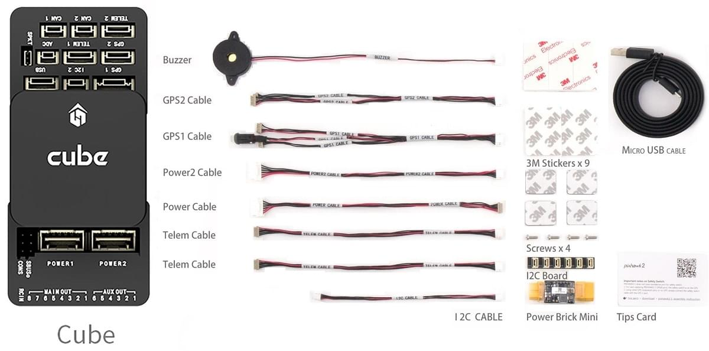

# Швидке підключення Cube

:::warning
PX4 не розробляє цей (або будь-який інший) автопілот.
Contact the [manufacturer](https://cubepilot.org/#/home) for hardware support or compliance issues.

Note also that while [Cube Black](../flight_controller/pixhawk-2.md) is [fully supported by PX4](../flight_controller/autopilot_pixhawk_standard.md), [Cube Yellow](../flight_controller/cubepilot_cube_yellow.md) and [Cube Orange](../flight_controller/cubepilot_cube_orange.md) are [Manufacturer Supported](../flight_controller/autopilot_manufacturer_supported.md).
:::

This quick start guide shows how to power the _Cube_&reg; flight controllers and connect their most important peripherals.

  

:::tip
The instructions apply to all Cube variants, including [Cube Black](../flight_controller/pixhawk-2.md), [Cube Yellow](../flight_controller/cubepilot_cube_yellow.md) and [Cube Orange](../flight_controller/cubepilot_cube_orange.md).
Further/updated information may be available in the [Cube User Manual](https://docs.cubepilot.org/user-guides/autopilot/the-cube-user-manual) (Cube Docs).
:::

## Аксесуари

Cube comes with most (or all) of the accessories you will need when [purchased](../flight_controller/pixhawk-2.md#stores).

The exception is that some kits do not include a GPS, which will have to be purchased separately ([see below](#gps)).

## Загальний огляд проводки

На зображенні нижче показано, як підключити найважливіші датчики та периферійні пристрої. Ми розглянемо кожну з них докладно в наступних розділах.

1. [Telemetry System](#telemetry) — Allows you to plan/run missions, and control and monitor the vehicle in real time. Зазвичай включає телеметричні радіо, планшет / ПК та програмне забезпечення для земної станції.
2. [Buzzer](#buzzer) — Provides audio signals that indicate what the UAV is doing
3. [Remote Control Receiver System](#rc_control) — Connects to a hand-held transmitter that an operator can use to manually fly the vehicle (shown is a PWM receiver with PWM->PPM converter).
4. (Dedicated) [Safety switch](#safety-switch) — Press and hold to lock and unlock motors. Only required if you are not using the recommended [GPS](#gps) with inbuilt safety switch.
5. [GPS, Compass, LED, Safety Switch](#gps) — The recommended GPS module contains GPS, Compass, LED and Safety Switch.
6. [Power System](#power) — Powers Cube and the motor ESCs. Складається з LiPo акумулятора, модуля живлення та необов'язкової системи попередження про рівень заряду акумулятора (аудіо попередження, якщо рівень заряду акумулятора падає нижче попередньо встановленого рівня).

:::info
The port labeled `GPS2` maps to `TEL4` in PX4 (i.e. if connecting to the port labeled `GPS2`, assign the [serial port configuration parameter](../peripherals/serial_configuration.md) for the connected hardware to `TEL4`).
:::

:::tip
More information about available ports can be found here: [Cube > Ports](../flight_controller/pixhawk-2.md#ports).
:::

## Монтаж та орієнтація контролера

Mount the Cube as close as possible to your vehicle’s center of gravity,
ideally oriented top-side up and with the arrow pointing towards the front of the vehicle (note the _subtle_ arrow marker on top of the cube)

:::info
Якщо контролер не може бути змонтований у рекомендованому/стандартному положенні (наприклад, через обмеження місця), вам потрібно буде налаштувати програмне забезпечення автопілота з орієнтацією, яку ви фактично використовували: [Орієнтація контролера польоту](../config/flight_controller_orientation.md).
:::

Куб може бути встановлений за допомогою або амортизуючих вібрації пінопластових підкладок (включених у комплект) або кріпильних гвинтів.
Гвинти кріплення в аксесуарах Куба призначені для рамки товщиною 1,8 мм.
Налаштовані гвинти повинні бути M2.5 з довжиною різьблення всередині Куба в діапазоні від 6 мм до 7.55 мм.

## GPS + Компас + Безпечний вимикач + Світлодіоди

The recommended GPS modules are the _Here_ and [Here+](../gps_compass/rtk_gps_hex_hereplus.md), both of which incorporate a GPS module, Compass, Safety Switch and [LEDs](../getting_started/led_meanings.md).
The difference between the modules is that _Here+_ supports centimeter level positioning via [RTK](../gps_compass/rtk_gps.md). В іншому випадку вони використовуються / підключаються так само.

:::warning
The [Here+](../gps_compass/rtk_gps_hex_hereplus.md) has been superseded by the [Here3](https://www.cubepilot.org/#/here/here3) a [DroneCAN](../dronecan/index.md) RTK-GNSS that incorporate a compass and [LEDs](../getting_started/led_meanings.md) (but no safety switch).
See [DroneCAN](../dronecan/index.md) for _Here3_ wiring and PX4 configuration information.
:::

Модуль слід монтувати на раму якомога подалі від інших електронних пристроїв, з напрямком вперед транспортного засобу (відокремлення компаса від інших електронних пристроїв зменшить втручання). It must be connected to the `GPS1` port using the supplied 8-pin cable.

Діаграма нижче показує схематичний вигляд модуля та його з'єднань.

:::info
Вбудований безпечний вимикач в GPS-модулі увімкнений _за замовчуванням_ (коли включений, PX4 не дозволить вам готувати до польоту).
Щоб вимкнути безпеку, натисніть і утримуйте безпечний вимикач протягом 1 секунди. Ви можете натиснути безпечний вимикач знову, щоб увімкнути безпеку та відключити транспортний засіб (це може бути корисно, якщо, з якихось причин, ви не можете вимкнути транспортний засіб за допомогою вашого пульта дистанційного керування або наземної станції).
:::

:::tip
If you want to use an old-style 6-pin GPS module, the kit comes with a cable that you can use to connect both the GPS and [Safety Switch](#safety-switch).
:::

## Запобіжний перемикач

The _dedicated_ safety switch that comes with the Cube is only required if you are not using the recommended [GPS](#gps) (which has an inbuilt safety switch).

If you are flying without the GPS you must attach the switch directly to the `GPS1` port in order to be able to arm the vehicle and fly (or via a supplied cable if using an old-style 6-pin GPS).

## Зумер

The buzzer plays [tones and tunes](../getting_started/tunes.md) that provide audible notification of vehicle status (including tones that are helpful for debugging startup issues, and that notify of conditions that might affect safe operation of the vehicle).

Дзвіночок слід підключити до порту USB, як показано (додаткова конфігурація не потрібна).

## Радіоуправління

A [remote control (RC) radio system](../getting_started/rc_transmitter_receiver.md) is required if you want to _manually_ control your vehicle (PX4 does not require a radio system for autonomous flight modes).

Вам потрібно [вибрати сумісний передавач/приймач](../getting_started/rc_transmitter_receiver.md) і _зв'язати_ їх таким чином, щоб вони взаємодіяли (ознайомтеся з інструкціями, що додаються до вашого конкретного передавача/приймача).

Нижче наведено інструкції, як підключити різні типи приймачів.

### PPM-SUM / Futaba S.Bus отримувачі

Підключіть дріт землі (-), живлення (+) та сигналу (S) до контактів RC за допомогою наданого трьохжильного серво-кабелю.

### Супутникові приймачі Spektrum

Spektrum DSM, DSM2, and DSM-X Satellite RC receivers connect to the **SPKT/DSM** port.

### Приймачі PWM

The Cube cannot directly connect to PPM or PWM receivers that have an _individual wire for each channel_.
PWM receivers must therefore connect to the **RCIN** port _via_ a PPM encoder module,
which may be purchased from hex.aero or proficnc.com.

## Power

Cube is typically powered from a Lithium Ion Polymer (LiPo) Battery via a Power Module (supplied with the kit) that is connected to the **POWER1** port.
The power module provides reliable supply and voltage/current indication to the board, and may _separately_ supply power to ESCs that are used to drive motors on a multicopter vehicle.

Типове живлення для транспортного засобу Multicopter показано нижче.

:::info
The power (+) rail of **MAIN/AUX** is _not powered_ by the power module supply to the flight controller.
Для керування сервоприводами керма, елеронами тощо, їх потрібно буде окремо живити.

Це можна зробити, підключивши живильну рейку до ESC з BEC, автономного BEC на 5V або 2S LiPo акумулятора.
Переконайтеся, що напруга сервопривода, яку ви збираєтеся використовувати, відповідає!
:::

## Система телеметрії (Опціонально)

Система телеметрії дозволяє вам спілкуватися, контролювати та управляти транспортним засобом у польоті з наземної станції (наприклад, ви можете направляти БПЛА до певної позиції або завантажувати нове завдання).

The communication channel is via [Telemetry Radios](../telemetry/index.md). The vehicle-based radio should be connected to the **TELEM1** port (if connected to this port, no further configuration is required). Інша радіостанція підключається до вашого комп'ютера або мобільного пристрою наземної станції (зазвичай через USB).

## SD-карта (Опціонально)

SD cards are highly recommended as they are needed to [log and analyse flight details](../getting_started/flight_reporting.md), to run missions, and to use UAVCAN-bus hardware.
Вставте картку Micro-SD в Куб, як показано (якщо вона ще не вставлена).

:::tip
Для отримання додаткової інформації див. [Основні концепції > SD-карти (знімна пам'ять)](../getting_started/px4_basic_concepts.md#sd-cards-removable-memory).
:::

## Двигуни

Motors/servos are connected to the **MAIN** and **AUX** ports in the order specified for your vehicle in the [Airframe Reference](../airframes/airframe_reference.md).

:::info
Цей довідник містить зіставлення портів виводу до моторів/сервоприводів для всіх підтримуваних повітряних та наземних шасі (якщо ваше шасі не вказане в довіднику, то використовуйте "загальний" планер відповідного типу).
:::

:::warning
Відображення не є однорідним для всіх конструкцій (наприклад, ви не можете покладатися на те, що ручка газу буде на тому ж вихідному порту для всіх повітряних конструкцій). Переконайтеся, що ви використовуєте правильне зіставлення для вашого апарату.
:::

## Інші периферійні пристрої

Підключення та конфігурація додаткових/менш поширених компонентів описано в темах для окремих [периферійних пристроїв](../peripherals/index.md).

:::info
If connecting peripherals to the port labeled `GPS2`, assign the PX4 [serial port configuration parameter](../peripherals/serial_configuration.md) for the hardware to `TEL4` (not GPS2).
:::

## Налаштування

Configuration is performed using [QGroundContro](http://qgroundcontrol.com/).

After downloading, installing and running _QGroundControl_, connect the board to your computer as shown.

Basic/common configuration information is covered in: [Autopilot Configuration](../config/index.md).

Конкретні конфігурації QuadPlane тут: [QuadPlane VTOL налаштування](../config_vtol/vtol_quad_configuration.md)

<!-- what about config of other vtol types and plane. Do the instructions in these ones above apply for tailsitters etc? -->

### Оновлення завантажувача

Якщо ви отримуєте сигнал попередження [Програма PX4IO(../getting_started/tunes.md#program-px4io) після прошивки програмного забезпечення PX4, вам може знадобитися оновити завантажувач.

Перемикач безпеки може бути використаний для примусового оновлення завантажувача.
Для використання цієї функції вимкніть живлення Куба, утримуйте перемикач безпеки, а потім підключіть живлення Куба через USB.

## Подальша інформація

- [Cube Black](../flight_controller/pixhawk-2.md)
- [Cube Yellow](../flight_controller/cubepilot_cube_yellow.md)
- [Cube Orange](../flight_controller/cubepilot_cube_orange.md)
- Cube Docs (виробник):
  - [Cube Module Overview](https://docs.cubepilot.org/user-guides/autopilot/the-cube-module-overview)
  - [Cube User Manual](https://docs.cubepilot.org/user-guides/autopilot/the-cube-user-manual)
  - [Mini Carrier Board](https://docs.cubepilot.org/user-guides/carrier-boards/mini-carrier-board)
