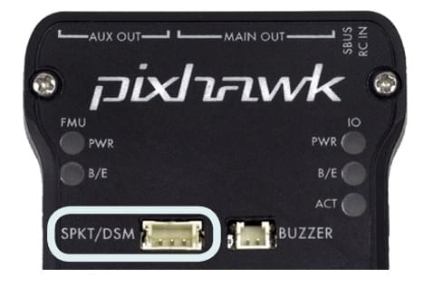

# Швидкий старт Pixhawk Wiring

:::warning
PX4 не розробляє цей (або будь-який інший) автопілот.
Contact the [manufacturer](https://store.mrobotics.io/) for hardware support or compliance issues.
:::

This quick start guide shows how to power the _3DR Pixhawk_ flight controller and connect its most important peripherals.

:::info
The [3DR Pixhawk](../flight_controller/pixhawk.md) is no longer available from 3DR.
Other flight controllers based on the [Pixhawk FMUv2 architecture](../flight_controller/pixhawk_series.md) are available from other companies (these share the same connections, outputs, functions, etc. and are wired in a similar way).
:::

## Огляд схеми підключення

На зображенні нижче показані стандартні підключення Pixhawk (за винятком виходів мотора та сервоприводів).
Ми розглянемо кожен основний елемент в наступних розділах.

:::info
More detailed wiring information is [shown below](#detailed-wiring-infographic-copter).
:::

## Монтаж та орієнтація контролера

The _Pixhawk_ should be mounted on the frame using vibration-damping foam pads (included in the kit).
Він повинен бути розташований якомога ближче до центру ваги вашого транспортного засобу, орієнтований верхньою стороною вгору зі стрілкою, що вказує вперед транспортного засобу.

:::info
Якщо контролер не може бути змонтований у рекомендованому/стандартному положенні (наприклад, через обмеження місця), вам потрібно буде налаштувати програмне забезпечення автопілота з орієнтацією, яку ви фактично використовували: [Орієнтація контролера польоту](../config/flight_controller_orientation.md).
:::

## Звуковий сигнал і захисний вимикач

Підключіть зумер і захисний вимикач, як показано нижче (вони є обов’язковими).

## GPS + Компас

Прикріпіть GPS (потрібно) до GPS порту, використовуючи 6-канальний кабель в комплекті. Додатково можна підключити компас до порту I2C за допомогою 4-жильного кабелю (у Pixhawk є вбудований компас, який можна використовувати за потреби).

:::info
На діаграмі показано комбінований GPS та компас.
GPS/Компас слід монтувати на раму якомога подалі від інших електронних пристроїв, з напрямком вперед транспортного засобу (відокремлення компаса від інших електронних пристроїв зменшить втручання).
:::

## Power

Connect the output of a _Power module_ (PM) to the **POWER** port using a 6-wire cable as shown. Вхід PM буде підключений до вашого акумулятора LiPo, а основний вихід буде постачати живлення для ESC/motor вашого транспортного засобу (можливо, через плату розподілу потужності).

Модуль живлення постачає контролер польоту енергією від акумулятора та також надсилає інформацію про аналоговий струм та напругу, що постачається через модуль (включаючи як потужність контролеру польоту, так і до моторів тощо).

:::warning
Модуль живлення постачає контролер польоту енергією, але не може живити сервоприводи та інше обладнання, підключене до виходних портів контролера (рейки). Для вертольотів це не має значення, оскільки мотори окремо живляться.
:::

Для літаків та ВТОЛ рейка виходу повинна бути окремо живлена для керування сервоприводами для рульових пристроїв, елеронами тощо. Often the main pusher/puller motor uses an ESC with an integrated [BEC](https://en.wikipedia.org/wiki/Battery_eliminator_circuit) that can be connected to the Pixhawk output rail. Якщо цього немає, вам доведеться налаштувати 5-вольтовий BEC для підключення до одного з вільних портів Pixhawk (без живлення сервоприводи не будуть працювати).

<!-- It would be good to have real example of this powering -->

## Радіоуправління

Для того щоб керувати транспортним засобом _вручну_, потрібна система радіоуправління (RC) (PX4 не потребує системи радіоуправління для автономних режимів польоту).

Вам потрібно [вибрати сумісний передавач/приймач](../getting_started/rc_transmitter_receiver.md) і _зв'язати_ їх таким чином, щоб вони взаємодіяли (ознайомтеся з інструкціями, що додаються до вашого конкретного передавача/приймача).

Нижче наведено інструкції, як підключити різні типи приймачів до Pixhawk:

- Spektrum and DSM receivers connect to the **SPKT/DSM** input.
  

- PPM-SUM and S.BUS receivers connect to the **RC** ground, power and signal pins as shown.
  

- PPM and PWM receivers that have an _individual wire for each channel_ must connect to the **RC** port _via a PPM encoder_ [like this one](http://www.getfpv.com/radios/radio-accessories/holybro-ppm-encoder-module.html) (PPM-Sum receivers use a single signal wire for all channels).

Для отримання додаткової інформації про вибір радіосистеми, сумісність приймача та зв'язок вашої передавача/приймача, див. статтю: [Пульт керування передавачів & приймачів](../getting_started/rc_transmitter_receiver.md).

## Телеметричні радіостанції (Опціонально)

Телеметричні радіостанції можуть використовуватися для зв'язку та управління транспортним засобом у польоті з наземної станції (наприклад, ви можете направляти БПЛА до певної позиції або завантажувати нове завдання). Один радіомодуль повинен бути підключений до вашого транспортного засобу, як показано нижче. Інший підключається до вашого комп'ютера або мобільного пристрою наземної станції (зазвичай за допомогою USB).

<!-- what configuration is required once you've set up a radio) -->

## Двигуни

The mappings between MAIN/AUX output ports and motor/servos for all supported air and ground frames are listed in the [Airframe Reference](../airframes/airframe_reference.md).

:::warning
Відображення не є однорідним для всіх конструкцій (наприклад, ви не можете покладатися на те, що ручка газу буде на тому ж вихідному порту для всіх повітряних конструкцій).
Переконайтеся, що ви використовуєте правильне зіставлення для вашого апарату.
:::

:::tip
Якщо ваша рама не вказана в довідці, використовуйте "загальну" раму відповідного типу.
:::

:::info
The output rail must be separately powered, as discussed in the [Power](#power) section above.
:::

<!-- INSERT image of the motor AUX/MAIN ports? -->

## Інші периферійні пристрої

The wiring and configuration of other components is covered within the topics for individual [peripherals](../peripherals/index.md).

## Налаштування

Загальну інформацію про конфігурацію описано в: [Конфігурація автопілота](../config/index.md).

Конкретні конфігурації QuadPlane тут: [QuadPlane VTOL налаштування](../config_vtol/vtol_quad_configuration.md)

<!-- what about config of other vtol types and plane. Do the instructions in these ones above apply for tailsitters etc? -->

## Інфографіка з детальною проводкою (коптер)

## Подальша інформація

- [Pixhawk Series](../flight_controller/pixhawk_series.md)
- [3DR Pixhawk](../flight_controller/pixhawk.md)
