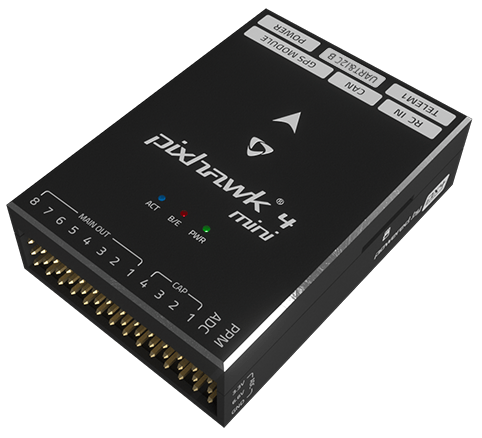
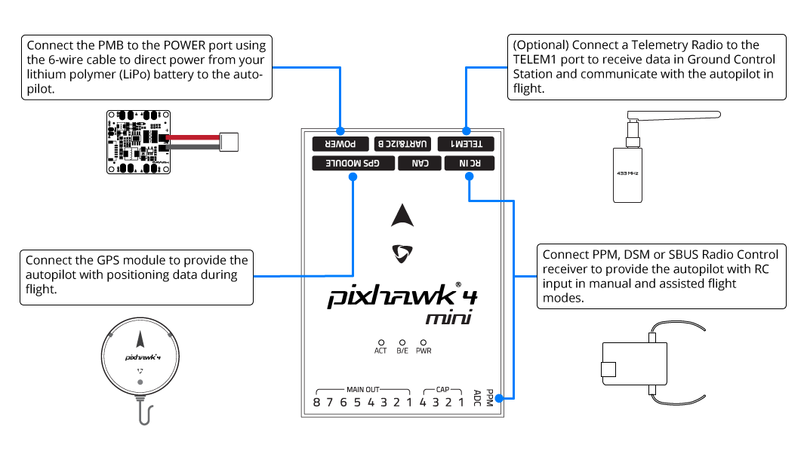
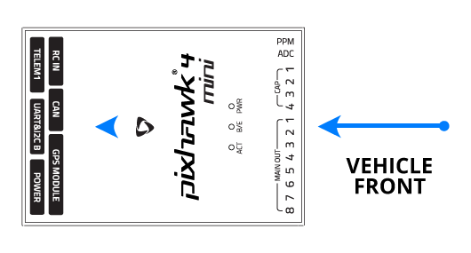
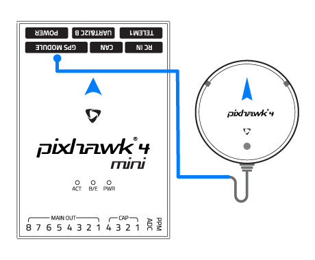
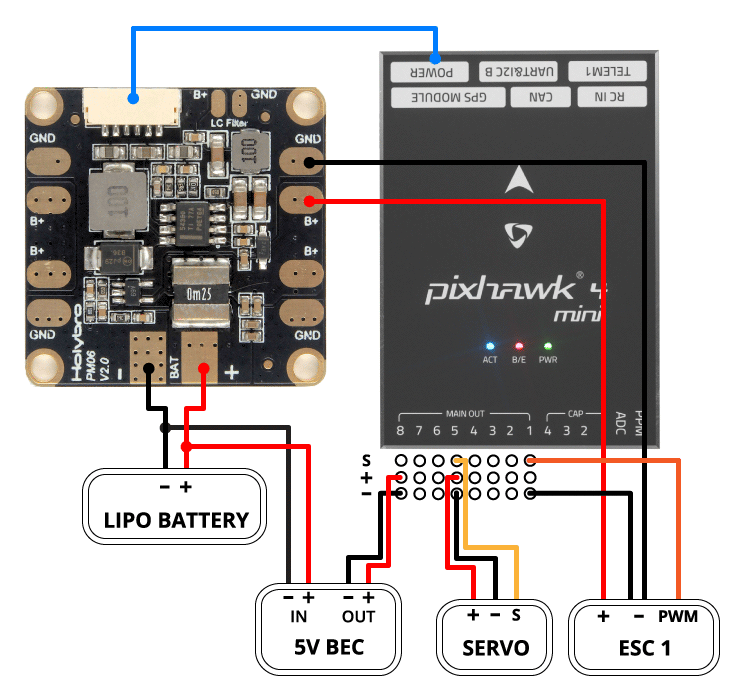
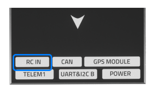
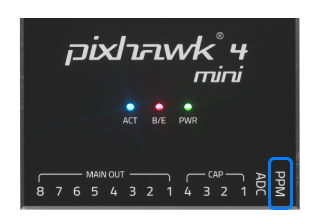
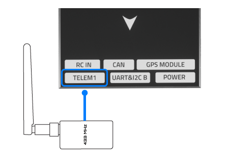
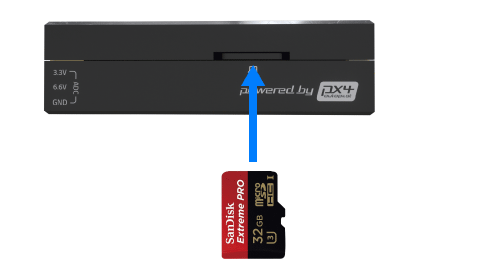

# _Pixhawk 4 Mini_ Wiring Quick Start

:::warning
PX4 не розробляє цей (або будь-який інший) автопілот.
Contact the [manufacturer](https://holybro.com/) for hardware support or compliance issues.
:::

This quick start guide shows how to power the [_Pixhawk&reg; 4 Mini_](../flight_controller/pixhawk4_mini.md) flight controller and connect its most important peripherals.

## Огляд схеми підключення

На зображенні нижче показано, куди підключити найважливіші датчики та периферійні пристрої (за винятком моторів та сервоприводів).

:::tip
More information about available ports can be found here: [_Pixhawk 4 Mini_ > Interfaces](../flight_controller/pixhawk4_mini.md#interfaces).
:::

## Монтаж та орієнтація контролера

_Pixhawk 4 Mini_ should be mounted on your frame using vibration-damping foam pads (included in the kit).
Вона повинна розташовуватися якомога ближче до центру тяжіння вашого апарату верхньою стороною вгору зі стрілкою, що вказує в напрямку передньої частини апарату.

:::info
Якщо контролер не може бути змонтований у рекомендованому/стандартному положенні (наприклад, через обмеження місця), вам потрібно буде налаштувати програмне забезпечення автопілота з орієнтацією, яку ви фактично використовували: [Орієнтація контролера польоту](../config/flight_controller_orientation.md).
:::

## GPS + компас + зумер + захисний вимикач + світлодіод

Attach the provided GPS with integrated compass, safety switch, buzzer, and LED to the **GPS MODULE** port. The GPS/Compass should be [mounted on the frame](../assembly/mount_gps_compass.md) as far away from other electronics as possible, with the direction marker towards the front of the vehicle (separating the compass from other electronics will reduce interference).

:::info
Вбудований безпечний вимикач в GPS-модулі увімкнений _за замовчуванням_ (коли включений, PX4 не дозволить вам готувати до польоту).
Щоб вимкнути безпеку, натисніть і утримуйте безпечний вимикач протягом 1 секунди.
Ви можете натиснути безпечний вимикач знову, щоб увімкнути безпеку та відключити транспортний засіб (це може бути корисно, якщо, з якихось причин, ви не можете вимкнути транспортний засіб за допомогою вашого пульта дистанційного керування або наземної станції).
:::

## Power

Плата управління живленням (PMB) виконує функції блоку живлення та розподільчої плати живлення.
In addition to providing regulated power to _Pixhawk 4 Mini_ and the ESCs, it sends information to the autopilot about the battery’s voltage and current draw.

Connect the output of the PMB that comes with the kit to the **POWER** port of the _Pixhawk 4 Mini_ using a 6-wire cable.
Підключення PMB, включаючи живлення та сигнальні з'єднання з ESC та сервоприводами, пояснені на зображенні нижче.

:::info
The image above only shows the connection of a single ESC and a single servo.
Підключіть інші ESC та сервоприводи аналогічно.
:::

| Pin(s) або роз'єм | Функція                                                                    |
| ------------------------------------ | -------------------------------------------------------------------------- |
| B+                                   | Підключіться до ESC B+, щоб живити ESC                                     |
| GND                                  | Підключіться до землі ESC                                                  |
| PWR                                  | JST-GH 6-pin Connector, 5V 3A output  connect to _Pixhawk 4 Mini_ POWER |
| BAT                                  | Живлення, підключіть до акумулятора LiPo 2~12s             |

The pinout of the _Pixhawk 4 Mini_ **POWER** port is shown below.
The `CURRENT` signal should carry an analog voltage from 0-3.3V for 0-120A as default.
The `VOLTAGE` signal should carry an analog voltage from 0-3.3V for 0-60V as default.
Лінії VCC повинні пропонувати принаймні 3A безперервного струму і за замовчуванням повинні мати напругу 5,1 В. Нижчий напруга 5V все ще прийнятний, але не рекомендується.

| Pin                         | Сигнал  | Вольтаж               |
| --------------------------- | ------- | --------------------- |
| 1(red)   | VCC     | +5V                   |
| 2(black) | VCC     | +5V                   |
| 3(black) | CURRENT | +3.3V |
| 4(black) | VOLTAGE | +3.3V |
| 5(black) | GND     | GND                   |
| 6(black) | GND     | GND                   |

:::info
If using a plane or rover, the 8 pin power (+) rail of **MAIN OUT** will need to be separately powered in order to drive servos for rudders, elevons, etc.
Щоб це зробити, живильну рейку потрібно підключити до ESC з BEC, автономного BEC на 5V або 2S LiPo акумулятора.
Будьте обережні з напругою сервопривода, який ви збираєтеся використовувати тут.
:::

<!--In the future, when Pixhawk 4 kit is available, add wiring images/videos for different airframes.-->

:::info
Using the Power Module that comes with the kit you will need to configure the _Number of Cells_ in the [Power Settings](https://docs.qgroundcontrol.com/master/en/qgc-user-guide/setup_view/power.html) but you won't need to calibrate the _voltage divider_.
You will have to update the _voltage divider_ if you are using any other power module (e.g. the one from the Pixracer).
:::

## Радіоуправління

Для того щоб керувати транспортним засобом _вручну_, потрібна система радіоуправління (RC) (PX4 не потребує системи радіоуправління для автономних режимів польоту).

Вам потрібно [вибрати сумісний передавач/приймач](../getting_started/rc_transmitter_receiver.md) і _зв'язати_ їх таким чином, щоб вони взаємодіяли (ознайомтеся з інструкціями, що додаються до вашого конкретного передавача/приймача).

The instructions below show how to connect the different types of receivers to _Pixhawk 4 Mini_:

- Spektrum/DSM or S.BUS receivers connect to the **DSM/SBUS RC** input.

  

- PPM receivers connect to the **PPM RC** input port.

  

- PPM and PWM receivers that have an _individual wire for each channel_ must connect to the **PPM RC** port _via a PPM encoder_ [like this one](http://www.getfpv.com/radios/radio-accessories/holybro-ppm-encoder-module.html) (PPM-Sum receivers use a single signal wire for all channels).

Для отримання додаткової інформації про вибір радіосистеми, сумісність приймача та зв'язок вашої передавача/приймача, див. статтю: [Пульт керування передавачів & приймачів](../getting_started/rc_transmitter_receiver.md).

## Телеметрійне радіо (Опціонально)

Телеметричні радіостанції можуть використовуватися для зв'язку та управління транспортним засобом у польоті з наземної станції (наприклад, ви можете направляти БПЛА до певної позиції або завантажувати нове завдання).

The vehicle-based radio should be connected to the **TELEM1** port as shown below (if connected to this port, no further configuration is required).
Інша радіостанція підключається до вашого комп'ютера або мобільного пристрою наземної станції (зазвичай за допомогою USB).

## microSD-карта (Опціонально)

SD cards are highly recommended as they are needed to [log and analyse flight details](../getting_started/flight_reporting.md), to run missions, and to use UAVCAN-bus hardware.
Insert the card (included in the kit) into _Pixhawk 4 Mini_ as shown below.

:::tip
Для отримання додаткової інформації див. [Основні концепції > SD-карти (знімна пам'ять)](../getting_started/px4_basic_concepts.md#sd-cards-removable-memory).
:::

## Двигуни

Motors/servos are connected to the **MAIN OUT** ports in the order specified for your vehicle in the [Airframe Reference](../airframes/airframe_reference.md). See [_Pixhawk 4 Mini_ > Supported Platforms](../flight_controller/pixhawk4_mini.md#supported-platforms) for more information.

:::info
Цей довідник містить зіставлення портів виводу до моторів/сервоприводів для всіх підтримуваних повітряних та наземних шасі (якщо ваше шасі не вказане в довіднику, то використовуйте "загальний" планер відповідного типу).
:::

:::warning
Відображення не є однорідним для всіх конструкцій (наприклад, ви не можете покладатися на те, що ручка газу буде на тому ж вихідному порту для всіх повітряних конструкцій).
Переконайтеся, що ви використовуєте правильне зіставлення для вашого апарату.
:::

## Інші периферійні пристрої

Підключення та конфігурація додаткових/менш поширених компонентів описано в темах для окремих [периферійних пристроїв](../peripherals/index.md).

## Налаштування

Загальну інформацію про конфігурацію описано в: [Конфігурація автопілота](../config/index.md).

Конкретні конфігурації QuadPlane тут: [QuadPlane VTOL налаштування](../config_vtol/vtol_quad_configuration.md)

<!-- Nice to have detailed wiring infographic and instructions for different vehicle types. -->

## Подальша інформація

- [_Pixhawk 4 Mini_](../flight_controller/pixhawk4_mini.md)
