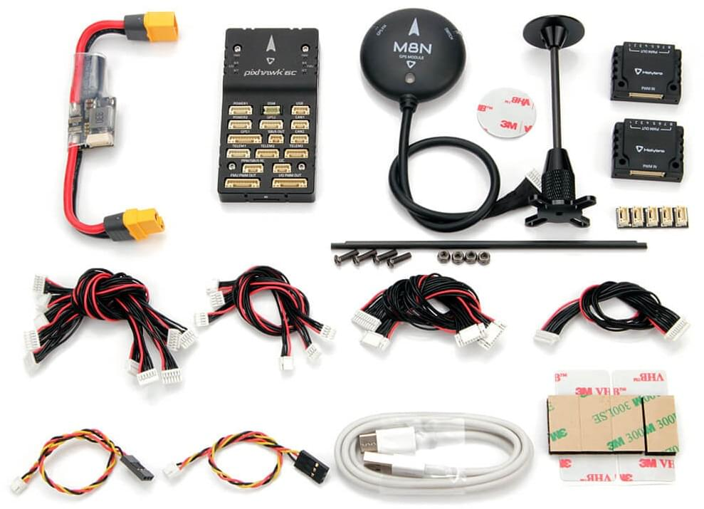

# Швидке підключення Holybro Pixhawk 6C

:::warning
PX4 не розробляє цей (або будь-який інший) автопілот.
Contact the [manufacturer](https://holybro.com/) for hardware support or compliance issues.
:::

This quick start guide shows how to power the [Pixhawk 6C&reg;](../flight_controller/pixhawk6c.md) flight controller and connect its most important peripherals.

## Вміст набору

Pixhawk 6C + PM02 + M8N GPS.

## Монтаж та орієнтація контролера

_Pixhawk 6C_ can be mounted on the frame using double side tape included in the kit.
Вона повинна розташовуватися якомога ближче до центру тяжіння вашого апарату верхньою стороною вгору зі стрілкою, що вказує в напрямку передньої частини апарату.

:::info
Якщо контролер не може бути змонтований у рекомендованому/стандартному положенні (наприклад, через обмеження місця), вам потрібно буде налаштувати програмне забезпечення автопілота з орієнтацією, яку ви фактично використовували: [Орієнтація контролера польоту](../config/flight_controller_orientation.md).
:::

## GPS + компас + зумер + захисний вимикач + світлодіод

The _Pixhawk6C_ can be purchased with M8N or M9N GPS (10-pin connector) that should be connected to the **GPS1** port.
Ці модулі GNSS мають вбудований компас, безпечний перемикач, дзвіночок та світлодіод.

A secondary [M8N or M9N GPS](https://holybro.com/collections/gps) (6-pin connector) can be purchased separately and connected to the **GPS2** port.

The GPS/Compass should be [mounted on the frame](../assembly/mount_gps_compass.md) as far away from other electronics as possible, with the direction marker towards the front of the vehicle (separating the compass from other electronics will reduce interference).

:::info
Вбудований безпечний вимикач в GPS-модулі увімкнений _за замовчуванням_ (коли включений, PX4 не дозволить вам готувати до польоту).
Щоб вимкнути безпеку, натисніть і утримуйте безпечний вимикач протягом 1 секунди.
Ви можете натиснути безпечний вимикач знову, щоб увімкнути безпеку та відключити транспортний засіб (це може бути корисно, якщо, з якихось причин, ви не можете вимкнути транспортний засіб за допомогою вашого пульта дистанційного керування або наземної станції).
:::

## Power

Connect the output of the power module of your selection that comes with the Standard Set to one of the **POWER** port of _Pixhawk 6C_ using the 6-wire cable.

If using a plane or rover, the **FMU PWM-OUT** will need to be separately powered in order to drive servos for rudders, elevons etc. This can be done by connecting the 8 pin power (+) rail of the **FMU PWM-OUT** to a voltage regulator (for example, a BEC equipped ESC or a standalone 5V BEC or a 2S LiPo battery).

:::info
Напруга шини живлення повинна бути відповідною для використаного сервоприводу!
:::

| PIN & Connector | Функція                                                                           |
| ----------------------------------- | --------------------------------------------------------------------------------- |
| I/O PWM Out                         | Підключіть сигнальні та земельні проводи двигуна тут.             |
| FMU PWM Out                         | Підключіть сигнальні, позитивні та GND-проводи сервоприводу сюди. |

:::info
**MAIN** outputs in PX4 firmware map to **I/O PWM OUT** port of _Pixhawk 6C_ whereas **AUX outputs** map to **FMU PWM OUT** of _Pixhawk 6C_.
For example, **MAIN1** maps to IO_CH1 pin of **I/O PWM OUT** and **AUX1** maps to FMU_CH1 pin of **FMU PWM OUT**.
:::

The pinout of _Pixhawk 6C_’s power ports is shown below.

| Pin                         | Сигнал  | Вольтаж               |
| --------------------------- | ------- | --------------------- |
| 1(red)   | VDD     | +5V                   |
| 2(black) | VDD     | +5V                   |
| 3(black) | CURRENT | +3.3V |
| 4(black) | VOLTAGE | +3.3V |
| 5(black) | GND     | GND                   |
| 6(black) | GND     | GND                   |

## Радіоуправління

Для того щоб керувати транспортним засобом _вручну_, потрібна система радіоуправління (RC) (PX4 не потребує системи радіоуправління для автономних режимів польоту).

Вам потрібно [вибрати сумісний передавач/приймач](../getting_started/rc_transmitter_receiver.md) і _зв'язати_ їх таким чином, щоб вони взаємодіяли (ознайомтеся з інструкціями, що додаються до вашого конкретного передавача/приймача).

- Spektrum/DSM receivers connect to the **DSM** input.
- PPM or SBUS receivers connect to the **PPM/SBUS** input port.

PPM and PWM receivers that have an _individual wire for each channel_ must connect to the \*PPM/SBUS\*\* port \*via a PPM encoder\* [like this one](http://www.getfpv.com/radios/radio-accessories/holybro-ppm-encoder-module.html) (PPM-Sum receivers use a single signal wire for all channels).

Для отримання додаткової інформації про вибір радіосистеми, сумісність приймача та зв'язок вашої передавача/приймача, див. статтю: [Пульт керування передавачів & приймачів](../getting_started/rc_transmitter_receiver.md).

## Телеметричні радіостанції (Опціонально)

[Телеметричні радіостанції](../telemetry/index.md) можуть використовуватися для зв'язку та управління транспортним засобом у польоті з наземної станції (наприклад, ви можете направляти БПЛА до певної позиції або завантажувати нове завдання).

The vehicle-based radio should be connected to the **TELEM1** port as shown below (if connected to this port, no further configuration is required).
Інша радіостанція підключається до вашого комп'ютера або мобільного пристрою наземної станції (зазвичай за допомогою USB).

Radios are also available for purchase on [Holybro's website](https://holybro.com/collections/telemetry-radios) .

## SD-карта (Опціонально)

SD cards are highly recommended as they are needed to [log and analyse flight details](../getting_started/flight_reporting.md), to run missions, and to use UAVCAN-bus hardware.
Insert the card (included in Pixhawk 6C) into _Pixhawk 6C_ as shown below.

:::tip
Для отримання додаткової інформації див. [Основні концепції > SD-карти (знімна пам'ять)](../getting_started/px4_basic_concepts.md#sd-cards-removable-memory).
:::

## Двигуни

Motors/servos are connected to the **I/O PWM OUT** (**MAIN**) and **FMU PWM OUT** (**AUX**) ports in the order specified for your vehicle in the [Airframe Reference](../airframes/airframe_reference.md).

:::info
Цей довідник містить зіставлення портів виводу до моторів/сервоприводів для всіх підтримуваних повітряних та наземних шасі (якщо ваше шасі не вказане в довіднику, то використовуйте "загальний" планер відповідного типу).
:::

:::warning
Відображення не є однорідним для всіх конструкцій (наприклад, ви не можете покладатися на те, що ручка газу буде на тому ж вихідному порту для всіх повітряних конструкцій). Переконайтеся, що ви використовуєте правильне зіставлення для вашого апарату.
:::

## Інші периферійні пристрої

Підключення та конфігурація додаткових/менш поширених компонентів описано в темах для окремих [периферійних пристроїв](../peripherals/index.md).

## Схема розташування виводів

- [Holybro Pixhawk -6C Pinout](https://docs.holybro.com/autopilot/pixhawk-6c/pixhawk-6c-pinout)

## Налаштування

Загальну інформацію про конфігурацію описано в: [Конфігурація автопілота](../config/index.md).

Конкретні конфігурації QuadPlane тут: [QuadPlane VTOL налаштування](../config_vtol/vtol_quad_configuration.md)

<!-- Nice to have detailed wiring infographic and instructions for different vehicle types. -->

## Подальша інформація

- [Holybro Docs](https://docs.holybro.com/) (Holybro)
- [Pixhawk 6C](../flight_controller/pixhawk6c.md) (PX4 Doc Overview page)
- [PM02 Power Module](../power_module/holybro_pm02.md)
- [PM06 Power Module](../power_module/holybro_pm06_pixhawk4mini_power_module.md)
- [PM07 Power Module](../power_module/holybro_pm07_pixhawk4_power_module.md)
- [Pixhawk Autopilot Bus Standard](https://github.com/pixhawk/Pixhawk-Standards/blob/master/DS-010%20Pixhawk%20Autopilot%20Bus%20Standard.pdf).
- [Pixhawk Connector Standard](https://github.com/pixhawk/Pixhawk-Standards/blob/master/DS-009%20Pixhawk%20Connector%20Standard.pdf).
