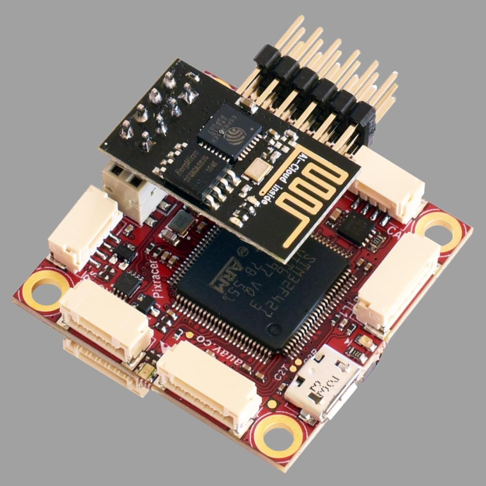
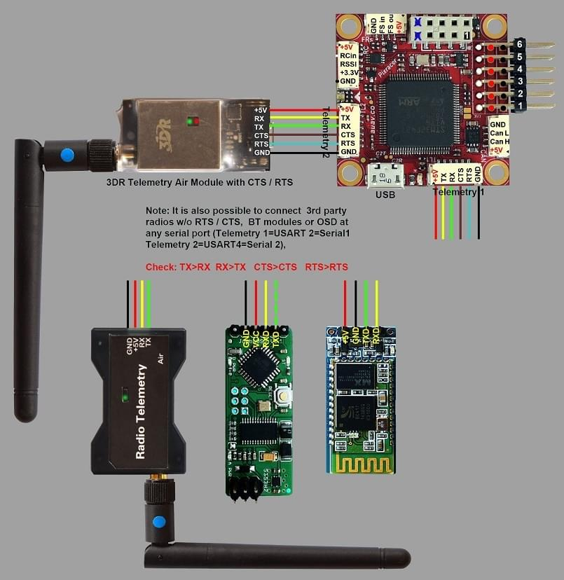

# Швидкий старт з підключенням Pixracer

:::warning
PX4 не розробляє цей (або будь-який інший) автопілот.
Contact the [manufacturer](https://store.mrobotics.io/) for hardware support or compliance issues.
:::

:::warning
Under construction
:::

This quick start guide shows how to power the [Pixracer](../flight_controller/pixracer.md) flight controller and connect its most important peripherals.

## Посібники з підключення/монтажу

### Основне Налаштування

### Радіо/Дистанційне Управління

Для того щоб керувати транспортним засобом _вручну_, потрібна система радіоуправління (RC) (PX4 не потребує системи радіоуправління для автономних режимів польоту).

Вам потрібно [вибрати сумісний передавач/приймач](../getting_started/rc_transmitter_receiver.md) і _зв'язати_ їх таким чином, щоб вони взаємодіяли (ознайомтеся з інструкціями, що додаються до вашого конкретного передавача/приймача).

Нижче наведено інструкції з підключення різних типів приймачів:

- Приймачі FrSky підключаються через показаний порт і можуть використовувати наданий роз'єм введення/виведення.

  

  

- PPM-SUM and S.BUS receivers connect to the **RCIN** port.

  

- PPM and PWM receivers that have an _individual wire for each channel_ must connect to the **RCIN** port _via a PPM encoder_ [like this one](http://www.getfpv.com/radios/radio-accessories/holybro-ppm-encoder-module.html) (PPM-Sum receivers use a single signal wire for all channels).

### Модуль потужності (ACSP4)

### Зовнішня телеметрія

Pixracer has inbuilt WiFi, but also supports telemetry via external Wi-Fi or radio telemetry modules connected to the `TELEM1` or `TELEM2` ports.
Це показано на схемі підключення нижче.

:::info
The `TELEM2` port must be configured as a second MAVLink instance using the [MAV_2_CONFIG](../advanced_config/parameter_reference.md#MAV_2_CONFIG) parameter.
For more information see [MAVLink Peripherals > MAVLink Instances](../peripherals/mavlink_peripherals.md#mavlink-instances) (and [Serial Port Configuration](../peripherals/serial_configuration.md)).
:::
