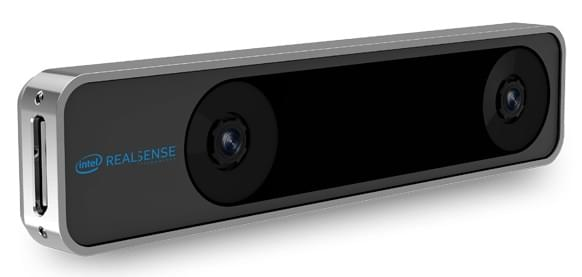

# Камера відстеження Intel® RealSense™ T265 (ВІО)

[Камера відстеження Intel® RealSense™ T265](https://www.intelrealsense.com/tracking-camera-t265/) надає одометричну інформацію яку можна використати для [ВІО](../computer_vision/visual_inertial_odometry.md), доповнюючи або замінюючи інші системи позиціювання на PX4.

:::tip
Ця камера рекомендована і використовується у [Візуально-інерційна одометрія (ВІО) > Рекомендовані налаштування](../computer_vision/visual_inertial_odometry.md#suggested-setup).
:::



## Де купити

[Intel® RealSense™ Tracking Camera T265](https://www.intelrealsense.com/tracking-camera-t265/) (store.intelrealsense.com)

## Інструкції з налаштування

На загальному рівні:

- Для отримання необроблених даних з камери слід використовувати [обгортку `realsense-ros`](https://github.com/IntelRealSense/realsense-ros), надану компанією Intel.
- Камеру слід встановити об'єктивами спрямованими вниз (за замовчуванням).
  Не забудьте вказати орієнтацію камери, опублікувавши статичне перетворення між `base_link` та `camera_pose_frame` у файлі запуску ROS, наприклад:
  ```xml
  <node pkg="tf" type="static_transform_publisher" name="tf_baseLink_cameraPose"
      args="0 0 0 0 1.5708 0 base_link camera_pose_frame 1000"/>
  ```
  Це - статичне перетворення, що пов'язує систему відліку камери `camera_pose_frame` у ROS з системою відліку дрона `base_link` у MAVROS.
  - перші три `args` вказують _перетворення_ x,y,z у метрах від центру контролера польоту до камери.
    Наприклад, якщо камера знаходиться на відстані 10 см від контролера і на висоті 4 см, перші три числа будуть: [0.1, 0, 0.04,...]
  - наступні три `args` вказують обертання в радіанах (рискання, тангаж, крен).
    Тому `[... 0, 1.5708, 0]` означає нахил вниз на 90° (обернений до землі). Обернений вперед буде [... 0 0 0].
- Камера чутлива до високочастотних вібрацій!
  Вона повинна бути змонтована з м'яким кріпленням, наприклад з піною для віброізоляції.
