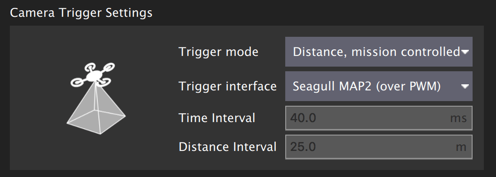
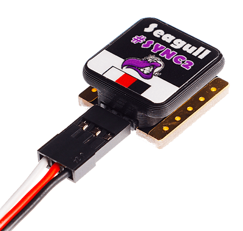
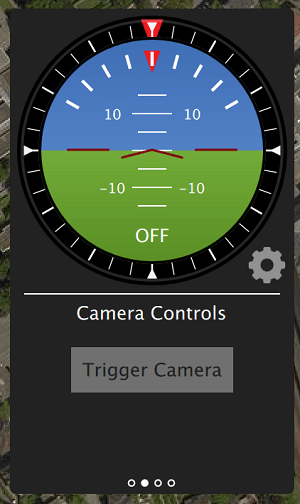
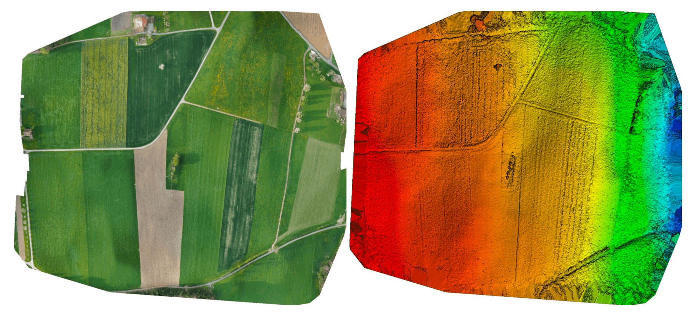
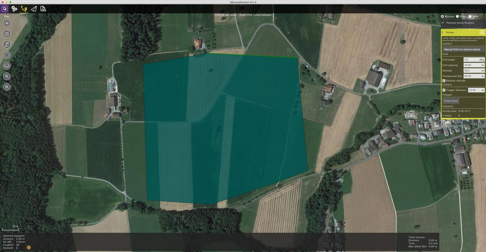
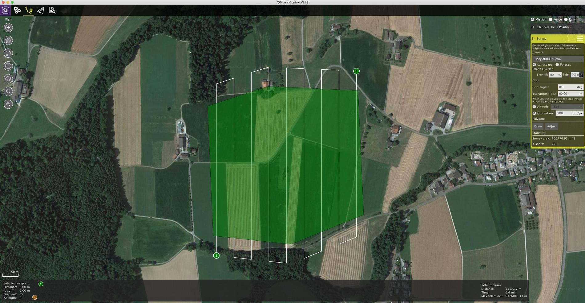
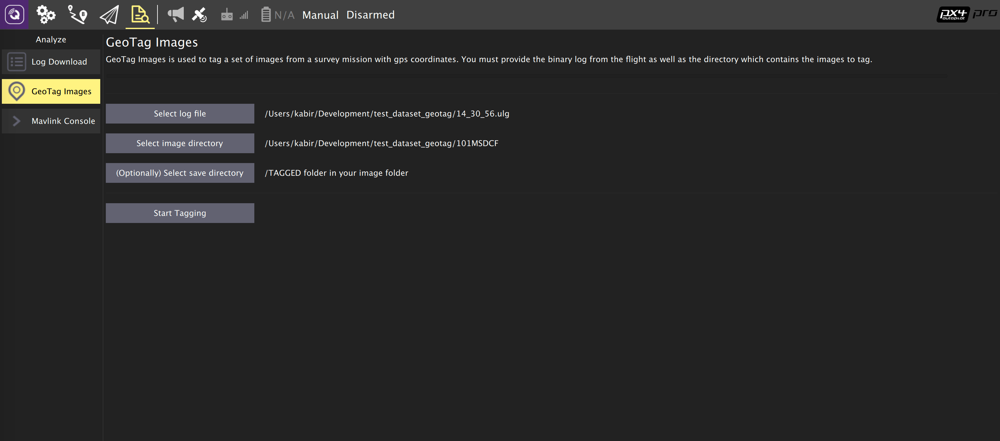
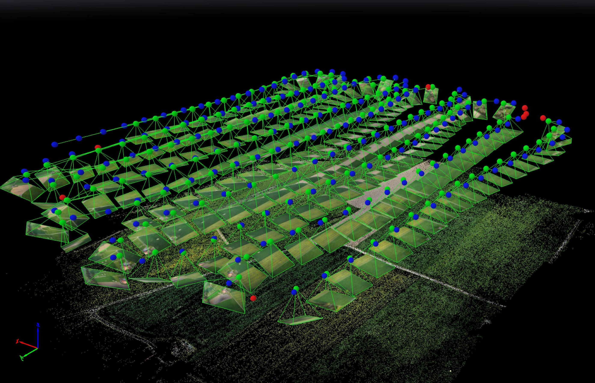
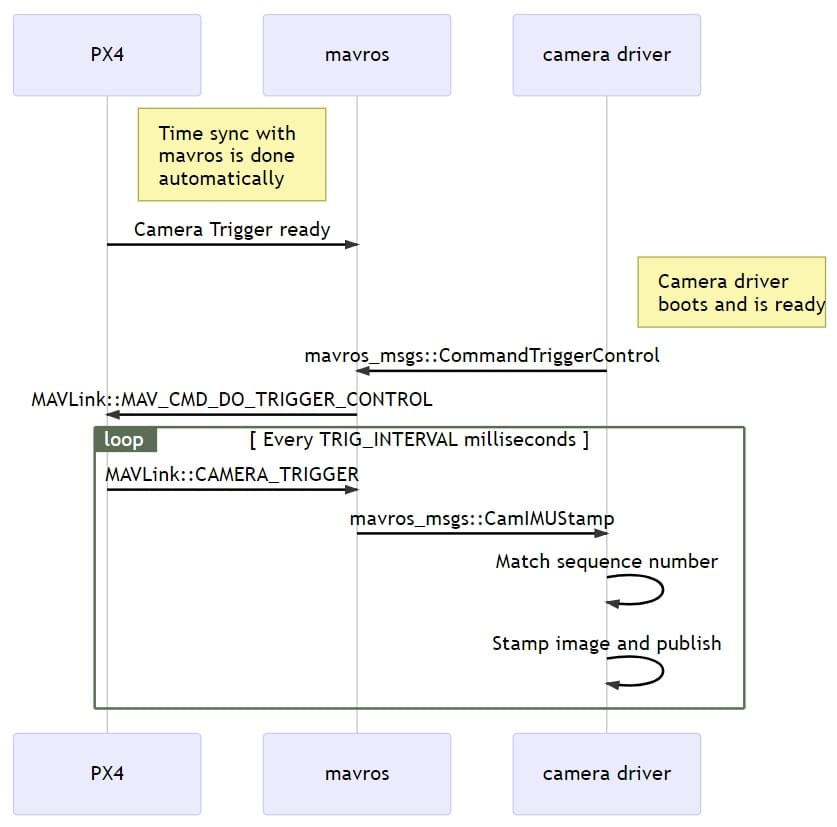

# Камери, підключені до виходів керування польотом

Ця тема пояснює, як використовувати PX4 з [камерою](../camera/index.md), яка приєднана до виходів контролера польоту.

:::warning
[Камери MAVLink](../camera/mavlink_v2_camera.md), які використовують [Протокол камери MAVLink v2](https://mavlink.io/en/services/camera.html), рекомендовані.
:::

## Загальний огляд

PX4 може викликати [camera](../camera/index.md), підключену до виходів керування польотом за допомогою [команд камери](#mavlink-command-interface) в місіях або відправлений наземними станціями.
Підтримувані команди є підмножиною тих, що визначені в MAVLink [Протоколі камери v1](https://mavlink.io/en/services/camera.html).

Кожен раз, коли спрацьовує камера, опубліковано повідомлення MAVLink [CAMERA_TRIGGER](https://mavlink.io/en/messages/common.html#CAMERA_TRIGGER), що містить номер послідовності (тобто поточний номер послідовності зображення сеансу) та відповідний часовий позначення.
Цей часовий міткий може бути використаний для кількох цілей, включаючи: міткування фотографій для повітряного обстеження та реконструкції, синхронізацію багатокамерної системи або візуально-інерціальної навігації.

Камера може бути підключена до різних виходів, включаючи виходи PWM, виходи GPIO та кару MAP2 від Seagull через виходи PWM.

Камери також можуть (за бажанням) сигналізувати PX4 у саму точну мить, коли знімається фото/кадр, використовуючи [вивід захоплення камери](#camera-capture-configuration), який приєднаний до їх гарячого черевика.
Це дозволяє більш точну прив'язку зображень до позиції GPS для прив'язки до місцевості або потрібну вибірку IMU для синхронізації ВІО, тощо.

<!-- Camera trigger driver: https://github.com/PX4/PX4-Autopilot/tree/main/src/drivers/camera_trigger -->

<!-- Camera capture driver: https://github.com/PX4/PX4-Autopilot/tree/main/src/drivers/camera_capture -->

## Командний інтерфейс MAVLink

PX4 підтримує наступні команди MAVLink для камер, підключених до КП, як у місіях, так і в разі їх отримання від БПК(GCS):

- [MAV_CMD_DO_SET_CAM_TRIGG_INTERVAL](#mav-cmd-do-set-cam-trigg-interval) — встановити інтервал часу між зніманнями.
- [MAV_CMD_DO_SET_CAM_TRIGG_DIST](#mav-cmd-do-set-cam-trigg-dist) — встановити відстань між зніманнями
- [MAV_CMD_DO_TRIGGER_CONTROL](#mav-cmd-do-trigger-control) — почати/зупинити знімання (використовуючи відстань або час, як визначено попередніми командами).
- [MAV_CMD_OBLIQUE_SURVEY](#mav-cmd-oblique-survey) — початок/зупинка відхиленого обстеження
- [MAV_CMD_DO_DIGICAM_CONTROL](#мав-команда-керування-цифровою-камерою) — тестова зйомка камери з GCS.

Підтримувана поведінка перерахована нижче (вони не точно відповідають специфікації MAVLink).

### MAV_CMD_DO_TRIGGER_CONTROL

[MAV_CMD_DO_TRIGGER_CONTROL](https://mavlink.io/en/messages/common.html#MAV_CMD_DO_TRIGGER_CONTROL) - Приймається в "командному" режимі (`TRIG_MODE` 1).

| Параметри команди | Опис                                                                                                                                                                                  |
| ----------------- | ------------------------------------------------------------------------------------------------------------------------------------------------------------------------------------- |
| Параметр №1       | Увімкнення/вимкнення спрацювання. `1`: увімкнути (запуск), `0`: вимкнути.                          |
| Параметр №2       | Скидання послідовності спрацьовування. `1`: скинути, будь-яке інше значення нічого не робить.                                         |
| Параметр №3       | Призупинення спрацьовування, але без вимкнення камери або прибирання об'єктиву. `1`: призупинити, `0`: перезапустити. |

<!-- https://github.com/PX4/PX4-Autopilot/blob/main/src/drivers/camera_trigger/camera_trigger.cpp#L549 -->

### MAV_CMD_DO_DIGICAM_CONTROL

[MAV_CMD_DO_DIGICAM_CONTROL](https://mavlink.io/en/messages/common.html#MAV_CMD_DO_DIGICAM_CONTROL) - Приймається в усіх режимах.

Використовується GCS для перевірки знімання камерою з інтерфейсу користувача.
Драйвер спрацювання не підтримує всі параметри керування камерою, визначені специфікацією MAVLink.

| Параметри команди | Опис                                                                                                        |
| ----------------- | ----------------------------------------------------------------------------------------------------------- |
| Параметр №5       | Виконати команду одноразово (встановіть у 1 для знімання єдиного кадру). |

### MAV_CMD_DO_SET_CAM_TRIGG_DIST

[MAV_CMD_DO_SET_CAM_TRIGG_DIST](https://mavlink.io/en/messages/common.html#MAV_CMD_DO_SET_CAM_TRIGG_DIST) - Приймається у режимі "політного завдання" (`TRIG_MODE` 4)

Ця команда генерується автоматично під час виконання політного завдання для спрацювання камери на основі завдань обстеження з GCS.

### MAV_CMD_DO_SET_CAM_TRIGG_INTERVAL

[MAV_CMD_DO_SET_CAM_TRIGG_INTERVAL](https://mavlink.io/en/messages/common.html#MAV_CMD_DO_SET_CAM_TRIGG_INTERVAL)

### MAV_CMD_OBLIQUE_SURVEY

[MAV_CMD_OBLIQUE_SURVEY](https://mavlink.io/en/messages/common.html#MAV_CMD_OBLIQUE_SURVEY) - Команда політного завдання, щоб налаштувати автоматичне кріплення камери обертатись при зніманні навскіс.

Приймає від `param1` до `param4`, як вказано у визначенні повідомлення MAVLink.
Налаштування інтеграції затвору (`param2`) виконується тільки з бекендом GPIO.

<!-- https://github.com/PX4/PX4-Autopilot/blob/main/src/drivers/camera_trigger/camera_trigger.cpp#L632 -->

## Налаштування спрацьовування

Камери можна підключати до FC для виклику за допомогою різних інтерфейсів, таких як PWM та GPIO, вказавши відповідний [задній інтерфейс тригера](#trigger-interface-backends).
Ви також можете вказати камеру [режим тригера](#trigger-mode).

Цю конфігурацію найлегше виконати з розділу _QGroundControl_ [Налаштування рухомого засобу > Камера](https://docs.qgroundcontrol.com/master/en/qgc-user-guide/setup_view/camera.html#px4-camera-setup).



Різні [режими спрацювання](#trigger-modes), [бекенди інтерфейсу спуску](#trigger-interface-backends) та [налаштування виводу спуску](#trigger-output-pin-configuration) описані нижче (їх також можна встановити прямо з [параметрів](../advanced_config/parameters.md)).

:::info
Розділ налаштувань камери за замовчуванням недоступний для польотних контролерів на основі FMUv2 (наприклад 3DR Pixhawk), оскільки модуль камери не включено в прошивку автоматично.
Для додаткової інформації дивіться [Пошук/Оновлення параметрів > Параметри, яких немає в прошивці](../advanced_config/parameters.md#parameter-not-in-firmware).
:::

### Режими спрацювання

Підтримуються чотири різні режими, керуються параметром [TRIG_MODE](../advanced_config/parameter_reference.md#TRIG_MODE):

| Режим | Опис                                                                                                                                                                                                                                                                            |
| ----- | ------------------------------------------------------------------------------------------------------------------------------------------------------------------------------------------------------------------------------------------------------------------------------- |
| 0     | Спрацювання камери вимкнено.                                                                                                                                                                                                                                    |
| 1     | Працює як звичайний вимірювач інтервалів який можна увімкнути або вимкнути використовуючи команду MAVLink `MAV_CMD_DO_TRIGGER_CONTROL`. Дивіться [командний інтерфейс](#mavlink-command-interface) для додаткової інформації.                   |
| 2     | Вмикає вимірювач інтервалів.                                                                                                                                                                                                                                    |
| 3     | Спрацювання основані на відстані. Знімок робиться кожного разу, коли перевищується встановлена горизонтальна відстань. Мінімальний інтервал часу між двома знімками, однак, обмежується встановленим інтервалом спрацьовування. |
| 4     | Спрацьовує автоматично при виконанні опитування в режимі місії.                                                                                                                                                                                                 |

:::info
Якщо ви вперше вмикаєте додаток спрацювання камери, не забудьте перезавантажитись після зміни параметру `TRIG_MODE`.
:::

### Бекенди інтерфейсу спрацювання

Драйвер спрацювання камери підтримує кілька бекендів - кожен для конкретного застосування, що керується параметром [TRIG_INTERFACE](../advanced_config/parameter_reference.md#TRIG_INTERFACE):

| Номер | Опис                                                                                                                                                                                                                                                                                                                                                                                                                                                                                                                                                                                                                                                                  |
| ----- | --------------------------------------------------------------------------------------------------------------------------------------------------------------------------------------------------------------------------------------------------------------------------------------------------------------------------------------------------------------------------------------------------------------------------------------------------------------------------------------------------------------------------------------------------------------------------------------------------------------------------------------------------------------------- |
| 1     | Вмикає інтерфейс GPIO. AUX виходи дають періодичний високий або низький сигнал (в залежності від параметра `TRIG_POLARITY`) кожен інтервал часу [TRIG_INTERVAL](../advanced_config/parameter_reference.md#TRIG_INTERVAL). Це може бути використано для безпосереднього спуску більшості стандартних камер машинного зору. Зверніть увагу, що на апаратному забезпеченні серії PX4FMU (Pixhawk, Pixracer тощо) рівень сигналу на AUX контактах становить 3,3 В.                                                                             |
| 2     | Вмикає інтерфейс Seagull MAP2. Це дозволяє використовувати [Seagull MAP2](http://www.seagulluav.com/product/seagull-map2/) для взаємодії з безліччю камер, що підтримуються. Контакт/канал 1 (спуск камери) так контакт/канал 2 (селектор режиму) MAP2 повинні бути підключені до [контактів спрацювання камери](#trigger-output-pin-configuration) з налаштованим низьким та високим сигналом. За допомогою Seagull MAP2, PX4 також підтримує автоматичний контроль потужності та функційність утримання в робочому стані камер Sony Multiport, таких як QX-1. |
| 3     | Цей режим дозволяє використовувати камери MAVLink, які використовували старі інтерфейси [описані вище](#mavlink-command-interface). Повідомлення автоматично видаються на каналі `onboard` MAVLink під час знаходження їх в місіях. PX4 випускає повідомлення MAVLink `CAMERA_TRIGGER`, коли спрацьовує камера, за замовчуванням на канал `onboard` (якщо він не використовується, буде потрібно ввімкнути власний потік). [Прості камери MAVLink](../camera/mavlink_v1_camera.md) пояснюють цей випадок більш детально.                                                           |
| 4     | Вмикає загальний інтерфейс ШІМ. Це дозволяє використовувати [інфрачервоні спускові пристрої](https://hobbyking.com/en_us/universal-remote-control-infrared-shutter-ir-rc-1g.html) або сервоприводи для спуску камери.                                                                                                                                                                                                                                                                                                                                                                                                                 |

### Налаштування вихідних контактів спуску

Контакти спуску камери встановлюються в _QGroundControl_ на екрані налаштувань [Приводи](../config/actuators.md).

Контакти спуску можуть бути встановлені призначенням функції `Camera_Trigger` на будь-який вихід FMU.
Якщо використовується налаштування спрацювання, яке потребує двох контактів (наприклад Seagull MAP2), ви можете призначити її на будь-які два виходи.

Однак зверніть увагу, якщо вивід _ШІМ_ було використано для спуску камери (наприклад як у Seagull MAP2), уся група ШІМ не може бути використана для чого-небудь ще (ви не зможете використати інший вивід в групі для приводу, двигуна або захоплення камери, оскільки таймер вже використано).

:::info
At time of writing triggering only works on FMU pins:

- На контролері польоту Pixhawk, який має як FMU, так і плати вводу-виводу, контакти FMU призначені на виходи `AUX` (наприклад Pixhawk 4, CUAV v5+).
- Контакти контролера, що має лише FMU призначено на виходи `MAIN` (наприклад Pixhawk 4 mini, CUAV v5 nano).

:::

### Інші параметри

| Параметр                                                                                                           | Опис                                                                                                                                                                                                                                                                                                                                          |
| ------------------------------------------------------------------------------------------------------------------ | --------------------------------------------------------------------------------------------------------------------------------------------------------------------------------------------------------------------------------------------------------------------------------------------------------------------------------------------- |
| [TRIG_POLARITY](../advanced_config/parameter_reference.md#TRIG_POLARITY)                      | Доречний лише при використанні інтерфейсу GPIO. Встановлює полярність контакту спрацювання. Високий сигнал в активному стані означає що сигнал на контакті зазвичай низький і підіймається на високий рівень під час спрацювання. Низький сигнал в активному стані - навпаки. |
| [TRIG_INTERVAL](../advanced_config/parameter_reference.md#TRIG_INTERVAL)                      | Визначає час між двома послідовними подіями спрацьовування в мілісекундах.                                                                                                                                                                                                                                                    |
| [TRIG_ACT_TIME](../advanced_config/parameter_reference.md#TRIG_ACT_TIME) | Визначає час у мілісекундах, протягом якого контакт спуску утримується в стані "активний" перед поверненням до нейтрального. У режимах ШІМ мінімум обмежується 40 мс щоб завжди вміщати активний імпульс у сигнал ШІМ з частотою 50 Гц.                                                                       |

Повний список параметрів, що стосуються модуля спуску камери можна знайти на сторінці [довіднику параметрів](../advanced_config/parameter_reference.md#camera-trigger).

## Налаштування захоплення камери

Камери можуть також (необов'язково) використовувати контакт захоплення камерою, щоб сигналізувати точну мить, коли зроблено фото/кадр.
Це дозволяє більш точну прив'язку зображень до позиції GPS для прив'язки до місцевості або потрібну вибірку IMU для синхронізації ВІО, тощо.

Захоплення/зворотний зв'язок камери вмикається в PX4 встановленням [CAM_CAP_FBACK = 1](../advanced_config/parameter_reference.md#CAM_CAP_FBACK).
Контакт, використаний для захоплення камерою потім налаштовується на екрані налаштувань _QGroundControl_ [Приводи](../config/actuators.md), призначенням функції `Camera_Capture` на будь-який вихід FMU.

Зверніть увагу, якщо _вивід ШІМ_ було використано як вхід захоплення камерою, уся група ШІМ не може бути використана для чого-небудь ще (ви не зможете використати інший вивід в групі для приводу, двигуна або спуску камери, оскільки таймер вже використано).

:::info
At time of writing camera capture only works on FMU pins:

- На контролері польоту Pixhawk, який має як FMU, так і плати вводу-виводу, контакти FMU призначені на виходи `AUX` (наприклад Pixhawk 4, CUAV v5+).
- Контакти контролера, що має лише FMU призначено на виходи `MAIN` (наприклад Pixhawk 4 mini, CUAV v5 nano).

:::

PX4 виявляє висхідний фронт сигналу з відповідним рівнем напруги на контакті захоплення камерою (для контролерів польоту Pixhawk це зазвичай 3,3 В).
Якщо камера не видає відповідної напруги, то для забезпечення сумісності сигналу буде потрібен додатковий контур.

Камери, які мають роз'єм типу "гарячий башмак" (для підключення спалаху), зазвичай можна під'єднати за допомогою адаптера для цього роз'єму.
Наприклад [універсальний адаптер роз'єму "гарячий башмак" Seagull #SYNC2](https://www.seagulluav.com/product/seagull-sync2/) - це оптрон, який відокремлює та зсуває напругу спалаху до напруги Pixhawk.
Він вставляється в роз'єм для спалаху зверху камери.
Червоні та чорні вихідні дроти під'єднані до шини живлення/землі сервоприводу, а білий дріт - до вхідного контакту захоплення.



:::info
PX4 видає повідомлення MAVLink [CAMERA_TRIGGER](https://mavlink.io/en/messages/common.html#CAMERA_TRIGGER) як на спрацювання камери, так і на захоплення камерою.
Якщо налаштовано захоплення камерою, використовується відмітка часу від драйвера захоплення камери, в іншому випадку використовується відмітка часу спрацювання.
:::

## Тестування функціональності тригера

:::warning
Наступні розділи застаріли і потребують повторного тестування.
:::

1. На консолі PX4:

  ```shell
  camera_trigger test
  ```

2. Від _QGroundControl_:

  Клацніть на **Запуск камери** на головній панелі інструментів.
  Ці знімки не відображаються або не підраховуються для геотегування.

  

## Приклад Sony QX-1 (Фотограметрія)



У цьому прикладі ми використаємо кабель спускового пристрою Seagull MAP2 для інтерфейсу з Sony QX-1 та використаємо налаштування для створення ортомозаїк після проведення повністю автономної місії обстеження.

### Налаштування тригера

Рекомендовані налаштування камери:

- `TRIG_INTERFACE=2` (Seagull MAP2).
- `TRIG_MODE=4` (Контрольований місією).
- Залиште решту параметрів за замовчуванням.

Вам потрібно підключити карту Seagull MAP2 до контактів FMU на вашому автопілоті.
Інший кінець кабелю MAP2 буде вставлено в роз'єм "MULTI" QX-1.

### Налаштування камери

Ми використовуємо Sony QX-1 з об'єктивом 16-50 мм f3.5-5.6 для цього прикладу.

Щоб уникнути затримки автофокусу та вимірювання при спрацюванні камери, слід дотримуватися наступних вказівок:

- Ручне фокусування на безкінечність
- Встановіть камеру в режим постійного знімання
- Вручну встановіть експозицію та діафрагму
- ISO повинен бути встановлений якнайнижчим
- Ручний баланс білого, відповідний для сцени

### Планування місії





### Геотегування

Завантажте/скопіюйте файл журналу та зображення з польоту та вказіть QGroundControl на них.
Потім клацніть на **Почати позначення**.



Ви можете перевірити геотегування за допомогою безкоштовного онлайн-сервісу, такого як [Pic2Map](https://www.pic2map.com/).
Зверніть увагу, що Pic2Map обмежений лише 40 зображеннями.

### Реконструкція

Ми використовуємо [Pix4D](https://pix4d.com/) для реконструкції у 3D.



## Приклад синхронізації Camera-IMU (VIO)

У цьому прикладі ми розглянемо основи синхронізації вимірювань ІМП з візуальними даними для побудови стерео навігаційної системи Visual-Inertial Navigation System (VINS).
Щоб було зрозуміло, ідея тут полягає не в тому, щоб вимірювати IMU точно у той же час, що і ми фотографуємо, а отримувати правильний часовий штамп на наших зображеннях, щоб надавати точні дані нашому алгоритму VIO.

Автопілот та супутник мають різні бази часу (час завантаження для автопілота та UNIX епоха для супутника), тому замість вигинати будь-який з годинників, ми безпосередньо спостерігаємо різницю часу між годинниками.
Це зміщення додається або віднімається від міток часу в повідомленнях MAVLink (наприклад, `HIGHRES_IMU`) в компоненті перекладача міжпрограмного забезпечення (наприклад, MAVROS на співмешканці та `mavlink_receiver` в PX4).
Фактичний алгоритм синхронізації є модифікованою версією алгоритму мережевого протоколу часу (NTP) та використовує експоненційний рухомий середній для згладжування відстеженого зсуву часу.
Ця синхронізація виконується автоматично, якщо використовується MAVROS з високосмуговим зв'язком на борту (режим MAVLink onboard\`).

Для отримання синхронізованих кадрів зображення та інерційних вимірювань ми підключаємо входи тригера двох камер до контакту GPIO на автопілоті.
Часовий штамп інерційного вимірювання від початку впливу та номер послідовності зображень записуються й відправляються на спільний комп'ютер (`повідомлення CAMERA_TRIGGER`), який буферизує ці пакети та кадри зображень, отримані з камери.
Вони збігаються за порядковим номером (перший кадр зображення - послідовність 0), часовими позначками зображень (з міткою часу від повідомлення CAMERA_TRIGGER) та потім публікуються.

Наступна діаграма ілюструє послідовність подій, які повинні відбутися для правильного відміткового зображень.

[](https://mermaid.live/edit#pako:eNqNUs9rwjAU_lceOW-3nXIQpIoIVkftZIdCeTbPNqxJXJI6ivi_L1Er6Dzs9kK-H3lfviOrjCDGmaPvjnRFE4m1RVVogKXxBFbWjQezg_fPN-CQS0Xgel3Bj_QNKDxY40A6EEYTYOeNQi8rbNs-SkTS62g04DgkqMgi5EG2JguWUPR_vaoLSlh5CKAb63reGuMdoBbR96Zwz7kzvQylcrXjPDFKBe71BYnR3po2ClzhkXnZNR1vFlJ_cR6GMkkn5WRV5tl8NptmZbJa5tlqEXmtMXuYBtMe4m05X-bTbDNegJJtKx1VRgv3NIybQTJOp9l4EH94zGMY99ugmqcfa49q_zyER3aKvmpg-G3QndqS_R_17AJSYU3n9PfdNuzXFJq0YC8sgBVKEbp0jHoF8w0pKhgPo6Addq0vWKFPARp7sg4lYtzbjl5Ytxfoh-oxvsPW0ekXb8TjxQ)

<!-- Original

{/% mermaid %/}
sequenceDiagram
  Note right of PX4 : Time sync with mavros is done automatically
  PX4 ->> mavros : Camera Trigger ready
  Note right of camera driver : Camera driver boots and is ready
  camera driver ->> mavros : mavros_msgs::CommandTriggerControl
  mavros ->> PX4 : MAVLink::MAV_CMD_DO_TRIGGER_CONTROL
  loop Every TRIG_INTERVAL milliseconds
  PX4 ->> mavros : MAVLink::CAMERA_TRIGGER
  mavros ->> camera driver : mavros_msgs::CamIMUStamp
  camera driver ->> camera driver : Match sequence number
  camera driver ->> camera driver : Stamp image and publish
end
{/% endmermaid %/}
-->

### Крок 1

Спочатку встановіть TRIG_MODE на 1, щоб драйвер чекав на команду запуску та перезавантажте свій FCU, щоб отримати решту параметрів.

### Крок 2

Для цілей цього прикладу ми налаштуємо тригер для співпраці з камерою Point Grey Firefly MV, що працює з частотою 30 FPS.

- `TRIG_INTERVAL`: 33.33 мс
- `TRIG_POLARITY`: 0 (активний низький)
- `TRIG_ACT_TIME`: 0.5 мс.
  Ручний номер у цьому випадку має бути не менш ніж 1 мікросекунда.
- `TRIG_MODE`: 1, тому що ми хочемо, щоб ваш драйвер камери був готовий до отримання зображень перед початком запуску.
  Це важливо для належної обробки послідовних номерів.

### Крок 3

Підключіть свої камери до роз'єму AUX, підключивши земельний і сигнальний контакти до відповідного місця.

### Крок 4

Вам доведеться змінити свій драйвер, щоб дотримуватися схеми послідовності вище.
Для камер [IDS Imaging UEye](https://github.com/ProjectArtemis/ueye_cam) та для камер, що відповідають стандарту [IEEE1394 compliant](https://github.com/andre-nguyen/camera1394), доступні публічні посилання на референтні реалізації.

## Дивіться також

- Драйвер Тригера камери: [вихідний код](https://github.com/PX4/PX4-Autopilot/tree/main/src/drivers/camera_trigger) <!-- no module doc -->
- Драйвер захоплення камери: [вихідний код](https://github.com/PX4/PX4-Autopilot/tree/main/src/drivers/camera_capture) <!-- no module doc -->
