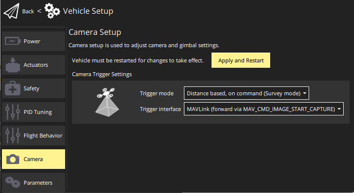

# Прості камери MAVLink (Протокол камери v1)

Ця тема пояснює, як використовувати PX4 з MAVLink [камерою](../camera/index.md), що реалізує [Протокол Камери v1 (Простий Протокол Тригера)](https://mavlink.io/en/services/camera_v1.html) з PX4 та Наземною Станцією.

:::warning
[Камери MAVLink](../camera/mavlink_v2_camera.md), що використовують [Протокол Камери MAVLink v2](https://mavlink.io/en/services/camera.html) слід використовувати замість цього, коли це можливо!
Цей підхід зберігається для використання зі старими камерами MAVLink.
:::

## Загальний огляд

[Протокол камери v1](https://mavlink.io/en/services/camera_v1.html) визначає невеликий набір команд, які дозволяють викликати камеру для:

- знімок неперервне зйомка з частотою, залежно від часу або відстані
- захоплення відео
- обмежені налаштування камери

PX4 підтримує цей набір команд для спрацьовування камер з вбудованою підтримкою протоколу (як описано в цій темі), а також для [камер, підключених до виходів контролера польоту](../camera/fc_connected_camera.md).

Наземні станції та SDK MAVLink, як правило, надсилають команди камери автопілоту, який потім передає їх на підключений канал MAVLink типу `onboard`.
PX4 також повторно відправляє будь-які елементи місії камери, з якими він зустрічається у місії як команди камери: команди, які не приймаються, реєструються.
У всіх випадках команди надсилаються з системним ідентифікатором автопілота та ідентифікатором компоненту 0 (тобто адресовані всім компонентам, включаючи камери).

PX4 також буде випускати [CAMERA_TRIGGER](https://mavlink.io/en/messages/common.html#CAMERA_TRIGGER) кожного разу, коли спрацьовує захоплення зображення (сама камера також може випускати це повідомлення при спрацьовуванні).

## Керування камерою

### Команди та повідомлення MAVLink

[Протокол камери v1 (простий тригер протокол)](https://mavlink.io/en/services/camera_v1.html) визначає наступні команди:

- [MAV_CMD_DO_TRIGGER_CONTROL](https://mavlink.io/en/messages/common.html#MAV_CMD_DO_TRIGGER_CONTROL)
- [MAV_CMD_NAV_CMD_DO_DIGICAM_CONTROL](https://mavlink.io/en/messages/common.html#MAV_CMD_NAV_CMD_DO_DIGICAM_CONTROL)
- [MAV_CMD_DO_SET_CAM_TRIGG_DIST](https://mavlink.io/en/messages/common.html#MAV_CMD_DO_SET_CAM_TRIGG_DIST)
- [MAV_CMD_DO_SET_CAM_TRIGG_INTERVAL](https://mavlink.io/en/messages/common.html#MAV_CMD_DO_SET_CAM_TRIGG_INTERVAL)
- [MAV_CMD_OBLIQUE_SURVEY](https://mavlink.io/en/messages/common.html#MAV_CMD_OBLIQUE_SURVEY)
- [MAV_CMD_DO_CONTROL_VIDEO](https://mavlink.io/en/messages/common.html#MAV_CMD_DO_CONTROL_VIDEO)

Камера MAVLink буде підтримувати певний піднабір цих команд.
Оскільки протокол не має процесу виявлення функцій, єдиний спосіб дізнатися - це оглянути [COMMAND_ACK](https://mavlink.io/en/messages/common.html#COMMAND_ACK), що повернено у відповіді.

Камери також повинні видавати [CAMERA_TRIGGER](https://mavlink.io/en/messages/common.html#CAMERA_TRIGGER) кожного разу, коли захоплюється зображення.

[Протокол камери v1](https://mavlink.io/en/services/camera_v1.html) детальніше описує протокол.

### Радіостанції наземної станції

Наземні станції можуть використовувати будь-які команди у [Протоколі Камери v1 (Простий Протокол Тригера)](https://mavlink.io/en/services/camera_v1.html) і повинні надсилати їх до ідентифікатора компонента автопілоту.
Якщо команди не підтримуються камерою, вона поверне [COMMAND_ACK](https://mavlink.io/en/messages/common.html#COMMAND_ACK) з помилковим результатом.

Зазвичай команди адресовані автопілоту, оскільки це працює незалежно від того, чи підключено камеру через MAVLink, чи безпосередньо до керування польотом.
Якщо звернення до автопілота PX4, він буде висилати [CAMERA_TRIGGER](https://mavlink.io/en/messages/common.html#CAMERA_TRIGGER) кожного разу, коли захоплюється зображення, і може реєструвати подію захоплення камери.

<!-- "May" because the camera feedback module is "supposed"  to log just camera capture from a capture pin connected to camera hotshoe, but currently logs all camera trigger events from the camera trigger driver https://github.com/PX4/PX4-Autopilot/pull/23103 -->

У теорії ви також можете надсилати команди безпосередньо до камери.

### Команди камери у місіях

Можна використовувати наступні команди [Протокол камери v1 (простий тригер протокол)](https://mavlink.io/en/services/camera_v1.html) в місіях (це той самий список, що і вище).

- [MAV_CMD_DO_TRIGGER_CONTROL](https://mavlink.io/en/messages/common.html#MAV_CMD_DO_TRIGGER_CONTROL)
- [MAV_CMD_NAV_CMD_DO_DIGICAM_CONTROL](https://mavlink.io/en/messages/common.html#MAV_CMD_NAV_CMD_DO_DIGICAM_CONTROL)
- [MAV_CMD_DO_SET_CAM_TRIGG_DIST](https://mavlink.io/en/messages/common.html#MAV_CMD_DO_SET_CAM_TRIGG_DIST)
- [MAV_CMD_DO_SET_CAM_TRIGG_INTERVAL](https://mavlink.io/en/messages/common.html#MAV_CMD_DO_SET_CAM_TRIGG_INTERVAL)
- [MAV_CMD_OBLIQUE_SURVEY](https://mavlink.io/en/messages/common.html#MAV_CMD_OBLIQUE_SURVEY)
- [MAV_CMD_DO_CONTROL_VIDEO](https://mavlink.io/en/messages/common.html#MAV_CMD_DO_CONTROL_VIDEO)

PX4 переістовує їх з тим самим ідентифікатором системи, що й автопілот, та ідентифікатором компонента [MAV_COMP_ID_ALL](https://mavlink.io/en/messages/common.html#MAV_COMP_ID_ALL):

<!-- See camera_architecture.md topic for detail on how this is implemented -->

### Ручне керування

Ручне спрацьовування за допомогою цих камер не підтримується (ні для джойстика, ні для дистанційного керування).

## Конфігурація PX4

<!-- set up the mode and triggering -->

### Налаштування порту та перенаправлення MAVLink

Підключіть PX4 до камери MAVLink, приєднавши її до не використаного послідовного порту на вашому авіаційному контролері, наприклад, `TELEM2`.
Потім ви можете налаштувати порт як [MAVLink Peripheral](../peripherals/mavlink_peripherals.md).
Документ пояснює, як, але в описі:

1. Змініть невикористаний параметр `MAV_n_CONFIG`, такий як [MAV_2_CONFIG](../advanced_config/parameter_reference.md#MAV_2_CONFIG), щоб він був присвоєний порту, до якого підключена ваша камера.
2. Встановіть відповідний [MAV_2_MODE](../advanced_config/parameter_reference.md#MAV_2_MODE) на `2` (На борту).
  Це забезпечує, що правильний набір повідомлень MAVLink випромінюється та пересилається.
3. Можливо, вам доведеться встановити деякі інші параметри, залежно від вашого з'єднання - наприклад, швидкість передачі даних.

Підключіться та налаштуйте камеру, як рекомендовано в її посібнику користувача.

<!-- Removed this because I am pretty sure forwarding happens automatically for this set. Keeping it simple.
1. Set [MAV_2_FORWARD](../advanced_config/parameter_reference.md#MAV_2_FORWARD) if you want to enable forwarding of MAVLink messages to other ports, such as the one that is connected to the ground station.
-->

### Режим камери та режим запуску

Налаштуйте водій камери PX4 для включення фонового процесу камери MAVLink та встановіть режим спуску для захоплення по команді в місіях обстеження.

Використання Від _QGroundControl_:

- Відкрийте [Налаштування рухомого засобу > Камера](https://docs.qgroundcontrol.com/master/en/qgc-user-guide/setup_view/camera.html#px4-camera-setup).
- Встановіть значення, як показано:

  

:::info
You can also [set the parameters directly](../advanced_config/parameters.md):

- [TRIG_MODE](../advanced_config/parameter_reference.md#TRIG_MODE) — `4`: Основано на відстані, за командою (режим опитування)
- [TRIG_INTERFACE](../advanced_config/parameter_reference.md#TRIG_INTERFACE) — `3`: MAVLink

:::
