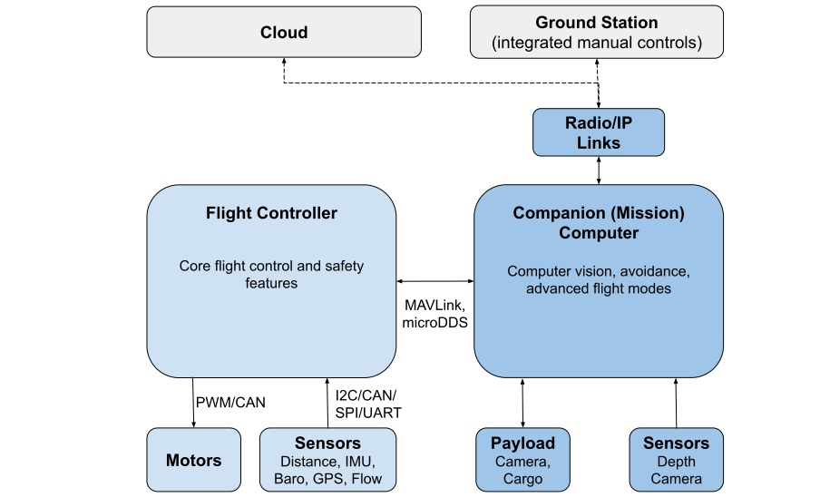

# Супутні комп'ютери

Companion computers ("mission computers"), are separate on-vehicle computers that are connected to the flight controller, and which enable computationally expensive features like [collision prevention](../computer_vision/collision_prevention.md).

На схемі нижче показана можлива архітектура безпілотного транспортного засобу, яка включає в себе контролер польоту і супутній комп'ютер.

<!-- source for drawing: https://docs.google.com/drawings/d/1ZDSyj5djKCEbabgx8K4ESdTeEUizgEt8spUWrMGbHUE/edit?usp=sharing -->

Польотний контролер працює під керуванням PX4 на NuttX і забезпечує основний код польоту та безпеки.
На комп'ютері-компаньйоні зазвичай працює Linux, оскільки це значно краща платформа для розробки "загального" програмного забезпечення.
Вони підключаються за допомогою швидкого послідовного або Ethernet-з'єднання і зазвичай взаємодіють за допомогою протоколу [MAVLink](https://mavlink.io/en/) або uXRCE-DDS.

Зв'язок з наземними станціями і хмарою зазвичай маршрутизується через супутній комп'ютер (наприклад, за допомогою [MAVLink Router](https://github.com/mavlink-router/mavlink-router)).

## Інтегровані плати супутнього компьютера/контролера польоту

The following carrier boards make it easy to integrate Pixhawk flight controllers with a companion computer, significantly easing both hardware and software setup.
The boards support the [Pixhawk Autopilot Bus (PAB)](../flight_controller/pixhawk_autopilot_bus.md) open standard so you can plug in any compliant controller:

- [ARK Jetson PAB Carrier](../companion_computer/ark_jetson_pab_carrier.md)
- [Holybro Pixhawk Jetson Baseboard](../companion_computer/holybro_pixhawk_jetson_baseboard.md)
- [Holybro Pixhawk RPi CM4 Baseboard](../companion_computer/holybro_pixhawk_rpi_cm4_baseboard.md)

## Керовані інтегровані системи

Наступні інтегровані системи супутній комп'ютер/пілотажний контролер за замовчуванням використовують керовані/кастомізовані версії програмного забезпечення пілотажного контролера та супутнього комп'ютера.
Вони перераховані тут, оскільки можуть бути оновлені "лайтовою" прошивкою PX4 для тестування/швидкої розробки.

- [Auterion Skynode](../companion_computer/auterion_skynode.md)
- [ModalAI VOXL 2](https://docs.modalai.com/voxl-2/)

## Параметри супутнього комп'ютера

PX4 можна використовувати з комп'ютерами, які можна налаштувати для зв’язку через MAVLink або microROS/uXRCE-DDS через послідовний порт (або порт Ethernet, якщо є).
Невеликий набір можливих альтернатив наведено нижче.

Більші приклади високої потужності:

- [ModalAI VOXL 2](https://docs.modalai.com/voxl2-external-flight-controller/)
- [NXP NavQPlus](https://nxp.gitbook.io/navqplus/user-contributed-content/ros2/microdds)
- [Nvidia Jetson TX2](https://developer.nvidia.com/embedded/jetson-tx2)

* [Intel NUC](https://www.intel.com/content/www/us/en/products/details/nuc.html)
* [Gigabyte Brix](https://www.gigabyte.com/Mini-PcBarebone/BRIX)

Нижче наведено невелику підгрупу можливих альтернатив:

- [Raspberry Pi](../companion_computer/pixhawk_rpi.md)

:::info
Вибір комп'ютера буде залежати від стандартних критеріїв: вартості, ваги, потужності, простоти налаштування та необхідних обчислювальних ресурсів.
:::

## Програмне забезпечення супутнього комп'ютера

На супутньому комп'ютері має бути встановлене програмне забезпечення, яке зв'язується з диспетчером польоту і спрямовує трафік на наземні станції та в хмару.

#### Програми для дронів

API та SDK для дронів дозволяють писати програмне забезпечення, яке може керувати PX4.
Серед популярних альтернатив:

- [MAVSDK](https://mavsdk.mavlink.io/main/en/index.html) - бібліотеки на різних мовах програмування для взаємодії з системами MAVLink, такими як дрони, камери або наземні системи.
- [ROS 2](../ros2/index.md) to communicate to ROS 2 nodes (may also be used).
- [ROS 1 і MAVROS](../ros/mavros_installation.md)

MAVSDK, як правило, є простішим у вивченні та використанні, в той час як ROS надає більше вбудованого програмного забезпечення для складних задач, таких як комп'ютерний зір.
[API та SDK для дронів > Який API використовувати?](../robotics/README.md#what-api-should-i-use) детально описує можливі опції.

Ви також можете написати власні бібліотеки MAVLink з нуля:

- [Приклад коду на C/C++](https://github.com/mavlink/c_uart_interface_example) показує, як підключити кастомний код
- MAVLink також можна використовувати з [багатьма іншими мовами програмування](https://mavlink.io/en/#mavlink-project-generatorslanguages)

#### Маршрутизатори

Вам знадобиться маршрутизатор, якщо вам потрібен міст MAVLink від апарату до наземної станції або IP-мережі, або якщо вам потрібно кілька з'єднань:

- [MAVLink Router](https://github.com/intel/mavlink-router) (рекомендується)
- [MAVProxy](https://ardupilot.org/mavproxy/)

## Налаштування Ethernet

Ethernet - рекомендоване з'єднання, якщо воно підтримується вашим польотним контролером.
У розділі [Налаштування Ethernet](../advanced_config/ethernet_setup.md).

## Налаштування для окремих контролерів польоту

У наступних темах пояснюється, як налаштувати комп'ютери-компаньйони для конкретних польотних контролерів, зокрема, коли ви не використовуєте з'єднання Ethernet.

- [Використання комп'ютера-компаньйона з контролерами Pixhawk](../companion_computer/pixhawk_companion.md)

## Додаткова інформація

- [Периферійні пристрої супутнього комп'ютера](../companion_computer/companion_computer_peripherals.md)
- [Архітектура системи PX4; FC і супутній комп'ютер](../concept/px4_systems_architecture.md#fc-and-companion-computer)
