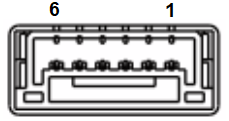
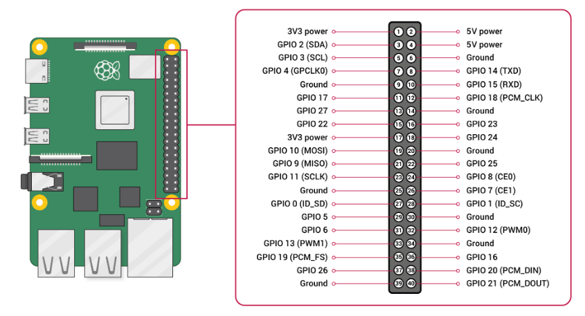

# Супутник Raspberry Pi з Pixhawk

This topic describes how to setup a Raspberry Pi ("RPi") companion companion running [ROS 2](../ros2/user_guide.md) on Linux Ubuntu OS, connecting to a [Pixhawk](../flight_controller/autopilot_pixhawk_standard.md) flight controller using a serial connection between the Pixhawk `TELEM2` port and the RPi's TX/RX pins.

Ці інструкції мають бути легко розширювані для інших конфігурацій контролерів RPi та польотів.

:::info
Інші загальні способи підключення RaPi та Pixhawk це:

- Ethernet-з'єднання між RPi та Pixhawk.
  Контролери Pixhawk на основі FMUv5x, FMUv6x та пізніших можуть мати вбудований порт Ethernet.
  Див. [PX4 Ethernet > Підтримувані контролери](../advanced_config/ethernet_setup.md#supported-flight-controllers).
- Серійне підключення до USB-порту RPi.
  Це просто і надійно, але потребує додаткової плати адаптера USB-серійного інтерфейсу від FTDI Chip.
  Ця опція описана в [Pixhawk Companion > Налаштування послідовного порту](../companion_computer/pixhawk_companion.md#serial-port-setup).

:::

## Підключення

### Послідовне з'єднання

Спочатку підключіть послідовне з'єднання між RPi та PX4, яке буде використовуватися для управління ззовні.

Це налаштування з'єднує Pixhawk `TELEM2`, що загалом рекомендується для офлайн керування.
Спочатку вона налаштована в PX4 для використання з MAVLink, що ми змінимо пізніше при налаштуванні ROS 2.
Порти Pixhawk можуть бути розташовані де завгодно на контролері польоту, але майже завжди добре позначені, і повинні бути очевидними на вашому конкретному [контролері польоту](../flight_controller/index.md).

Підключіть контакти Pixhawk `TELEM2` `TX`/`RX`/`GND` до відповідних контактів `RXD`/`TXD`/`Ground` на платі GPIO RPi:

| PX4 TELEM2 Pin                                       | RPi GPIO Pin                              |
| ---------------------------------------------------- | ----------------------------------------- |
| UART5_TX (2) | RXD (GPIO 15 - pin 10) |
| UART5_RX (3) | TXD (GPIO 14 - pin 8)  |
| GND (6)                           | Ground (pin 6)         |

Діаграма показує контакти порту Pixhawk `TELEM2` зліва та контакти плати GPIO RPi справа.
Контакти на порті `TELEM2` зазвичай нумеруються справа наліво, як показано.

| `TELEM2`                                                                                                      | RPi GPIO                                                      |
| ------------------------------------------------------------------------------------------------------------- | ------------------------------------------------------------- |
|  |  |

:::info
Майже всі останні плати Pixhawk, такі як Pixhawk-6C, використовують ті ж самі роз'єми та номери контактів для відповідних портів, як визначено в Стандарті роз'ємів Pixhawk.
Ви можете перевірити конкретну документацію дошки, щоб підтвердити розташування контактів.

Стандартні призначення контактів `TELEM2` показані нижче.

| Піни                         | Сигнал                                                  | Напруга               |
| ---------------------------- | ------------------------------------------------------- | --------------------- |
| 1 (Red)   | VCC                                                     | +5V                   |
| 2 (Black) | UART5_TX (out)  | +3.3V |
| 3 (Black) | UART5_RX (in)   | +3.3V |
| 4 (Black) | UART5_CTS (in)  | +3.3V |
| 5 (Black) | UART5_RTS (out) | +3.3V |
| 6 (Black) | GND                                                     | GND                   |

:::

### TELEM1/Телеметрійне радіо

Порт Pixhawk `TELEM1` попередньо налаштований для підключення до GCS через MAVLink через радіоканал телеметрії.

Ви можете підключити [відповідне радіо](../telemetry/index.md) до порту Pixhawk `TELEM1` і у більшості випадків воно повинно працювати.
Зазвичай інший радіоприймач повинен бути підключений до USB-порту наземної станції.
Якщо у вас виникли проблеми, перевірте документацію радіо.

### Джерело живлення

Плати Pixhawk зазвичай потребують надійного джерела живлення 5 В постійного струму, яке зазвичай постачається від акумуляторів LiPO через [Модуль живлення та/або розподільник живлення](../power_module/index.md) до порту, позначеного як `POWER` (або схоже).

Інструкції для вашого керування польотом зазвичай пояснюють рекомендовану настройку.
Наприклад:

- [Holybro Pixhawk 6C > Voltage Ratings](../flight_controller/pixhawk6c.md#voltage-ratings)
- [Швидке підключення Holybro Pixhawk 6X > Живлення](../assembly/quick_start_pixhawk6c.md#power)

Контролери Pixhawk можуть постачати живлення для _невеликої кількості_ низькопотужних периферійних пристроїв, таких як модулі GPS та радіо телеметрії низького діапазону.
The RPi companion computer, servos, high power radios, and other peripherals require a separate power supply, which is usually from a battery elimination circuit (BEC) wired to the same or another battery.
Деякі модулі живлення мають окремий BEC включений.

:::warning
Перевантаження вашого Pixhawk - це хороший спосіб його знищення.
:::

:::info
Під час налаштування та конфігурації PX4 USB-підключення до ноутбука вашої наземної станції є достатнім для живлення плати Pixhawk, а ваш компаньйон може бути живлений від настільного зарядного пристрою.
:::

## Налаштування PX4

Ці інструкції працюють на PX4 v1.14 та пізніших версіях.

Якщо вам потрібно оновити прошивку, підключіть Pixhawk до вашого ноутбука / настільного комп'ютера через порт `USB` та використовуйте QGroundControl для оновлення прошивки, як описано [Прошивка > Встановлення стабільної PX4](../config/firmware.md#install-stable-px4).
Якщо ви хочете отримати останню розробницьку версію, оновіть прошивку на "main", як описано в [Прошивка > Встановлення PX4 Master, Beta або власної прошивки](../config/firmware.md#installing-px4-main-beta-or-custom-firmware).

:::info
Ви також можете [налаштувати середовище розробки](../dev_setup/dev_env.md), [зібрати](../dev_setup/building_px4.md#building-for-nuttx) та [завантажити](../dev_setup/building_px4.md#uploading-firmware-flashing-the-board) прошивку вручну.
:::

<!-- Keeping this line as record - this is only unexpected dependency:
```
sudo apt -y install stlink-tools
```
-->

<!-- Keeping this because we might need it for updating linux instructions
On Linux, the default name of a USB connection is `/dev/ttyACM0`:

```
sudo chmod a+rw /dev/ttyACM0
cd /PX4-Autopilot
make px4_fmu-v6c_default upload
```
-->

## Налаштування Ubuntu на RPi

Наступні кроки показують, як встановити та налаштувати Ubuntu 22.04 на RPi.
Зверніть увагу, що версії ROS 2 спрямовані на конкретні версії Ubuntu.
Ми використовуємо Ubuntu 22.04 для відповідності ROS 2 "Humble", тому якщо ви працюєте з ROS 2 "Foxy", ви замість цього могли б встановити Ubuntu 20.04.

Спочатку встановіть Ubuntu на RPi:

1. Prepare a Ubuntu 22.04 bootable Ubuntu Desktop SD card by following the official tutorial: [How to install Ubuntu Desktop on Raspberry Pi 4](https://ubuntu.com/tutorials/how-to-install-ubuntu-desktop-on-raspberry-pi-4#1-overview)
2. Під'єднайте мишу, клавіатуру, монітор і підключіть RPi до джерела живлення 5 В (зовнішнє джерело/зарядний пристрій).
3. Вставте SD-карту в RPi і увімкніть RPi для завантаження з карти SD.
4. Дотримуйтесь інструкцій на екрані для встановлення Ubuntu.

Введіть наступні команди (у послідовності) у термінал для налаштування Ubuntu на RPi:

1. Встановіть `raspi-config`:

  ```sh
  sudo apt update
  sudo apt upgrade
  sudo apt-get install raspi-config
  ```

2. Open `raspi-config`:

  ```sh
  sudo raspi-config
  ```

3. Перейдіть до **Варіанти інтерфейсу**, а потім клацніть **Серійний порт**.

  - Виберіть **No**, щоб вимкнути послідовний вхід у оболонку.
  - Виберіть **Так**, щоб увімкнути послідовний інтерфейс.
  - Клацніть **Завершити** та перезапустіть RPi.

4. Відкрийте файл конфігурації завантаження прошивки в редакторі `nano` на RaPi:

  ```sh
  sudo nano /boot/firmware/config.txt
  ```

5. Додайте наступний текст в кінець файлу (після останнього рядка):

  ```sh
  enable_uart=1
  dtoverlay=disable-bt
  ```

6. Далі збережіть файл і перезапустіть RPi.

  - У `nano` ви можете зберегти файл за допомогою такої послідовності комбінацій клавіш: **ctrl+x**, **ctrl+y**, **Enter**.

7. Перевірте, чи доступний послідовний порт.
  В даному випадку ми використовуємо наступні команди для перегляду серійних пристроїв:

  ```sh
  cd /
  ls /dev/ttyAMA0
  ```

  Результат команди повинен містити підключення RX/TX `/dev/ttyAMA0` (зверніть увагу, що цей послідовний порт також доступний як `/dev/serial0`).

RPi наразі налаштований для роботи з RPi та зв'язку за допомогою послідовного порту `/dev/ttyAMA0`.
Зверніть увагу, що ми встановимо додаткове програмне забезпечення в наступних розділах для роботи з MAVLink та ROS 2.

## Зв'язок MAVLink

[MAVLink](https://mavlink.io/en/) є стандартним і стабільним інтерфейсом зв'язку для роботи з PX4.
Додатки MAVLink, які працюють на супутниковому комп'ютері, можуть підключатися до послідовного порту `/dev/ttyAMA0`, який ви щойно налаштували на RPi, і за замовчуванням повинні автоматично підключатися до `TELEM 2` на Pixhawk.

PX4 рекомендує використовувати [MAVSDK](https://mavsdk.mavlink.io/main/en/index.html) для написання додатків супутникового комп'ютера, що використовують MAVLink, оскільки він надає прості API для використання багатьох загальних сервісів MAVLink на багатьох різних мов програмування.
Ви також можете писати додатки, використовуючи бібліотеки, надані [MAVLink](https://mavlink.io/en/#mavlink-project-generatorslanguages), такі як [Pymavlink](https://mavlink.io/en/mavgen_python/), але в такому випадку вам, ймовірно, доведеться надати власні реалізації деяких мікрослужб.

У цьому підручнику ми не будемо вдаватися в докладності щодо управління MAVLink (воно добре описане в відповідних SDK).
Однак ми встановимо та використаємо простий розробницький GCS MAVLink, званий `mavproxy`.
Це дозволить нам перевірити підключення MAVLink, а отже, правильність налаштування нашого фізичного з'єднання.
Дуже схожий шаблон підключення використовуватиметься для MAVSDK та інших додатків MAVLink.

Спочатку перевірте конфігурацію Pixhawk `TELEM 2`:

1. Підключіть Pixhawk до ноутбука за допомогою USB-кабеля.
2. Відкрийте QGroundControl (повинно з'єднатися з транспортним засобом).
3. [Перевірте/змініть наступні параметри](../advanced_config/parameters.md) в QGroundControl:

  ```ini
  MAV_1_CONFIG = TELEM2
  UXRCE_DDS_CFG = 0 (Disabled)
  SER_TEL2_BAUD = 57600
  ```

  Зверніть увагу, що параметри можуть вже бути налаштовані належним чином.
  Для отримання інформації про те, як працюють послідовні порти та конфігурація MAVLink, див. [Конфігурація послідовного порту](../peripherals/serial_configuration.md) та [Периферійні пристрої MAVLink](../peripherals/mavlink_peripherals.md).

Потім встановіть налаштування MAVProxy на RPi за допомогою наступних термінальних команд:

1. Встановіть MAVProxy:

  ```sh
  sudo apt install python3-pip
  sudo pip3 install mavproxy
  sudo apt remove modemmanager
  ```

2. Запустіть MAVProxy, встановивши порт для підключення до `/dev/ttyAMA0` та швидкість передачі даних, щоб відповідати PX4:

  ```sh
  sudo mavproxy.py --master=/dev/serial0 --baudrate 57600
  ```

  Зверніть увагу, що вище ми використовували `/dev/serial0`, але ми могли б так само добре використовувати `/dev/ttyAMA0`.
  Якщо ми підключалися через USB, тоді ми замість цього встановили порт як `/dev/ttyACM0`:

  ```sh
  sudo chmod a+rw /dev/ttyACM0
  sudo mavproxy.py --master=/dev/ttyACM0 --baudrate 57600
  ```


:::

MAVProxy на RPi тепер повинен підключатися до Pixhawk через контакти RX/TX.
Ви повинні бачити це в терміналі RPi.

Тепер ми підтвердили, що наше підключення пов'язано належним чином.
У наступному розділі ми налаштуємо як Pixhawk, так і RPi для використання uXRCE-DDS та ROS2 замість MAVLink.

## ROS 2 та uXRCE-DDS

The [ROS 2 Guide](../ros2/user_guide.md) and [uXRCE-DDS](../middleware/uxrce_dds.md) pages cover the options for setting up the uXRCE-DDS and ROS, focussing on ROS 2 "Foxy".
Цей посібник використовує ROS 2 "Humble" та охоплює конкретну настройку для роботи з RPi.
Варто прочитати обидва!

### Налаштування Pixhawk/PX4

Наступним кроком ми налаштовуємо ROS 2 замість MAVLink на `TELEM2`.
Ми робимо це, змінюючи параметри в QGroundControl, яке може бути підключене через USB або використовуючи телеметричне радіо, підключене до `TELEM1`.

Етапи конфігурації:

1. Підключіть Pixhawk до ноутбука за допомогою USB-кабелю та відкрийте QGroundControl (якщо він не підключений в даний момент).

2. [Перевірте/змініть наступні параметри](../advanced_config/parameters.md) в QGroundControl:

  ```ini
  MAV_1_CONFIG = 0 (Disabled)
  UXRCE_DDS_CFG = 102 (TELEM2)
  SER_TEL2_BAUD = 921600
  ```

  [MAV_1_CONFIG=0](../advanced_config/parameter_reference.md#MAV_1_CONFIG) та [UXRCE_DDS_CFG=102](../advanced_config/parameter_reference.md#UXRCE_DDS_CFG) вимикають MAVLink на TELEM2 та увімкнюють клієнт uXRCE-DDS на TELEM2, відповідно.
  Швидкість `SER_TEL2_BAUD` встановлює швидкість передачі даних зв'язку.\
  Ви так само можете налаштувати підключення до `TELEM1`, використовуючи або `MAV_1_CONFIG`, або `MAV_0_CONFIG`.

  Вам потрібно перезавантажити керування польотом, щоб застосувати будь-які зміни до цих параметрів.

:::

3. Перевірте, що модуль [uxrce_dds_client](../modules/modules_system.md#uxrce-dds-client) зараз працює.
  Ви можете це зробити, запустивши наступну команду в QGroundControl [MAVLink Console](https://docs.qgroundcontrol.com/master/en/qgc-user-guide/analyze_view/mavlink_console.html):

  ```sh
  uxrce_dds_client status
  ```

:::info
Якщо модуль клієнта не працює, ви можете запустити його вручну в консолі MAVLink:

```sh
uxrce_dds_client start -t serial -d /dev/ttyS3 -b 921600
```

Зверніть увагу, що `/dev/ttyS3` є портом PX4 для `TELEM2` на [Holybro Pixhawk 6c](../flight_controller/pixhawk6c.md#serial-port-mapping).
Для інших контролерів польоту перевірте розділ відображення послідовного порту на їх сторінці огляду.
:::

### ROS Setup on RPi

Кроки для налаштування ROS 2 та агента Micro XRCE-DDS на RPi такі:

1. Встановіть ROS 2 Humble, слідуючи за [офіційним посібником](https://docs.ros.org/en/humble/Installation/Ubuntu-Install-Debians.html).

2. Встановіть git за допомогою терміналу RPi:

  ```sh
  sudo apt install git
  ```

3. Встановіть агент uXRCE_DDS:

  ```sh
  git clone https://github.com/eProsima/Micro-XRCE-DDS-Agent.git
  cd Micro-XRCE-DDS-Agent
  mkdir build
  cd build
  cmake ..
  make
  sudo make install
  sudo ldconfig /usr/local/lib/
  ```

  Див. [uXRCE-DDS > Встановлення агента Micro XRCE-DDS](../middleware/uxrce_dds.md#micro-xrce-dds-agent-installation) для альтернативних способів встановлення агента.

4. Запустіть агента в терміналі RPi:

  ```sh
  sudo MicroXRCEAgent serial --dev /dev/serial0 -b 921600
  ```

  Зверніть увагу, як ми використовуємо раніше налаштований послідовний порт і ту саму швидкість передачі даних, що й для PX4.

Тепер, коли обидва агент та клієнт працюють, ви повинні бачити активність як на консолі MAVLink, так і на терміналі RPi.
Ви можете переглянути доступні теми за допомогою наступної команди на RPi:

```sh
source /opt/ros/humble/setup.bash
ros2 topic list
```

Ось і все.
Once you have the connection working, see the [ROS 2 Guide](../ros2/user_guide.md) for more information about working with PX4 and ROS 2.
