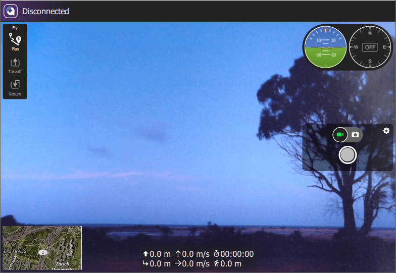

# Відеотрансляція (Супутній комп'ютер/QGroundControl)

Транспортні засоби на основі PX4 підтримують відеотрансляцію за допомогою камери, підключеної до супутнього комп'ютера [companion computer](../companion_computer/README.md).

:::info
Ви не можете безпосередньо транслювати відео з камери, підключеної до PX4.
:::

GStreamer використовується для відправки відео до _QGroundControl_ через IP-посилання.
Для відтворення сценаріїв використання вам потрібно встановити пакети розробки Gstreamer як на супутньому комп'ютері, так і на системі, на якій працює _QGroundControl_.
_QGroundControl_ uses GStreamer 1.18.1 and a stripped down version of _QtGstreamer_ to support UDP RTP and RSTP video streaming.

## Налаштування Компаньйонного Комп'ютера

You will need to install the _GStreamer_ packages that match those used by QGC.

For a Ubuntu companion, a minimal set might be:

```sh
sudo apt install gstreamer1.0-plugins-bad gstreamer1.0-libav gstreamer1.0-gl -y
```

For the full set you can mirror the QGC dependencies installed by [/tools/setup/install-dependencies-debian.sh](https://github.com/mavlink/qgroundcontrol/blob/master/tools/setup/install-dependencies-debian.sh).
At time of writing this is:

```sh
DEBIAN_FRONTEND=noninteractive apt-get -y --quiet install \
    libgstreamer1.0-dev \
    libgstreamer-plugins-bad1.0-dev \
    libgstreamer-plugins-base1.0-dev \
    libgstreamer-plugins-good1.0-dev \
    libgstreamer-gl1.0-0 \
    gstreamer1.0-plugins-bad \
    gstreamer1.0-plugins-base \
    gstreamer1.0-plugins-good \
    gstreamer1.0-plugins-ugly \
    gstreamer1.0-plugins-rtp \
    gstreamer1.0-gl \
    gstreamer1.0-libav \
    gstreamer1.0-rtsp \
    gstreamer1.0-vaapi \
    gstreamer1.0-x
```

:::tip
For other companion platforms you can mirror the instructions in the [corresponding installation scripts](https://github.com/mavlink/qgroundcontrol/tree/master/tools/setup).
:::

General instructions for starting the stream on a companion computer are provided in the [QGroundControl VideoReceiver GStreamer README](https://github.com/mavlink/qgroundcontrol/blob/master/src/VideoManager/VideoReceiver/GStreamer/README.md).

Налаштування камер та даних залежить від багатьох факторів.
Нижче наведено приклади з цієї бібліотеки (зауважте, що це варіанти, а не "рекомендації"):

- [Відеотрансляція за допомогою WFB-ng Wifi](../companion_computer/video_streaming_wfb_ng_wifi.md) (Навчальний посібник): Використання RaPi та модуля WiFi в режимі непідключеного (розповсюдженого) режиму для відеотрансляції та як двонапрямкового телеметричного зв'язку.

## Налаштування QGC

Для налаштування та використання відеотрансляції з QGC:

1. Install GStreamer if using Ubuntu QGC 4 release builds (or earlier)

   ::: tip
   All other QGroundControl builds include GStreamer binaries, including daily builds, release builds after version 4, and builds for other platforms include GStreamer binaries.

:::

   Install the runtime dependencies using the command:

   ```sh
   sudo apt install gstreamer1.0-plugins-bad gstreamer1.0-libav gstreamer1.0-gl -y
   ```

2. Start QGC

3. Увімкніть відео в режимі _Fly View_: [QGroundControl > Загальні налаштування (Вид налаштувань) > Відео](https://docs.qgroundcontrol.com/master/en/SettingsView/General.html#video)

4. Якщо все працює, ви повинні побачити відеопотік, відображений у перемикачі відео QGC (лівий нижній кут режиму Fly View QGC).
   Ви можете клацнути на перемикач відео, щоб перемикати відео на повний екран, як показано на знімку екрану нижче.

   

## Симуляція Gazebo Classic

[Gazebo Classic](../sim_gazebo_classic/Readme.md) підтримує потокове відео з імітованого середовища.
Для отримання додаткової інформації див.
For more information see [Gazebo Classic Simulation > Video Streaming](../sim_gazebo_classic/index.md#video-streaming).
