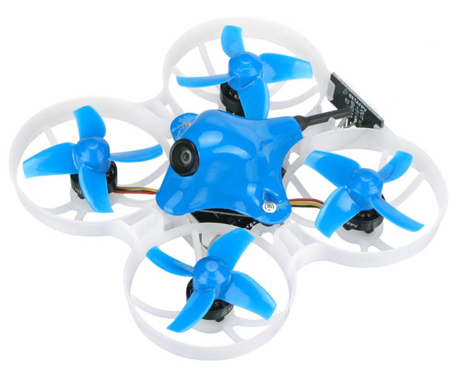

# BetaFPV Beta75X 2S Brushless Whoop

<Badge type="info" text="Discontinued" />

:::warning
Ця модель знятий з виробництва (../flight_controller/autopilot_experimental.md) і більше комерційно не доступна.
:::

[BetaFPV Beta75X](https://betafpv.com/products/beta75x-2s-whoop-quadcopter) - це дуже малий квадрокоптер, який може літати в приміщенні або на вулиці, з FPV або візуальним контролем.

## Де купити

_Beta75X_ можна придбати від кількох виробників, включаючи:

- [GetFPV](https://www.getfpv.com/beta75x-2s-brushless-whoop-micro-quadcopter-xt30-frsky.html)
- [Amazon](https://www.amazon.com/BETAFPV-Beta75X-Brushless-Quadcopter-Smartaudio/dp/B07H86XSPW)

Крім того, вам знадобиться:

- Передавач дистанційного керування. _Beta75X_ може постачатися з різними приймачами в комплекті. PX4 сумісний з усіма ними, але переконайтеся, що ви вибрали версію, яка відповідає вашому передавачу.
- Зарядний пристрій для LiPo акумулятора (апарат постачається з одним акумулятором, але вам може знадобитися додатковий).
- FPV окуляри, якщо ви хочете літати в режимі FPV.
  Є багато сумісних варіантів, включаючи ці від [Fatshark](https://www.fatshark.com/product-page/dominator-v3).

  ::: інформація
  Підтримка FPV є абсолютно незалежною від PX4/контролера польоту.

:::

## Прошивка завантажувача PX4

_Beta75X_ поставляється із заздалегідь встановленим Betaflight.

Перед завантаженням прошивки PX4 вам спочатку потрібно встановити завантажувач PX4.
Інструкції щодо встановлення завантажувача можна знайти в темі [Omnibus F4](../flight_controller/omnibus_f4_sd.md#bootloader) (це плата керування польотом на _Beta75X_).

:::tip
Ви завжди можете [перевстановити Betaflight](../advanced_config/bootloader_update_from_betaflight.md#reinstall-betaflight) пізніше, якщо захочете!
:::

## Встановлення/Налаштування

Після установки завантажувача, ви зможете під'єднати апарат до _QGroundControl_ через USB-кабель.

:::info
На момент написання _Omnibus F4_ підтримується в _Daily Build_ QGroundControl, і попередньо зібрана прошивка доступна лише для основної (master) гілки (стабільні версії ще не доступні).
:::

Для встановлення та налаштування PX4:

- [Завантажити Прошивку PX4](../config/firmware.md).
- [Встановіть Airframe](../config/airframe.md) в _BetaFPV Beta75X 2S Brushless Whoop_.
- Продовжуйте з [базовою конфігурацією](../config/index.md), включаючи калібрування датчиків та радіо.

## Відео

<lite-youtube videoid="_-O0kv0Qsh4" title="PX4 running on the BetaFPV Whoop"/>
