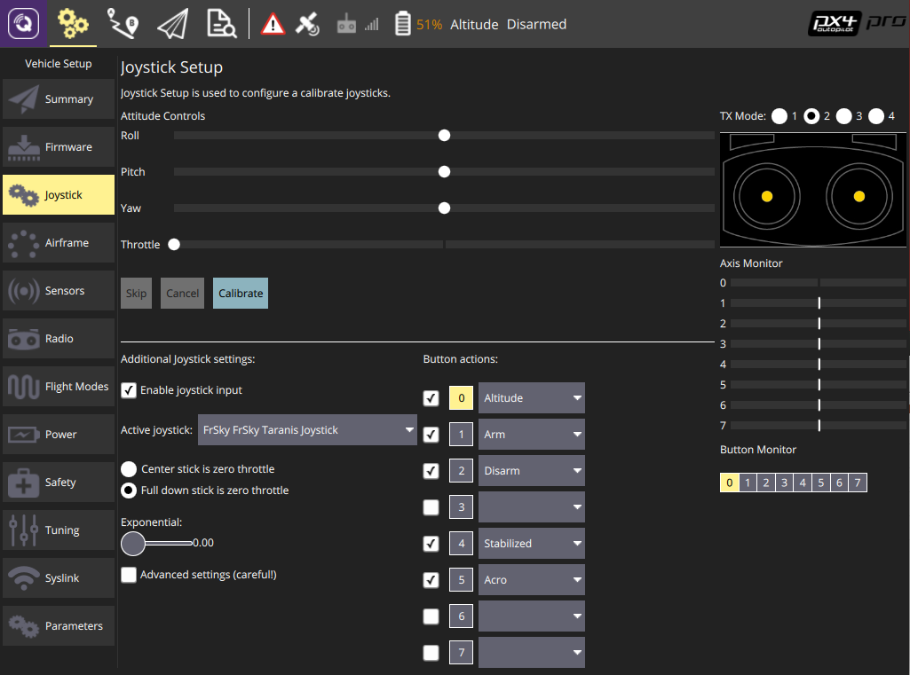

# Crazyflie 2.0 (Припинено)

<Badge type="info" text="Discontinued" />

:::warning
_Crazyflie 2.0_ було [припинено/замінено](../flight_controller/autopilot_experimental.md).
Натомість спробуйте [Bitcraze Crazyflie 2.1](../complete_vehicles_mc/crazyflie21.md)!
:::

:::warning

- PX4 не розробляє цей (або будь-який інший) автопілот.
  Зверніться до [виробника](https://www.bitcraze.io/) щодо підтримки апаратного забезпечення чи питань відповідності вимогам.
- Підтримка PX4 для цього контролера польоту є [експериментальною](../flight_controller/autopilot_experimental.md).

:::

Лінійка мікро-квадрокоптерів Crazyflie була створена компанією Bitcraze AB.
Огляд Crazyflie 2.0 можна [знайти тут](https://www.bitcraze.io/crazyflie-2/).


## Короткий опис

:::info
Основна документація з апаратного забезпечення тут: https://wiki.bitcraze.io/projects:crazyflie2:index
:::

- Основний System-on-Chip: STM32F405RG
  - CPU: 168 МГц ARM Cortex M4 з одноточним FPU
  - RAM: 192 KB SRAM
- nRF51822 радіо та керування живленням MCU
- MPU9250 Акселератор / Гіроскоп / Магнит
- Барометр LPS25H

## Де купити

- [Crazyflie 2.0](https://store.bitcraze.io/collections/kits/products/crazyflie-2-0).
- [Crazyradio PA 2.4 GHz USB dongle](https://store.bitcraze.io/collections/kits/products/crazyradio-pa): використовується для бездротового зв'язку між _QGroundControl_ та Crazyflie 2.0.
- [Breakout deck](https://store.bitcraze.io/collections/decks/products/breakout-deck): плата розширення для підключення нових периферійних пристроїв.
- [Дека потоку](https://store.bitcraze.io/collections/decks/products/flow-deck): містить оптичний сенсор потоку для вимірювання рухів землі та датчик відстані для вимірювання відстані до землі.
  Це буде корисно для точного контролю висоти та положення.
- [Deck Z-ranger](https://store.bitcraze.io/collections/decks/products/z-ranger-deck) має той самий датчик відстані, як і Deck Flow, щоб виміряти відстань до землі.
  Це буде корисно для точного контролю висоти.
- [Набір SD-картки](https://store.bitcraze.io/collections/decks/products/sd-card-deck): використовується для швидкого внутрішнього журналювання на карту micro SD.
- [Джойстик Logitech](https://support.logi.com/hc/en-us/articles/360024326793--Getting-Started-Gamepad-F310).

## Прошивка PX4

Після налаштування середовища розробки PX4 слідкуйте цим крокам, щоб встановити автопілот PX4 на Crazyflie 2.0:

1. Завантажте вихідний код завантажувача PX4:

  ```sh
  git clone https://github.com/PX4/Bootloader.git
  ```

2. Перейдіть до верхньої директорії вихідного коду та скомпілюйте його за допомогою:

  ```sh
  make crazyflie_bl
  ```

3. Поставте Crazyflie 2.0 у режим DFU, виконавши ці кроки:
  - Спочатку переконайтеся, що він знеструмлений.
  - Утримуйте кнопку скидання (див. малюнок нижче...).
    
  - Підключіть до USB-порту комп'ютера.
  - Через секунду синій світлодіод повинен почати блимати, а через 5 секунд повинен почати блимати швидше.
  - Відпустіть кнопку.

4. Встановіть _dfu-util_:

  ```sh
  sudo apt-get update
  sudo apt-get install dfu-util
  ```

5. Виконайте прошивку завантажувальника за допомогою _dfu-util_ та від'єднайте Crazyflie 2.0, коли це зроблено:

  ```sh
  sudo dfu-util -d 0483:df11 -a 0 -s 0x08000000 -D ./build/crazyflie_bl/crazyflie_bl.bin
  ```

  Коли увімкнено Crazyflie 2.0, жовтий світлодіод повинен мигати.

6. Завантажте вихідний код завантажувача автопілоту PX4:

  ```sh
  git clone https://github.com/PX4/PX4-Autopilot.git
  ```

7. Перейдіть до верхньої директорії вихідного коду та скомпілюйте його за допомогою:

  ```sh
  make bitcraze_crazyflie_default upload
  ```

8. Коли вас попросять підключити пристрій, підключіть Crazyflie 2.0.
  Жовтий світлодіод повинен почати блимати, що вказує на режим завантажувача.
  Потім червоний світлодіод повинен увімкнутися, що вказує на те, що процес мигання розпочався.

9. Очікування завершення.

10. Готово! Калібруйте сенсори за допомогою [QGroundControl](https://docs.qgroundcontrol.com/master/en/qgc-user-guide/setup_view/sensors.html).

:::info
If QGroundControl does not connect with the vehicle, ensure that in [nuttx-config](https://github.com/PX4/PX4-Autopilot/blob/main/boards/bitcraze/crazyflie/nuttx-config/nsh/defconfig) for crazyflie `# CONFIG_DEV_LOWCONSOLE is not set` is replaced by `CONFIG_DEV_LOWCONSOLE=y`.
This should be done using _menuconfig_:

```sh
make bitcraze_crazyflie_default menuconfig
```

або _qconfig_ (Перевірте _Low-level console support_ в розділі _Serial Driver Support_ у GUI):

```sh
make bitcraze_crazyflie_default qconfig
```

:::

## Інструкції з налаштування бездротового з'єднання

Модуль nRF на борту дозволяє підключатися до плати через Bluetooth або через пропрієтарний протокол Nordic ESB на частоті 2,4 ГГц.

- Рекомендується [Crazyradio PA](https://www.bitcraze.io/crazyradio-pa/).
- Щоб одразу летіти на Crazyflie 2.0, додаток для смартфона Crazyflie підтримується через Bluetooth.

Використання офіційного додатка **Crazyflie для телефону**:

- Підключіться через Bluetooth.
- Змініть режим у налаштуваннях на 1 або 2.
- Відкалібруйте через QGroundControl.

Підключення через **MAVLink**:

- Використовуйте Crazyradio PA разом із сумісним GCS.
- Завантажте вихідний код _crazyflie-lib-python_:

  ```sh
  git clone https://github.com/bitcraze/crazyflie-lib-python.git
  ```

:::info
Ми будемо використовувати [cfbridge.py](https://github.com/bitcraze/crazyflie-lib-python/blob/master/examples/cfbridge.py) для налаштування бездротового зв'язку MAVlink між Crazyflie 2.0 (прошитий PX4) та QGroundControl. _Cfbridge_ дозволяє QGroundControl комунікувати з crazyradio PA.
Цей [базований на C cfbridge](https://github.com/dennisss/cfbridge) наразі має проблеми з втратою даних, тому ми вирішили використовувати **cfbridge.py**.
:::

- Переконайтеся, що ви налаштували дозволи udev для використання USB радіо. Для цього виконайте наступні кроки [тут](https://www.bitcraze.io/documentation/repository/crazyflie-lib-python/master/installation/usb_permissions/) та **перезапустіть** ваш комп'ютер.

- Підключіть Crazyradio PA через USB.

- Побудуйте [віртуальне середовище (локальне середовище Python)](https://virtualenv.pypa.io/en/latest/) залежностей в пакеті, використовуючи наступний метод:

  ```sh
  pip install tox --user
  ```

- Перейдіть до папки crazyflie-lib-python та введіть:

  ```sh
  make venv
  ```

- Активуйте віртуальне середовище:

  ```sh
  source venv-cflib/bin/activate
  ```

- Встановіть необхідні залежності:

  ```sh
  pip install -r requirements.txt --user
  ```

Щоб підключити Crazyflie 2.0 з crazyradio, **запустіть cfbridge** за допомогою цих кроків:

- Вимкніть та увімкніть Crazyflie 2.0 та зачекайте, поки він завантажиться.

- Підключіть радіопристрій Crazyflie через USB.

- Перейдіть до папки crazyflie-lib-python.

- Активуйте середовище:

  ```sh
  source venv-cflib/bin/activate
  ```

- Перейдіть до папки прикладів:

  ```sh
  cd examples
  ```

- Запустіть cfbridge:

```sh
python cfbridge.py
```

:::info
_Cfbridge_ за замовчуванням намагається ініціювати комунікацію радіоканалу на каналі 80 та з адресою crazyflie 0xE7E7E7E7E7.
Якщо ви використовуєте [кілька crazyflies та/або crazyradios](https://github.com/dennisss/cfbridge/blob/master/index.md#advanced-swarming) в одній кімнаті і хочете використовувати різні канали та/або адреси для кожного, спочатку підключіть crazyflie до QGroundControl через USB-кабель і змініть параметри syslink (канал, адреса) в QGroundControl.
Після цього запустіть cfbridge, надаючи той самий канал та адресу як перший та другий аргументи відповідно, наприклад: `python cfbridge.py 90 0x0202020202`
:::

- Відкрийте QGroundControl.
- Після використання _cfbridge_ ви можете вимкнути віртуальне середовище, якщо ви його активували, натиснувши `CTRL+z`.
  Більшість часу, запуск _cfbridge_ знову з того ж терміналу не підключається до crazyflie, це можна вирішити, закривши термінал і знову запустивши _cfbridge_ в новому терміналі.

:::tip
If you change any driver in [crazyflie-lib-python](https://github.com/bitcraze/crazyflie-lib-python) or if launching _cfbridge_ in a new terminal does not find crazyflie, you can try navigating to the crazyflie-lib-python folder and run the script below to rebuild cflib.

```sh
make venv
```

:::

:::info
Для використання джойстика встановіть `COM_RC_IN_MODE` в QGroundControl на "Joystick/No RC Checks".
Калібруйте джойстик та встановіть частоту повідомлень джойстика в QGroundControl на будь-яке значення від 5 до 14 Гц (рекомендовано 10 Гц).
Щоб мати можливість встановити частоту, потрібно ввімкнути розширену опцію.
Це швидкість, з якою команди джойстика відправляються з QGroundControl до Crazyflie 2.0 (для цього вам потрібно слідувати інструкціям [тут](https://github.com/mavlink/qgroundcontrol), щоб отримати останній вихідний код QGroundControl (master) і скомпілювати його).
:::


## Налаштування програмного забезпечення

Crazyflie 2.0 може літати з точним керуванням у режимі [Стабілізований режим](../flight_modes_mc/manual_stabilized.md), режимі [Висотний режим](../flight_modes_mc/altitude.md) та режимі [Позиційний режим](../flight_modes_mc/position.md).

- Для польоту в режимі _Altitude_ вам знадобиться [Z-ranger deck](https://store.bitcraze.io/collections/decks/products/z-ranger-deck).
  Якщо ви також хочете літати в режимі _Position_, рекомендується придбати [Flow deck](https://store.bitcraze.io/collections/decks/products/flow-deck), який також має вбудований сенсор Z-ranger.
- Покладений барометр дуже чутливий до будь-яких зовнішніх вітрових порушень, включаючи ті, які створюються Crazyflie власними гвинтами. Отже, ми відокремили барометр за допомогою шматка піни, а потім встановили датчик відстані зверху, як показано нижче:


Для реєстрації деталей польоту ви можете встановити наверху Crazyflie карту SD, як показано нижче:


Потім вам потрібно приклеїти батарею зверху до покриття карти SD за допомогою двостороннього скотчу:


## Контроль висоти

Crazyflie може літати в режимі _Altitude_, якщо ви використовуєте [Z-ranger deck](https://store.bitcraze.io/collections/decks/products/z-ranger-deck).
Згідно з технічною характеристикою, максимальна висота (над землею), яку може відчути дальномер, становить 2 м. Проте, коли це перевірялося на темних поверхнях, це значення зменшується до 0.5 м. На світлій підлозі він піднімається до максиму 1.3 м. Це означає, що ви не можете утримувати висоти вище цієї величини у режимах польоту _Altitude_ або _Position_.

:::tip
Якщо висота Crazyflie 2.0 зсувається при команді середнього газу в _Altitude mode_ або _Position mode_, спочатку спробуйте перезавантажити дрон. Якщо це не виправляє проблему, перекалібруйте акселерометр та магніт (компас).\
:::

:::info
Оскільки бортовий барометр дуже вразливий до вітрових турбулентностей, створених власними пропелерами Crazyflie, ви не можете покладатися на нього для збереження висоти.
:::

## Керування позицією

З [Flow deck](https://store.bitcraze.io/collections/decks/products/flow-deck) ви можете літати на Crazyflie 2.0 в _Position mode_.
На відміну від [PX4FLOW](../sensor/px4flow.md), плата потоку не містить гіроскоп, тому вбудований гіроскоп використовується для об'єднання потоку з метою знаходження місцевих оцінок позиції.
Крім того, палуба потоку використовує ту саму шину SPI, що й палуба SD-карти, тому ведення журналу на високій швидкості на SD-картці не рекомендується під час польоту у режимі _Position mode_.

## Використання пульта дистанційного керування FrSky Taranis як джойстика

Якщо у вас вже є пульт дистанційного керування Taranis і ви хочете використовувати його як контролер, його можна налаштувати як USB джойстик:

- Створити нову модель у Taranis.

  

- На сторінці меню _MODEL SETUP_ вимикайте обидва внутрішні і зовнішні TX модулі.

  

- На сторінці меню _OUTPUTS_ (також називаній сторінкою “SERVOS” у деяких передавачах Taranis) інвертуйте Throttle (CH1) та Aileron (CH3).

  

Для використання перемикачів Taranis для озброєння/роззброєння та перемикання між різними режимами польоту:

- На сторінці меню _MIXER_ в Taranis UI ви можете призначити перемикачі для будь-якого каналу в діапазоні каналів 9-16, які відповідають кнопкам 0-7 у налаштуванні джойстика QGroundControl. Наприклад, перемикач Taranis "SD" може бути встановлений на канал 9 в інтерфейсі Taranis UI:

  

- Підключіть Taranis до ПК за допомогою USB-кабелю та відкрийте QGroundControl.

- У налаштуваннях джойстика QGroundControl ви можете побачити, як кнопки стають жовтими, коли ви їх увімкнете. Наприклад, канал 9 в Taranis відповідає кнопці 0 в налаштуванні джойстика QGroundControl. Ви можете призначити будь-який режим для цієї кнопки, наприклад, режим _Altitude_. Тепер, коли ви опускаєте перемикач "SD", режим польоту зміниться на _Altitude_.

  

### ROS

Для підключення до Crazyflie 2.0 через MAVROS:

- Запустіть _cfbridge_ за допомогою вищезазначених інструкцій.

- Змінити порт UDP, на який прослуховує QGroundControl:
  - У QGroundControl перейдіть до **Налаштувань додатка > Загальні** і знять позначки з усіх полів під _Autoconnect to the following devices_.
  - Додайте в **Comm Links** посилання типу _UDP_, встановіть параметр _Automatically Connect on Start_, змініть _Listening Port_ на 14557, додайте Цільові хости: 127.0.0.1, а потім натисніть **OK**.

- Переконайтеся, що встановлено [MAVROS](https://github.com/mavlink/mavros/tree/master/mavros#installation).

- Запустіть MAVROS за допомогою команди:

  ```sh
  roslaunch mavros px4.launch fcu_url:="udp://:14550@127.0.0.1:14551" gcs_url:="udp://@127.0.0.1:14557"
  ```

- Перезапустіть QGroundControl, якщо він не підключається.
