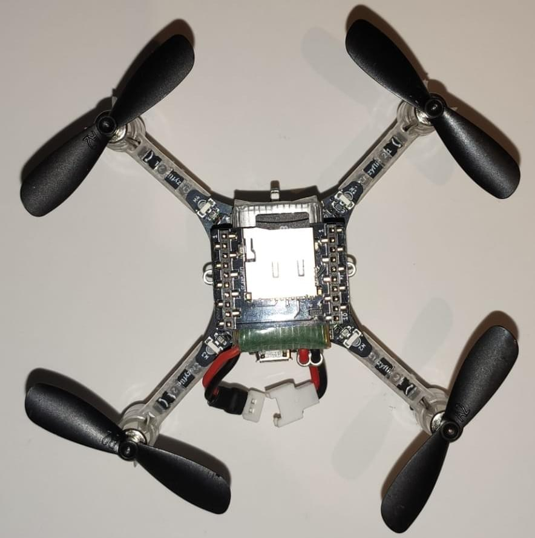

# Crazyflie 2.1

<LinkedBadge type="warning" text="Experimental" url="../flight_controller/autopilot_experimental.html"/>

:::warning
PX4 не розробляє цей (або будь-який інший) автопілот.
Зверніться до [виробника](https://www.bitcraze.io/) щодо підтримки апаратного забезпечення чи питань відповідності вимогам.
:::

:::warning
Crazyflie 2.1 може літати лише в режимі [Стабілізований режим](../flight_modes_mc/manual_stabilized.md).
:::

Лінійка мікро-квадрокоптерів Crazyflie була створена компанією Bitcraze AB.
Огляд Crazyflie 2.1 можна [знайти тут](https://www.bitcraze.io/products/crazyflie-2-1/).


## Короткий опис

:::info
Основна документація з апаратного забезпечення [тут](https://wiki.bitcraze.io/projects:crazyflie2:index)
:::

- Основний System-on-Chip: STM32F405RG
  - CPU: 168 МГц ARM Cortex M4 з одноточним FPU
  - RAM: 192 KB SRAM
- nRF51822 радіо та керування живленням MCU
- BMI088 3 вісний акселерометр / гіроскоп
- Високоточний датчик тиску BMP388
- uUSB конектор
- Інтегрований LiPo зарядний пристрій з доступними режимами 100мА, 500мА та 980мА
- Інтерфейс пристрою USB повної швидкості
- Часткова можливість USB OTG (присутній USB OTG, але відсутній вихід 5В)
- 8KB EEPROM

## Де купити

Транспортний засіб можна придбати тут: [Crazyflie 2.1](https://store.bitcraze.io/products/crazyflie-2-1) (store.bitcraze.io)

Корисне периферійне обладнання включає в себе:

- [Crazyradio PA 2.4 GHz USB dongle](https://store.bitcraze.io/collections/kits/products/crazyradio-pa): використовується для бездротового зв'язку між _QGroundControl_ та Crazyflie 2.0
- [Breakout deck](https://store.bitcraze.io/collections/decks/products/breakout-deck): плата розширення для підключення нових периферійних пристроїв.
- [Flow deck v2](https://store.bitcraze.io/collections/decks/products/flow-deck-v2): Оптичний сенсор потоку та датчик відстані для управління висотою та позицією.
- [Z-ranger deck v2](https://store.bitcraze.io/collections/decks/products/z-ranger-deck-v2): Датчик відстані для керування висотою (той самий датчик, що й Flow deck).
- [Мульти-датчикова плата](https://store.bitcraze.io/collections/decks/products/multi-ranger-deck) Виявлення об'єктів у багатьох напрямках
- [Бортовий динамік](https://store.bitcraze.io/collections/decks/products/buzzer-deck) Аудіоповідомлення про події в системі, такі як низький рівень заряду або завершення зарядки.
- [Breakout deck](https://store.bitcraze.io/collections/decks/products/breakout-deck): плата розширення, яка дозволяє вам легко тестувати нове апаратне забезпечення без паяння.
- [Плата SD-картки](https://store.bitcraze.io/collections/decks/products/sd-card-deck): використовується для швидкого внутрішнього журналювання на карту micro SD
- [Джойстик Logitech](https://support.logi.com/hc/en-us/articles/360024326793--Getting-Started-Gamepad-F310)

## Збірка Crazyflie 2.1

- [Початок роботи з Bitcraze crazyflie 2.1](https://www.bitcraze.io/documentation/tutorials/getting-started-with-crazyflie-2-x/).

## Прошивка PX4

:::info
Ці інструкції були перевірені на Ubuntu.
:::

Після налаштування середовища розробки PX4 слідкуйте цим крокам, щоб встановити автопілот PX4 на Crazyflie 2.1:

1. Завантажте вихідний код завантажувача PX4:

  ```sh
  git clone https://github.com/PX4/Bootloader.git --recurse-submodules
  ```

2. Перейдіть до верхньої директорії вихідного коду та скомпілюйте його за допомогою:

  ```sh
  make crazyflie21_bl
  ```

3. Поставте Crazyflie 2.1 у режим DFU, виконавши ці кроки:
  - Спочатку переконайтеся, що він знеструмлений.
  - Переконайтеся, що акумулятор від'єднаний.
  - Утримуйте кнопку скидання (див. малюнок нижче...).
    
  - Підключіть до USB-порту комп'ютера.
  - Через секунду синій світлодіод повинен почати блимати, а через 5 секунд повинен почати блимати швидше.
  - Відпустіть кнопку.

4. Встановіть _dfu-util_:

  ```sh
  sudo apt-get update
  sudo apt-get install dfu-util
  ```

5. Виконайте прошивку завантажувальника за допомогою _dfu-util_ та від'єднайте Crazyflie 2.1, коли це зроблено:

  ```sh
  sudo dfu-util -d 0483:df11 -a 0 -s 0x08000000 -D ./build/crazyflie21_bl/crazyflie21_bl.bin
  ```

  Коли увімкнено Crazyflie 2.1, жовтий світлодіод повинен мигати.

6. Завантажте вихідний код завантажувача автопілоту PX4:

  ```sh
  git clone https://github.com/PX4/PX4-Autopilot.git
  ```

7. Перейдіть до верхньої директорії вихідного коду та скомпілюйте його за допомогою:

  ```sh
  cd PX4-Autopilot/
  make bitcraze_crazyflie21_default upload
  ```

8. Коли вас попросять підключити пристрій, підключіть Crazyflie 2.1.
  Жовтий світлодіод повинен почати блимати, що вказує на режим завантажувача.
  Потім червоний світлодіод повинен увімкнутися, що вказує на те, що процес мигання розпочався.

9. Очікування завершення.

10. Готово! Калібруйте сенсори за допомогою [QGroundControl](https://docs.qgroundcontrol.com/master/en/qgc-user-guide/setup_view/sensors.html).

## Встановлення оригінальної прошивки Bitcraze

1. Завантажте останній [завантажувач Crazyflie 2.1](https://github.com/bitcraze/crazyflie2-stm-bootloader/releases)

2. Поставте Crazyflie 2.1 у режим DFU, виконавши ці кроки:
  - Спочатку переконайтеся, що він знеструмлений.
  - Переконайтеся, що акумулятор від'єднаний.
  - Утримуйте кнопку скидання.
  - Підключіть до USB-порту комп'ютера.
  - Через секунду синій світлодіод повинен почати блимати, а через 5 секунд повинен почати блимати швидше.
  - Відпустіть кнопку.

3. Виконайте прошивку завантажувальника за допомогою _dfu-util_ та від'єднайте Crazyflie 2.1, коли це зроблено:

  ```sh
  sudo dfu-util -d 0483:df11 -a 0 -s 0x08000000 -D cf2loader-1.0.bin
  ```

  Коли увімкнено Crazyflie 2.1, жовтий світлодіод повинен мигати.

4. Встановіть останнє програмне забезпечення для польоту Bitcraze Crazyflie 2.1, використовуючи [цей](https://www.bitcraze.io/documentation/tutorials/getting-started-with-crazyflie-2-x/#update-fw) посібник.

## Інструкції з налаштування бездротового з'єднання

Модуль nRF на борту дозволяє підключатися до плати через Bluetooth або через пропрієтарний протокол Nordic ESB на частоті 2,4 ГГц.

- Рекомендується [Crazyradio PA](https://www.bitcraze.io/crazyradio-pa/).
- Щоб одразу летіти на Crazyflie 2.1, додаток для смартфона Crazyflie підтримується через Bluetooth.

Підключення через **MAVLink**:

- Використовуйте Crazyradio PA разом із сумісним GCS.
- Завантажте вихідний код _crazyflie-lib-python_:

  ```sh
  git clone https://github.com/bitcraze/crazyflie-lib-python.git
  ```

:::info
Ми будемо використовувати [cfbridge.py](https://github.com/bitcraze/crazyflie-lib-python/blob/master/examples/cfbridge.py) для налаштування бездротового зв'язку MAVlink між Crazyflie 2.1 (прошитий PX4) та QGroundControl. _Cfbridge_ дозволяє QGroundControl комунікувати з crazyradio PA.
Цей [базований на C cfbridge](https://github.com/dennisss/cfbridge) наразі має проблеми з втратою даних, тому ми вирішили використовувати **cfbridge.py**.
:::

- Переконайтеся, що ви налаштували дозволи udev для використання USB радіо. Для цього виконайте наступні кроки [тут](https://www.bitcraze.io/documentation/repository/crazyflie-lib-python/master/installation/usb_permissions/) та **перезапустіть** ваш комп'ютер.

- Підключіть Crazyradio PA через USB.

- Побудуйте [віртуальне середовище (локальне середовище Python)](https://virtualenv.pypa.io/en/latest/) залежностей в пакеті, використовуючи наступний метод:

  ```sh
  pip install tox --user
  ```

- Перейдіть до папки crazyflie-lib-python та введіть:

  ```sh
  make venv
  ```

- Активуйте віртуальне середовище:

  ```sh
  source venv/bin/activate
  ```

- Встановіть необхідні залежності:

  ```sh
  pip install cflib
  pip install -r requirements.txt
  ```

Щоб підключити Crazyflie 2.1 з crazyradio, **запустіть cfbridge** за допомогою цих кроків:

- Вимкніть та увімкніть Crazyflie 2.1 та зачекайте, поки він завантажиться.

- Підключіть радіопристрій Crazyflie через USB.

- Перейдіть до папки crazyflie-lib-python.

- Активуйте середовище:

  ```sh
  source venv/bin/activate
  ```

- Перейдіть до папки прикладів:

  ```sh
  cd examples

  ```

- Запустіть cfbridge:

  ```sh
  python cfbridge.py
  ```

  ::: info
  _Cfbridge_ за замовчуванням намагається ініціювати комунікацію радіоканалу на каналі 80 та з адресою crazyflie 0xE7E7E7E7E7.
  Якщо ви використовуєте [кілька crazyflies та/або crazyradios](https://github.com/dennisss/cfbridge/blob/master/index.md#advanced-swarming) в одній кімнаті і хочете використовувати різні канали та/або адреси для кожного, спочатку підключіть crazyflie до QGroundControl через USB-кабель і змініть параметри syslink (канал, адреса) в QGroundControl.
  Після цього запустіть cfbridge, надаючи той самий канал та адресу як перший та другий аргументи відповідно, наприклад: `python cfbridge.py 90 0x0202020202`

:::

- Відкрийте QGroundControl.

- Після використання _cfbridge_ ви можете вимкнути віртуальне середовище, якщо ви його активували, натиснувши `CTRL+z`.
  Більшість часу, запуск _cfbridge_ знову з того ж терміналу не підключається до crazyflie, це можна вирішити, закривши термінал і знову запустивши _cfbridge_ в новому терміналі.

:::tip
If you change any driver in [crazyflie-lib-python](https://github.com/bitcraze/crazyflie-lib-python) or if launching _cfbridge_ in a new terminal does not find crazyflie, you can try navigating to the crazyflie-lib-python folder and run the script below to rebuild cflib.

```sh
make venv
```

:::

:::info
The Joystick menu in QGC, only appears after you connect the controller to the PC (for example a Playstation 3 controller).


:::

## Налаштування програмного забезпечення

Crazyflie 2.1 може літати лише в режимі [Стабілізований режим](../flight_modes_mc/manual_stabilized.md).

Для реєстрації деталей польоту ви можете встановити наверху Crazyflie карту SD, як показано нижче:



## Використання пульта дистанційного керування FrSky Taranis як джойстика

Якщо у вас вже є пульт дистанційного керування Taranis і ви хочете використовувати його як контролер, його можна налаштувати як USB джойстик:

- Створити нову модель у Taranis.

  

- На сторінці меню _MODEL SETUP_ вимикайте обидва внутрішні і зовнішні TX модулі.

  

- На сторінці меню _OUTPUTS_ (також називаній сторінкою “SERVOS” у деяких передавачах Taranis) інвертуйте Throttle (CH1) та Aileron (CH3).

  

Для використання перемикачів Taranis для озброєння/роззброєння та перемикання між різними режимами польоту:

- На сторінці меню _MIXER_ в Taranis UI ви можете призначити перемикачі для будь-якого каналу в діапазоні каналів 9-16, які відповідають кнопкам 0-7 у налаштуванні джойстика QGroundControl. Наприклад, перемикач Taranis "SD" може бути встановлений на канал 9 в інтерфейсі Taranis UI:

  

- Підключіть Taranis до ПК за допомогою USB-кабелю та відкрийте QGroundControl.

- У налаштуваннях джойстика QGroundControl ви можете побачити, як кнопки стають жовтими, коли ви їх увімкнете. Наприклад, канал 9 в Taranis відповідає кнопці 0 в налаштуванні джойстика QGroundControl. Ви можете призначити будь-який режим для цієї кнопки, наприклад, режим _Altitude_. Тепер, коли ви опускаєте перемикач "SD", режим польоту зміниться на _Altitude_.

  

### ROS

Для підключення до Crazyflie 2.1 через MAVROS:

- Запустіть _cfbridge_ за допомогою вищезазначених інструкцій.

- Змінити порт UDP, на який прослуховує QGroundControl:
  - У QGroundControl перейдіть до **Налаштувань додатка > Загальні** і знять позначки з усіх полів під _Autoconnect to the following devices_.
  - Додайте в **Comm Links** посилання типу _UDP_, встановіть параметр _Automatically Connect on Start_, змініть _Listening Port_ на 14557, додайте Цільові хости: 127.0.0.1, а потім натисніть **OK**.

- Переконайтеся, що встановлено [MAVROS](https://github.com/mavlink/mavros/tree/master/mavros#installation).

- Запустіть MAVROS за допомогою команди:

  ```sh
  roslaunch mavros px4.launch fcu_url:="udp://:14550@127.0.0.1:14551" gcs_url:="udp://@127.0.0.1:14557"
  ```

- Перезапустіть QGroundControl, якщо він не підключається.

## Політ

<lite-youtube videoid="0qy7O3fVN2c" title="Crazyflie 2.1 - PX4 Firmware (stabilized mode)"/>
