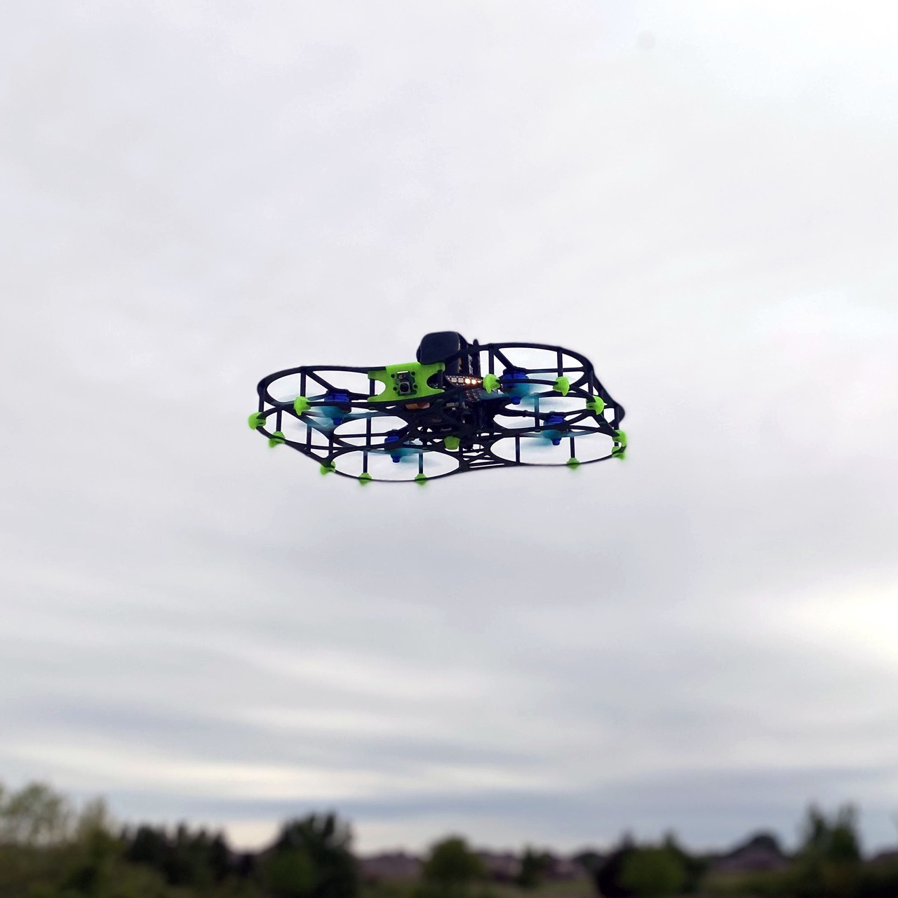

# DroneBlocks DEXI 5

The [DEXI 5](https://droneblocks.io/program/dexi-5-px4-stem-drone-kit/) is an NDAA-compliant PX4 STEM and development drone kit from [DroneBlocks](https://droneblocks.io/), designed to take students, hobbyists, and PX4 developers from unboxing to writing autonomous code with no technical barrier.

DEXI 5 is an [Official PX4 Developer Kit](../dev_kits/index.md).

## Загальний огляд

DEXI 5 is built around an all-in-one flight controller running PX4, developed in collaboration with [ARK Electronics](https://arkelectron.com/), with integrated optical flow sensing for GPS-denied indoor flight.
A Raspberry Pi compute module acts as the companion computer, with a Pi camera and accessible GPIO pins for sensors, servos, and other payloads (up to about 225 g).

Assembly is modular, solder-free, and plug-and-play, and is itself part of the learning experience: building the vehicle teaches the aerodynamics, mechanics, and electronics behind it.

All critical electronic components are manufactured in the United States, meeting NDAA Section 848 requirements.

## Software and Curriculum

The kit ships with a full project-based curriculum on [learn.droneblocks.io](https://learn.droneblocks.io/) covering:

- DroneBlocks visual (block-based) programming
- Python scripting with [MAVSDK](https://mavsdk.mavlink.io/)
- [ROS 2](../ros2/index.md) development, including projects such as AprilTag detection
- Computer vision with OpenCV using the onboard Pi camera

Community support is available on the [DroneBlocks forum](https://community.droneblocks.io/).

## Де купити

- [DroneBlocks DEXI 5](https://droneblocks.io/program/dexi-5-px4-stem-drone-kit/) (single kits and classroom packs)
