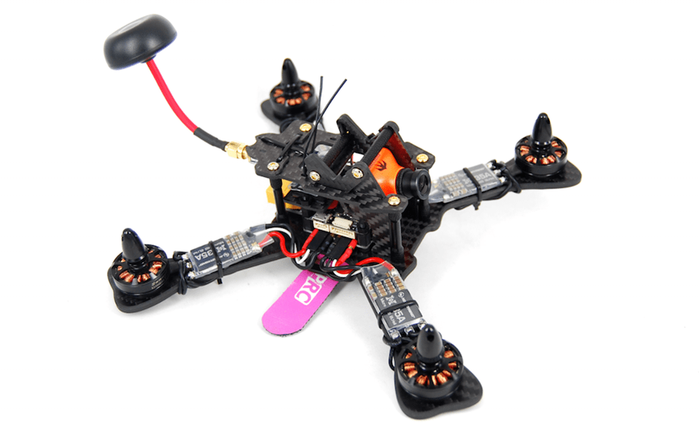

## MindRacer 210

### Опис

Готовий літній звір працює з повним стеком PX4/MindPX. Можна досягти максимального 10:1 коефіцієнта тяги до ваги!

MR210 використовує MindRacer як польотний контролер. MR210 є повністю модульним, складним RTF дронтом. Безпаяльні SEP/WEP сокети дозволяють пілотам швидко замінити пошкоджені частини без потреб для паяльника. Пілоти можуть ще більше легко налаштувати конструювання, додавши до нього або замінивши частини складу, щоб зробити більш потужний дрон.

### Основні характеристики

1. Справжній «X», рама з вуглецевого волокна товщиною 4 мм і діагоналлю 210 мм.
2. Стабільні SEP/WEP сокети для безплатного ESC з'єднання та заміни частин.
3. 30A/4S/OneShot увімкнув BLHeli ESC.
4. 5V універсального постачання напруги для всіх авіонік, включаючи камери та VTX.
5. DroneCode&reg; стандартний сумісний JST GH коннектори.
6. Мають параметри PPM/S.Bus/Specktrum DSM приймача

### Посібник користувача

:::info
Посібник користувача – [here](http://mindpx.net/assets/accessories/MR210usermanual_pdf.pdf).
:::

### Де купити

MindRacer 210 доступний в [AirMind Store](https://airmind.mindpx.net/node/78). Ви також можете знайти MindRacer на Amazon&reg; або на eBay&reg;.

### Підтримка

Будь ласка, зайдіть на http://www.mindpx.org для отримання додаткової інформації. Або ви можете надіслати email на [support@mindpx.net](mailto:support@mindpx.net) для будь-яких запитів або допомоги.
