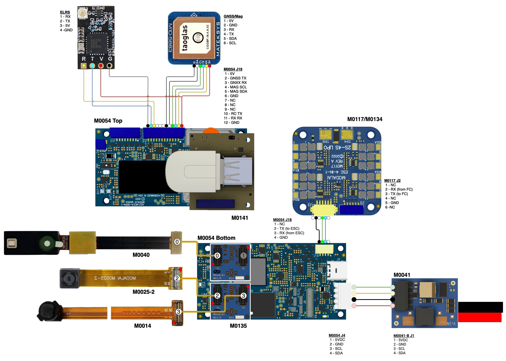

# VOXL 2 Зоряний PX4 Розробка Дрону

[Starling](https://modalai.com/starling) - це SLAM розроблений дрон, підсиленний [VOXL 2](../flight_controller/modalai_voxl_2.md) та PX4 з оптимізованими датчиками та навантаженнями для внутрішньої та зовнішньої автономної навігації.
За допомогою автопілота Blue UAS Framework, VOXL 2, Starling важить всього 275 г і має вражаючі 30 хвилин автономного польоту в приміщенні.

VOXL 2 Starling - це розробницький безпілотник PX4, який містить супутній комп'ютер [VOXL 2](../flight_controller/modalai_voxl_2.md) та керування польотом PX4, сенсори зображення, GPS, модем підключення і готовий до польоту прямо з коробки.
Starling має [відкрите SDK](https://docs.modalai.com/voxl-developer-bootcamp/) від ModalAI, яке має попередньо налаштовані моделі автономії для польотів з допомогою комп'ютерного зору.
Цей розвивальний дрон призначений, щоб допомогти вам швидше вийти на ринок та прискорити розробку та прототипування вашої програми.

Цей посібник пояснює мінімальну додаткову настройку, необхідну для підготовки БПЛА до польоту. Він також охоплює огляд апаратного забезпечення, перший польот, налаштування WiFi та інше.

:::info
Для повного та регулярно оновлюваного документування відвідайте <https://docs.modalai.com/starling-v2>.
:::

:::info
Якщо ви новачок у VOXL, обов'язково ознайомтеся з основними функціями апаратного та програмного забезпечення VOXL, переглянувши [VOXL Bootcamp](https://docs.modalai.com/voxl-developer-bootcamp/).
:::

## Де купити

[modalai.com/starling](https://modalai.com/starling)

## Налаштування обладнання

| Callout | Опис                                                         | MPN              |
| ------- | ------------------------------------------------------------ | ---------------- |
| A       | VOXL 2                                                       | MDK-M0054-1      |
| B       | VOXL 4-in-1 ESC                                              | MDK-M0117-1      |
| C       | Заглушка для барометра                                       | M10000533        |
| D       | Датчик зображення ToF (PMD)               | MDK-M0040        |
| E       | Датчик відстеження зображень (OV7251)     | M0014            |
| F       | Датчик зображення високої якості (IMX214) | M0025-2          |
| G       | AC600 WiFi Dongle                                            | AWUS036EACS      |
| H       | Модуль GNSS GPS & Компас                 | M10-5883         |
| I       | Приймач ELRS 915МГц                                          | BetaFPV Nano RX  |
| J       | Роз'єм USB C на VOXL 2 (не відображено)   |                  |
| K       | Блок живлення VOXL                                           | MCCA-M0041-5-B-T |
| L       | 4726FM Пропелер                                              | M10000302        |
| M       | Мотор 1504                                                   |                  |
| N       | XT30 Конектор живлення                                       |                  |

## Документація

### Характеристики

| Компонент                | Специфікація                                                        |
| ------------------------ | ------------------------------------------------------------------- |
| Автопілот                | VOXL2                                                               |
| Максимальна взлітна вага | 275г (172г без батареї)                          |
| Розмір по діагоналі      | 211мм                                                               |
| Час польоту              | 30 хвилин                                                           |
| Двигуни                  | 1504                                                                |
| Пропелери                | 120mm                                                               |
| Frame                    | Карбонове волокно 3мм                                               |
| ESC                      | ModalAI VOXL 4-in-1 ESC V2                                          |
| GPS                      | UBlox M10                                                           |
| Приймач радіокерування   | 915мгц ELRS                                                         |
| Модуль живлення          | Модуль живлення ModalAI v3 - 5V/6A                                  |
| Батарея                  | Sony VTC6 3000mah 2S, або будь-яка 2S 18650 батарея з роз'ємом XT30 |
| Висота                   | 83мм                                                                |
| Ширина                   | 187мм (пропелери складені)                       |
| Довжина                  | 142мм (пропелери складені)                       |

### Стандартна схема проводки

## Посібники

### ELRS Set Up

Прив'язка вашого приймача ELRS (ExpressLRS) до передавача є важливим кроком у підготовці вашого набору розробника автономії PX4 Autonomy Developer Kit від ModalAI на базі VOXL 2 для польоту.
Цей процес забезпечує безпечне та відгукнуто з'єднання між вашим дроном та його системою керування.

Дотримуйтесь цього керівництва, щоб прив'язати ваш приймач ELRS до вашого передавача.

#### Налаштування відображення

1. **Увімкніть приймач**: Як тільки ваш квадрокоптер увімкнено, ви помітите, що синій світлодіод приймача ELRS мигає.
  Це свідчить про те, що отримувач увімкнений, але ще не встановив зв'язок з передавачем.

  

2. **Увійдіть в режим зв'язку**: Для ініціювання зв'язку відкрийте термінал та виконайте команди `adb shell` та `voxl-elrs -bind`.
  Ви побачите, що світлодіод приймача перемикається на миготливий в режимі миттєвого реагування, сигналізуючи, що тепер він у режимі зв'язку.

  

#### Налаштування передавача

1. **Отримайте доступ до меню**: На вашому передавачі радіо Commando 8, включеному в комплект, натисніть ліву кнопку режиму, щоб відкрити систему меню.

  

2. **Перейдіть до ExpressLRS**: Використовуйте праву кнопку, щоб вибрати перший пункт меню, який повинен бути "ExpressLRS."

3. **Знайдіть опцію Bind**: Після вибору опції "ExpressLRS" прокрутіть вниз до нижньої частини меню, щоб знайти розділ "Bind". Це можна зробити, натиснувши праву кнопку донизу, поки ви не досягнете опцію "Прив'язка".

  

4. **Ініціювати Прив'язку**: Виберіть "Прив'язати", щоб перевести передавач у режим прив'язки. Ви будете знати, що процес був успішним, коли передавач видасть сигнал, вказуючи на успішне зв'язування.

#### Завершення процесу зв'язування

Після того як передавач встановлено в режим зв'язку, приймач ELRS на дроні змінить свій світлодіод з миготливого на постійне світло, що свідчить про успішне підключення між приймачем та передавачем.

- **Цикл живлення**: Після завершення процесу прив'язки обов'язково вимкніть живлення VOXL 2 перед спробою політів.
  Це означає вимкнути VOXL 2, а потім увімкнути його знову.
  Цей крок забезпечує, що всі налаштування правильно застосовані і система визнає новостворене з'єднання.

Тепер ви повинні мати успішно прив'язаний приймач ELRS до вашого передавача, готовий до використання з набором автономії PX4 від ModalAI.
Безпечне підключення є важливим для надійної роботи вашого безпілотника, тому завжди підтверджуйте статус зв'язку перед польотом.

### Відео

- [Огляд апаратного забезпечення VOXL 2 Starling](https://youtu.be/M9OiMpbEYOg)
- [Посібник з першого польоту VOXL 2 Starling](https://youtu.be/Cpbbye3Z6co)
- [VOXL 2 Starling Налаштування ELRS](https://youtu.be/7OwGS-kcFVg)
