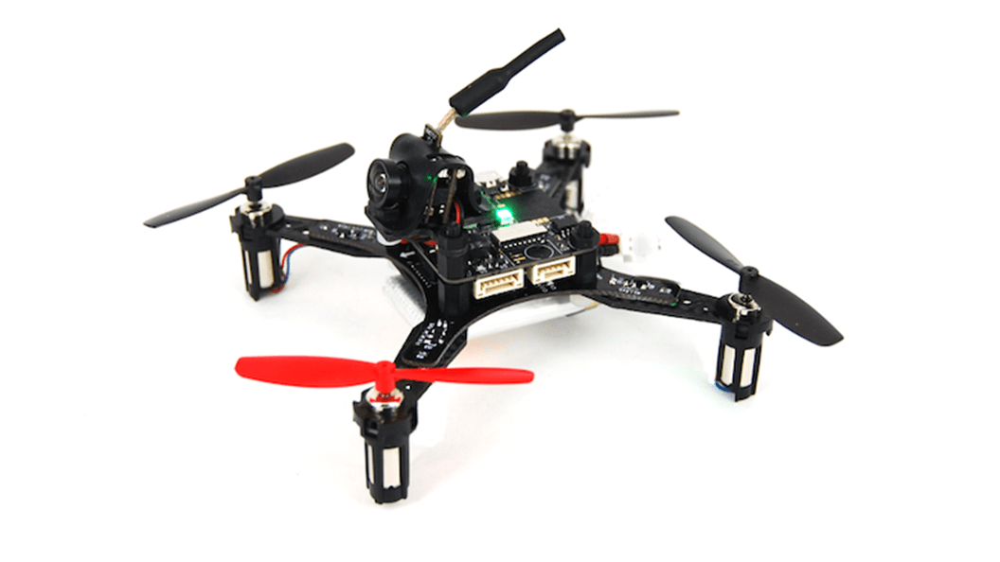

## NanoMind 110

### Опис

Готовий до польоту квадрокоптер готовий до польоту у приміщенні / на гонках з діагоналлю 110 мм.
NanoMind використовує MindRacer як керування польотом, яке запускає повний стек польоту PX4/MindPX.

### Основні характеристики

1. 36г порожньої ваги, з максимальною вагою взльоту 80г, важкій підйомник.
2. 6~7 хвилин польоту.
3. вбудовані параметри для PPM/S.Bus/Specktrum DSM приймача.
4. Безпаяна, повністю стекована структура з роз'ємами SEP/WEP для легкого стекінгу та функціонального розширення.

### Посібник користувача

:::info
Посібник користувача – [here](http://mindpx.net/assets/accessories/NanoMind_110_user_manual.pdf).
:::

### Відео польоту

<lite-youtube videoid="bLtKa--Buic" title="NanoMind with external compass flying EKF2 estimator"/>

### Де купити

NanoMind 110 доступний в [AirMind® Store](https://airmind.mindpx.net/node/92). Ви також можете знайти MindRacer на Amazon&reg; або на eBay&reg;.

### Підтримка

Будь ласка, зайдіть на http://www.mindpx.org для отримання додаткової інформації. Або ви можете надіслати email на [support@mindpx.net](mailto:support@mindpx.net) для будь-яких запитів або допомоги.
