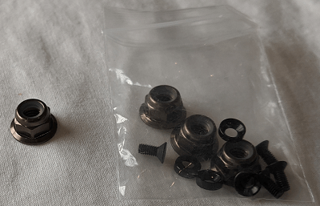

# PX4 Vision Autonomy Development Kit

[_PX4 Vision Autonomy Development Kit_] (https://holybro.com/collections/multicopter-kit/PX4-Vision) - це надійний і недорогий комплект для створення систем комп'ютерного зору на автономних пристроях.


The kit contains a near-ready-to-fly carbon-fibre quadcopter equipped with a _Pixhawk 4_ or _Pixhawk 6C_ (on V1.5) flight controller, a _UP Core_ companion computer (4GB memory & 64GB eMMC), and a Occipital _Structure Core_ depth camera sensor.

Посібник надає інформацію про мінімальне додаткове налаштування, потрібне для того, щоб підготувати апарат до польоту (встановлення системи дистанційного керування та акумулятора). Він також описує перший політ і те, як почати модифікацію коду комп'ютерного зору.

:::warning
PX4 no longer supports the avoidance software described in this document:

- [PX4/PX4-Avoidance](https://github.com/PX4/PX4-Avoidance) is archived
- [Path Planning Interface](../computer_vision/path_planning_interface.md), along with obstacle avoidance in missions, and safe landing.

A USB stick is included in the kit with an example of an obstacle avoidance feature implementation based on this software.
Цей приклад є орієнтовним і слугує для демонстрації можливостей платформи.
:::

:::tip
This kit is still highly recommended for developing and testing vision solutions (that don't rely on the legacy integrations).
:::

## Де купити

- [PX4 Vision Dev Kit v1.5](https://holybro.com/collections/multicopter-kit/products/px4-vision-dev-kit-v1-5)
- [PX4 Vision Dev Kit v1 (Знято з виробництва)](https://holybro.com/collections/multicopter-kit/products/px4-vision)

## Зміст посібника Px4 Vision Guide

- [Попередження та сповіщення](#warnings-and-notifications)
- [Що всередині](#what-is-inside)
- [Що ще вам потрібно](#what-else-do-you-need)
- [Первинне налаштування](#first-time-setup)
- [Керування дроном з запобіганням зіткнень](#fly-the-drone-with-avoidance)
- [Розробка з використанням комплекту](#development-using-the-kit)
- [Розпіновка плати PX4 Vision Carrier](#px4-vision-carrier-board-pinouts)
- [Інші ресурси для розробників](#other-development-resources)
- [Як отримати технічну підтримку](#how-to-get-technical-support)

## Попередження та сповіщення

1. Комплект призначений для проєктів комп'ютерного зору, які використовують камеру, спрямовану вперед (він не має камер глибини, спрямованих вниз або назад).
  Consequently it can't be used (without modification) for testing features that require a downward-facing camera.

2. Уникання перешкод у місіях можна тестувати лише за наявності сигналу GPS (місії використовують GPS-координати).
  Запобігання зіткненням можна перевірити в режимі позиціювання за умови, що є стійке захоплення позиції, отримане або з GPS, або з оптичного потоку.

3. Порт, позначений `USB1`, може глушити GPS, якщо його використовувати з периферійним пристроєм _USB3_ (вимкніть GPS-залежні функції, зокрема місії).
  Саме тому образ завантаження постачається на флешці _USB2.0_.

4. PX4 Vision v1 з ECN 010 або вище (несуча плата RC05 і вище), _UP Core_ може живитися як від розетки постійного струму, так і від акумулятора.

   

5. Всі PX4 Vision v1.5 _UP Core_ можна живити як від мережі постійного струму, так і від батареї.

:::warning
For PX4 Vision v1 with ECN below 010/carrier board below RC04, the _UP Core_ should only be powered using the battery (do not remove the _UP Core power_ socket safety cover). This does not apply to PX4 Vision v1.5


:::

## Що всередині

:::info
Відмінності між PX4 Vision V1 і V1.5 можна знайти [тут](https://docs.holybro.com/drone-development-kit/px4-vision-dev-kit-v1.5/v1-and-v1.5-difference)
:::


Про те, що знаходиться всередині PX4 Vision V1, можна дізнатися тут [PX4 v1.13 Docs here] (https://docs.px4.io/v1.13/en/complete_vehicles/px4_vision_kit.html#what-is-inside).

PX4 Vision DevKit містить наступні компоненти:

- Основні компоненти:

  - 1x Pixhawk 4 або Pixhawk 6C (для v1.5) польотний контролер
  - 1x оптичний датчик потоку PMW3901
  - 1x датчик відстані TOF інфрачервоного діапазону (PSK‐CM8JL65‐CC5)
  - 1x камера глибини Structure Core
    - Камера з широким кутом огляду 160 градусів
    - Стерео-інфрачервоні камери
    - Вбудований ІМП (інерціальний модуль)
    - Потужний багатоядерний процесор глибини NU3000
  - 1x комп'ютер _UP Core_ (4 ГБ оперативної пам'яті та 64 ГБ eMMC з Ubuntu та PX4 униканням)
    - Intel® Atom™ x5-z8350 (до1.92 GHz)
    - Сумісні ОС: повна версія Microsoft Windows 10, Linux (ubilinux, Ubuntu, Yocto), Android
    - FTDI UART підключений до контролера польоту
    - `USB1`: USB3.0 Порт, який використовується для завантаження середовища уникнення PX4 з флешки USB2.0 (підключення периферійного пристрою USB3.0 може заглушити GPS).
    - `USB2`: Порт USB2.0 на роз'ємі JST-GH. Може бути використаний для другої камери, LTE тощо (або клавіатури/миші під час розробки).
    - `USB3`: Порт USB2.0 JST-GH, підключений до камери глибини
    - `HDMI`: HDMI вихід
    - SD карта
    - WiFi 802.11 b/g/n @ 2,4 ГГц (підключений до зовнішньої антени №1). Дозволяє комп'ютеру отримати доступ до домашньої WiFi-мережі для доступу до Інтернету та оновлень.

- Механічні характеристики:

  - Каркас: Цілісна 5-міліметрова саржа з вуглецевого волокна 3k
  - Мотори: T-MOTOR KV1750
  - ESC: BEHEli-S 20A ESC
  - GPS: M8N GPS модуль
  - Модуль живлення: Holybro PM07
  - Колісна база: 286мм
  - Вага: 854 грами без акумулятора або гвинтів
  - Телеметрія: ESP8266 підключений до польотного контролера (приєднаний до зовнішньої антени №2). Вмикає бездротове з'єднання з наземною станцією.

- Флеш-накопичувач USB2.0 з попередньо завантаженим програмним забезпеченням, яке включає в себе:

  - Ubuntu 18.04 LTS
  - ROS Melodic
  - Occipital Structure Core ROS драйвер
  - MAVROS
  - [PX4 Avoidance](https://github.com/PX4/PX4-Avoidance)

- Різноманітні кабелі, 8x гвинти, 2x ремінці для акумулятора (встановлені) та інші аксесуари (їх можна використовувати для підключення додаткових периферійних пристроїв).

## Що ще потрібно

Комплект містить усе необхідне обладнання для керування дроном, окрім акумулятора та системи радіоуправління, які необхідно придбати окремо:

- Батарея:
  - 4S LiPo з гніздом XT60
  - Довжина менше 115 мм (щоб поміститися між роз'ємом живлення та GPS-антеною)
- Системи радіо керування
  - Будь-яка [PX4-сумісна RC система](../getting_started/rc_transmitter_receiver.md) може бути використана.
  - Передавач _FrSky Taranis_ з приймачем R-XSR - одна з найпопулярніших комбінацій.
- Шестигранний ключ H2.0 (для відкручування верхньої панелі, з метою підключення пульта дистанційного керування)

Крім того, користувачам знадобиться апаратне / програмне забезпечення для земної станції:

- Ноутбук або планшет, на якому працює [QGroundControl](https://docs.qgroundcontrol.com/master/en/qgc-user-guide/getting_started/download_and_install.html) (QGC).

## Перший запуск

1. Підключіть [сумісний RC приймач](../getting_started/rc_transmitter_receiver.md#connecting-receivers) до транспортного засобу (не постачається в комплекті):

  - Видаліть/відкрутіть верхню пластину (де йде батарея) за допомогою інструменту з головками шестигранника H2.0.
  - [Підключіть приймач до контролера польоту](../assembly/quick_start_pixhawk4.md#radio-control).
  - Прикріпіть знову верхню пластину.
  - Встановіть RC-приймач на плату кар'єра _UP Core_ на задній частині транспортного засобу (використовуйте зажими або двосторонній скотч).
  - Переконайтеся, що антени вільні від будь-яких перешкод і електрично ізольовані від рами (наприклад, закріпіть їх під платою або до рук або ніг транспортного засобу).

2. [Прив'яжіть](../getting_started/rc_transmitter_receiver.md#binding) земельні та повітряні блоки керування RC (якщо ще не зроблено).
  Процедура прив'язки залежить від конкретної радіосистеми, яку використовують (прочитайте посібник користувача приймача).

3. Підніміть стійку GPS до вертикального положення та вкрутіть кришку на тримач на базовій пластині. (Не потрібно для v1.5)

  

4. Уставте попередньо зображену USB2.0-ручку зі набору в порт _UP Core_, позначений як `USB1` (виділено нижче).

  

5. Запустіть транспортний засіб з повністю зарядженою батареєю.
  :::info
  Переконайтеся, що гвинти від'єднані перед підключенням батареї.

:::

6. Підключіть земельну станцію до мережі WiFi транспортного засобу (через кілька секунд) за допомогою наступних типових облікових даних:

  - **SSID:** pixhawk4
  - **Пароль:** px4vision

  :::tip
  Ім'я мережі WiFi, пароль та інші облікові дані можуть бути змінені після підключення (за бажанням), використовуючи веб-переглядач для відкриття URL-адреси: `http://192.168.4.1`.
  Швидкість передачі даних (baud rate) не повинна змінюватися з 921600.

:::

7. Почніть _QGroundControl_ на земній станції.

8. [Налаштувати/калібрувати](../config/index.md) транспортний засіб:

  :::info
  Транспортний засіб повинен прибути попередньо каліброваним (наприклад, з вбудованим програмним забезпеченням, конструкцією корпусу, батареєю та датчиками, всі встановлені).
  Проте вам все одно потрібно калібрувати радіосистему (яку ви щойно підключили), і часто варто повторно виконати калібрування компаса.

:::

  - [Калібрування Радісистеми](../config/radio.md)
  - [Калібрувати Компас](../config/compass.md)

9. (Опціонально) Налаштуйте перемикач режиму польоту на пульті дистанційного керування, скориставшись [вибором режиму польоту](../config/flight_mode.md).

  :::info
  Режими також можна змінити за допомогою _QGroundControl_

:::

  Ми рекомендуємо визначити RC контролери для перемикачів:

  - [Режим позиції](../flight_modes_mc/position.md) - безпечний ручний режим польоту, який можна використовувати для тестування запобігання зіткнень.
  - [Режим місії](../flight_modes_mc/mission.md) - виконуйте місії та тестуйте уникання перешкод.
  - [Режим повернення](../flight_modes_mc/return.md) - повернення транспортного засобу безпечно до точки запуску та посадка.

10. Прикріпіть гвинти з обертанням, як показано:

  

  - Напрямки гвинтів можна визначити за мітками: _6045_ (звичайний, проти годинникової стрілки) та _6045_**R** (обернений, за годинниковою стрілкою).

    

  - Закрутіть тісно за допомогою наданих гайок пропелера:

    

## Політ дроном з униканням

Коли налаштування транспортного засобу, описані вище, завершені:

1. Підключіть батарею, щоб живити транспортний засіб.

2. Зачекайте, доки завершиться послідовність завантаження та система уникання розпочне роботу (транспортний засіб відхилить команди на озброєння під час завантаження).

  :::tip
  Процес завантаження/початку роботи триває близько 1 хвилини з постачаної USB-флешки (або 30 секунд з [внутрішньої пам'яті](#install_image_mission_computer)).

:::

3. Перевірте, що система уникання почала працювати належним чином:

  - Журнал сповіщень _QGroundControl_ відображає повідомлення: **Підключена система уникнення**.

    

  - Червоний лазер видно на передній частині камери _Structure Core_.

4. Зачекайте, доки світлодіод GPS не засвітиться зеленим кольором.
  Це означає, що у транспортного засобу є GPS фіксація і він готовий до польоту!

5. Підключіть наземну станцію до мережі WiFi транспортного засобу.

6. Знайдіть безпечне зовнішнє місце для польоту, ідеально з деревом або якою-небудь іншою зручною перешкодою для тестування PX4 Vision.

7. Для тестування [попередження про зіткнення](../computer_vision/collision_prevention.md), увімкніть [Режим Позиції](../flight_modes_mc/position.md) та літайте вручну до перешкоди.
  Транспортний засіб повинен сповільнити і зупинитися протягом 6м від перешкоди (відстань може бути [змінена](../advanced_config/parameters.md) за допомогою параметра [CP_DIST](../advanced_config/parameter_reference.md#CP_DIST)).

8. To test obstacle avoidance, create a mission where the path is blocked by an obstacle.
  Потім перейдіть до [Режиму Місії](../flight_modes_mc/mission.md), щоб запустити місію, і спостерігайте, як транспортний засіб рухається навколо перешкоди, а потім повертається на запланований курс.

## Розробка за допомогою комплекту

Наступні розділи пояснюють, як використовувати комплект як середовище для розробки програмного забезпечення комп'ютерного зору.

### Огляд уникання PX4

:::warning
This feature is no [longer supported by PX4](../computer_vision/path_planning_interface.md).
:::

Система _PX4 Avoidance_ складається з програмного забезпечення комп'ютерного зору, що працює на супутниковому комп'ютері (з підключеною камерою глибини), яке надає інформацію про перешкоди та/або маршрут до стеку керування польотом PX4, який працює на _контролері польоту_.

Документацію про програмне забезпечення для компаньйон комп'ютерного зору/планування можна знайти на github тут: [PX4/PX4-Avoidance](https://github.com/PX4/PX4-Avoidance).
Проект надає ряд різних реалізацій планувальника (упакованих у вигляді вузлів ROS):

- Комплект PX4 Vision запускає _localplanner_ за замовчуванням, і це рекомендована вихідна точка для вашого власного програмного забезпечення.
- _Глобальний планувальник_ не був протестований з цим комплектом.
- _Планер посадки_ потребує камери, спрямованої вниз, і не може бути використаний без попередньої модифікації кріплення камери.

PX4 та супутниковий комп'ютер обмінюються даними через [MAVLink](https://mavlink.io/en/) за допомогою цих інтерфейсів:

- [Інтерфейс планування маршруту](../computer_vision/path_planning_interface.md) - API для впровадження функцій уникання в автоматичних режимах.
- [Інтерфейс запобігання зіткненням](../computer_vision/collision_prevention.md) - API для уникнення зіткнень на основі мапи перешкод у ручному режимі позиціонування на транспортному засобі (в даний час використовується для запобігання зіткнень).

<a id="install_image_mission_computer"></a>

### Встановлення образу на  супутній комп’ютер

Ви можете встановити зображення на _UP Core_ та завантажитися з внутрішньої пам'яті (замість USB-накопичувача).

Це рекомендується, оскільки завантаження з внутрішньої пам'яті відбувається набагато швидше, звільняє один USB-порт і, можливо, надасть більше пам'яті, ніж ваш USB-накопичувач.

:::info
Завантаження з внутрішньої пам'яті займає близько 30 секунд при завантаженні із поставлених USB2 завантажувачів (інша карта може тривати кілька разів довше).
:::

Щоб прошити зображення USB для _UP Core_:

1. Вставте передфлешний USB-накопичувач у порт _UP Core_, позначений як `USB1`.

2. [Увійдіть в супровідний комп'ютер](#login_mission_computer) (як описано вище).

3. Відкрийте термінал та виконайте наступну команду, щоб скопіювати зображення на внутрішню пам'ять (eMMC).
  Термінал буде пропонувати ввести кількість відповідей під час процесу прошивки.

  ```sh
  cd ~/catkin_ws/src/px4vision_ros/tools
  sudo ./flash_emmc.sh
  ```

  :::info
  Всю інформацію, збережену в комп'ютері _UP Core_, буде видалено при виконанні цього сценарію.

:::

4. Витягніть USB-флешку.

5. Перезавантажте пристрій.
  Тепер ком'ютер _UP Core_ буде завантажений з внутрішньої пам'яті (eMMC).

### Запустіть супутній комп'ютер

Спочатку вставте наданий USB2.0-накопичувач у порт _UP Core_, позначений `USB1`, а потім включіть живлення пристрою за допомогою батареї 4S.
Система уникнення перешкод повинна почати працювати приблизно за 1 хвилину (хоча це залежить від встановленої USB-флешки).

:::tip
[Політ дроном з униканням колізій](#fly-the-drone-with-avoidance) додатково пояснює, як перевірити, що система уникання перешкод активна.
:::

Якщо ви вже [встановили зображення на супутньому комп'ютері](#install_image_mission_computer), ви можете просто увімкнути транспортний засіб (тобто не потрібен USB-накопичувач).
Система уникання повинна бути активована та працювати протягом близько 30 секунд.

Після початку роботи компаньйонний комп'ютер може бути використаний як середовище розробки комп'ютерного зору, так і для запуску програмного забезпечення.

<a id="login_mission_computer"></a>

### Увійдіть в бортовий комп'ютер

Для входу на компаньйоновий комп'ютер:

1. Підключіть клавіатуру та мишу до _UP Core_ через порт `USB2`:

  

  - Використовуйте кабель USB-JST з комплекту, щоб отримати роз'єм USB A

    

  - До кабелю можна підключити USB хаб, якщо клавіатура та миша мають окремі роз'єми.

2. Підключіть монітор до порту HDMI _UP Core_.

  

  Екран входу в Ubuntu повинен з'явитися на моніторі.

3. Увійдіть в _UP Core_ за допомогою облікових даних:

  - **Username:** px4vision
  - **Password:** px4vision

### Розробка / Розширення уникнення PX4

Комп'ютер _UP Core_ PX4 Vision надає повне та повністю налаштоване середовище для розширення програмного забезпечення PX4 Avoidance (і, загалом, для розробки нових алгоритмів комп'ютерного зору за допомогою ROS 2).
Ви повинні розробляти та тестувати своє програмне забезпечення на транспортному засобі, синхронізувати його з власним git-сховищем та ділитися будь-якими виправленнями та покращеннями з широкою спільнотою PX4 на репозиторії github [PX4/PX4-Avoidance](https://github.com/PX4/PX4-Avoidance).

Робочий простір catkin знаходиться в `~/catkin_ws`, і попередньо налаштований для запуску локального планувальника уникнення PX4.
Файл запуску з включенням (`avoidance.launch`) знаходиться в пакеті `px4vision_ros` (змініть цей файл, щоб змінити, який планувальник запускається).

Пакет уникнення запускається при завантаженні.
Для інтеграції іншого планувальника це потрібно вимкнути.

1. Вимкніть процес уникання за допомогою наступної команди:

  ```sh
  systemctl stop avoidance.service
  ```

  Ви можете просто перезавантажити машину, щоб перезапустити службу.

  Інші корисні команди підтримуються:

  ```sh
  # restart service
  systemctl start avoidance.service

  # disable service (stop service and do not restart after boot)
  systemctl disable avoidance.service

  # enable service (start service and enable restart after boot)
  systemctl enable avoidance.service
  ```

2. Вихідний код пакету уникання перешкод можна знайти за адресою https://github.com/PX4/PX4-Avoidance, який розташований в `~/catkin_ws/src/avoidance`.

3. Внесіть зміни до коду! Щоб отримати останній код уникання, витягніть код з репозиторію уникання:

  ```sh
  git pull origin
  git checkout origin/master
  ```

4. Побудуйте пакет

  ```sh
  catkin build local_planner
  ```

Робоче середовище ROS розміщене в `~/catkin_ws`.
Для посилання на розробку в ROS та використання робочого простору catkin, див. [Посібники ROS catkin](http://wiki.ros.org/catkin/Tutorials).

### Розробка прошивки PX4

You can modify PX4 itself, and [install it as custom firmware](../config/firmware.md#custom):

- Для оновлення прошивки вам потрібно підключити _QGroundControl_ до _Pixhawk_ комплекту **через USB**.
- Оберіть корпус _PX4 Vision DevKit_ після завантаження нового прошивки:
  

## Виводи пінів плати-носія PX4 Vision

Інформацію про PX4 Vision 1.15 можна знайти за посиланням [https://docs.holybro.com](https://docs.holybro.com/drone-development-kit/px4-vision-dev-kit-v1.5).
Пін-роз'єми плати переносу та інша інформація знаходяться у розділі [завантаження](https://docs.holybro.com/drone-development-kit/px4-vision-dev-kit-v1.5/downloads).

## Інші Ресурси Розробника

- [_UP Core_ Wiki](https://github.com/up-board/up-community/wiki/Ubuntu) - _Up Core_ супутниковий комп'ютер технічна інформація
- [Форум розробників Occipital](https://structure.io/developers) - інформація про камеру _Structure Core_
- [Огляд Pixhawk 4](../flight_controller/pixhawk4.md)
- [Огляд Pixhawk 6C](../flight_controller/pixhawk6c.md)

## Як отримати технічну підтримку

Щодо апаратних проблем, будь ласка, звертайтеся до Holybro за адресою: [productservice@holybro.com](mailto:productservice@holybro.com).

Для проблем з програмним забезпеченням використовуйте наступні канали підтримки спільноти:

- [Holybro PX4 Vision Wikifactory](https://wikifactory.com/+holybro/px4-vision)
- [Канали підтримки PX4](../contribute/support.md)
