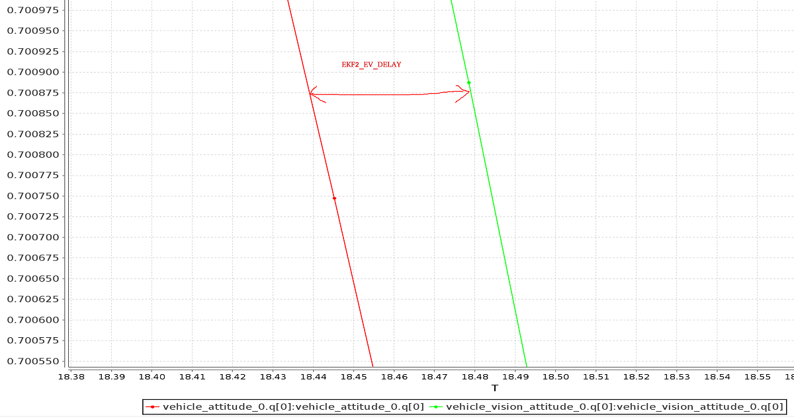

# Візуальна інерціальна оцінка положення (VIO)

_Візуальна інерціальна одометрія_ (VIO) — це техніка [комп’ютерного бачення](../computer_vision/index.md), яка використовується для оцінки тривимірної _пози_ (локального положення та орієнтації) і _швидкості_ транспортного засобу, що рухається, відносно _локальної_ вихідної позиції.
Він зазвичай використовується для навігації транспортного засобу в ситуаціях, коли GPS відсутній або ненадійний (наприклад, у приміщенні або під час прольоту під мостом).

VIO використовує [Візуальну одометрію](https://en.wikipedia.org/wiki/Visual_odometry) для оцінки _позиції_ транспортного засобу на основі зображень із камери в поєднанні з інерційними вимірюваннями з IMU транспортного засобу (щоб виправити помилки, пов’язані зі швидким рухом транспортного засобу, що призводить до поганого захоплення зображення).

Ця тема надає керівництво щодо налаштування PX4 та супутнього комп'ютера для налаштування VIO.

:::info
Рекомендоване налаштування використовує ROS для передачі інформації VIO до PX4.
Однак сам PX4 не цікавиться джерелом повідомлень, якщо вони надаються через відповідний [інтерфейс MAVLink](../ros/external_position_estimation.md#px4-mavlink-integration).
:::

## Рекомендована настройка

Апаратна та програмна настройка для VIO запропонована в розділах нижче як ілюстрація того, як підключити систему VIO до PX4. Вона використовує готову систему відстеження камери та супутній комп'ютер, що працює під керуванням ROS.
ROS використовується для зчитування інформації про одометрію з камери та подачі її до PX4.

Прикладом підходящої відстежуючої камери є камера відстеження [Intel® RealSense™ T265](../peripherals/camera_t265_vio.md).

### Встановлення камери

Прикріпіть камеру до супутнього комп'ютера та закріпіть її на рамі:

- Прикріпіть камеру з лінзами, спрямованими вниз, якщо це можливо (за замовчуванням).
- Камери зазвичай дуже чутливі до вібрацій; рекомендується використовувати м'яке кріплення (наприклад, за допомогою віброізоляційної піни).

### Налаштування комп'ютера компаньйона

Для налаштування ROS та PX4:

- На комп'ютері-супутнику встановіть та налаштуйте [MAVROS](../ros/mavros_installation.md).

- Реалізуйте та запустіть вузол ROS для зчитування даних з камери та публікації відомостей VIO за допомогою MAVROS.
  - Дивіться розділ нижче про вузол [ROS VIO](#vio_ros_node) для подробиць щодо вимог до цього вузла.

- Слідуйте інструкціям [нижче](#ekf2_tuning) для налаштування оцінювача EKF2 в PX4.

- Перевірте підключення до керуючого контролера.

  Ви можете використовувати _QGroundControl_ [MAVLink Inspector](https://docs.qgroundcontrol.com/master/en/qgc-user-guide/analyze_view/mavlink_inspector.html), щоб переконатися, що ви отримуєте повідомлення `ODOMETRY` або `VISION_POSITION_ESTIMATE` (або перевірити наявність Повідомлення `HEARTBEAT`, які мають ідентифікатор компонента 197 (`MAV_COMP_ID_VISUAL_INERTIAL_ODOMETRY`)).

:::

- [Перевірте, чи VIO налаштовано правильно](#verify_estimate) перед першим польотом!

### ROS VIO вузол

У цьому рекомендованому налаштуванні ROS вузла VIO потрібно

1. інтерфейс з обраною апаратурою камери або сенсора,
2. створити повідомлення відомостей, що містять оцінку позиції, які будуть надіслані до PX4 за допомогою MAVROS, та
3. публікувати повідомлення для вказівки стану системи VIO.

Реалізація вузла ROS буде конкретною для використовуваної камери і буде потребувати розробки для використання відповідного інтерфейсу та драйверів для камери.

Повідомлення відомостей повинні бути типу [`nav_msgs/Odometry`](http://docs.ros.org/en/noetic/api/nav_msgs/html/msg/Odometry.html) та публікуватися на темі `/mavros/odometry/out`.

Повідомлення відомостей повинні бути типу [`nav_msgs/Odometry`](http://docs.ros.org/en/noetic/api/nav_msgs/html/msg/Odometry.html) та публікуватися на темі `/mavros/odometry/out`. Вони повинні ідентифікувати компонент як `MAV_COMP_ID_VISUAL_INERTIAL_ODOMETRY` (197) та вказувати `стан системи`. Рекомендовані значення статусу:

- `MAV_STATE_ACTIVE` коли система VIO працює як очікувалося,
- `MAV_STATE_CRITICAL` коли система VIO працює, але з низькою впевненістю, та
- `MAV_STATE_FLIGHT_TERMINATION` коли система зазнала відмови або впевненість в оцінці неприйнятно низька.

### Вдосконалення

Наступні параметри повинні бути задані для використання зовнішньої позиції з EKF2.

| Параметр                                                                                                                                                                                                                                                                                                                                                                                                                  | Налаштування для Зовнішньої Оцінки Положення                                                                                                                                                             |
| ------------------------------------------------------------------------------------------------------------------------------------------------------------------------------------------------------------------------------------------------------------------------------------------------------------------------------------------------------------------------------------------------------------------------- | -------------------------------------------------------------------------------------------------------------------------------------------------------------------------------------------------------- |
| [EKF2_EV_CTRL](../advanced_config/parameter_reference.md#EKF2_EV_CTRL)                                                                                                                                                                                                                                                                                                          | Встановіть _горизонтальне об'єднання позиції_, _вертикальне об'єднання позиції_, _об'єднання швидкості_ та _об'єднання кута_ курсу згідно з вашою бажаною моделлю об'єднання.            |
| [EKF2_HGT_REF](../advanced_config/parameter_reference.md#EKF2_HGT_REF)                                                                                                                                                                                                                                                                                                          | Set to _Vision_ to use the vision as the reference sensor for altitude estimation.                                                                                                       |
| [EKF2_EV_DELAY](../advanced_config/parameter_reference.md#EKF2_EV_DELAY)                                                                                                                                                                                                                                                                                                        | Встановіть різницю між міткою часу вимірювання та "фактичним" часом захоплення. Для отримання додаткової інформації див. [нижче](#tuning-EKF2_EV_DELAY). |
| [EKF2_EV_POS_X](../advanced_config/parameter_reference.md#EKF2_EV_POS_X), [EKF2_EV_POS_Y](../advanced_config/parameter_reference.md#EKF2_EV_POS_Y), [EKF2_EV_POS_Z](../advanced_config/parameter_reference.md#EKF2_EV_POS_Z) | Встановіть положення візуального датчика відносно корпусу транспортного засобу.                                                                                                          |

Їх можна встановити в _QGroundControl_ > **Налаштування автомобіля > Параметри > EKF2** (не забудьте перезавантажити контролер польоту, щоб зміни параметрів набули чинності).

For more detailed/additional information, see: [Using PX4's Navigation Filter (EKF2) > External Vision System](../advanced_config/tuning_the_ecl_ekf.md#external-vision-system).

#### Налаштування EKF2_EV_DELAY

[EKF2_EV_DELAY](../advanced_config/parameter_reference.md#EKF2_EV_DELAY) - це _затримка оцінювача позиції за допомогою візійної системи відносно вимірювань_.
Іншими словами, це різниця між міткою часу візійної системи та "фактичним" часом захоплення, який був би записаний годинником IMU (тобто "базовий годинник" для EKF2).

Технічно це може бути встановлено на 0, якщо є правильне відміткове (не тільки час прибуття) та синхронізація часу (наприклад, за допомогою NTP) між MoCap та (наприклад) комп'ютерами ROS.
На практиці це може потребувати емпіричного налаштування, оскільки затримки в ланцюгу зв'язку дуже специфічні для конкретного обладнання.
Рідко коли система налаштована з повністю синхронізованим ланцюгом!

Приблизна оцінка затримки може бути отримана з журналів, перевіряючи зсув між частотами IMU та частотами EV:

:::info
Графік зовнішніх даних проти вбудованої оцінки (як вище) може бути створений за допомогою [FlightPlot](../log/flight_log_analysis.md#flightplot) або подібних засобів аналізу польоту.
:::

Значення можна додатково налаштувати, змінюючи параметр, щоб знайти значення, яке дає найнижчі інновації EKF під час динамічних маневрів.

## Перевірка/підтвердження оцінки VIO

:::info
Параметр [MAV_ODOM_LP](../advanced_config/parameter_reference.md#MAV_ODOM_LP), згаданий нижче, був вилучений у PX4 v1.14.
Цей розділ потрібно оновити. <!-- https://github.com/PX4/PX4-Autopilot/pull/20501#issuecomment-1993788815 -->
:::

Виконайте наступні перевірки, щоб переконатися, що VIO працює належним чином _перед_ першим польотом:

- Встановіть параметр PX4 `MAV_ODOM_LP` на `1`.
  Встановіть параметр PX4 `MAV_ODOM_LP` на `1`.
  Після цього PX4 буде передавати отриману зовнішню позицію у вигляді повідомлень MAVLink [ODOMETRY](https://mavlink.io/en/messages/common.html#ODOMETRY).
  Ви можете перевірити ці повідомлення MAVLink за допомогою [інспектора MAVLink](https://docs.qgroundcontrol.com/master/en/qgc-user-guide/analyze_view/mavlink_inspector.html) в _QGroundControl_
- Поверніть літак так, щоб кватерніон повідомлення `ODOMETRY` був дуже близьким до одиничного кватерніону (w=1, x=y=z=0).
  - На цьому етапі корпус виробу зорієнтований у відповідності з ориєнтацією відносно зовнішньої системи координат.
  - Якщо вам не вдається отримати кватерніон, близький до одиничного, без обертання або нахилу вашого літака, це, ймовірно, означає, що ваша рама все ще має зміщення нахилу або кочування.
    У цьому випадку не продовжуйте і перевірте знову свої координатні рамки.
- Після зорієнтування ви можете підняти літак з землі, і ви маєте бачити, як координата z позиції зменшується.
  Переміщення літака вперед повинно збільшувати координату x позиції, а переміщення вправо - збільшувати координату y.
  Переміщення засобу праворуч повинно збільшити координату Y.
- Перевірте, що лінійні швидкості у повідомленні виражені в описаній відносно корпусу _FRD_ відліковій системі.
- Встановіть параметр PX4 `MAV_ODOM_LP` назад на 0.
  PX4 припинить передавати повідомлення `ODOMETRY` назад.

Якщо ці кроки є послідовними, ви можете спробувати свій перший польот:

1. Покладіть літак на землю і почніть передавати зворотний зв'язок `ODOMETRY` (як вище).
  Потягніть палицю газу вниз і зберметизуйте двигуни.

  На цьому етапі, зліва палиця на найнижчому положенні, перейдіть у режим позиціонного контролю.
  Ви повинні побачити зелену лампочку.
  Зелена лампочка свідчить про те, що доступний зворотний зв'язок позиції, і позиційний контроль активований.

2. Покладіть палицю газу в середину (мертву зону), щоб літак підтримував свою висоту.
  Підняття палиці збільшить висоту посилки, тоді як зниження значення зменшить її.
  Так само, інша палиця змінить положення над землею.

3. Збільшуйте значення перемикача газу, і літак злетить. Відразу після цього поверніть його в середину.

4. Переконайтеся, що літак може утримувати свою позицію.

## Усунення проблем

Спочатку переконайтеся, що MAVROS успішно підключається до автопілота.

Якщо підключення відбувається належним чином, можливі проблеми/рішення:

- **Проблема:** У мене виникає дрейф / відліт дрона, коли він літає, але не коли я несу його без пропелерів.

  - Якщо використовуєте [T265](../peripherals/camera_t265_vio.md), спробуйте його м'яко кріпити (ця камера дуже чутлива до високочастотних вібрацій).

- **Проблема:** У мене виникає "туалетний боулінг", коли ввімкнено VIO.

  - Переконайтеся, що орієнтація камери відповідає трансформації в запущеному файлі.
    Використовуйте [Інспектор MAVLink](https://docs.qgroundcontrol.com/master/en/qgc-user-guide/analyze_view/mavlink_inspector.html) _QGroundControl_, щоб перевірити, що швидкості в повідомленні `ODOMETRY`, що надходить від MAVROS, вирівнані з системою координат FRD.

- **Проблема:** Я хочу використовувати позицію зору для замикання петель, і також хочу запустити GPS.
  - Це дійсно складно, оскільки коли вони не збігаються, це збентежить EKF.
    За результатами тестування, надійніше використовувати візійну швидкість (якщо ви знайдете спосіб зробити цю конфігурацію надійною, дайте нам знати).

## Інформація для розробників

Розробники, які зацікавлені в розширенні цієї реалізації (або написанні іншої, яка може не залежати від ROS), повинні подивитися [використання візійних або систем відстеження руху для оцінки позиції.](../ros/external_position_estimation.md).

Ця тема також пояснює, як налаштувати VIO для використання з оцінювачем LPE (застарілим).

## Подальша інформація

- [Using PX4's Navigation Filter (EKF2) > External Vision System](../advanced_config/tuning_the_ecl_ekf.md#external-vision-system)
