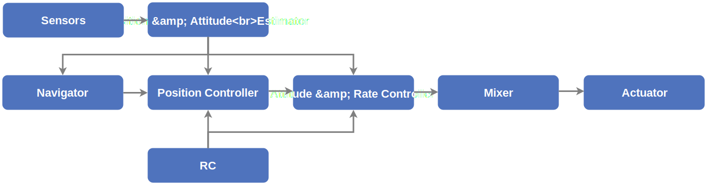

# Огляд архітектури PX4

PX4 складається із двох головних шарів: [набору політного ПЗ](#flight-stack), що є системою керування та оцінки польоту, та [проміжного ПЗ](#middleware), яке є загальним робототехнічним прошарком ПЗ, що може підтримувати будь-який тип автономного робота, забезпечуючи внутрішній та зовнішній зв'язок та інтеграцію апаратного забезпечення.

Всі [планери](../airframes/README.md) PX4 мають окрему кодову базу (включаючи й інші роботизовані системи, такі як човни, ровери, підводні човни тощо). Побудова системи є [реакційною](http://www.reactivemanifesto.org), це означає що:

- Весь функціонал розділений на взаємозамінні та придатні для повторного використання компоненти
- Зв'язок зроблено через асинхронне передавання повідомлень
- Система може дати раду різним робочим навантаженням

<a id="architecture"></a>

## Високорівнева архітектура ПЗ

На діаграмі нижче показано детальний огляд будівельних блоків PX4.
Верхня частина діаграми містить блоки проміжного ПЗ, тоді як нижня частина - компоненти набору польотного ПЗ.


<!-- This diagram can be updated from
[here](https://drive.google.com/file/d/0B1TDW9ajamYkaGx3R0xGb1NaeU0/view?usp=sharing)
and opened with draw.io Diagrams. You might need to request access if you
don't have a px4.io Google account.
Caution: it can happen that after exporting some of the arrows are wrong. In
that case zoom into the graph until the arrows are correct, and then export
again. -->

Вихідний код розділено на самодостатні модулі/програми (показано на діаграмі `моноширинним` шрифтом).
Зазвичай один блок відповідає одному модулю.

:::tip
Під час виконання можна переглянути який з модулів виконується за допомогою команди `top` в консолі, а кожен модуль може бути запущено окремо за допомогою `<module_name> start/stop`.
Хоча команда `top` характерна для оболонки NuttX, інші команди можуть бути використані також в оболонці SITL (pxh>).
Для додаткової інформації про кожен з цих модулів дивіться [Довідник команд та модулів](../modules/modules_main.md).
:::

Стрілки показують плин інформації для _найважливіших_ зв'язків між модулями.
В реальності зв'язків набагато більше ніж показано, а деякі дані (наприклад параметри) отримуються більшістю модулів.

Модулі спілкуються один з одним через шину повідомлень публікації/підписки яка називається [uORB](../middleware/uorb.md).
Використання схеми публікації/підписки означає, що:

- Система реакційна — тобто є асинхронною та миттєво оновиться при наявності нових даних
- Всі операції та комунікації повністю розпаралелено
- Системний компонент може споживати дані звідки завгодно у спосіб безпечний для потоків

:::info
Ця архітектура дозволяє швидко і легко замінити кожен з цих блоків навіть під час виконання.
:::

### Набір польотного ПЗ

Набір польотного ПЗ є колекцією алгоритмів керування, навігації та спрямування для автономних дронів.
Він включає контролери для планерів з фіксованим крилом, мультироторів та ВЗІП, а також спостерігача орієнтації та позиції.

У наступній діаграмі показано огляд будівельних блоків набору ПЗ для польоту.
Він містить повний конвеєр від датчиків, вхідних даних РК та контролера автономного польоту (Navigator), до двигуна або управління сервоприводами (Actuators).



<!-- This diagram can be updated from
[here](https://drive.google.com/a/px4.io/file/d/15J0eCL77fHbItA249epT3i2iOx4VwJGI/view?usp=sharing)
and opened with draw.io Diagrams. You might need to request access if you
don't have a px4.io Google account.
Caution: it can happen that after exporting some of the arrows are wrong. In
that case zoom into the graph until the arrows are correct, and then export
again. -->

**Спостерігач** приймає вхідні дані з одного або більше датчиків, поєднує їх та обчислює стан рухомого засобу (наприклад орієнтацію з даних датчика ІВП або ж IMU).

**Контролер** - це компонент, який приймає на вхід заданий і виміряний або ж визначений стан (змінну процесу).
Його мета - скорегувати значення змінної процесу, таким чином, щоб вона відповідала заданому значенню.
Вихідні дані - це корекційні значення, щоб врешті-решт досягти заданих.
Наприклад, контролер позиції приймає задані значення позиції на вході, змінна процесу є значенням позиції що оцінюється, а вихід - це орієнтація та задане значення газу, що рухає засіб до потрібної позиції.

**Змішувач** приймає команди примусу (наприклад "повернути вправо") і перекладає їх на окремі команди двигуна, при цьому гарантуючи, що певні межі не перевищено.
Цей переклад є специфічним для типу засобу і залежить від різних факторів такі як розташування двигунів відносно центру мас або інерція обертання засобу.

<a id="middleware"></a>

### Проміжне програмне забезпечення

[Проміжне ПЗ](../middleware/README.md) головним чином складається з драйверів для вбудованих датчиків, зв'язку із зовнішнім світом (допоміжним комп'ютером, GCS і т ін.) та шиною повідомлень uORB.

Крім того, в проміжне ПЗ включено [шар симуляції](../simulation/README.md), який дозволяє коду PX4 запускатися на настільній операційній системі та контролювати модельований комп'ютером рухомий засіб у симульованому "світі".

## Темпи оновлення даних

Оскільки модулі очікують оновлень повідомлень, зазвичай драйвери визначають як швидко оновлюється стан модуля.
Більшість драйверів ІВП роблять вибірку даних на частоті 1 кГц, інтегрують їх і публікують з частотою 250 Гц.
Інші частини системи, такі як `navigator` не потребують такої високої швидкості поновлення даних тому виконуються значно повільніше.

Частота оновлення повідомлень на системі може бути [перевірена](../middleware/uorb.md) в реальному часі, запустивши команду `uorb top`.

<a id="runtime-environment"></a>

## Середовище виконання

PX4 запускається на різних операційних системах які надають POSIX-API (наприклад, Linux, macOS, NuttX або QuRT).
Вони також повинні мати якусь форму планування завдань в реальному часі (наприклад FIFO).

Комунікація між модулями (за допомогою [uORB](../middleware/uorb.md)) заснована на розділюваній пам'яті.
Усе проміжне ПЗ PX4 виконується в єдиному адресному просторі, тобто пам'ять розділена між усіма модулями.

:::info
Система створена так, щоб з мінімальними зусиллями, можна було б запустити кожен модуль в окремому адресному просторі (частини, які необхідно буде змінити включають `uORB`, `parameter interface`, `dataman` та `perf`).
:::

Існує 2 різні способи запуску модуля:

- **Завдання**: Модуль виконується у своєму власному завданні з власним стеком і пріоритетом процесу.
- **Завдання робочої черги**: Модуль виконується в спільній робочій черзі, розділяючи той самий стек та пріоритет потоку робочої черги як і інші модулі в черзі.

  - Усі завдання повинні поводитися скооперовано, оскільки вони не можуть переривати одне одного.
  - Декілька _завдань робочої черги_ можуть запускатися у черзі, а також може бути кілька черг.
  - _Завдання робочої черги_ планується вказанням визначеного часу у майбутньому або через зворотний виклик "поновлення теми" uORB.

  Перевага запуску модулів у робочій черзі полягає в тому, що це використовує менше ОЗП, і потенційно призводить до меншої кількості перемикань завдань.
  Недоліки в тому, що _завданням робочої черги_ не дозволено перебувати в режимі сну або опитувати наявність повідомлення, або виконувати блокуючу операцію вводу/виводу (наприклад, читання з файлу).
  Довгострокові завдання (що виконують важкі обчислення) повинні потенційно також запускатися в окремому завданні або принаймні в окремій робочий черзі.

:::info
Завдання запущені в робочій черзі не з'являються у виводі [`top`](../modules/modules_command.md#top) (видно тільки робочі як такі, наприклад `wq:lp_default`).
Використовуйте [`work_queue status`](../modules/modules_system.md#work-queue) для показу всіх активних елементів черги.
:::

### Фонові завдання

`px4_task_spawn_cmd()` використовується для запуску нових завдань (NuttX) або потоків (POSIX - Linux/macOS), які працюють незалежно від (батьківського) завдання, що їх викликало:

```cpp
independent_task = px4_task_spawn_cmd(
    "commander",                    // Process name
    SCHED_DEFAULT,                  // Scheduling type (RR or FIFO)
    SCHED_PRIORITY_DEFAULT + 40,    // Scheduling priority
    3600,                           // Stack size of the new task or thread
    commander_thread_main,          // Task (or thread) main function
    (char * const *)&argv[0]        // Void pointer to pass to the new task
                                    // (here the commandline arguments).
    );
```

### Інформація для певної ОС

#### NuttX

[NuttX](https://nuttx.apache.org//) є основною RTOS для запуску PX4 на платі керування польотами.
Вона має відкритий вихідний код (під BSD ліцензією), легка, ефективна і дуже стабільна.

Модулі виконуються як завдання: вони мають свої списки дескрипторів файлів, але мають єдиний адресний простір.
Завдання все ще може запустити один або кілька потоків, які розділяють той самий список дескрипторів файлів.

Кожне завдання/поток має стек фіксованого розміру, є періодичне завдання, яке перевіряє, що в всіх стеках залишилося достатньо вільного місця (засновано на розфарбовуванні стеку).

#### Linux/macOS

На Linux або macOS, PX4 виконується в одному процесі, а модулі запускаються у своїх потоках (бо немає різниці між завданнями та потоками як на NuttX).
