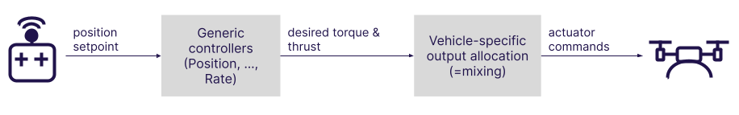
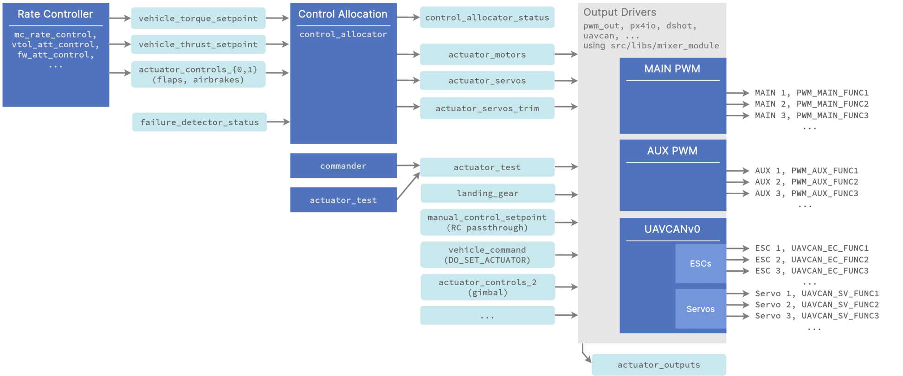

# Розподіл керування (змішування)

:::info
Розподіл керування замінює застарілий підхід змішування, який використовувався в PX4 v1.13 або раніше.
Документацію по PX4 v1.13 дивіться в: [Змішування та приводи](https://docs.px4.io/v1.13/en/concept/mixing.html), [Файли геометрії](https://docs.px4.io/v1.13/en/concept/geometry_files.html) та [Додавання налаштувань нового планера](https://docs.px4.io/v1.13/en/dev_airframes/adding_a_new_frame.html).
:::

PX4 приймає бажані команди моменту та тяги від основних контролерів і перекладає їх у команди приводів, які керують двигунами чи сервоприводами.

Переклад залежить від фізичної геометрії планеру.
Скажемо наприклад, за командою моменту "повернути праворуч":

- Літак з одним сервоприводом на елерон накаже одному сервоприводу підняти, а іншому опустити їх.
- Мультикоптер порине вправо змінивши швидкість всіх двигунів.

PX4 відокремлює цю логіку перекладу, що називається "змішуванням", від контролера позиції/швидкості.
Це гарантує, що основним контролерам не потрібна особлива обробка для кожної геометрії планерів і значно покращує повторне використання.

Крім того, PX4 абстрагує відображення функцій виводу до конкретних апаратних виходів.
Це означає, що будь-який двигун або сервопривід може бути призначений майже на будь-який фізичний вивід.

<!-- https://docs.google.com/drawings/d/1Li9YhTLc3yX6mGX0iSOfItHXvaUhevO2DRZwuxPQ1PI/edit -->



## Конвеєр керування приводами

Огляд конвеєрів змішування в термінах модулів та uORB (натисніть для показу в повноекранному режимі):

<!-- https://drive.google.com/file/d/1L2IoxsyB4GAWE-s82R_x42mVXW_IDlHP/view?usp=sharing -->



Примітки:

- Регулятор швидкості видає задані значення моменту та тяги
- модуль `control_allocator`:
  - обробляє різні геометрії на основі параметрів конфігурації
  - робить змішування
  - обробляє відмови двигунів
  - публікує сигнали керування двигуном та сервоприводами
  - публікує корекції для сервоприводів окремо щоб їх можна було додати як відхилення при [перевірці приводів](../config/actuators.md#actuator-testing) (використовуючи тестувальні повзунки).
- Драйвери виходу:
  - обробляють апаратну ініціалізацію та оновлення
  - використовують поділювану бібліотеку [src/libs/mixer_module](https://github.com/PX4/PX4-Autopilot/blob/main/src/lib/mixer_module/).
    Драйвер визначає префікс параметру, наприклад `PWM_MAIN`, який бібліотека використовує для налаштування.
    Її головне завдання зробити вибірку з вхідних дані та призначити правильні дані на виходи засновуючись на встановлених користувачем значеннях параметрів `<param_prefix>_FUNCx`.
    Наприклад, якщо `PWM_MAIN_FUNC3` встановлено у **Motor 2**, це означає що на 2-й двигун з `actuator_motors` встановлено 3-й вивід.
  - функції виводу визначаються у [src/lib/mixer_module/output_functions.yaml](https://github.com/PX4/PX4-Autopilot/blob/main/src/lib/mixer_module/output_functions.yaml).
- якщо ви хочете керувати виводом з MAVLink, встановіть відповідну вихідну функцію в **Offboard Actuator Set x**, а потім відправте MAVLink команду [MAV_CMD_DO_SETUATOR](https://mavlink.io/en/messages/common.html#MAV_CMD_DO_SET_ACTUATOR).

## Додавання нової геометрії або функції виводу

Дивіться [цей коміт](https://github.com/PX4/PX4-Autopilot/commit/5cdb6fbd8e1352dcb94bd58918da405f8ff930d7) як додати нову геометрію.
Інтерфейс QGC автоматично покаже правильний інтерфейс налаштування, коли в новій геометрії встановлено [CA_AIRFRAME](../advanced_config/parameter_reference.md#CA_AIRFRAME).

[Цей коміт](https://github.com/PX4/PX4-Autopilot/commit/a65533b46986e32254b64b7c92469afb8178e370) показує як додати нову функцію виходу.
Будь-яка тема uORB може бути підписана і закріплена за функцією.

Зауважте що параметри для розподілу керування визначені у [src/modules/control_allocator/module.yaml](https://github.com/PX4/PX4-Autopilot/blob/main/src/modules/control_allocator/module.yaml) Схема для цього файлу є [тут](https://github.com/PX4/PX4-Autopilot/blob/main/validation/module_schema.yaml#L440=) (конкретніше, шукайте термін `mixer:`

## Встановлення геометрії планеру за замовчуванням

Коли [додаєте нові налаштування планера](../dev_airframes/adding_a_new_frame.md), встановіть відповідне значення [CA_AIRFRAME](../advanced_config/parameter_reference.md#CA_AIRFRAME) змішувача та інші значення за замовчуванням для геометрії.

Ви можете це побачити наприклад, у файлі конфігурації планера [13200_generic_vtol_tailsitter](https://github.com/PX4/PX4-Autopilot/blob/main/ROMFS/px4fmu_common/init.d/airframes/13200_generic_vtol_tailsitter)

```sh
...
param set-default CA_AIRFRAME 4
param set-default CA_ROTOR_COUNT 2
param set-default CA_ROTOR0_KM -0.05
param set-default CA_ROTOR0_PY 0.2
...
```

## Налаштування геометрії та виходів

Геометрія для плати та параметри за замовчуванням для рухомого засобу встановлюються (з файлу налаштувань планера) коли планер обирається у QGroundControl: [Основне налаштування > Планери](../config/airframe.md).

Параметри геометрії та відображення виводу для певних планерів та апаратного забезпечення польотних контролерів потім налаштовується у QGroundControl на екрані **Приводи**: [Базове налаштування > Налаштування та перевірка приводу](../config/actuators.md).
