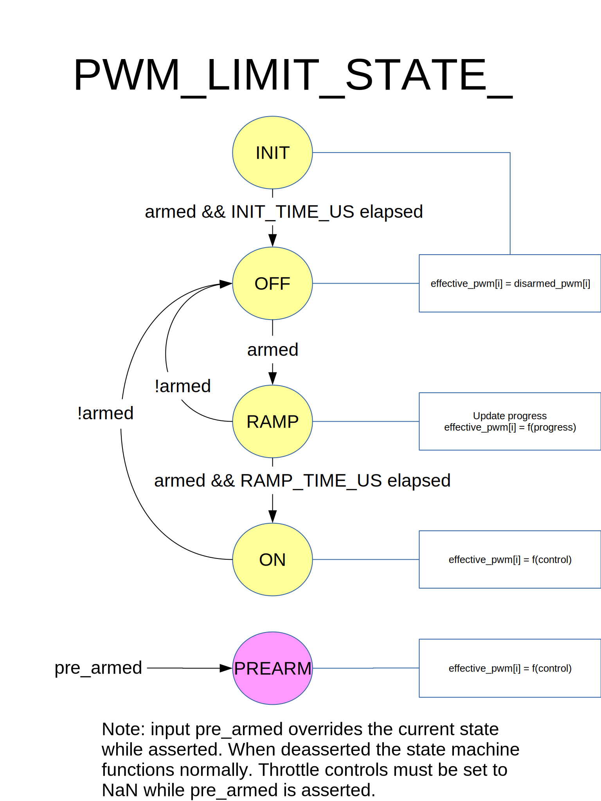

# Скінченний автомат PWM_limit

`Скінченний автомат PWM_limit` керує виходами ШІМ як функцією входів готового і попередньо готового стану.
Забезпечує затримку між твердженням стану "готовності" та нарощуванням тяги при твердженні сигналу готовності.

## Короткий опис

**Вхідні дані**

- готовий: стверджено щоб дозволити небезпечні дії, такі як обертання пропелерів
- попередньо готовий: стверджено щоб дозволити безпечні дії, такі як рух керівних поверхонь
- цей вхід перекриває поточний стан
- ствердження попередньо готового стану негайно примушує до поведінки стану ON незалежно від поточного стану
- відкидання попередньо готового стану повертає поведінку до поточного стану

**Стани**

- INIT та OFF
  - ШІМ виходи встановлені у стан неготовності.
- RAMP
  - ШІМ виходи нарощуються зі стану неготовності до мінімальних значень.
- УВІМК
  - ШІМ виходи встановлюються відповідно до керівних значень.

## Діаграма зміну стану

