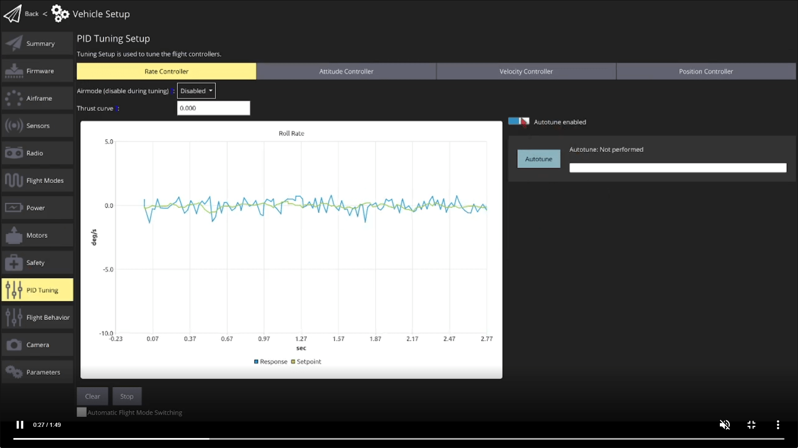

<!-- This is the single-source for autotuning docs used in the autotune_mc.md and autotune_fy.md
At time of writing, only FW, MC, and VTOL, support autotuning.
VTOL has its own doc that references the other two
-->

# Auto-tuning (Multicopter)

# Auto-tuning (Fixed-Wing)

Автоналаштування автоматизує процес налаштування контролерів швидкості та ставлення PX4, які є найважливішими контролерами для стабільного та реактивного польоту (інші налаштування є більш "необов'язковими").

Tuning only needs to be done once, and is recommended unless you're using a vehicle that has already been tuned by the manufacturer (and not modified since).

:::warning
Auto-tuning is performed while flying.
The airframe must fly well enough to handle moderate disturbances, and should be closely attended:

- Test that your vehicle is [stable enough for autotuning](#pre-tuning-test).
- Be ready to abort the autotuning process.
  You can do this by changing flight modes
 or using an auto-tune enable/disable switch ([if configured](#enable-disable-autotune-switch))
.
- Перевірте, що автомобіль добре літає після налаштування.

:::

<lite-youtube videoid="5xswOhhqrIQ" title="QGroundControl Autotune Feature Breakdown for PX4 Autopilot"/>

## Попереднє налаштування тесту

Транспортний засіб повинен бути здатний літати і належним чином стабілізувати себе перед запуском автоматичного налаштування.
Цей тест дозволяє забезпечити безпечний польот транспортного засобу в режимах управління положенням.

Переконайтеся, що транспортний засіб достатньо стабільний для автоналаштування:

1. Виконайте звичайний контрольний перелік безпеки перед польотом, щоб переконатися, що зона польоту чиста і має достатньо місця.

2. Take off and 
hover at 1m above ground in [Altitude mode](../flight_modes_mc/altitude.md) or [Stabilized mode](../flight_modes_mc/manual_stabilized.md)

fly at cruise speed in [Position mode](../flight_modes_fw/position.md) or [Altitude mode](../flight_modes_fw/altitude.md)
.

3. Use the RC transmitter roll stick to perform the following maneuver, tilting the vehicle just a few degrees: _roll left > roll right > center_ (The whole maneuver should take about 3 seconds).
  Транспортний засіб повинен стабілізуватися протягом 2 коливань.

4. Повторіть маневр, нахиляючись з більшими амплітудами при кожної спроби.
  Якщо транспортний засіб може стабілізуватися протягом 2 коливань під кутом близько 20 градусів, перейдіть до наступного кроку.

5. Повторіть ті ж маніпуляції, але по осі поля.
  Як вище, почніть з невеликих кутів і підтвердіть, що транспортний засіб може стабілізуватися самостійно протягом 2 коливань, перш ніж збільшувати нахил.

If the drone can stabilize itself within 2 oscillations it is ready for the [auto-tuning procedure](#auto-tuning-procedure).

:::warning
If the drone cannot stabilize itself sufficiently, follow the instructions in the [troubleshooting](#troubleshooting) section.
These explain the minimal manual tuning to prepare the vehicle for auto-tuning.
:::

## Процедура автоналагодження

The auto-tuning sequence must be performed in a **safe flight zone, with enough space**.
It takes about 40 seconds ([between 19 and 68 seconds](#how-long-does-autotuning-take)).
Для найкращих результатів ми рекомендуємо проводити тестування в спокійні погодні умови.

The recommended mode for autotuning is 
[Altitude mode](../flight_modes_mc/altitude.md)

[Hold mode](../flight_modes_fw/hold.md)
, but any other flight mode can be used.
The RC sticks cannot be used during autotuning (moving the sticks will stop the autotune operation).

Кроки наступні:

1. Perform the [pre-tuning test](#pre-tuning-test).

2. Takeoff using RC control 
in [Altitude mode](../flight_modes_mc/altitude.md).
  Hover the vehicle at a safe distance and at a few meters above ground (between 4 and 20m).

  Once flying at cruise speed, activate [Hold mode](../flight_modes_fw/hold.md).
  This will guide the plane to fly in circle at constant altitude and speed.

3. Enable autotune.

  

  

TIP

  If an [Enable/Disable Autotune Switch](#enable-disable-autotune-switch) is configured you can just toggle the switch to the "enabled" position.

  

  1. In QGroundControl, open the menu **Vehicle setup > PID Tuning**:

    

  2. Select either the _Rate Controller_ or _Attitude Controller_ tabs.

  3. Ensure that the **Autotune enabled** button is enabled (this will display the **Autotune** button and remove the manual tuning selectors).

  4. Read the warning popup and click on **OK** to start tuning.

4. Дрон спочатку почне виконувати швидкі рухи кочення, а потім рухи тангажу та рухи курсу.
  The progress is shown in the progress bar, next to the _Autotune_ button.

5. Manually land and disarm to apply the new tuning parameters.
  Takeoff carefully and manually test that the vehicle is stable.

5. The tuning will be immediately/automatically be applied and tested in flight (by default).
  PX4 will then run a 4 second test and revert the new tuning if a problem is detected.

:::warning
If any strong oscillations occur, land immediately and follow the instructions in the [Troubleshooting](#troubleshooting) section below.
:::

Additional notes:

- The instructions above tune the vehicle in [Altitude mode](../flight_modes_mc/altitude.md).
  You can instead takeoff in [Takeoff mode](../flight_modes_mc/takeoff.md) and tune in [Position mode](../flight_modes_mc/position.md) if the vehicle is is _known_ to be stable in these modes.

- Autotuning can also be run in [Altitude mode](../flight_modes_fw/altitude.md) or [Position mode](../flight_modes_fw/position.md).
  However running the test while flying straight requires a larger safe area for tuning, and does not give a significantly better tuning result.

- Whether tuning is applied while flying or after landing can be [configured using parameters](#apply-tuning-when-in-air-landed).

## Autotuning Large Vehicles

For big multicopter vehicles you may need to increase the desired raise time of the step response [MC_AT_RISE_TIME](../advanced_config/parameter_reference.md#MC_AT_RISE_TIME).
This requires some trial and error as an appropriate rise time depends on both vehicle size and the rotor response.

Note that if there are slow oscillations in pretuning it may mean that the attitude loop is too fast compared to the rate loop.
In this case you should troubleshoot as described in [Drone oscillates when performing the pre-tuning test](#drone-oscillates-when-performing-the-pre-tuning-test).

<!-- Fixed wing rise time is hardcoded (it's lower than on multirotors and is probably enough for most platforms). -->

## Усунення проблем

### Drone oscillates when performing the pre-tuning test

Slow oscillations (1 oscillation per second or slower): this often occurs on large platforms and means that the attitude loop is too fast compared to the rate loop:

- Decrease [MC_ROLL_P](../advanced_config/parameter_reference.md#MC_ROLL_P) and [MC_PITCH_P](../advanced_config/parameter_reference.md#MC_PITCH_P) by steps of 1.0.

Fast oscillations (more than 1 oscillation per second): this is because the gain of the rate loop is too high.

- Decrease `MC_[ROLL|PITCH|YAW]RATE_K` by steps of 0.02

Slow oscillations (1 oscillation per second or slower): this often occurs on large platforms and means that the attitude loop is too fast compared to the rate loop.

- Increase [FW_R_TC](../advanced_config/parameter_reference.md#FW_R_TC) and [FW_P_TC](../advanced_config/parameter_reference.md#FW_P_TC) by steps of 0.1.

Fast oscillations (more than 1 oscillation per second): this is because the gain of the rate loop is too high.

- Decrease [FW_RR_P](../advanced_config/parameter_reference.md#FW_RR_P), [FW_PR_P](../advanced_config/parameter_reference.md#FW_PR_P), [FW_YR_P](../advanced_config/parameter_reference.md#FW_YR_P) by steps of 0.01.

### Послідовність автоматичної настройки не вдається

Якщо безпілотник не рухався достатньо під час автоматичного налаштування, алгоритм ідентифікації системи може мати проблеми з визначенням правильних коефіцієнтів.

Increase the 
[MC_AT_SYSID_AMP](../advanced_config/parameter_reference.md#MC_AT_SYSID_AMP)

[FW_AT_SYSID_AMP](../advanced_config/parameter_reference.md#FW_AT_SYSID_AMP)
 parameter by steps of 1 and trigger the auto-tune again.

### The drone oscillates after auto-tuning

Due to effects not included in the mathematical model such as delays, saturation, slew-rate, airframe flexibility, the loop gain can be too high.
To fix this, follow the same steps described [when the drone oscillates in the pre-tuning test](#drone-oscillates-when-performing-the-pre-tuning-test).

### Я все ще не можу зрозуміти, як це працює

Attempt manual tuning using the guides listed in [See also](#see-also) below.

## Необов'язкова Конфігурація

### Apply Tuning when In-Air/Landed

By multicopters land before parameters are applied.
This behaviour can be configured using the [MC_AT_APPLY](../advanced_config/parameter_reference.md#MC_AT_APPLY) parameter:

By default fixed wing tuning the parameters are applied while flying, and then PX4 runs a test to confirm that the controllers work properly.
This behaviour can be configured using the [FW_AT_APPLY](../advanced_config/parameter_reference.md#FW_AT_APPLY) parameter:

- `0`: the gains are not applied.
  Це використовується для тестування, якщо користувач хоче перевірити результати автоналаштування алгоритму без прямого їх використання.
- `1`: apply the gains after disarm (default for multirotors).
  Оператор може перевірити нове налаштування під час обережного зльоту.
- `2`: apply immediately (default for fixed-wings).
  Нове налаштування застосовується, перешкоди надсилаються контролеру, а стабільність контролюється протягом наступних 4 секунд.
  Якщо керуюче коло нестійке, керуючі коефіцієнти негайно повертаються до свого попереднього значення.
  If the test passes, the pilot can then use the new tuning.

### Enable/Disable Autotune Switch

A remote control switch can be configured to enable/disable autotune (in any mode) using an RC AUX channel (note, this is only supported on fixed-wing vehicles).

To map a switch:

1. Select an RC channel on your controller to use for the autotune enable/disable switch.
2. Set [RC_MAP_AUX1](../advanced_config/parameter_reference.md#RC_MAP_AUX1) to match the RC channel for your switch (you can use any of `RC_MAP_AUX1` to `RC_MAP_AUX6`).
3. Set [FW_AT_MAN_AUX](../advanced_config/parameter_reference.md#FW_AT_MAN_AUX) to the selected channel (i.e. `1: Aux 1` if you mapped `RC_MAP_AUX1`).

The auto tuner will be disabled when the switch is below `0.5` (on the manual control setpoint range of of `[-1, 1]`) and enabled when the switch channel is above `0.5`.

If using an RC AUX switch to enable autotuning, make sure to [select the tuning axes](#select-tuning-axis) before flight.

### Select Tuning Axis

Fixed-wing vehicles (only) can select which axes are tuned using the [FW_AT_AXES](../advanced_config/parameter_reference.md#FW_AT_AXES) bitmask parameter:

- bit `0`: roll (default)
- bit `1`: pitch (default)
- bit `2`: yaw

## Розробники/SDKs

Autotuning is started using [MAV_CMD_DO_AUTOTUNE_ENABLE](https://mavlink.io/en/messages/common.html#MAV_CMD_DO_AUTOTUNE_ENABLE) MAVLink command.

At time of writing the message is resent at regular intervals to poll PX4 for progress: the `COMMAND_ACK` includes result that the operation is in progress, and also the progress as a percentage.
Операція завершується, коли прогрес досягає 100% або транспортний засіб приземляється і роззброюється.

:::info
This is not a MAVLink-compliant implementation of a [command protocol long running command](https://mavlink.io/en/services/command.html#long_running_commands).
PX4 повинен транслювати прогрес, оскільки протокол не дозволяє опитування.
:::

Функція ще не підтримується MAVSDK.

## Background/Detail

PX4 uses [PID controllers](../flight_stack/controller_diagrams.md) (rate, attitude, velocity, and position) to calculate the outputs required to move a vehicle from its current estimated state to match a desired setpoint.
Контролери повинні бути добре налаштовані, щоб отримати найкращу продуктивність з автомобіля.
Зокрема, погано налаштований регулятор швидкості призводить до менш стабільного польоту у всіх режимах і потребує більше часу на відновлення після перешкод.

Generally if you use a [frame configuration](../config/airframe.md) that is similar to your vehicle then the vehicle will be able to fly.
Однак, якщо конфігурація точно не відповідає вашому обладнанню, вам слід налаштувати регулятори швидкості та кута нахилу.
Налаштування контролерів швидкості та позиції менш важливе, оскільки вони менше піддаються динаміці транспортного засобу, і типова конфігурація налаштування для схожого аеродинамічного корпусу часто є достатньою.

Автоналаштування забезпечує автоматичний механізм для налаштування регуляторів швидкості та кута нахилу.
It can be used to tune fixed-wing and multicopter vehicles, and VTOL vehicles when flying as a multicopter or as a fixed-wing (transition between modes must be manually tuned).
Теоретично це повинно працювати для інших типів транспортних засобів, які мають регулятор швидкості, але наразі підтримуються лише вищезазначені типи.

Automatic tuning works well for the multicopter and fixed-wing vehicle configurations supported by PX4, provided the frame is not too flexible
(see [below for more information](#does-autotuning-work-for-all-supported-airframes)).

The vehicle must be flying in an altitude-stabilized mode (such as [Altitude mode](../flight_modes_mc/altitude.md), [Hold mode](../flight_modes_mc/hold.md), or [Position mode](../flight_modes_mc/position.md)).
The flight stack will apply a small disturbance to the vehicle in each axis and then attempt to calculate the new tuning parameters.
For fixed-wing vehicles the new tuning is applied in-air by default, after which the vehicle tests the new settings and reverts the tuning if the controllers are not stable.
For multicopter, the vehicle lands and applies the new tuning parameters after disarming; the pilot is expected to then take off carefully and test the tuning.

The tuning process takes about 40 seconds ([between 19 and 70 seconds](#how-long-does-autotuning-take)).
The default behaviour can be configured using [parameters](#optional-configuration).

### Часто Запитувані Питання

#### Які типи кадрів підтримуються?

Autotuning is enabled for multicopter, fixed-wing, and hybrid VTOL fixed-wing vehicles.

While it is not yet enabled for other frame types, in theory it an be used with any frame that uses a rate controller.

#### Чи працює автоналадка для всіх підтримуваних конструкцій?

The mathematical model used by autotuning to estimate the dynamics of the drone assumes this it is a linear system with no coupling between the axes (SISO), and with a limited complexity (2 poles and 2 zeros).
If the real drone is too far from those conditions, the model will not be able to represent the real dynamics of the drone.

In practise, autotuning generally works well for fixed-wing and multicopter, provided the frame is not too flexible.

#### Як довго триває автоналагодження?

Tuning takes 5s-20s per axis (aborted if tuning could not be established in 20s) + 2s pause between each axis + 4s of testing if the new gains are applied in air.

Мультикоптер повинен налаштовувати всі три осі, і за замовчуванням не перевіряє нові виграші у повітрі.
Tuning will therefore take between 19s (`5 + 2 + 5 + 2 + 5`) and 64s (`20x3 + 2x2`).

За замовчуванням літак налагоджує всі три осі, а потім перевіряє нові коефіцієнти в повітрі.
The range is therefore between 25s (`5 + 2 + 5 + 2 + 5 + 2 + 4`) and 70s (`20x3 + 3x2 + 4`).

Зверніть увагу, що вищезазначені налаштування є значеннями за замовчуванням.
Мультикоптер може вибрати проведення тестів в повітрі, а планер може вибрати не робити цього.
Додатково, літак з фіксованим крилом може вибрати налаштувати менше вісей.

Anecdotally, it usually takes around 40s for either vehicle.

<!--
#### How vigorous is the disturbance applied by tuning

This might be added later. I'd like to just point to a video.

If not, perhaps say "not very" but you should expect that the vehicle might deflect by as much as 20degrees and so should be able to cope with that deflection with default tuning.

-->

## Дивись також

- [Multicopter PID Tuning Guide](../config_mc/pid_tuning_guide_multicopter_basic.md) (Manual/Simple)
- [Multicopter PID Tuning Guide](../config_mc/pid_tuning_guide_multicopter.md) (Advanced/Detailed)
- [Parameters > Autotuning](../advanced_config/parameter_reference.md#autotune) (prefixed with `MC_AT_`).

## Дивись також

- [Fixed-Wing PID Tuning Guide](../config_fw/pid_tuning_guide_fixedwing.md)
- [Parameters > Autotuning](../advanced_config/parameter_reference.md#autotune) (prefixed with `FW_AT_`).

