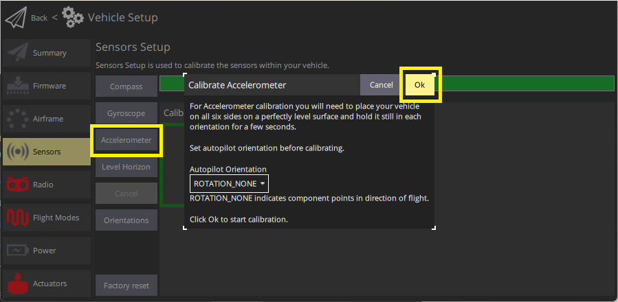
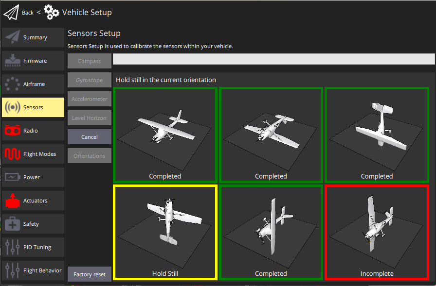

# Калібрування акселерометра

Акселерометр повинен бути калібрований при першому використанні або якщо змінився орієнтація контролера польоту.
Otherwise it should not need to recalibrated (except perhaps in winter, if the flight controller was not [thermally calibrated](../advanced_config/sensor_thermal_calibration.md) in the factory).

:::info
Poor accelerometer calibration is generally caught by preflight checks and arming-denied messages (QGC warnings typically refer to "high accelerometer bias" and "consistency check failures").
:::

:::tip
This is similar to [compass calibration](../config/compass.md) except that you hold the vehicle still (rather than rotate it) in each orientation.
:::

## Виконання калібрування

_QGroundControl_ will guide you to place and hold your vehicle in a number of orientations (you will be prompted when to move between positions).

Калібрування включає наступні кроки:

1. Start _QGroundControl_ and connect the vehicle.

2. Select **"Q" icon > Vehicle Setup > Sensors** (sidebar) to open _Sensor Setup_.

3. Click the **Accelerometer** sensor button.

   

   ::: info
   You should already have set the [Autopilot Orientation](../config/flight_controller_orientation.md).
   Якщо ні, ви також можете встановити це тут.

:::

4. Click **OK** to start the calibration.

5. Position the vehicle as guided by the _images_ on the screen.
   Після виклику (орієнтаційне зображення стає жовтим) тримайте транспортний засіб нерухомо.
   Після завершення калібрування для поточного орієнтації пов'язане зображення на екрані стане зеленим.

   ::: info
   The calibration uses a least squares 'fit' algorithm that doesn't require you to have "perfect" 90 degree orientations.
   За умови, що кожна вісь спрямована в основному вгору і вниз у певний момент у послідовності калібрування, а транспортний засіб утримується нерухомо, точна орієнтація не має значення.

:::

   

6. Повторіть процес калібрування для всіх орієнтацій автомобіля.

Once you've calibrated the vehicle in all the positions _QGroundControl_ will display _Calibration complete_ (all orientation images will be displayed in green and the progress bar will fill completely).
Ви можете потім перейти до наступного сенсора.

## Подальша інформація

- [QGroundControl User Guide > Sensors](https://docs.qgroundcontrol.com/master/en/qgc-user-guide/setup_view/sensors_px4.html#accelerometer)
- [PX4 Setup Video - @1m46s](https://youtu.be/91VGmdSlbo4?t=1m46s) (Youtube)
