# Конфігурація та тестування приводу

<Badge type="tip" text="PX4 v1.14" />

The _Actuators Setup_ view is used to customize the specific geometry of the vehicle, assign actuators and motors to flight controller outputs, and test the actuator and motor response.

## Загальний огляд

Open the view in _QGroundControl_ here: **"Q" (app menu) > Vehicle Setup > Actuators** (tab).
The displayed elements depend on the [selected frame](../config/airframe.md), with outputs mapped by default as shown in the [Airframe Reference](../airframes/airframe_reference.md).

Вид має три розділи:

- [Geometry](#geometry): Configure the geometry for the [selected airframe](../config/airframe.md).
  This includes number, position and properties of [motors](#motor-geometry) and also the number and properties of [control surfaces](#control-surfaces-geometry) and [motor tilt servos](#motor-tilt-servo-geometry).
- [Actuator Outputs](#actuator-outputs): Assign motors, control surfaces, and other actuators to specific output.
- [Actuator Testing](#actuator-testing): Test that motors and actuators move in the direction / speed as expected.

Можливо, у квадрокоптера буде екран налаштувань, схожий на показаний нижче.
Це визначає чотиримоторний коптер з геометрією X.
Він відображає 4 двигуни на виходи AUX1 до AUX4 та вказує, що вони підключені до регуляторів швидкості DShot1200 ESC.
Також він відображає виходи PWM400 AUX для керування парашутом та стійками посадки.

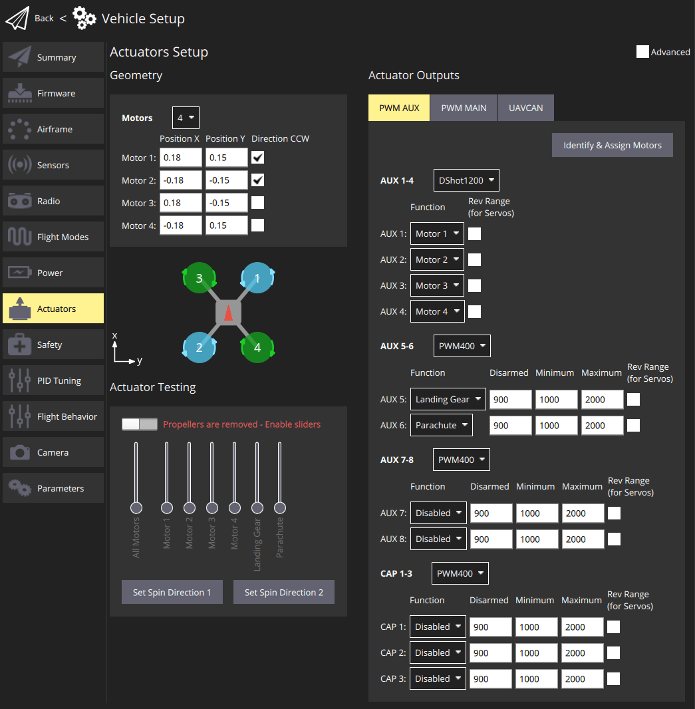

:::info
Only the most common settings are displayed by default.
Select the **Advanced** checkbox in the top right corner to display all settings.
:::

## Геометрія

The geometry section is used to set any configurable geometry-related parameters for the selected [airframe](../config/airframe.md).
This includes the number and position of [motors](#motor-geometry), and the number, function, and properties of [control surfaces](#control-surfaces-geometry).
For VTOL tiltrotor vehicles, it will also include the number and properties of [tilt servos](#motor-tilt-servo-geometry)

:::info
The UI is customised for the selected airframe:

- Only _configurable_ fields for the selected airframe type are displayed; fields that aren't configurable for the airframe are hidden.
- Діаграма положення двигуна наразі відображається лише для рам мультикоптера.

:::

### Геометрія двигунів

Розділ геометрії двигунів дозволяє вам встановити кількість двигунів, відносне положення та інші властивості кожного двигуна.

Більшість властивостей двигуна застосовуються до всіх рамок.
Деякі властивості застосовуються до певних рамок.
For example, `Tilted-by` and `axis` are only relevant for [Tiltrotor VTOL](#motor-geometry-vtol-tiltrotor) and [Standard VTOL](#motor-geometry-standard-vtol) vehicles, respectively.

Конфігурація геометрії для повітряних рамок мультікоптерів надає діаграму, яка показує відносні позиції по вісі x та y для кожного з двигунів.
See the [Airframe Reference](../airframes/airframe_reference.md) for an broad understanding of the motor positions for other frames.

Основні концепції геометрії та конфігурація для ряду різних фреймів наведені в наступних розділах.

#### Мотор геометрія: Мультикоптер

На зображенні нижче показано налаштування геометрії для рамки квадрокоптера з і без розширеними налаштуваннями.

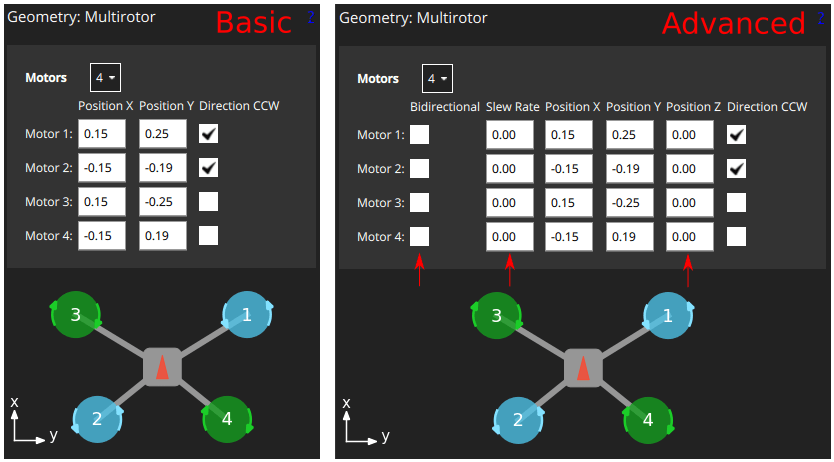

First, the **Motors** drop-down setting lets you choose the number of motors (4 for the example above).

Для кожного двигуна ви можете встановити:

- `Position X`: [X-position](#motor-position-coordinate-system), in metres.
- `Position Y`: [Y-position](#motor-position-coordinate-system), in metres.
- `Position Z`: [Z-position](#motor-position-coordinate-system), in metres.
- (Advanced) `Direction CCW`: Checkbox to indicate motor spins counter-clockwise (uncheck for clockwise).
- (Advanced) `Bidirectional`: Checkbox to indicate motor is [bidirectional](#bidirectional-motors)
- (Advanced) `Slew Rate`: Sets minimum time that the motor output can take to reach its maximum value.
  Refer to the [Control Surfaces Geometry](#control-surfaces-geometry) section for more information

:::info
The `X`, `Y`, `Z` positions are in [FRD coordinate frame, relative to the _centre of gravity_](#motor-position-coordinate-system).
Зверніть увагу, що це може не збігатися з позицією контролера польоту!
:::

#### Геометрія двигуна: VTOL Quadrotor Tailsitter

The motor geometry for a [VTOL Quad Tailsitter](../airframes/airframe_reference.md#vtol-tailsitter) is shown below (the approach for configuring other tailsitter VTOL vehicles will be similar).

Motors have the same configuration fields as for the [multicopter geometry](#motor-geometry-multicopter).

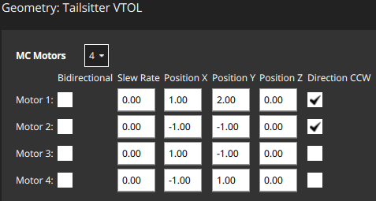

#### Геометрія двигуна: VTOL Tiltrotor

The motor geometry for a [Generic Quadplane VTOL Tiltrotor](../airframes/airframe_reference.md#vtol_vtol_tiltrotor_generic_quadplane_vtol_tiltrotor) is shown below (the approach for configuring other [VTOL tiltrotors](../airframes/airframe_reference.md#vtol_vtol_tiltrotor_generic_quadplane_vtol_tiltrotor) will be similar).

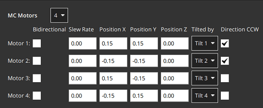

- `Tilted by`: The associated servo used for tilting the motor.
  The properties of this servo are defined in the [Motor Tilt Servo Geometry](#motor-tilt-servo-geometry).

#### Геометрія двигуна: стандартний VTOL

The motor geometry for a [Generic Standard VTOL](../airframes/airframe_reference.md#vtol_standard_vtol_generic_standard_vtol) is shown below (the approach for configuring other "Standard VTOL" will be similar).

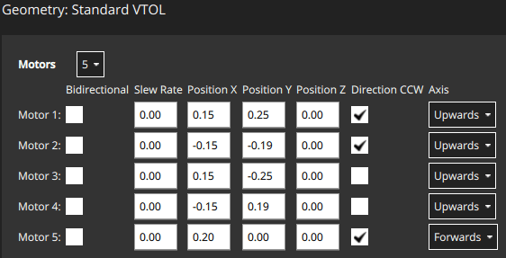

Motors have most of the same configuration fields as for the [multicopter geometry](#motor-geometry-multicopter).
Є додаткове поле для позначення напрямку, в якому рухається двигун транспортного засобу (для стандартного ВТОЛ, гвинти для утримання у повітрі зазвичай встановлені "вгору", а тяговий двигун встановлений "вперед").

- `Axis`: One of `Upwards`, `Downwards`, `Forwards`, `Backwards`, `Leftwards`, `Rightwards`, `Custom`
  - If `Custom` is selected, then the UI displays three additional fields for setting the motor orientation.

#### Геометрія двигуна: Інші транспортні засоби

Інші типи транспортних засобів визначать відповідну геометрію двигуна для свого типу рами.
Ще раз ці двигуни, як правило, матимуть ті ж самі властивості, що й показано вище.

Наприклад, у літального апарата з фіксованим крилом може бути лише один тяговий двигун, тоді як ровер з диференційним керуванням матиме двигун для керування швидкістю і для керування керуванням.

#### Система координат положення двигуна

Система координат для позицій двигуна - FRD (у тілі), де вісь X вказує вперед, вісь Y - праворуч, а вісь Z - вниз.

The origin is the vehicle's **centre-of-gravity (COG)**.
This may **NOT** be the same position as the location of the autopilot.

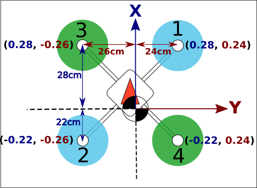

#### Двосторонні мотори

Деякі транспортні засоби можуть використовувати двонаправлені двигуни (тобто двигуни, які підтримують обертання у обох напрямках).
Наприклад, земляні транспортні засоби, які хочуть рухатися вперед і назад, або літальні апарати типу VTOL, які мають двигуни-тягунці, які можуть обертатися у будь-якому напрямку.

If bidiectional motors are used, make sure to select the **Reversible** checkbox for those motors (the checkbox is displayed as an "advanced" option).

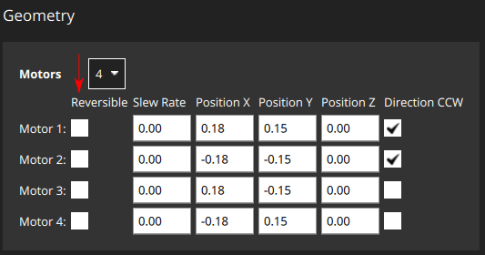

Note that you will need to also ensure that the ESC associated with bidirectional motors is configured appropriately (e.g. 3D mode enabled for DShot ESCs, which can be achieved via [DShot commands](../peripherals/dshot.md#commands)).

### Геометрія поверхонь керування

Розділ поверхонь керування на панелі геометрії дозволяє встановити кількість і типи поверхонь керування, які присутні на транспортному засобі.
У деяких випадках вам також може знадобитися встановити значення обрізки і швидкості переміщення.
Для більш досвідчених користувачів також доступна можливість налаштувати масштаби кочення, рулювання та тангажу (зазвичай значення за замовчуванням є прийнятними і цього не потрібно).
Нижче показаний "приклад" розділу поверхонь керування для транспортного засобу з двома елеронами.
Зауважте, що елерони впливають тільки на кочення, тому поля тангажу та рулювання вимкнені.

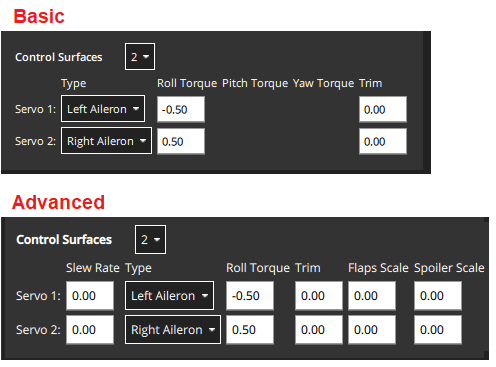

:::info
Only the most common settings are displayed by default.
Select the **Advanced** checkbox in the top right corner of the view to display all settings.
:::

Кроки наступні:

- `Control Surfaces`: The number of control surfaces (set this first!)
- `Type`: The type of each control surface: `LeftAileron`, `RightAileron`, `Elevator`, `Rudder`, `Left Elevon`, `Right Elevon`, `Left V-Tail`, `Right V-Tail`, `Left Flap`, `Right Flap`, `Airbrakes`, `Custom`.
- `Roll Torque`: Effectiveness of actuator around roll axis (normalised: -1 to 1).
  [Generally you should use the default actuator value](#actuator-roll-pitch-and-yaw-scaling).
- `Pitch Torque`: Effectiveness of actuator around pitch axis (normalised: -1 to 1).
  [Generally you should use the default actuator value](#actuator-roll-pitch-and-yaw-scaling).
- `Yaw Torque`: Effectiveness of actuator around yaw axis (normalised: -1 to 1).
  [Generally you should use the default actuator value](#actuator-roll-pitch-and-yaw-scaling).
- `Trim`: An offset added to the actuator so that it is centered without input.
  Це може бути визначено методом проб і помилок.
- (Advanced) `Slew Rate`: Limits the minimum time in which the motor/servo signal is allowed to pass through its full output range, in seconds.
  - Параметр обмежує швидкість зміни приводу (якщо не вказано, то обмеження швидкості не застосовується).
    It is intended for actuators that may be damaged or cause flight disturbance if they move too fast — such as the tilting actuators on a tiltrotor VTOL vehicle, or fast moving flaps, respectively.
  - Наприклад, значення 2.0 означає, що двигун/сервопривід не буде командуватися рухатися від 0 до 1 зі швидкістю, яка завершить операцію менш ніж за 2 секунди (у випадку реверсивних двигунів діапазон -1 до 1).
- (Advanced) `Flap Scale`: How much this actuator is deflected at the "full flaps configuration" [0, 1] (see [Flap Scale and Spoiler Scale Configuration](#flap-scale-and-spoiler-scale-configuration) below).
  Може бути використаний для налаштування аеродинамічної поверхні як закрилок або для компенсації обертового моменту, що виникає через головні закрилки.
- (Advanced) `Spoiler Scale`: How much this actuator is deflected at the "full spoiler configuration" [0, 1] (see [Flap Scale and Spoiler Scale Configuration](#flap-scale-and-spoiler-scale-configuration) below).
  Може бути використаний для налаштування аеродинамічної поверхні як закрилок або для компенсації обертового моменту, що виникає через головні закрилки.
- (VTOL only) `Lock control surfaces in hover`:
  - `Enabled`: Most vehicles do not use control surfaces in hover. Використовуйте цей параметр, щоб заблокувати їх, щоб вони не впливали на динаміку транспортного засобу.
  - `Disabled`: Set this for vehicles that use control surfaces in hover, such as the duo tailsitter (which uses elevons for pitch and yaw control). Також воно повинно бути встановлено для транспортних засобів, які використовують поверхні керування для забезпечення додаткової стабілізації в режимі утримання на місці при русі зі швидкістю або при сильному вітрі.

#### Конфігурація масштабу закрилка та спойлера

"Керування флапами" та "керування спойлерами" - це аеродинамічні конфігурації, які можуть керуватися вручну пілотом (наприклад, за допомогою RC) або встановлюватися автоматично контролером.
Наприклад, пілот або система посадки можуть ввести "керування спойлерами", щоб зменшити швидкість повітря перед посадкою.

The configurations are an _abstract_ way for the controller to tell the allocator how much it should adjust the aerodynamic properties of the wings relative to the "full flaps" or "full spoiler" configuration (between `[0,1]`, where "1" indicates the full range).
Потім алокатор використовує будь-які доступні поверхні керування для досягнення вимаганої конфігурації: зазвичай флапи, елерони та кормові поверхні.

The `flap scale` and `spoiler scale` settings in the actuator UI inform the allocator how much ailerons, elevators, flaps, spoilers, and other control surfaces, contribute to a requested "Flap-control" and/or "Spoiler-control" value.
Зокрема, вони показують, на скільки кожна поверхня керування повинна бути відхиленою, коли контролер вимагає "повних флапів" або "повного спойлера".

У наступному прикладі транспортний засіб має два елерона, один елеватор, один руль і дві флапи як поверхні керування:

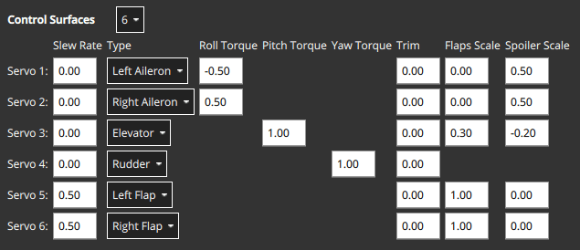

- The flaps have both `Flap Scale` set to 1, meaning that they will be fully deflected with the flap-control at 1.
  They also have a [slew rate](#slew_rate) of 0.5/s, meaning that it will take 2s to fully deflect them (a slew rate on the flaps is generally recommended to reduce the disturbances their movement creates).
- Елерони в основному призначені для забезпечення керованого крутного моменту.
  They also have `Spoiler Scale` set to 0.5, and will additionally be deflected upwards 50% if the controller demands full spoiler configuration.
  Таким чином, відхилення елеронів - це сума (асиметричного) відхилення для крутного моменту, плюс (симетричне) відхилення для вказаної точки спойлера.
- Елеватор в основному призначений для забезпечення крутного моменту по тангажу.
  It also has non-zero entries in the `Flap Scale` and `Spoiler Scale` fields.
  Це відхилення елеватора, яке додається для компенсації моментів по тангажу, створених дією поверхні флапів та спойлерів.
  У цьому випадку елеватор буде відхилений на 0,3 вгору при повному розгортанні флапів для компенсації моменту, спрямованого вниз, який викликано дією флапів.

#### Масштабування крену, кута та повороту приводу

:::info
For the majority of airframe setups the default values for each control surface types should not be changed.
:::

The `Roll scale`, `Pitch scale` and `Yaw scale` values indicate the normalized effectiveness of the actuator around the corresponding axis.

Настройка значень є темою низького / рівня / продвинутої складності і, як правило, потрібна лише при налаштуванні зв'язаних поверхонь керування (наприклад, елерон, який контролює як кочення, так і тангаж).
У цьому випадку важливо знати наступне:

- Числа, які вводяться, безпосередньо вводяться в матрицю розподілу, яка потім інвертується для отримання сигналів керування від вибраних моментів (нормалізованих).
- Increasing the scale will _reduce_ the deflection of the control surfaces (as it gets inverted).

<!-- For more information see:  (PX4 Dev Summit, 2022) -->

#### Конвенція про відхилення поверхні керування

Control surfaces that move in either direction from neutral include: Ailerons, Elevons, V-Tails, A-Tails, Rudder.

In order to ensure that these control surfaces always move as expected for positive or negative inputs from the controllers, there needs to be a definition of the deflection directions that is independent of the physical servo setup.

Positive input causes positive deflection.
The diagram below shows the direction of movement for positive input:

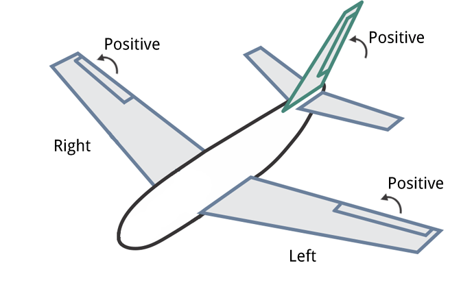

In summary, positive inputs result in:

- **Horizontal Control Surfaces:** Upwards movement.
  Includes ailerons and elevons.
- **Vertical Control Surfaces:** Rightwards movement.
  Includes rudders.
- **Mixed Control Surfaces:** Upwards/rightwards movement.
  Includes V-Tail. A-Tail

:::tip
Control surfaces that can only deflect in one direction from the neutral point include: Airbrakes, Spoiler, and Flaps.

For these controls a positive input is always deflection from the neutral (0: no effect, 1: full effect), irrespective of the direction that the control itself moves.
They do not respond to negative input.
:::

<!-- Also see this comment: https://github.com/PX4/PX4-Autopilot/blob/96b03040491e727752751c0e0beed87f0966e6d4/src/modules/control_allocator/module.yaml#L492 -->

### Геометрія сервоприводу нахилу двигуна

[VTOL tiltrotor vehicles](../frames_vtol/tiltrotor.md) can tilt their motors to transition between hover and forward flight.
Цей розділ визначає властивості сервоприводів з відхиленням.
Ці значення відображаються на конкретні двигуни в геометрії двигуна для тільтротора.

The example below shows the tilt servo setup for the [tiltrotor motor geometry shown above](../config/actuators.md#motor-geometry-vtol-tiltrotor).

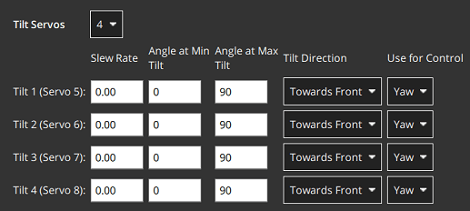

Допустимі значення, які можна встановити:

- `Tilt servos`: The number of servos (tiltable motors).
- `Angle at min tilt`: [Maximum tilt angle](#tilt-servo-coordinate-system) in degrees, relative to the z axis.
- `Angle at max tilt`: [Minimum tilt angle](#tilt-servo-coordinate-system) in degrees, relative to the z-axis.
- `Tilt direction`: `Towards front` (positive x direction) or `Towards right` (positive y direction).
- `Use for control`: [Tilt servo used for yaw/pitch](#tilt-servos-for-yaw-pitch-control)
  - `None`: Torque control is not used.
  - `Yaw`: Tilt servos used to control yaw.
  - `Pitch`: Tilt servos used to control pitch.
  - `Both Yaw and Pitch`: Tilt servos are used to control both yaw and pitch.

#### Система координат сервопривода нахилу

Система координат для кутів нахилу вітрокрила показана нижче.
Орієнтація для кутів нахилу - пряме вгору (0 градусів).
Кут нахилу вперед або праворуч від автомобіля є позитивним, а в напрямку назад або ліворуч - негативним.

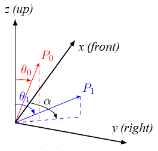

The `Angle at min tilt` and `Angle at max tilt` indicate the range of movement for the tilt servo.
The minimum tilt is the smaller _numerical value_ (not absolute) of the two angles.

If the max/min tilt vectors are **P0** and **P1** as shown above, both tilt angles are positive but **θ0** is smaller:

- `Angle at min tilt` = **θ0**
- `Angle at max tilt` = **θ1**

:::info
If the diagram was mirrored so that **P0** and **P1** were tilting into the -x, -y quadrant, then both the tilt angles would be negative.
Because **θ1** would more negative (smaller) than **θ0**, it would be the `Angle at min tilt`.

Аналогічно, сервопривід, який рухається:

- between the upright and forward positions would have `min=0` and `max=90`.
- symmetrically 45 degrees around the upright position would have `min=-45` and `max=45`
- between the upright and backward positions would have `min=-90` and `max=0`.

:::

The `Tilt direction` indicates whether the servo tilts in the plane towards the `Front` or `Right` of the vehicle.
On the diagram this would be represented by **α** that can only take values of 0 (front) or 90 (right).

#### Сервоприводи для крену/тангажу

Сервоприводи нахилу можуть надавати крутний момент на одній або декількох осях, які можуть бути використані для розвороту або крена транспортного засобу:

- Yaw зазвичай налаштовується таким чином, хоча на транспортних засобах з чотирма або більше двигунами часто використовуються двигуни.
- Крен керується в основному за допомогою різниці тяги двигунів.
  Control using tilt servos is useful on airframes that can't use differential thrust, such as a [Bicopter](https://www.youtube.com/watch?v=hfss7nCN40A).

Whether this feature is used is configured in the `Use for control` setting.

## Виводи приводу

The _Actuator Outputs_ section is used to assign motors, control surface servos, and other actuators used by the particular frame to the physical outputs on the flight controller, and to set parameters for those outputs.

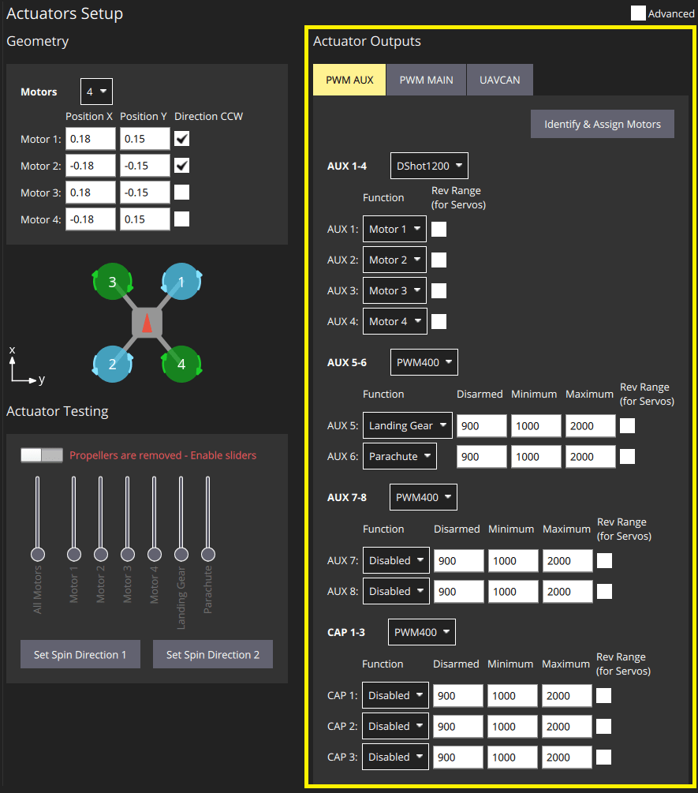

Для кожної підтримуваної вихідної шини, підключеної до керуючого контролера польоту, відображаються окремі вкладки: PWM MAIN (вихід дошки вводу/виводу), PWM AUX (вихід дошки FMU), UAVCAN.

Motors and actuators (which are referred to as "[functions](#output-functions)") can be assigned to any physical output on any of the available buses.

:::info
PWM AUX outputs are preferred over the PWM MAIN outputs for controlling motors (they have lower latency).
:::

Вихідні PWM групуються на основі груп апаратних таймерів.
Це означає, що всі виходи в одній групі повинні працювати за одним протоколом з однаковою швидкістю (наприклад, сигнал ШІМ на частоті 400 Гц для всіх виходів в одній групі).
Тому неможливо відобразити Серводвигун та Двигун в одній вихідній групі, оскільки вони зазвичай працюють на різних швидкостях.

The PWM AUX tab has CAP outputs that are generally used as the [camera capture/trigger input](../camera/fc_connected_camera.md#trigger-configuration).
Однак ви можете відобразити виводи CAP на інші функції виводу, і інші AUX виводи можуть бути використані як вхід для захоплення / спрацювання камери.

:::info
Configuring the Camera Capture / Trigger input requires a reboot to take effect
:::

You should assign functions to the outputs that match your physical wiring of motors and servos, and use the [Actuator Testing](#actuator-testing) section described below to determine appropriate output parameter values.
These steps are covered in [Output Assignment and Configuration](#output-assignment-and-configuration).

### Функції виводу

Output functions are used to map the "logical functions" of an airframe, such as `Motor 1` or `Landing gear`, to physical outputs like FMU output pin 2.
Це дозволяє легко використовувати певний вихідний контакт для майже будь-якої мети.

Деякі функції є актуальними лише для певних кадрів або типів виведення, і не будуть запропоновані на інших.

Функції включають:

- `Disabled`: Output has no assigned function.
- `Constant_Min`: Output set to constant minimum value (-1).
- `Constant_Max`: Output is set to constant maximum value (+1).
- `Motor 1` to `Motor 12`: Output is indicated motor.
  Відображаються тільки двигуни, дозволені для авіаконструкції.
- `Servo 1` to `Servo 8`: Servo output.
  Ці об'єкти отримують конкретне значення на основі конструкції, таке як "серводвигун нахилу", "лівий елерон".
- `Peripheral via Acutator Set 1` to `Peripheral via Acutator Set 6`: [Generic Actuator Control with MAVLink](../payloads/generic_actuator_control.md#generic-actuator-control-with-mavlink).
- `Landing Gear`: Output is landing gear.
- `Parachute`: Output is parachute.
  Мінімальне значення надсилається у звичайному режимі, а максимальне - при спрацьовуванні захисту від збоїв.
- `RC Roll`: Output is passthrough roll from RC ([RC_MAP_ROLL](../advanced_config/parameter_reference.md#RC_MAP_ROLL) maps an RC channel to this output).
- `RC Pitch`: Output is passthrough pitch from RC ([RC_MAP_PITCH](../advanced_config/parameter_reference.md#RC_MAP_PITCH) maps an RC channel to this output).
- `RC Throttle`: Output is passthrough throttle from RC ([RC_MAP_THROTTLE](../advanced_config/parameter_reference.md#RC_MAP_THROTTLE) maps an RC channel to this output).
- `RC Yaw`: Output is yaw from RC ([RC_MAP_YAW](../advanced_config/parameter_reference.md#RC_MAP_YAW) maps an RC channel to this output).
- `RC Flaps`: Output is flaps from RC ([RC_MAP_FLAPS](../advanced_config/parameter_reference.md#RC_MAP_FLAPS) maps an RC channel to this output).
- `RC AUXn` to `RC AUX1`: Outputs used for [arbitrary payloads triggered by RC passthrough](../payloads/generic_actuator_control.md#generic-actuator-control-with-rc).
- `Gimbal Roll`: вихід керує поворотом gimbal.
- `Gimbal pitch`: вихід контролює крок підвісу.
- `Gimbal Yaw`: Output controls Gimbal yaw.
- `Gripper`<Badge type="tip" text="PX4 v1.14" />: Output controls gripper open/close.
- `Landing_Gear_Wheel`<Badge type="tip" text="PX4 v1.14" />: Output controls deployment of landing gear wheel

Наведені функції можуть бути застосовані тільки до виходів FMU:

- `Camera_Trigger`: Output to trigger camera.
  Enabled when [`TRIG_MODE==0`](../advanced_config/parameter_reference.md#TRIG_MODE).
  Configured via `TRIG_*` parameters.
- `Camera_Capture`: Input to get image capture notification.
  Enabled when [CAM_CAP_FBACK==0](../advanced_config/parameter_reference.md#CAM_CAP_FBACK).
  Configured via `CAM_CAP_*` parameters.
- `PPS_Input`: Pulse-per-second input capture.
  Використовується для синхронізації GPS.
  Enabled when [`PPS_CAP_ENABLE==0`](../advanced_config/parameter_reference.md#PPS_CAP_ENABLE)

:::info
The functions are defined in source at [/src/lib/mixer_module/output_functions.yaml](https://github.com/PX4/PX4-Autopilot/blob/main/src/lib/mixer_module/output_functions.yaml).
This list is correct at PX4 v1.15.
:::

## Тестування актуаторів

The _Actuator Testing_ section in lower-right corner provides sliders that can be used to test (and determine) actuator and motor settings.
A slider is provided for each output defined in the [Actuator Outputs](#actuator-outputs) section.
Наведений нижче приклад слайдера показує розділ для типової повітряної конструкції VTOL Tiltrotor.

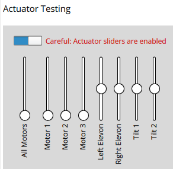

The section has an **Enable Sliders** switch that must be toggled before sliders can be used.
Повзунки можуть живити двигуни/сервоприводи в повному діапазоні їх руху, а також «прив’язувати» до вимкненого та мінімального положень.

:::info
After you toggle the **Enable sliders** switch, actuators/motors won't do anything until the corresponding slider is _moved_.
Це функція безпеки, що запобігає раптовим рухам двигуна після увімкнення перемикача.
:::

Повзунки можуть бути використані для перевірки наступного:

1. Actuators (Motors, Control surfaces, etc.) are assigned to the expected output.
2. Motors don't spin when at the `disarmed` PWM output value
3. Motors barely spin at the `minimum` PWM output value.
4. Motors give **positive thrust** in the expected direction
5. Control Surfaces are in the correct idle position for `disarmed` output value
6. Control Surfaces move in the direction as defined in the [Control Surface Convention](#control-surface-deflection-convention)
7. Motor Tilt Servos are in the correct idle position for `disarmed` output value
8. Motor Tilt Servos move in the direction as defined in the [Tilt Servo Convention](#tilt-servo-coordinate-system)

## Призначення та конфігурація виходу

Outputs are assigned to functions and configured in the [Actuator Outputs](#actuator-outputs) section, while the [Actuator Testing](#actuator-testing) sliders are commonly used to determine appropriate configuration values to enter:

- MC vehicles that have connected motors to PWM outputs can use the [Identify & Assign Motors](#multicopter-pwm-motor-assignment) button to perform motor assignment "semi-automatically".
- Output assignment of both motors and actuators can be done/checked using sliders (see [Output Assignment (Manual)](#output-assignment-manual)).
- Роззброєний, мінімальні та максимальні налаштування для всіх виходів також можуть бути визначені за допомогою слайдерів.
  This is shown as part of [Motor Configuration](#motor-configuration), [Control Surface Setup](#control-surface-setup), [Tilt servo setup](#tilt-servo-setup)

### PWM багатокоптера: Призначення двигуна

You can use the **Identify & Assign Motors** button to assign motors to PWM outputs using a semi-automated process.

:::info
This is the easiest way to assign motors, but is currently only supported for motors on **multicopter vehicles** that are connected to PWM outputs (UAVCAN outputs and other frame types do not support this feature).
On other frames you can follow the instructions in [Output Assignment (Manual)](#output-assignment-manual).
:::

:::warning
Remove the propellers from motors before assigning outputs or any testing.
:::

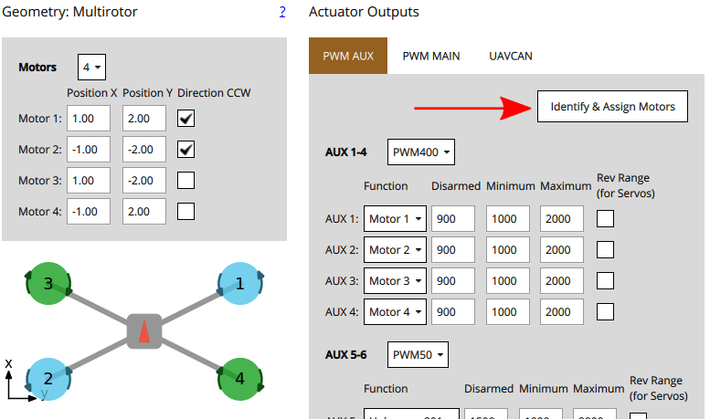

Коли ви натискаєте кнопку, QGC відправляє команду до двигуна, що призводить до його обертання.
Щоб призначити цей двигун виводу, просто виберіть відповідний двигун, який відображається на екрані.
QGC потім автоматично обере наступний двигун для вас для призначення, і так далі.

Інструкції:

1. Налаштуйте геометрію двигуна, щоб вона відповідала двигунам на вашій рамі.

2. Виберіть вкладку PWM, на якій ви хочете призначити двигуни.

3. Click the **Identify & Assign Motors** button.

4. One motor will start spinning (click **Spin Motor Again** if it stops spinning too quickly to note.)

  Виберіть відповідний двигун в розділі геометрії.

  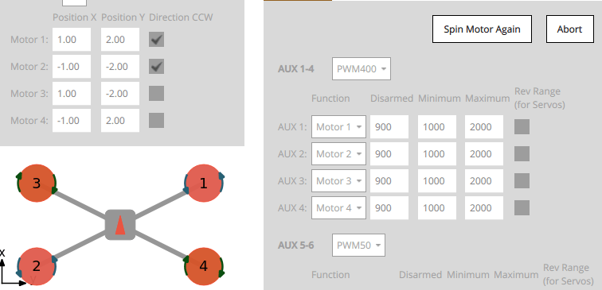

5. Після призначення всіх двигунів інструмент встановить правильне відображення двигунів для виходів, а потім вийде.

### Вивід призначення (ручний)

:::warning
Remove the propellers from motors before assigning outputs or any testing.
:::

Actuator outputs for both motors and servos can be _manually_ assigned using sliders in the [Actuator Testing](#actuator-testing) section.

Для призначення приводу:

1. First assign functions to the outputs that you think are _likely_ to be correct in the _Actuator Outputs_ section.
2. Toggle the **Enable sliders** switch in _Actuator Testing_ section.
3. Перемістіть повзунок для приводу, який ви хочете перевірити:
  - Двигуни повинні бути переведені в положення мінімального тяги.
  - Сервоприводи повинні бути переміщені близько до середнього положення.
4. Перевірте, який привод рухається на транспортному засобі.
  This should match the actuator positions for your geometry (the [airframe reference](../airframes/airframe_reference.md) shows motor positions for a number of standard airframes).
  - Якщо правильний привод рухається, перейдіть до наступного кроку.
  - Якщо неправильний привод рухається, поміняйте призначення виводу.
  - Якщо нічого не рухається, то збільште регулятор наполовину діапазону, потім вище, якщо потрібно.
    Якщо після цього нічого не рухається, вихід може бути не підключений, можливо, двигун не живиться або вихід може бути неправильно налаштований.
    Вам потрібно буде вирішити проблему (можливо, спробуйте інші виходи виконавчих пристроїв, щоб побачити, чи "щось" рухається).
5. Поверніть слайдер у положення "роззброєно" (донизу для двигунів, по центру для сервоприводів).
6. Повторити для всіх приводів

### Конфігурація двигуна

:::info
If using PWM or OneShot ESCs, you should first perform [ESC Calibration](../advanced_config/esc_calibration.md) (this topic also covers PWM specific motor configuration).

[DShot](../peripherals/dshot.md) ESCs do not require configuration of the command limits but only rotation direction.
:::

:::warning
Remove propellers!
:::

Конфігурація двигуна встановлює вихідні значення так, що двигуни:

- don't spin when disarmed (at the `disarmed` PWM output value).
- barely but reliably spin up at the `minimum` PWM output value.
- have the _lowest_ `maximum` PWM output value that spins the motor at its _highest_ rate.
- give **positive thrust** in the expected direction.

Для кожного двигуна:

1. Тягніть слайдер мотора вниз, щоб він защелкнувся унизу.
  In this position the motor is set to the outputs `disarmed` value.
  - Перевірте, що двигун не обертається в цьому положенні.
  - If the motor spins, reduce the corresponding PWM `disarmed` value in the [Actuator Outputs](#actuator-outputs) section to below the level at which it still spins.

2. Slowly move the slider up until it snaps to the _minimum_ position.
  In this position the motor is set to the outputs `minimum` value.

  - Перевірте, чи двигун обертається дуже повільно в цьому положенні.
  - If the motor is not spinning, or spinning too fast you will need to adjust the corresponding PWM `minimum` value in the [Actuator Outputs](#actuator-outputs) such that the motors barely spin.

    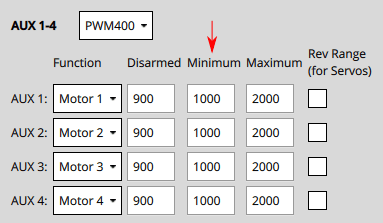
    ::: info
    For DShot output, this is not required.

:::

3. Збільште значення слайдера до рівня, на якому ви можете перевірити, що двигун обертається в правильному напрямку і що він надасть позитивний тяговий потік в очікуваному напрямку.

  - Очікувана напрямок тяги може відрізнятися в залежності від типу транспортного засобу.
    Наприклад, у багатороторних літаках тяга завжди повинна вказувати вгору, тоді як у повітряному судні з фіксованим крилом тяга буде тягти судно вперед.
  - For VTOL, thrust should point upwards when the Tilt Servo is at 0 degrees as defined the [Tilt Servo Convention](#tilt-servo-coordinate-system).
    Testing of the [Tilt Servo](#tilt-servo-setup) is covered below as well.
  - If thrust is in the wrong direction, you may need to [reverse the motors](#reversing-motors).

4. Збільште значення слайдера до максимального значення, щоб двигун швидко обертався.
  Reduce the value of the PWM output's `maximum` value just below the default.
  Прослухайте тон моторів, коли ви збільшуєте значення малими (25us) інкрементами.
  "Оптимальне" максимальне значення - це значення, при якому ви востаннє почули зміну тона.

### Налаштування поверхонь керування

First set the _frame rate_ for the servos used in each group of outputs.
Зазвичай це встановлюється на максимальне значення, підтримуване вашим серводвигуном.
Нижче ми покажемо, як ви можете встановити його на PWM50 (найбільш поширене значення).

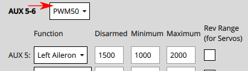

:::info
You will almost certainly need to change the pulse rate from the default of 400Hz because support is rare (if not supported the servo will usually make an "odd" noise).
Якщо ви використовуєте сервоприводи PWM, PWM50 є набагато поширенішим.
If a high rate servo is _really_ needed, DShot offers better value.
:::

#### Control surfaces that move both directions about a neutral point

Control surfaces that move either direction around a neutral point include: ailerons, elevons, V-tails, A-tails, and rudders.

To set these up:

1. Set the `Disarmed` value so that the surfaces will stay at neutral position when disarmed.
  This is usually around `1500` for PWM servos (near the centre of the servo range).

  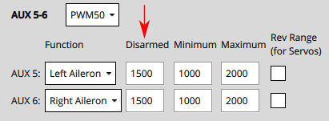

2. Move the slider for the surface upwards (positive command) and verify that it moves in the direction defined in the [Control Surface Convention](#control-surface-deflection-convention).

  - Ailerons, elevons, V-Tails, A-Tails, and other horizontal surfaces should move up.
  - Rudders and other "purely vertical" surfaces should move right.

  ::: tip
  It is important that the slider movement matches the control surface convention, in order to normalize control for different servo mountings (moving the slider up may actually decrease the output value sent to the servo).

:::

  If the control surface moves in the opposite direction, click on the `Rev Range` checkbox to reverse the range.

3. Move the slider again to the middle and check if the Control Surfaces are aligned in the neutral position of the wing.

  - If it is not aligned, you can set the **Trim** value for the control surface.

    ::: info
    This is done in the `Trim` setting of the Geometry panel, usually by "trial and error".
    

:::

  - After setting the trim for a control surface, move its slider away from the centre, release, and then back into disarmed (middle) position.
    Підтвердіть, що поверхня знаходиться в нейтральному положенні.

:::info
Another way to test without using the sliders would be to set the [`COM_PREARM_MODE`](../advanced_config/parameter_reference.md#COM_PREARM_MODE) parameter to `Always`:

- Це дозволить керувати сервоприводами навіть коли транспортний засіб відброньований, і постійно застосовуватиме налаштування обрізки до керуючих поверхонь
- Ви можете спробувати встановити різні значення для обрізки та перевірити вирівнювання, а потім вибрати значення, з яким ви будете задоволені.

:::

#### Control surfaces that move from neutral to full deflection

Control surfaces that move only one direction from neutral include: airbrakes, spoilers, and flaps.

For these controls you should set the minimum and maximum PWM values according to the full range of the control.
The `Disarmed` value should then match the value (of maximum or minimum) that corresponds to control being in the "neutral" position.
For a flap, that is when the flap is fully retracted and flush with the wing.

One approach for setting these up is:

1. Set values `Disarmed` to `1500`, `Min` to `1200`, `Max` to `1700` so that the values are around the centre of the servo range.
2. Move the corresponding slider up and check the control moves and that it is extending (moving away from the disarmed position).
  If not, click on the `Rev Range` checkbox to reverse the range.
3. Enable slider in the disarmed position, them change the value of the `Disarmed` signal until the control is retracted/flush with wing.
  This may require that the `Disarmed` value is increased or decreased:
  - If the value was decreased towards `Min`, then set `Min` to match `Disarmed`.
  - If the value was increased towards `Max`, then set `Max` to match `Disarmed`.
4. The value that you did _not_ set to match `Disarmed` controls the maximum amount that the control surface can extend.
  Set the slider to the top of the control, then change the value (`Max` or `Min`) so that the control surface is fully extended when the slider is at top.

:::info Special note for flaps
In some vehicle builds, flaps may be configured such that both flaps are controlled from a single output.
In this case, you need to ensure that both flaps extend/deploy when raising the corresponding slider.
If this is not the case and one servo deploys correctly and one does not, you need to change the servo direction with a third party servo programmer.
Alternatively, you might move the servo that is not deflecting in the correct orientation to its own servo output channel and then reverse its direction via the `Rev range` check box.
:::

### Налаштування серводвигуна нахилу

First set the _frame rate_ for the servos used in each group of outputs.
Зазвичай це встановлюється на максимальне значення, підтримуване вашим серводвигуном.
Нижче воно встановлено на PWM50 (найбільш поширене значення).
Зверніть увагу, що ця частина налаштування є такою ж, як і для поверхонь керування вище.

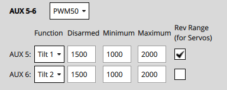

Для кожного з сервоприводів нахилу:

1. Set the `Disarmed` value (e.g. `1000` or `2000` for PWM Servos) so that the servo will be positioned in expected direction when _disarmed_.

2. Position the slider for the servo in the lowest position, and verify that a positive value increase will point towards the `Angle at Min Tilt` (defined in the Geometry section).

  

3. Position the slider for the servo in the highest position, and verify that positive motor thrust will point towards the `Angle at Max Tilt` (as defined in the Geometry section).

### Інші примітки

- Якщо використовується кнопка безпеки, її потрібно натиснути перед тим, як буде дозволено проводити випробування приводу.
- Вимикач вимкнення все ще може бути використаний для негайного зупинення двигунів.
- Сервоприводи фактично не рухаються, поки не буде змінено відповідний слайдер.
- The parameter [COM_MOT_TEST_EN](../advanced_config/parameter_reference.md#COM_MOT_TEST_EN) can be used to completely disable actuator testing.
- On the shell, [actuator_test](../modules/modules_command.md#actuator-test) can be used as well for actuator testing.
- VTOLs will automatically turn off motors pointing upwards during **fixed-wing flight**:
  - Стандартний VTOL: Двигуни, визначені як багатокоптерні двигуни, будуть вимкнені
  - Tiltrotors : Двигуни, які не мають пов'язаного сервоприводу нахилу, вимкнуться
  - Tailsitters не вимикають жодних двигунів у польоті з фіксованим крилом

### Реверсивні мотори

The motors must turn in the direction defined in configured geometry ("**Direction CCW**" checkboxes).
Якщо будь-які двигуни не обертаються в правильному напрямку, їх необхідно перевернути.

Є декілька варіантів:

- If the ESCs are configured as [DShot](../peripherals/dshot.md) you can permanently reverse the direction via UI.
  The **Set Spin Direction** buttons are displayed below the Actuator sliders (if DShot motors are used).
  Ці викидають діалогове вікно, в якому ви вибираєте мотор, для якого хочете застосувати напрямок.

  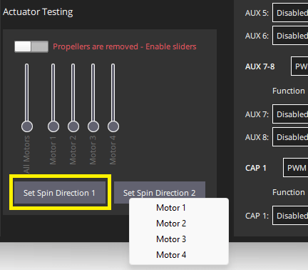

  Зверніть увагу, що поточного напрямку не можна запитати, тому вам може знадобитися спробувати обидві опції.

- Поміняйте місцями 2 з 3 кабелів двигуна (не має значення які саме).

  ::: info
  If motors are not connected via bullet-connectors, re-soldering is required (this is a reason, among others, to prefer DShot ESCs).

:::
