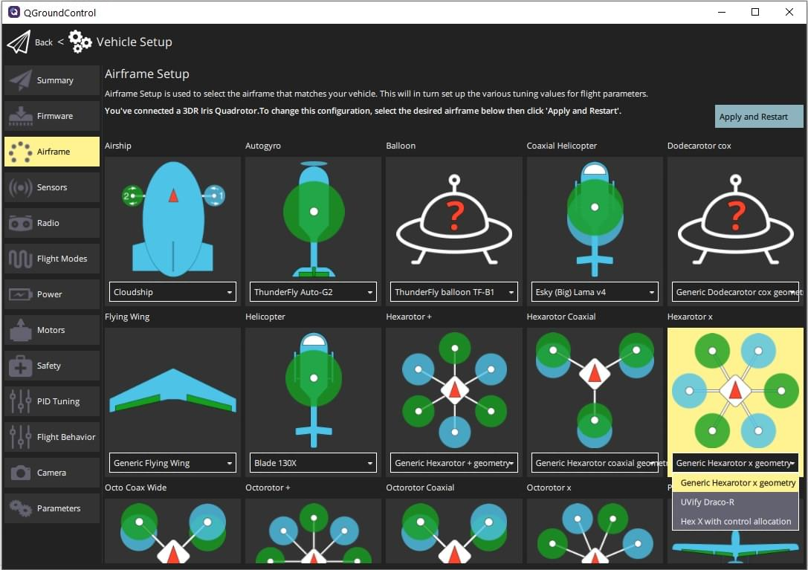
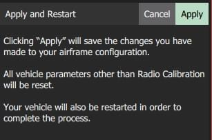

# Вибір рухомого засобу (корпусу)

After installing firmware you need to select a [vehicle type and frame configuration](../airframes/airframe_reference.md).
This applies appropriate initial parameter values for the selected frame, such as the vehicle type, number of motors, relative motor position, and so on.
These can later be customised for your vehicle in [Actuator Configuration & Testing](../config/actuators.md).

:::tip
Choose the frame that matches your vehicle brand and model if one exists, and otherwise select the closest "Generic" frame option matching your vehicle.
:::

## Налаштуйте раму

Налаштуйте планер:

1. Start _QGroundControl_ and connect the vehicle.

2. Select **"Q" icon > Vehicle Setup > Airframe** (sidebar) to open _Airframe Setup_.

3. Виберіть широку групу/тип транспортного засобу, який відповідає вашій конструкції, а потім скористайтеся випадаючим списком всередині групи, щоб вибрати конструкцію, яка найкраще підходить для вашого транспортного засобу.

   

   The example above shows _Generic Hexarotor X geometry_ selected from the _Hexarotor X_ group.

4. Click **Apply and Restart**.
   Click **Apply** in the following prompt to save the settings and restart the vehicle.

   

## Наступні кроки

[Actuator Configuration & Testing](../config/actuators.md) shows how to set the precise geometry of the vehicle motors and actuators, and their mapping to flight controller outputs.
After mapping actuators to outputs you should perform [ESC Calibration](../advanced_config/esc_calibration.md) if using PWM or OneShot ESCs.

## Подальша інформація

- [QGroundControl User Guide > Airframe](https://docs.qgroundcontrol.com/master/en/qgc-user-guide/setup_view/airframe.html)
- [PX4 Setup Video - @37s](https://youtu.be/91VGmdSlbo4?t=35s) (Youtube)
