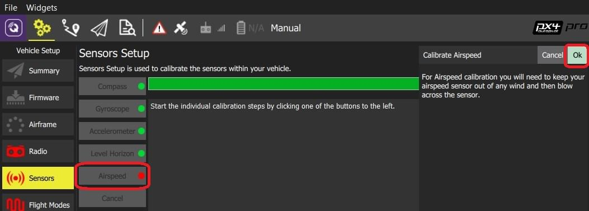

# Калібрування швидкості повітря

:::info
[Airspeed sensors](../sensor/airspeed.md) are highly recommended for Fixed-wing and VTOL vehicles.
:::

:::warning
Unlike most other sensor drivers, the airspeed sensor drivers are not automatically started.
Before calibration they must be [enabled via the corresponding parameter](../advanced_config/parameters.md):

- Sensirion SDP3X ([SENS_EN_SDP3X](../advanced_config/parameter_reference.md#SENS_EN_SDP3X))
- TE MS4525 ([SENS_EN_MS4525DO](../advanced_config/parameter_reference.md#SENS_EN_MS4525DO))
- TE MS5525 ([SENS_EN_MS5525DS](../advanced_config/parameter_reference.md#SENS_EN_MS5525DS))
- Eagle Tree airspeed sensor ([SENS_EN_ETSASPD](../advanced_config/parameter_reference.md#SENS_EN_ETSASPD))

:::

## Виконання калібрування

Для калібрування датчика швидкості повітря:

1. Start _QGroundControl_ and connect the vehicle.

2. Enable the airspeed sensors if not already done (as in _warning_ above).

3. Select **"Q" icon > Vehicle Setup > Sensors** (sidebar) to open _Sensor Setup_.

4. Click the **Airspeed** sensor button.

  

5. Захистіть сенсор від вітру (тобто закрийте його рукою).
  Пильнуйте, щоб не заблокувати жодного з отворів.

6. Click **OK** to start the calibration.

7. Після запиту, дмухніть у кінець труби пітота, щоб сигналізувати про завершення калібрування.

  :::tip
  Blowing into the tube is also a basic check that the dynamic and static ports are installed correctly.
  Якщо вони будуть поміняні місцями, то датчик буде відображати великий від'ємний перепад тиску, коли ви дмухаєте в трубку, і калібрування завершиться з помилкою.

:::

8. _QGroundControl_ then tells you if the calibration was successful or not.

## Подальша інформація

- [QGroundControl User Guide > Sensors](https://docs.qgroundcontrol.com/master/en/qgc-user-guide/setup_view/sensors_px4.html#airspeed)
