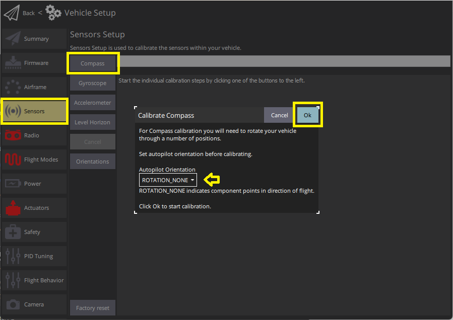

# Калібрування компасу

This process calibrates and configures all [magnetometers](../gps_compass/index.md).
_QGroundControl_ will guide you to position the vehicle in a number of set orientations and rotate the vehicle about the specified axis.

:::info
It also auto-detects the compass orientation for external magnetometers ([by default](../advanced_config/parameter_reference.md#SENS_MAG_AUTOROT)).
If you have [mounted the compass](../assembly/mount_gps_compass.md#compass-orientation) at a non-standard angle you will need to [manually set the compass orientation](../config/flight_controller_orientation.md#setting-the-compass-orientation) before calibrating.
:::

## Загальний огляд

You will need to calibrate your compass(es) when you first setup your vehicle, and you may need to recalibrate it if the vehicles is ever exposed to a very strong magnetic field, or if it is used in an area with abnormal magnetic characteristics.

:::tip
Indications of a poor compass calibration include multicopter circling during hover, toilet bowling (circling at increasing radius/spiraling-out, usually constant altitude, leading to fly-way), or veering off-path when attempting to fly straight.
_QGroundControl_ should also notify the error `mag sensors inconsistent`.
:::

The process calibrates all compasses and autodetects the orientation of any external compasses.
If any external magnetometers are available, it then disables the internal magnetometers (these are primarily needed for automatic rotation detection of external magnetometers).

Several types of compass calibration are available:

1. [Complete](#complete-calibration): This calibration is required after installing the autopilot on an airframe for the first time or when the configuration of the vehicle has changed significantly.
  Воно компенсує впливи твердого та м'якого заліза, оцінюючи зміщення та коефіцієнт масштабу для кожної вісі.
2. [Partial](#partial-quick-calibration): This calibration can be performed as a routine when preparing the vehicle for a flight, after changing the payload, or simply when the compass rose seems inaccurate.
  Цей тип калібрування лише оцінює зміщення для компенсації ефекту твердого заліза.
3. [Large vehicle](#large-vehicle-calibration): This calibration can be performed when the vehicle is too large or heavy to perform a complete calibration. Цей тип калібрування лише оцінює зміщення для компенсації ефекту твердого заліза.

## Виконання калібрування

### Передумови

Перед початком калібрування:

1. Виберіть місце подалеку від великих металевих об'єктів або магнітних полів.
  :::tip
  Metal is not always obvious! Уникайте калібрування на верхній частині офісного столу (часто містять металеві пластины) або поруч з транспортним засобом.
  Калібрування може бути навіть уражено, якщо ви стоїте на бетонній плиті з нерівномірним розподілом арматури.

:::
2. Підключайтесь за допомогою телеметричного радіо, а не через USB, якщо це взагалі можливо.
  USB потенційно може викликати значне магнітне втручання.
3. If using an external compass (or a combined GPS/compass module), make sure it is [mounted](../assembly/mount_gps_compass.md) as far as possible from other electronics in order to reduce magnetic interference, and in a _supported orientation_.

### Повне калібрування

Калібрування включає наступні кроки:

1. Start _QGroundControl_ and connect the vehicle.

2. Select **"Q" icon > Vehicle Setup > Sensors** (sidebar) to open _Sensor Setup_.

3. Click the **Compass** sensor button.

  

  ::: info
  You should already have set the [Autopilot Orientation](../config/flight_controller_orientation.md). Якщо ні, ви також можете встановити це тут.

:::

4. Click **OK** to start the calibration.

5. Розмістіть транспортний засіб у будь-якому з показаних червоних орієнтацій (неповний) та утримуйте його нерухомим. Після запиту (орієнтаційне зображення стає жовтим) обертайте транспортний засіб навколо вказаної вісі в одному або обох напрямках. Після завершення калібрування для поточного орієнтації пов'язане зображення на екрані стане зеленим.

  

6. Повторіть процес калібрування для всіх орієнтацій автомобіля.

Once you've calibrated the vehicle in all the positions _QGroundControl_ will display _Calibration complete_ (all orientation images will be displayed in green and the progress bar will fill completely). Ви можете потім перейти до наступного сенсора.

### Часткова "Швидка" Калібрування

Ця калібровка схожа на відому калібровку компасу у вигляді восьмірки, виконану на смартфоні:

1. Утримуйте транспортний засіб перед собою та випадковим чином виконуйте часткові обертання по всіх його осях.
  2-3 коливань на кут близько 30 градусів у кожному напрямку зазвичай достатньо.
2. Зачекайте, поки оцінка заголовку стабілізується, і перевірте, що компас вказує в правильному напрямку (це може зайняти кілька секунд).

Примітки:

- Немає можливості початку/зупинки для цього типу калібрування (алгоритм працює безперервно, коли транспортний засіб роззброєний).
- Калібрування негайно застосовується до даних (перезавантаження не потрібно), але зберігається в параметрах калібрування лише після відброшення транспортного засобу (калібрування втрачається, якщо між калібруванням і вимкненням не виконана послідовність увімкнення/вимкнення).
- Амплітуда та швидкість часткових обертань, виконаних на кроці 1, можуть впливати на якість калібрування.
  Найчастіше вище зазначені поради виявляються досить ефективними.

### Large Vehicle Calibration

<Badge type="tip" text="PX4 v1.15" />

This calibration process leverages external knowledge of vehicle's orientation and location, and a World Magnetic Model (WMM) to calibrate the hard iron biases.

1. Ensure GNSS Fix. This is required to find the expected Earth magnetic field in WMM tables.
2. Align the vehicle to face True North.
  Be as accurate as possible for best results.
3. Open the [QGroundControl MAVLink Console](https://docs.qgroundcontrol.com/master/en/qgc-user-guide/analyze_view/mavlink_console.html) and send the following command:

  ```sh
  commander calibrate mag quick
  ```

Примітки:

- This method is specifically designed for vehicles where full rotation is impractical or impossible.
  If full rotation is possible, use the [complete calibration](#complete-calibration) instead.
- The vehicle doesn't need to be exactly levelled as this is automatically compensated using the tilt estimate.
- This calibration can also be triggered using the MAVLink command [MAV_CMD_FIXED_MAG_CAL_YAW](https://mavlink.io/en/messages/common.html#MAV_CMD_FIXED_MAG_CAL_YAW).

## Перевірка

Після завершення калібрування перевірте, щоб індикатор напрямку та напрямок стрілки на карті були стабільними і відповідали орієнтації транспортного засобу при його повороті, наприклад, на головні сторони.

## Додаткова калібрування/конфігурація

The process above will autodetect, [set default rotations](../advanced_config/parameter_reference.md#SENS_MAG_AUTOROT), calibrate, and prioritise, all available magnetometers.
If external magnetometers are available, internal magnetometers are disabled.

Додаткова конфігурація компаса, як правило, не повинна бути потрібною.

### Enable/Disable a Compass

While no further configuration should be _required_, developers who wish to disable/enable compasses for any reason, such as testing, can do so using the compass parameters.
These are prefixed with [CAL_MAGx_](../advanced_config/parameter_reference.md#CAL_MAG0_ID) (where `x=0-3`):

- [CAL_MAGn_ROT](../advanced_config/parameter_reference.md#CAL_MAG0_ROT) can be used to determine which compasses are internal.
  A compass is internal if `CAL_MAGn_ROT==1`.
- [CAL_MAGx_PRIO](../advanced_config/parameter_reference.md#CAL_MAG0_PRIO) sets the relative compass priority and can be used to disable a compass.

## Відлагодження

Raw comparison data for magnetometers (in fact, for all sensors) can be logged by setting [SDLOG_MODE=1](../advanced_config/parameter_reference.md#SDLOG_MODE) and [SDLOG_PROFILE=64](../advanced_config/parameter_reference.md#SDLOG_PROFILE).
See [Logging](../dev_log/logging.md) for more information.

## Подальша інформація

- [Peripherals > GPS & Compass](../gps_compass/index.md)
- [Basic Assembly](../assembly/index.md) (setup guides for each flight controller)
- [Compass Power Compensation](../advanced_config/compass_power_compensation.md) (Advanced Configuration)
- [QGroundControl User Guide > Sensors](https://docs.qgroundcontrol.com/master/en/qgc-user-guide/setup_view/sensors_px4.html#compass)
- [PX4 Setup Video - @2m38s](https://youtu.be/91VGmdSlbo4?t=2m38s) (Youtube)
