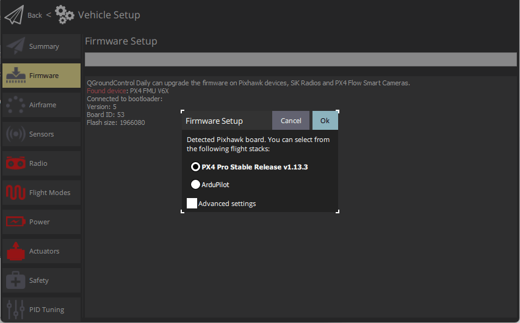

# Завантаження прошивки

_QGroundControl_ **desktop** versions can be used to install PX4 firmware onto [Pixhawk-series](../getting_started/flight_controller_selection.md) flight-controller boards.

:::warning
**Before you start installing Firmware** all USB connections to the vehicle must be _disconnected_ (both direct or through a telemetry radio).
The vehicle must _not be_ powered by a battery.
:::

## Встановити стабільну PX4

Generally you should use the most recent _released_ version of PX4, in order to benefit from bug fixes and get the latest and greatest features.

:::tip
This is the version that is installed by default.
:::

Щоб встановити PX4:

1. Start _QGroundControl_ and connect the vehicle.

2. Select **"Q" icon > Vehicle Setup > Firmware** (sidebar) to open _Firmware Setup_.

   

3. Підключіть польотний контролер безпосередньо до вашого комп'ютера через USB.

   ::: info
   Connect directly to a powered USB port on your machine (do not connect through a USB hub).

:::

4. Select the **PX4 Pro Stable Release vX.x.x** option to install the latest stable version of PX4 _for your flight controller_ (autodetected).

   

5. Click the **OK** button to start the update.

   Прошивка потім пройде кілька етапів оновлення (завантаження нової прошивки, видалення старої прошивки тощо).
   Кожен крок виводиться на екран та загальний прогрес відображається на панелі прогресу.

   

   Після завершення завантаження прошивки пристрій/транспортний засіб перезавантажиться та встановить з'єднання знову.

   :::tip
   If _QGroundControl_ installs the FMUv2 target (see console during installation) and you have a newer board, you may need to [update the bootloader](#bootloader) in order to access all the memory on your flight controller.

:::

Next you will need to specify the [vehicle airframe](../config/airframe.md) (and then sensors, radio, etc.)

## Встановлення PX4 Main, Beta або Custom Firmware

Щоб встановити іншу версію PX4:

1. Connect the vehicle as above, and select **PX4 Pro Stable Release vX.x.x**.
   
2. Check **Advanced settings** and select the version from the dropdown list:
   - **Standard Version (stable):** The default version (i.e. no need to use advanced settings to install this!)
   - **Beta Testing (beta):** A beta/candidate release.
      Лише доступно, коли готується новий реліз.
   - **Developer Build (master):** The latest build of PX4/PX4-Autopilot _main_ branch.
   - **Custom Firmware file...:** A custom firmware file (e.g. [that you have built locally](../dev_setup/building_px4.md)).
      Якщо ви виберете це, вам доведеться вибрати власну прошивку з файлової системи на наступному кроці.

Оновлення прошивки потім продовжується, як і раніше.

## Оновлення завантажувача

Апаратне забезпечення Pixhawk зазвичай має відповідну версію завантажувача.

Якщо оновлення може знадобитися - це новіші дошки Pixhawk, які встановлюють прошивку FMUv2.
Якщо _QGroundControl_ встановлює ціль FMUv2 (див. консоль під час встановлення), і у вас є новіша плата, вам може знадобитися оновити завантажувальник, щоб мати доступ до всієї пам'яті на вашому контролері польоту.

You can update it by following the instructions in [Bootloader update > FMUv2 Bootloader Update](../advanced_config/bootloader_update.md#fmuv2-bootloader-update).

## Подальша інформація

- [QGroundControl User Guide > Firmware](https://docs.qgroundcontrol.com/master/en/qgc-user-guide/setup_view/firmware.html).
- [PX4 Setup Video](https://youtu.be/91VGmdSlbo4) (Youtube)
