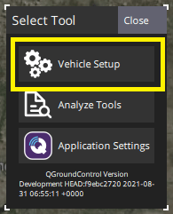

# Стандартна конфігурація

У цьому розділі описано загальну конфігурацію програмного забезпечення та калібрування, необхідні для більшості пристроїв PX4.

You must first [load firmware and select your vehicle frame/type](#firmware-vehicle-selection).
Most other steps can be done out of order, except for [tuning](#tuning), which must be done last.

## Передумови

Before starting you should [Download QGroundControl](http://qgroundcontrol.com/downloads/) and install it on your **desktop** computer.
Then open the QGC application menu ("Q" icon in the top-left corner) and choose **Vehicle Setup** in the _Select Tool_ popup:

## Етапи конфігурації

### Вибір прошивки/апарату

- [Loading Firmware](../config/firmware.md)
- [Vehicle (Frame) Selection](../config/airframe.md)

### Налаштування двигуна/приводу

- [ESC Calibration](../advanced_config/esc_calibration.md)
- [Actuator Configuration and Testing](../config/actuators.md)

### Калібрування сенсорів

- [Sensor Orientation](../config/flight_controller_orientation.md)
- [Magnetometer (Compass)](../config/compass.md)
- [Гіроскоп](../config/gyroscope.md)
- [Акселерометр](../config/accelerometer.md)
- [Level Horizon](../config/level_horizon_calibration.md)
- [Airspeed](../config/airspeed.md) (Fixed-wing/VTOL only)

:::info
Setup for these and other sensors is located in [Sensor Hardware & Setup](../sensor/index.md).
:::

### Налаштування керування вручному режимі

Радіоуправління:

- [Radio Controller (RC) Setup](../config/radio.md)
- [Flight Mode Configuration](../config/flight_mode.md)

Джойстик/Ґеймпад:

- [Joystick Setup](../config/joystick.md)

### Конфігурація безпеки

- [Battery Estimation Tuning](../config/battery.md) (requires [Power Module](../power_module/index.md))
- [Safety Configuration (Failsafes)](../config/safety.md)

### Вдосконалення

Auto-tuning is supported, and recommended, on the following frames:

- [Autotune (Multicopter)](../config/autotune_mc.md)
- [Autotune (Fixed Wing)](../config/autotune_fw.md)
- [Autotune (VTOL)](../config/autotune_vtol.md)

## Відеоінструкція

The video below shows most of the calibration process (it uses an older version of _QGroundControl_, but most of the process is unchanged).

<lite-youtube videoid="91VGmdSlbo4" title="PX4 Autopilot Setup Tutorial Preview"/>

## Підтримка

If you need help with the configuration you can ask for help on the [QGroundControl Support forum](https://discuss.px4.io//c/qgroundcontrol/qgroundcontrol-usage).

## Дивіться також

- [QGroundControl > Setup](https://docs.qgroundcontrol.com/master/en/qgc-user-guide/setup_view/setup_view.html)
- [Периферія контролера польоту](../peripherals/README.md) - налаштування конкретних датчиків, опціональних датчиків, приводів тощо.
- [Advanced Configuration](../advanced_config/index.md) - Factory/OEM calibration, configuring advanced features, less-common configuration.
- Конфігурація/налаштування, що залежать від апарату:

  - [Конфігурація/налаштування мультикоптера](../config_mc/index.md)
  - [Конфігурація/налаштування гелікоптера](../config_heli/index.md)
  - [Конфігурація/налаштування літака (з нерухомим крилом)](../config_fw/index.md)
  - [Конфігурація/налаштування VTOL](../config_vtol/index.md)
