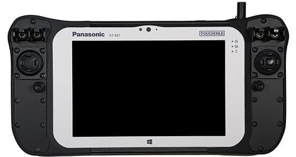

# Налаштування пульта

A [computer joystick](https://en.wikipedia.org/wiki/Joystick) or gamepad connected through _QGroundControl_ can be used to manually control the vehicle (_instead_ of using an [RC Transmitter](../config/radio.md)).

This approach may be used by manual control units that have an integrated ground control station (like the _UAVComponents_ [MicroNav](https://www.uxvtechnologies.com/ground-control-stations/micronav) shown below).
Джойстики також часто використовуються для того, щоб дозволити розробникам літати на транспортному засобі у симуляції.

:::tip
[Radio Setup](../config/radio.md) is not required if using only a joystick (because a joystick is not an RC controller)!
:::

:::info
_QGroundControl_ uses the cross-platform [SDL2](https://www.libsdl.org/index.php) library to convert joystick movements to MAVLink [MANUAL_CONTROL](https://mavlink.io/en/messages/common.html#MANUAL_CONTROL) messages, which are then sent to PX4 over the telemetry channel.
В результаті система керування на основі джойстика потребує надійного телеметричного каналу високої пропускної здатності, щоб забезпечити реагування транспортного засобу на рухи джойстика.
:::

## Увімкнення підтримки джойстика PX4

Information about how to set up a joystick is covered in: [QGroundControl > Joystick Setup](https://docs.qgroundcontrol.com/master/en/qgc-user-guide/setup_view/joystick.html).

Підсумовуючи:

- Open _QGroundControl_
- [Enable a `COM_RC_IN_MODE` mode that allows Joystick](../config/manual_control.md#px4-configuration).
  The default `RC or MAVLink keep first` should work if you plan to only have a Joystick connected.
- Підключіть джойстик
- Configure the connected joystick in: **Vehicle Setup > Joystick**.
