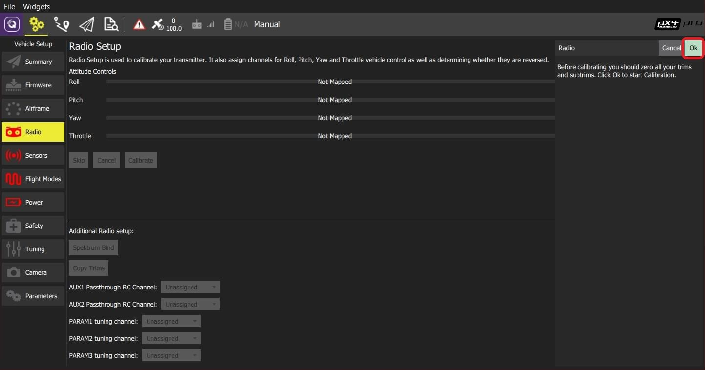
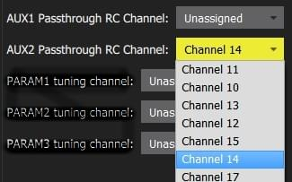

# Налаштування радіомодулів (RC)

The _Radio Setup_ screen is used to configure the mapping of your RC controller's main attitude control sticks (roll, pitch, yaw, throttle) to channels, and to calibrate the minimum, maximum, trim and reverse settings for all other transmitter controls/RC channels.

:::info
A [Joystick](../config/joystick.md) can be used instead of RC for manual control.
The [COM_RC_IN_MODE](../advanced_config/parameter_reference.md#COM_RC_IN_MODE) parameter [can be set](../advanced_config/parameters.md) to define what kind of manual controller(s) are enabled.
:::

## Прив'язка приймача

Щоб калібрувати радіосистему, слід підключити отримувач і передавач.
Процес прив'язки пари передавача та приймача залежить від апаратного забезпечення (дивіться посібник користувача для інструкцій).

:::info
If you are using a _Spektrum_ receiver, you can put it into bind mode using _QGroundControl_, as [shown below](#spectrum-bind).
:::

:::info
If you are using a _FrSky_ receiver, you can bind it with its transmitter, by following instructions [here](https://www.youtube.com/watch?v=1IYg5mQdLVI).
:::

## Виявлення втрат RC

PX4 needs to be able to detect when the signal from the RC controller has been lost in order to be able to take [appropriate safety measures](../config/safety.md#manual-control-loss-failsafe).

У RC приймачів є різні способи визначення втрати сигналу:

- Відсутній вивід (автоматично виявляється PX4)
- Виводиться низький рівень газу (можна налаштувати PX4 для виявлення цього).
- Output the last received signal (_cannot be detected by PX4_ as it looks like valid input).

If your RC receiver does not support outputting no signal on RC loss, you must configure it to set throttle low instead, and set the corresponding value in [RC_FAILS_THR](../advanced_config/parameter_reference.md#RC_FAILS_THR).

Шлях до цього полягає в тому, щоб встановити обрізку пульта керування RC та палицю газу якомога нижче, і використовувати отримане значення ШШІ у PX4 та приймачі (прочитайте посібник з приймача, щоб визначити, як встановити значення втрат RC).
Потім скиньте регулятор тримача педалі назад до його нормального положення.
Цей процес забезпечує, що втрата RC значення знаходиться нижче мінімального значення, виведеного приймачем у нормальній роботі.

:::info
Do not use a receiver that cannot support one of the two supported RC loss detection methods!
:::

## Виконання калібрування

Процес калібрування простий - вас попросять рухати палицями у певному порядку, який показаний на діаграмі передавача у верхньому правому куті екрана.

Для калібрування радіо:

1. Увімкніть ваш передавач RC.

2. Start _QGroundControl_ and connect the vehicle.

3. Select the **Gear** icon (Vehicle Setup) in the top toolbar and then **Radio** in the sidebar.

4. Press **OK** to start the calibration.

   

5. Set the [transmitter mode](../getting_started/rc_transmitter_receiver.md#transmitter_modes) radio button that matches your transmitter (this ensures that _QGroundControl_ displays the correct stick positions for you to follow during calibration).

   

6. Перемістіть палички в позиції, зазначені в тексті (і на зображенні передавача). Press **Next** when the sticks are in position. Повторіть для всіх позицій.

7. When prompted, move all other switches and dials through their full range (you will be able to observe them moving on the _Channel Monitor_).

8. Press **Next** to save the settings.

Radio calibration is demonstrated in the [autopilot setup video here](https://youtu.be/91VGmdSlbo4?t=4m30s) (youtube).

## Додаткове налаштування радіо

Крім калібрування ваших керуючих палиць та інших керувань передавачем, на цьому екрані є кілька додаткових параметрів налаштування радіо, які ви можете знайти корисними.

### Спектральний зв'язок

Щоб калібрувати радіосистему, слід підключити отримувач і передавач. If you have a _Spektrum_ receiver you can put it in _bind mode_ using _QGroundControl_ as shown below (this can be particularly useful if you don't have easy physical access to the receiver on your vehicle).

Для з'єднання передавача/приймача Spektrum:

1. Select the **Spektrum Bind** button

2. Виберіть радіокнопку для вашого отримувача

3. Press **OK**

   

4. Увімкніть ваш передавач Spektrum, утримуючи кнопку зв'язку.

### Копіювати обрізки

Цей параметр використовується для копіювання налаштувань ручного обрізання з вашого радіопередавача, щоб їх можна було автоматично застосовувати в автопілоті. Після цього вам потрібно буде видалити вручну встановлені обрізки.

:::info
Trim settings are used to adjust the roll, pitch, yaw such that when you center the sticks on your remote control, you get stable or level flight (in Stabilized flight mode).
Деякі пультів RC надають ручки обрізки, які дозволяють вам надати зміщення для значення, відправленого пультом RC для кожного положення палиці.
The **Copy Trims** setting here moves the offsets into the autopilot.
:::

Для копіювання обрізів:

1. Select **Copy Trims**.

2. Вирівняйте свої палиці і повністю опустіть ручку газу.

3. Press **Ok**.

   

4. Скиньте обрізки на вашому передавачі назад до нуля.

### Канали AUX Passthrough

Канали AUX passthrough дозволяють вам керувати довільними додатковими апаратними засобами з вашого передавача (наприклад, захват).

Для використання каналів AUX пропуску:

1. Відобразіть до 2 керувань передавачем на окремі канали.
2. Вкажіть ці канали для відображення на портах AUX1 та AUX2 відповідно, як показано нижче.
   Значення зберігаються на транспортний засіб, як тільки вони встановлені.

   

Контролер польоту передасть незмінені значення з вказаних каналів з AUX1/AUX2 до підключених сервоприводів/реле, які керують вашим обладнанням.

### Налаштування параметрів каналів

Налаштування каналів дозволяють вам відображати регулятор налаштування передавача на параметр (щоб ви могли динамічно змінювати параметр з вашого передавача).

:::tip
This feature is provided to enable manual in-flight tuning: [Multicopter PID Tuning Guide](../config_mc/pid_tuning_guide_multicopter.md), [Fixed-wing PID Tuning Guide](../config_fw/pid_tuning_guide_fixedwing.md).
:::

The channels used for parameter tuning are assigned in the _Radio_ setup (here!), while the mapping from each tuning channel to its associated parameter is defined in the _Parameter editor_.

Для налаштування каналів налаштування:

1. Відобразіть до 3 керувань передавачем (регулятори або слайдери) на окремі канали.
2. Select the mapping of _PARAM Tuning Id_ to radio channels, using the selection lists.
   Значення зберігаються на транспортний засіб, як тільки вони встановлені.

   

Для відображення каналу налаштування PARAM на параметр:

1. Open the **Parameters** sidebar.

2. Select the parameter to map to your transmitter (this will open the _Parameter Editor_).

3. Check the **Advanced Settings** checkbox.

4. Click the **Set RC to Param...** button (this will pop-up the foreground dialog displayed below)

   

5. Select the tuning channel to map (1, 2 or 3) from the _Parameter Tuning ID_ selection list.

6. Press **OK** to close the dialog.

7. Press **Save** to save all changes and close the _Parameter Editor_.

:::tip
You can clear all parameter/tuning channel mappings by selecting menu **Tools > Clear RC to Param** at the top right of the _Parameters_ screen.
:::

## Подальша інформація

- [QGroundControl > Radio Control](https://docs.qgroundcontrol.com/master/en/qgc-user-guide/setup_view/radio.html)
- [PX4 Setup Video - @4m30s](https://youtu.be/91VGmdSlbo4?t=4m30s) (Youtube)
- [RC System Selection](../getting_started/rc_transmitter_receiver.md) - Choose a compatible RC system.
