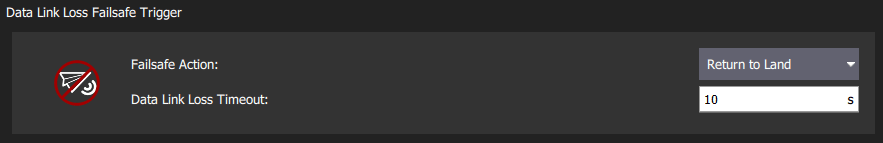

# Safety (Failsafe) Configuration

PX4 має кілька функцій безпеки для захисту та відновлення вашого транспортного засобу в разі виникнення проблем:

- _Failsafes_ allow you to specify areas and conditions under which you can safely fly, and the [action](#failsafe-actions) that will be performed if a failsafe is triggered (for example, landing, holding position, or returning to a specified point).
  The most important failsafe settings are configured in the _QGroundControl_ [Safety Setup](#qgroundcontrol-safety-setup) page.
  Others must be configured via [parameters](../advanced_config/parameters.md).
- [Safety switches](#emergency-switches) on the remote control can be used to immediately stop motors or return the vehicle in the event of a problem.

## Налаштування безпеки QGroundControl

The _QGroundControl_ Safety Setup page is accessed by clicking the _QGroundControl_ icon, **Vehicle Setup**, and then **Safety** in the sidebar.
This includes many of the most important failsafe settings (battery, RC loss etc.) and the settings for the triggered actions _Return_ and _Land_.

## Дії аварійного режиму

When a failsafe is triggered, the default behavior (for most failsafes) is to enter Hold for [COM_FAIL_ACT_T](../advanced_config/parameter_reference.md#COM_FAIL_ACT_T) seconds before performing an associated failsafe action.Це дає користувачу час помітити, що відбувається, і перевизначити аварійний режим, якщо це необхідно.У більшості випадків це можна зробити, використовуючи RC або GCS для перемикання режимів (зверніть увагу, що під час утримання аварійного режиму переміщення пультів RC не спричиняє перезапуску).

Нижче наведений список всіх дій аварійного режиму, впорядкованих за зростанням серйозності.
Зверніть увагу, що різні типи аварійного режиму можуть не підтримувати всі ці дії.

| Дія                                                    | Опис                                                                                                                                                                                                                                                                                                                                                |
| ------------------------------------------------------ | --------------------------------------------------------------------------------------------------------------------------------------------------------------------------------------------------------------------------------------------------------------------------------------------------------------------------------------------------- |
| None/Disabled                     | Немає дій Система аварійного відключення буде ігноруватися.                                                                                                                                                                                                                                                                         |
| Warning                           | A warning message will be sent (i.e. to _QGroundControl_).                                                                                                                                                                                                                       |
| Hold mode                         | The vehicle will enter [Hold mode (MC)](../flight_modes_mc/hold.md) or [Hold mode (FW)](../flight_modes_fw/hold.md) and hover or circle, respectively. Літальні апарати VTOL будуть утримуватися відповідно до їх поточного режиму (MC/FW).                |
| [Return mode][return]           | The vehicle will enter _Return mode_. Return behaviour can be set in the [Return Home Settings](#return-mode-settings) (below).                                                                                                                                                                  |
| Land mode                         | The vehicle will enter [Land mode (MC)](../flight_modes_mc/land.md) or [Land mode (FW)](../flight_modes_fw/land.md), and land. Спочатку VTOL перейде в режим MC.                                                                                                              |
| Disarm                          | Зупиняє мотори негайно.                                                                                                                                                                                                                                                                                                             |
| [Flight termination][flight_term] | Turns off all controllers and sets all PWM outputs to their failsafe values (e.g. [PWM\_MAIN\_FAILn][pwm_main_failn], [PWM\_AUX\_FAILn][pwm_main_failn]). Захисні виходи можуть бути використані для розгортання парашута, шасі або виконання іншої операції. Для літального апарату це може дозволити вам плавно спустити апарат у безпечне місце. |

[flight_term]: ../advanced_config/flight_termination.md
[return]: ../flight_modes/return.md
[pwm_main_failn]: ../advanced_config/parameter_reference.md#PWM_MAIN_FAIL1
[pwm_aux_failn]: ../advanced_config/parameter_reference.md#PWM_AUX_FAIL1

Якщо спрацьовують декілька запобіжників, вживається більш сувора дія.
For example if both RC and GPS are lost, and manual control loss is set to [Return mode](#act_return) and GCS link loss to [Land](#act_land), Land is executed.

:::tip
The exact behavior when different failsafes are triggered can be tested with the [Failsafe State Machine Simulation](safety_simulation.md).
:::

### Налаштування режиму повернення

<!-- Propose replace section by a summary and links - return mode is complicated -->

_Return_ is a common [failsafe action](#failsafe-actions) that engages [Return mode](../flight_modes/return.md) to return the vehicle to the home position.
The default settings for each vehicle are usually suitable, though for fixed wing vehicles you will usually need to define a mission landing.

:::tip
If you want to change the configuration you should carefully read the [Return mode](../flight_modes/return.md) documentation _for your vehicle type_ to understand the options.
:::

QGC allows users to set some aspects of the return mode and landing behaviour, such as the altitude to fly back, and the loiter time if you need to deploy landing gear.

### Налаштування режиму землі

_Land at the current position_ is a common [failsafe action](#failsafe-actions) (in particular for multicopters), that engages [Land Mode](../flight_modes_mc/land.md).
The default settings for each vehicle are usually suitable.

:::tip
If you want to change the configuration you should carefully read the [Land mode](../flight_modes_fw/land.md) documentation _for your vehicle type_ to understand the options.
:::

QGC allows users to set some aspects of the landing behaviour, such as the time to disarm after landing and the descent rate (for multicopters only).

## Battery Failsafes

### Battery level failsafe

The low battery failsafe is triggered when the battery capacity drops below battery failafe level values.
You can configure both the levels and the failsafe actions at each level in QGroundControl.

The most common configuration is to set the values and action as above (with `Warn > Failsafe > Emergency`), and to set the [Failsafe Action](#COM_LOW_BAT_ACT) to warn at "warn level", trigger Return mode at "Failsafe level", and land immediately at "Emergency level".

Налаштування та вибрані параметри показані нижче.

| Налаштування                                        | Параметр                                                                                                                                    | Опис                                                                                                             |
| --------------------------------------------------- | ------------------------------------------------------------------------------------------------------------------------------------------- | ---------------------------------------------------------------------------------------------------------------- |
| Failsafe Action         | [COM_LOW_BAT_ACT](../advanced_config/parameter_reference.md#COM_LOW_BAT_ACT) | Warn, Return, or Land based when capacity drops below the trigger levels.                        |
| Battery Warn Level          | [BAT_LOW_THR](../advanced_config/parameter_reference.md#BAT_LOW_THR)                              | Відсоткова ємність для попереджень (або інших дій).                           |
| Battery Failsafe Level     | [BAT_CRIT_THR](../advanced_config/parameter_reference.md#BAT_CRIT_THR)                            | Відсоткова ємність для дії Повернення (або інших дій, якщо вибрано одну дію). |
| Battery Emergency Level | [BAT_EMERGEN_THR](../advanced_config/parameter_reference.md#BAT_EMERGEN_THR)                      | Відсоткова ємність для спрацьовування дії Land (негайно).                     |

### Flight Time Failsafes

There are several other "battery related" failsafe mechanisms that may be configured using parameters:

- The "remaining flight time for safe return" failsafe ([COM_FLTT_LOW_ACT](#COM_FLTT_LOW_ACT)) is engaged when PX4 estimates that the vehicle has just enough battery remaining for a return mode landing.
  You can configure this to ignore the failsafe, warn, or engage Return mode.
- The "maximum flight time failsafe" ([COM_FLT_TIME_MAX](#COM_FLT_TIME_MAX)) allows you to set a maximum flight time after takeoff, at which the vehicle will automatically enter return mode (it will also "warn" at 90% of this time). This is like a "hard coded" estimate of the total flight time in a battery. The feature is disabled by default.
- The "minimum battery" for arming parameter ([COM_ARM_BAT_MIN](#COM_ARM_BAT_MIN)) prevents arming in the first place if the battery level is below the specified value.

Налаштування та вибрані параметри показані нижче.

| Налаштування                                                         | Параметр                                                                                                                                      | Опис                                                                                                                                                                                                                               |
| -------------------------------------------------------------------- | --------------------------------------------------------------------------------------------------------------------------------------------- | ---------------------------------------------------------------------------------------------------------------------------------------------------------------------------------------------------------------------------------- |
|  Low flight time for safe return action | [COM_FLTT_LOW_ACT](../advanced_config/parameter_reference.md#COM_FLTT_LOW_ACT) | Action when return mode can only just reach safety with remaining battery. `0`: None, `1`: Warning, `3`: Return mode (default). |
|  Maximum flight time failsafe level     | [COM_FLT_TIME_MAX](../advanced_config/parameter_reference.md#COM_FLT_TIME_MAX) | Maximum allowed flight time before Return mode will be engaged, in seconds. `-1`: Disabled (default).                                                           |

## Manual Control Loss Failsafe

The manual control loss failsafe may be triggered if the connection to the [RC transmitter](../getting_started/rc_transmitter_receiver.md) or [joystick](../config/joystick.md) is lost, and there is no fallback.
If using an [RC transmitter](../getting_started/rc_transmitter_receiver.md) this is triggered if the RC [transmitter link is lost](../getting_started/rc_transmitter_receiver.md#set-signal-loss-behaviour).
If using [joysticks](../config/joystick.md) connected over a MAVLink data link, this is triggered if the joysticks are disconnected or the data link is lost.

:::info
PX4 and the receiver may also need to be configured in order to _detect RC loss_: [Radio Setup > RC Loss Detection](../config/radio.md#rc-loss-detection).
:::

The QGCroundControl Safety UI allows you to set the [failsafe action](#failsafe-actions) and [RC Loss timeout](#COM_RC_LOSS_T).
Users that want to disable the RC loss failsafe in specific automatic modes (mission, hold, offboard) can do so using the parameter [COM_RCL_EXCEPT](#COM_RCL_EXCEPT).

Нижче наведено додаткові (і базові) налаштування параметрів.

| Параметр                                                                                                                                                             | Налаштування                                     | Опис                                                                                                                                                                                                                                                                                                                                                                                                                                                                                                                                                     |
| -------------------------------------------------------------------------------------------------------------------------------------------------------------------- | ------------------------------------------------ | -------------------------------------------------------------------------------------------------------------------------------------------------------------------------------------------------------------------------------------------------------------------------------------------------------------------------------------------------------------------------------------------------------------------------------------------------------------------------------------------------------------------------------------------------------- |
| [COM_RC_LOSS_T](../advanced_config/parameter_reference.md#COM_RC_LOSS_T)    | Аварійний режим втрати ручного керування Timeout | Час після отримання останньої встановленої точки від вибраного джерела керування вручну, після якого керування вважається втраченим. Це повинно бути коротким, оскільки транспортний засіб продовжуватиме літати за старими налаштуваннями керування вручну, поки не спрацює таймаут.                                                                                                                                                                                                                                    |
| [COM_FAIL_ACT_T](../advanced_config/parameter_reference.md#COM_FAIL_ACT_T) | Затримка відмови від дії                         | Delay in seconds between failsafe condition being triggered (`COM_RC_LOSS_T`) and failsafe action (RTL, Land, Hold). У цьому стані транспортний засіб очікує в режимі утримання на повторне підключення джерела керування вручну. Це може бути встановлено довше для довгих польотів, щоб втрата інтермітентного з'єднання не викликала негайного виклику аварійного режиму. Це може бути рівним нулю, щоб аварійний запобіжник спрацював негайно. |
| [NAV_RCL_ACT](../advanced_config/parameter_reference.md#NAV_RCL_ACT)                               | Моделювання відмовостійкості                     | Вимкнути, Блукати, Повернутися, Приземлитися, Роззброїти, Завершити.                                                                                                                                                                                                                                                                                                                                                                                                                                                                     |
| [COM_RCL_EXCEPT](../advanced_config/parameter_reference.md#COM_RCL_EXCEPT)                      | Виключення втрат RC                              | Встановіть режими, в яких втрата керування вручну ігнорується: Місія, Утримання, Offboard.                                                                                                                                                                                                                                                                                                                                                                                                                               |

## Втрата каналу зв'язку Failsafe

Збій втрати втрати даних посилання (при переході через телеметрію (підключення до наземної станції) втрачено.

Налаштування та вибрані параметри показані нижче.

| Налаштування                   | Параметр                                                                                                                                | Опис                                                                                  |
| ------------------------------ | --------------------------------------------------------------------------------------------------------------------------------------- | ------------------------------------------------------------------------------------- |
| Тайм-аут втрати каналу зв'язку | [COM_DL_LOSS_T](../advanced_config/parameter_reference.md#COM_DL_LOSS_T) | Час після втрати з'єднання з даними перед тим, як спрацює запобіжник. |
| Моделювання відмовостійкості   | [NAV_DLL_ACT](../advanced_config/parameter_reference.md#NAV_DLL_ACT)                          | Вимкнути, Hold mode, Return mode, Land mode, Роззброїти, Завершити.   |

Також застосовуються наступні налаштування, але вони не відображаються в інтерфейсі QGC.

| Налаштування                                                | Параметр                                                                                                             | Опис                                                                 |
| ----------------------------------------------------------- | -------------------------------------------------------------------------------------------------------------------- | -------------------------------------------------------------------- |
| Mode exceptions for DLL failsafe | [COM_DLL_EXCEPT](../advanced_config/parameter_reference.md#COM_DLL_EXCEPT) | Set modes where DL loss will not trigger a failsafe. |

## Аварійний режим "обмеження зони політів"

The _Geofence Failsafe_ is triggered when the drone breaches a "virtual" perimeter.
У найпростішій формі периметр налаштовується як циліндр, центрований навколо домашньої позиції.
If the vehicle moves outside the radius or above the altitude the specified _Failsafe Action_ will trigger.

:::tip
PX4 separately supports more complicated Geofence geometries with multiple arbitrary polygonal and circular inclusion and exclusion areas: [Flying > Geofence](../flying/geofence.md).
:::

The settings and underlying [geofence parameters](../advanced_config/parameter_reference.md#geofence) are shown below.

| Налаштування                 | Параметр                                                                                                                                    | Опис                                                                                              |
| ---------------------------- | ------------------------------------------------------------------------------------------------------------------------------------------- | ------------------------------------------------------------------------------------------------- |
| Дії у випадку порушення      | [GF_ACTION](../advanced_config/parameter_reference.md#GF_ACTION)                                                       | None, Попередження, Режим утримання, Режим повернення, Припинити, Посадка.        |
| Максимальний радіус          | [GF_MAX_HOR_DIST](../advanced_config/parameter_reference.md#GF_MAX_HOR_DIST) | Горизонтальний радіус циліндра геозони. Геозона вимкнена, якщо 0. |
| Макс. висота | [GF_MAX_VER_DIST](../advanced_config/parameter_reference.md#GF_MAX_VER_DIST) | Висота циліндра геозони. Геозона вимкнена, якщо 0.                |

:::info
Setting `GF_ACTION` to terminate will kill the vehicle on violation of the fence.
Due to the inherent danger of this, this function is disabled using [CBRK_FLIGHTTERM](#CBRK_FLIGHTTERM), which needs to be reset to 0 to really shut down the system.
:::

Також застосовуються наступні налаштування, але вони не відображаються в інтерфейсі QGC.

| Налаштування                                                       | Параметр                                                                                          | Опис                                                                                                                                                                                                                           |
| ------------------------------------------------------------------ | ------------------------------------------------------------------------------------------------- | ------------------------------------------------------------------------------------------------------------------------------------------------------------------------------------------------------------------------------ |
| Geofence source                              | [GF_SOURCE](../advanced_config/parameter_reference.md#GF_SOURCE)             | Встановіть, чи джерело позиції є оціненою глобальною позицією або прямо з пристрою GPS.                                                                                                                        |
| Preemptive geofence triggering              | [GF_PREDICT](../advanced_config/parameter_reference.md#GF_PREDICT)           | (Експериментальний) Спрацьовувати геозону, якщо поточний рух транспортного засобу передбачає спрацьовування порушення (замість пізнього спрацьовування після порушення). |
| Circuit breaker for flight termination | [CBRK_FLIGHTTERM](../advanced_config/parameter_reference.md#CBRK_FLIGHTTERM) | Увімкнення/вимкнення дії припинення польоту (за замовчуванням вимкнено).                                                                                                                    |

## Position (GNSS) Loss Failsafe

The _Position Loss Failsafe_ is triggered if the quality of the PX4 global position estimate falls below acceptable levels (this might be caused by GPS loss) while in a mode that requires an acceptable position estimate.

The failure action is controlled by [COM_POSCTL_NAVL](../advanced_config/parameter_reference.md#COM_POSCTL_NAVL), based on whether RC control is assumed to be available (and altitude information):

- `0`: Remote control available.
  Switch to _Altitude mode_ if a height estimate is available, otherwise _Stabilized mode_.
- `1`: Remote control _not_ available.
  Switch to _Descend mode_ if a height estimate is available, otherwise enter flight termination.
  _Descend mode_ is a landing mode that does not require a position estimate.

Fixed-wing planes, and VTOLs not configured to land in hover ([NAV_FORCE_VT](../advanced_config/parameter_reference.md#NAV_FORCE_VT)), have a parameter ([FW_GPSF_LT](../advanced_config/parameter_reference.md#FW_GPSF_LT)) that defines how long they will loiter (circle with a constant roll angle ([FW_GPSF_R](../advanced_config/parameter_reference.md#FW_GPSF_R)) at the current altitude) after losing position before attempting to land.
If VTOLs have are configured to switch to hover for landing ([NAV_FORCE_VT](../advanced_config/parameter_reference.md#NAV_FORCE_VT)) then they will first transition and then descend.

Відповідні параметри для всіх транспортних засобів наведено нижче.

| Параметр                                                                                                                                           | Опис                                                                                                                                                          |
| -------------------------------------------------------------------------------------------------------------------------------------------------- | ------------------------------------------------------------------------------------------------------------------------------------------------------------- |
| [COM_POSCTL_NAVL](../advanced_config/parameter_reference.md#COM_POSCTL_NAVL) | Position control navigation loss response during mission. Values: `0` - assume use of RC, `1` - Assume no RC. |

Параметри, які впливають лише на повітряні судна з фіксованим крилом:

| Параметр                                                                                                                            | Опис                                                                                                                                                                       |
| ----------------------------------------------------------------------------------------------------------------------------------- | -------------------------------------------------------------------------------------------------------------------------------------------------------------------------- |
| [FW_GPSF_LT](../advanced_config/parameter_reference.md#FW_GPSF_LT) | Час простою (очікування відновлення GPS перед посадкою або припиненням польоту). Установіть значення 0 для відключення. |
| [FW_GPSF_R](../advanced_config/parameter_reference.md#FW_GPSF_R)    | Фіксований кут крену/кочення під час кілочення.                                                                                                            |

## Аварійний режим втрати управління з пульта

The _Offboard Loss Failsafe_ is triggered if the offboard link is lost while under [Offboard control](../flight_modes/offboard.md).
Можна вказати різні дії аварійного режиму в залежності від наявності зв'язку з RC.

Відповідні параметри наведено нижче:

| Параметр                                                                                                                                  | Опис                                                                                                                                                           |
| ----------------------------------------------------------------------------------------------------------------------------------------- | -------------------------------------------------------------------------------------------------------------------------------------------------------------- |
| [COM_OF_LOSS_T](../advanced_config/parameter_reference.md#COM_OF_LOSS_T)   | Затримка після втрати зовнішнього з'єднання перед спрацюванням запобіжника.                                                                    |
| [COM_OBL_RC_ACT](../advanced_config/parameter_reference.md#COM_OBL_RC_ACT) | Запобіжна дія, якщо RC доступний: Режим позиції, Режим висоти, Ручний режим, Режим повернення, Режим посадки, Режим утримання. |

## Аварійний режим уникнення трафіку

The Traffic Avoidance Failsafe allows PX4 to respond to transponder data (e.g. from [ADSB transponders](../advanced_features/traffic_avoidance_adsb.md)) during missions.

Відповідні параметри наведено нижче:

| Параметр                                                                                                               | Опис                                                                                                                       |
| ---------------------------------------------------------------------------------------------------------------------- | -------------------------------------------------------------------------------------------------------------------------- |
| [NAV_TRAFF_AVOID](../advanced_config/parameter_reference.md#NAV_TRAFF_AVOID) | Встановіть дію аварійного режиму: Вимкнено, Попередження, Режим повернення, Режим посадки. |

## Запобіжник Quad-chute

Аварійний режим для випадку, коли БЛА типу VTOL більше не може летіти у режимі фіксованого крила, наприклад, через відмову тягового мотора, датчика швидкості повітря або керованої поверхні.
If the failsafe is triggered, the vehicle will immediately switch to multicopter mode and execute the action defined in parameter [COM_QC_ACT](#COM_QC_ACT).

:::info
The quad-chute can also be triggered by sending a MAVLINK [MAV_CMD_DO_VTOL_TRANSITION](https://mavlink.io/en/messages/common.html#MAV_CMD_DO_VTOL_TRANSITION) message with `param2` set to `1`.
:::

Параметри, які контролюють те, коли спрацює квадро-шнур, перераховані в таблиці нижче.

| Параметр                                                                                                                                                                                        | Опис                                                                                                                                                                                                                                                                                                                                                                                                                                                                                                                                                                                                                                                                                                                                                                                                                                                     |
| ----------------------------------------------------------------------------------------------------------------------------------------------------------------------------------------------- | -------------------------------------------------------------------------------------------------------------------------------------------------------------------------------------------------------------------------------------------------------------------------------------------------------------------------------------------------------------------------------------------------------------------------------------------------------------------------------------------------------------------------------------------------------------------------------------------------------------------------------------------------------------------------------------------------------------------------------------------------------------------------------------------------------------------------------------------------------- |
| [COM_QC_ACT](../advanced_config/parameter_reference.md#COM_QC_ACT)                                                             | Дія чотирьох канатів після переходу на польот на багатокоптер. Can be set to: [Warning](#act_warn), [Return](#act_return), [Land](#act_land), [Hold](#act_hold).                                                                                                                                                                                                                                                                                                                                                                                                                                                                                                                                                                                                                                         |
| [VT_FW_QC_HMAX](../advanced_config/parameter_reference.md#VT_FW_QC_HMAX)                               | Максимальна висота квадрокута, нижче якої не спрацьовує аварійний відпуск квадрокута. Це запобігає швидкому спуску квадрокутника на велику висоту, що може розрядити батарею (і саме це може спричинити крах). Висота є відносною до землі, дому або місцевого походження (за вподобанням, в залежності від доступності).                                                                                                                                                                                                                                                                                                                                                                                                                                          |
| [VT_QC_ALT_LOSS](../advanced_config/parameter_reference.md#VT_QC_ALT_LOSS)                            | Uncommanded descent quad-chute altitude threshold.  In altitude controlled modes, such as [Hold mode](../flight_modes_fw/hold.md), [Position mode](../flight_modes_fw/position.md), [Altitude mode](../flight_modes_fw/altitude.md), or [Mission mode](../flight_modes_fw/mission.md), a vehicle should track its current "commanded" altitude setpoint. Запускається аварійний парашут у випадку, якщо транспортний засіб падає надто далеко нижче заданої точки (на величину, визначену в цьому параметрі).  Зверніть увагу, що аварійний парашут запускається лише у випадку, якщо транспортний засіб постійно втрачає висоту нижче заданої точки; він не запускається, якщо задана точка висоти зростає швидше, ніж може рухатися транспортний засіб. |
| [VT_QC_T_ALT_LOSS](../advanced_config/parameter_reference.md#VT_QC_T_ALT_LOSS) | Поріг втрати висоти для спрацьовування квадропарашута під час переходу VTOL до польоту на фіксованому крилі. Quad-chute спрацьовує, якщо транспортний засіб падає на таку висоту нижче своєї початкової висоти перед завершенням переходу.                                                                                                                                                                                                                                                                                                                                                                                                                                                                                                                                                                               |
| [VT_FW_MIN_ALT](../advanced_config/parameter_reference.md#VT_FW_MIN_ALT)                               | Мінімальна висота над домашнім місцем для польотів на фіксованих крилах. Коли висота падає нижче цієї величини під час польоту на фіксованому крилі, тригерується квадрокупол.                                                                                                                                                                                                                                                                                                                                                                                                                                                                                                                                                                                                                                           |
| [VT_FW_QC_R](../advanced_config/parameter_reference.md#VT_FW_QC_R)                                        | Абсолютний поріг обертання для спрацьовування квадро-шнура в режимі FW.                                                                                                                                                                                                                                                                                                                                                                                                                                                                                                                                                                                                                                                                                                                                                                  |
| [VT_FW_QC_P](../advanced_config/parameter_reference.md#VT_FW_QC_P)                                        | Абсолютний поріг чутливості для виклику квадро-шлюзу у режимі FW.                                                                                                                                                                                                                                                                                                                                                                                                                                                                                                                                                                                                                                                                                                                                                                        |

## High Wind Failsafe

The high wind failsafe can trigger a warning and/or other mode change when the wind speed exceeds the warning and maximum wind-speed threshhold values.
The relevant parameters are listed in the table below.

| Параметр                                                                                                                                                                   | Опис                                                                                                                                                                                                                                                                                                                                                                                                                                                                                 |
| -------------------------------------------------------------------------------------------------------------------------------------------------------------------------- | ------------------------------------------------------------------------------------------------------------------------------------------------------------------------------------------------------------------------------------------------------------------------------------------------------------------------------------------------------------------------------------------------------------------------------------------------------------------------------------ |
| [COM_WIND_MAX](../advanced_config/parameter_reference.md#COM_WIND_MAX)                                  | Wind speed threshold that triggers failsafe action, in m/s ([COM_WIND_MAX_ACT](#COM_WIND_MAX_ACT)).                                                                                                                                                                                                                                                                                |
| [COM_WIND_MAX_ACT](../advanced_config/parameter_reference.md#COM_WIND_MAX_ACT) | High wind failsafe action (following [COM_WIND_MAX](#COM_WIND_MAX) trigger). Can be set to: `0`: None (Default), `1`: [Warning](#act_warn), `2`: [Hold](#act_hold), `3`: [Return](#act_return), `4`: [Terminate](#act_term), `5`: [Land](#act_land). |
| [COM_WIND_WARN](../advanced_config/parameter_reference.md#COM_WIND_WARN)                               | Wind speed threshold that triggers periodic failsafe warning.                                                                                                                                                                                                                                                                                                                                                                                                        |

## Виявлення відмов

Детектор відмов дозволяє автомобілю вжити захисних заходів, якщо він несподівано перевертається, або якщо йому повідомлено зовнішньою системою виявлення відмов.

During **flight**, the failure detector can be used to trigger [flight termination](../advanced_config/flight_termination.md) if failure conditions are met, which may then launch a [parachute](../peripherals/parachute.md) or perform some other action.

:::info
Failure detection during flight is deactivated by default (enable by setting the parameter: [CBRK_FLIGHTTERM=0](#CBRK_FLIGHTTERM)).
:::

During **takeoff** the failure detector [attitude trigger](#attitude-trigger) invokes the [disarm action](#act_disarm) if the vehicle flips (disarm kills the motors but, unlike flight termination, will not launch a parachute or perform other failure actions).
Note that this check is _always enabled on takeoff_, irrespective of the `CBRK_FLIGHTTERM` parameter.

The failure detector is active in all vehicle types and modes, except for those where the vehicle is _expected_ to do flips (i.e. [Acro mode (MC)](../flight_modes_mc/altitude.md), [Acro mode (FW)](../flight_modes_fw/altitude.md), and [Manual (FW)](../flight_modes_fw/manual.md)).

### Тригер висоти

Детектор відмов може бути налаштований на спрацьовування, якщо стан автомобіля перевищує попередньо визначені значення крена та кочення протягом певного часу.

Відповідні параметри наведено нижче:

| Параметр                                                                                                                                                             | Опис                                                                                                                                                                                 |
| -------------------------------------------------------------------------------------------------------------------------------------------------------------------- | ------------------------------------------------------------------------------------------------------------------------------------------------------------------------------------ |
| [CBRK_FLIGHTTERM](../advanced_config/parameter_reference.md#CBRK_FLIGHTTERM)                                        | Вимикач відключення польоту. Скасуйте з 121212 (типово), щоб увімкнути завершення польоту через виявлення відмови або втрату FMU. |
| [FD_FAIL_P](../advanced_config/parameter_reference.md#FD_FAIL_P)                                     | Максимальний допустимий кут нахилу (в градусах).                                                                                                  |
| [FD_FAIL_R](../advanced_config/parameter_reference.md#FD_FAIL_R)                                     | Максимальний допустимий кут крену (в градусах).                                                                                                   |
| [FD_FAIL_P_TTRI](../advanced_config/parameter_reference.md#FD_FAIL_P_TTRI) | Time to exceed [FD_FAIL_P](#FD_FAIL_P) for failure detection (default 0.3s).            |
| [FD_FAIL_R_TTRI](../advanced_config/parameter_reference.md#FD_FAIL_R_TTRI) | Time to exceed [FD_FAIL_R](#FD_FAIL_R) for failure detection (default 0.3s).            |

### Зовнішня автоматична система тригерування (ATS)

The [failure detector](#failure-detector), if [enabled](#CBRK_FLIGHTTERM), can also be triggered by an external ATS system.
Зовнішня система тригера повинна бути підключена до порту керування польотом AUX5 (або MAIN5 на платах, які не мають додаткових портів), і налаштовується за допомогою наведених нижче параметрів.

:::info
External ATS is required by [ASTM F3322-18](https://webstore.ansi.org/Standards/ASTM/ASTMF332218).
One example of an ATS device is the [FruityChutes Sentinel Automatic Trigger System](https://fruitychutes.com/uav_rpv_drone_recovery_parachutes/sentinel-automatic-trigger-system.htm).
:::

| Параметр                                                                                                                                                                | Опис                                                                                                                                                                                                                                                                    |
| ----------------------------------------------------------------------------------------------------------------------------------------------------------------------- | ----------------------------------------------------------------------------------------------------------------------------------------------------------------------------------------------------------------------------------------------------------------------- |
| [FD_EXT_ATS_EN](../advanced_config/parameter_reference.md#FD_EXT_ATS_EN)       | Увімкніть введення ШІМ на AUX5 або MAIN5 (в залежності від плати) для активації аварійного режиму зовнішньою автоматичною системою спрацювання (ATS). За замовчуванням: Вимкнено. |
| [FD_EXT_ATS_TRIG](../advanced_config/parameter_reference.md#FD_EXT_ATS_TRIG) | Поріг ШІМ для зовнішньої системи автоматичного спрацювання аварійного режиму. Значення за замовчуванням: 1900 мс.                                                                                                       |

## Перевірки можливостей місії

A number of checks are run to ensure that a mission can only be started if it is _feasible_.
Наприклад, перевірки забезпечують, що перший пункт маршруту не занадто віддалений, і що маршрут місії не конфліктує з жодними геозахистами.

As these are not strictly speaking "failsafes" they are documented in [Mission Mode (FW) > Mission Feasibility Checks](../flight_modes_fw/mission.md#mission-feasibility-checks) and [Mission Mode (MC) > Mission Feasibility Checks](../flight_modes_mc/mission.md#mission-feasibility-checks).

## Перемикачі екстренного виклику

Remote control switches can be configured (as part of _QGroundControl_ [Flight Mode Setup](../config/flight_mode.md)) to allow you to take rapid corrective action in the event of a problem or emergency; for example, to stop all motors, or activate [Return mode](#return-switch).

Цей розділ перелічує доступні аварійні вимикачі.

### Перемикач вимкнення

A kill switch immediately stops all motor outputs — if flying, the vehicle will start to fall!

[By default](#COM_KILL_DISARM) the motors will restart if the switch is reverted within 5 seconds, after which the vehicle will automatically disarm, and you will need to arm it again in order to start the motors.

| Параметр                                                                                                                                           | Опис                                                                                                                            |
| -------------------------------------------------------------------------------------------------------------------------------------------------- | ------------------------------------------------------------------------------------------------------------------------------- |
| [COM_KILL_DISARM](../advanced_config/parameter_reference.md#COM_KILL_DISARM) | Timeout value for disarming after kill switch is engaged. Default: `5` seconds. |

:::info
There is also a [Kill Gesture](#kill-gesture), which cannot be reverted.
:::

### Перемикач увімкнення/вимкнення

The arm/disarm switch is a _direct replacement_ for the default stick-based arming/disarming mechanism (and serves the same purpose: making sure there is an intentional step involved before the motors start/stop).
Це може бути використано замість механізму за замовчуванням через те, що:

- Про перевагу перемикача над палицею.
- Це допомагає уникнути випадкового спрацьовування озброєння/роззброєння у повітрі за певним рухом палиці.
- Немає затримки (він реагує миттєво).

The arm/disarm switch immediately disarms (stop) motors for those [flight modes](../flight_modes/index.md#flight-modes) that _support disarming in flight_.
Це включає:

- _Manual mode_
- _Acro mode_
- _Stabilized_

Для режимів, які не підтримують вимикання в повітрі, перемикач ігнорується під час польоту, але може бути використаний після виявлення посадки.
This includes _Position mode_ and autonomous modes (e.g. _Mission_, _Land_ etc.).

:::info
[Auto disarm timeouts](#auto-disarming-timeouts) (e.g. via [COM_DISARM_LAND](#COM_DISARM_LAND)) are independent of the arm/disarm switch - ie even if the switch is armed the timeouts will still work.
:::

<!--
**Note** This can also be done by [manually setting](../advanced_config/parameters.md) the [RC_MAP_ARM_SW](../advanced_config/parameter_reference.md#RC_MAP_ARM_SW) parameter to the corresponding switch RC channel.
  If the switch positions are reversed, change the sign of the parameter [RC_ARMSWITCH_TH](../advanced_config/parameter_reference.md#RC_ARMSWITCH_TH) (or also change its value to alter the threshold value).
-->

### Перемикач повернення

A return switch can be used to immediately engage [Return mode](../flight_modes/return.md).

## Kill Gesture

A kill gesture immediately stops all motor outputs — if flying, the vehicle will start to fall!

The action cannot be reverted without a reboot (this differs from a [Kill Switch](#kill-switch), where the operation can be reverted within the time period defined by [COM_KILL_DISARM](#COM_KILL_DISARM)).

| Параметр                                                                                                                                                                | Опис                                                                                                                                                                    |
| ----------------------------------------------------------------------------------------------------------------------------------------------------------------------- | ----------------------------------------------------------------------------------------------------------------------------------------------------------------------- |
| [MAN_KILL_GEST_T](../advanced_config/parameter_reference.md#MAN_KILL_GEST_T) | Time to hold sticks in gesture position before killing the motors. Default: `-1` seconds (Disabled). |

## Arming/Disarming Settings

The [commander module](../advanced_config/parameter_reference.md#commander) has a number of parameters prefixed with `COM_ARM` that configure whether the vehicle can arm at all, and under what conditions (note that some parameters named with the prefix `COM_ARM` are used to arm other systems).
Parameters prefixed with `COM_DISARM_` affect disarming behaviour.

### Auto-Disarming Timeouts

Ви можете встановити таймаути для автоматичного вимкнення транспортного засобу, якщо він занадто повільно збирається на зліт і/або після посадки (вимкнення транспортного засобу вимикає живлення моторів, тому пропелери не будуть обертатися).

The [relevant parameters](../advanced_config/parameters.md) are shown below:

| Параметр                                                                                                                                              | Опис                                                                                                           |
| ----------------------------------------------------------------------------------------------------------------------------------------------------- | -------------------------------------------------------------------------------------------------------------- |
| [COM_DISARM_LAND](../advanced_config/parameter_reference.md#COM_DISARM_LAND)    | Тайм-аут для автоматичного роззброєння після посадки.                                          |
| [COM_DISARM_PRFLT](../advanced_config/parameter_reference.md#COM_DISARM_PRFLT) | Тайм-аут для автоматичної роззброєння,  якщо транспортний засіб занадто повільно піднімається. |

### Arming Pre-Conditions

These parameters can be used to set conditions that prevent arming.

| Параметр                                                                                                                                                                   | Опис                                                                                                                                                                                                                                                                                                                                                                |
| -------------------------------------------------------------------------------------------------------------------------------------------------------------------------- | ------------------------------------------------------------------------------------------------------------------------------------------------------------------------------------------------------------------------------------------------------------------------------------------------------------------------------------------------------------------- |
| [COM_ARMABLE](../advanced_config/parameter_reference.md#COM_ARMABLE)                                                          | Enable arming (at all). `0`: Disabled, `1`: Enabled (default).                                                                                                                                                                                                |
| [COM_ARM_BAT_MIN](../advanced_config/parameter_reference.md#COM_ARM_BAT_MIN)    | Minimum battery level for arming. `0`: Disabled (default). Values: `0`-`0.9`,                                                                                                                                                                                                    |
| [COM_ARM_WO_GPS](../advanced_config/parameter_reference.md#COM_ARM_WO_GPS)       | Enable arming without GPS. `0`: Disabled, `1`: Enabled (default).                                                                                                                                                                                                                |
| [COM_ARM_MIS_REQ](../advanced_config/parameter_reference.md#COM_ARM_MIS_REQ)    | Require valid mission to arm. `0`: Disabled (default), `1`: Enabled .                                                                                                                                                                                                            |
| [COM_ARM_SDCARD](../advanced_config/parameter_reference.md#COM_ARM_SDCARD)                            | Require SD card to arm. `0`: Disabled (default), `1`: Warning, `2`: Enabled.                                                                                                                                                                                     |
| [COM_ARM_AUTH_REQ](../advanced_config/parameter_reference.md#COM_ARM_AUTH_REQ) | Requires arm authorisation from an external (MAVLink) system. Flag to allow arming (at all). `1`: Enabled, `0`: Disabled (default). Associated configuration parameters are prefixed with `COM_ARM_AUTH_`. |
| [COM_ARM_ODID](../advanced_config/parameter_reference.md#COM_ARM_ODID)                                  | Require healthy Remote ID system to arm. `0`: Disabled (default), `1`: Warning, `2`: Enabled.                                                                                                                                                                    |

In addition there are a number of parameters that configure system and sensor limits that make prevent arming if exceeded: [COM_CPU_MAX](../advanced_config/parameter_reference.md#COM_CPU_MAX), [COM_ARM_IMU_ACC](../advanced_config/parameter_reference.md#COM_ARM_IMU_ACC), [COM_ARM_IMU_GYR](../advanced_config/parameter_reference.md#COM_ARM_IMU_GYR), [COM_ARM_MAG_ANG](../advanced_config/parameter_reference.md#COM_ARM_MAG_ANG), [COM_ARM_MAG_STR](../advanced_config/parameter_reference.md#COM_ARM_MAG_STR).

## Подальша інформація

- [QGroundControl User Guide > Safety Setup](https://docs.qgroundcontrol.com/master/en/qgc-user-guide/setup_view/safety.html)
