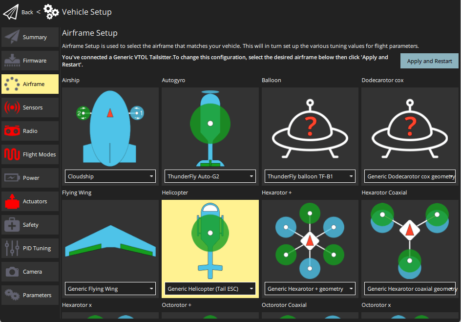
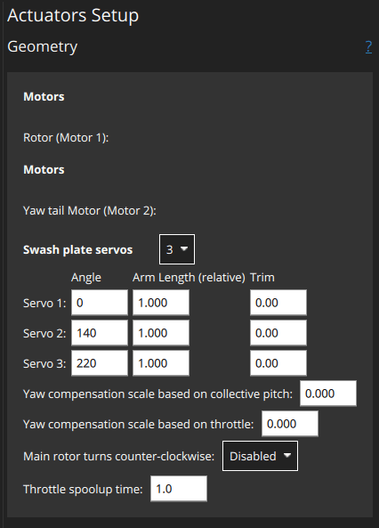
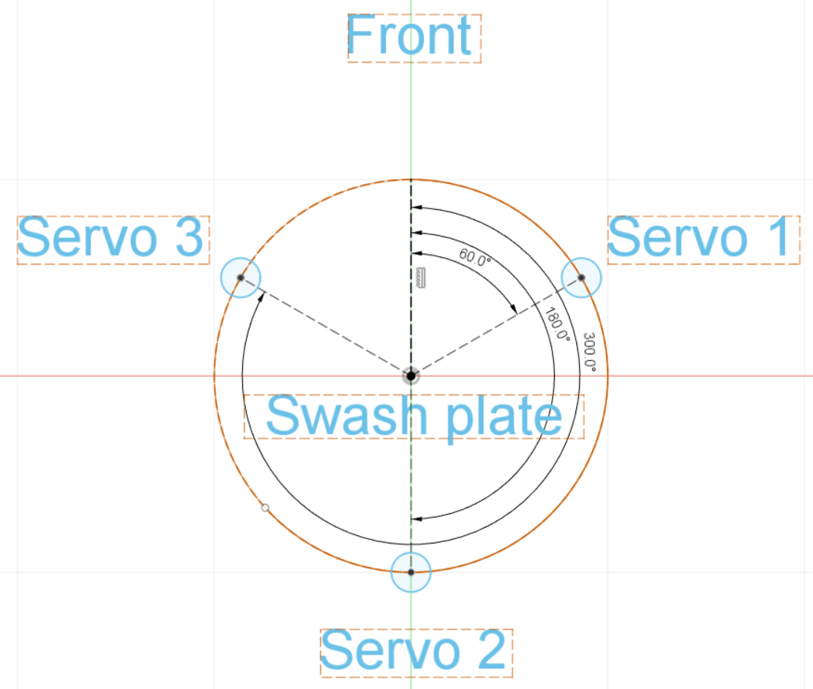

# Конфігурація гелікоптера

This section contains topics related to [helicopter](../frames_helicopter/index.md) configuration and tuning.

## Підтримувані конфігурації

Підтримувані конфігурації вертольоту:

- Однокрил з одним основним ротором, який керується планкою крена за допомогою до 4 сервоприводів планки крена і механічно роз'єднаний хвостовий ротор, що приводиться в рух за допомогою ESC.
- Однокрил з одним основним ротором, керований планкою крена за допомогою до 4 сервоприводів планки крена і механічно зв'язаний хвостовий ротор, керований сервоприводом.

Підтримувані польотні операції/функції:

- Те саме, що і мультикоптер.
- На момент написання статті автономні/керовані тривимірні польоти з негативною тягою неможливі.

## Установка

Щоб налаштувати та сконфігурувати гелікоптер:

1. Select a helicopter [Airframe](../config/airframe.md) in QGroundControl.
   At time of writing there is only _Generic Helicopter (Tail ESC)_ in the Helicopter group.
   This will configure the helicopter frame with a mechanically uncoupled tail ([CA_AIRFRAME](../advanced_config/parameter_reference.md#CA_AIRFRAME): `10: Helicopter (tail ESC)`).

   

   ::: info
   There is no separate airframe for the helicopter with tail servo.
   To select this configuration, set the parameter [CA_AIRFRAME](../advanced_config/parameter_reference.md#CA_AIRFRAME) to _Helicopter (tail Servo)_.
   Потім екран конфігурації приводу зміниться для підтримки цього типу рами.

:::

2. Configure helicopter actuator geometry in **Vehicle Setup > Actuators**.

   ::: info
   Actuator setup and testing is covered for most frames in [Actuators](../config/actuators.md).
   Хоча це згадується нижче, це основна тема для інформації про налаштування гелікоптера.

:::

   The geometry for a [Generic Helicopter - with Tail ESC](../airframes/airframe_reference.md#copter_helicopter_generic_helicopter_%28tail_esc%29) is shown below.

   

   Мотори не мають геометрії, що налаштовується:

   - `Rotor (Motor 1)`: The main rotor
   - `Yaw tail motor (Motor 2)`: The tail rotor

   Swash plate servos: `3` | `4` <!-- 4 provides additional stability -->

   Для кожного набору сервоприводів:

   - `Angle`: Clockwise angle in degree on the swash plate circle at which the servo arm is attached starting from `0` pointing forwards.
      Приклад для типової настройки, де три сервопривода керують планкою рівномірно розподіленою по колу (360° / 3 =) по 120° кожен, що призводить до наступних кутів:

      | #       | Кут  |
      | ------- | ---- |
      | Servo 1 | 60°  |
      | Servo 2 | 180° |
      | Servo 3 | 300° |

      

   - `Arm Length (relative to each other)`: Radius from the swash plate center (top view). Коротше плече означає, що та ж сама рух сервопривода зміщує плиту більше. Це дозволяє отримати компенсацію автопілоту.

   - `Trim`: Offset individual servo positions. Це потрібно лише у випадках, коли кронштейн рушія не рівний, навіть якщо всі сервоприводи налаштовані в центр.

   Додаткові налаштування:

   - `Yaw compensation scale based on collective pitch`: How much yaw is feed forward compensated based on the current collective pitch.
   - `Main rotor turns counter-clockwise`: `Disabled` (clockwise rotation) | `Enabled`
   - `Throttle spoolup time`: Set value (in seconds) greater than the achievable minimum motor spool up time.
      Більше значення може поліпшити зручність користувача.

3. Видаліть лопаті ротора та пропелери

4. Assign motors and servos to outputs and test (also in [Actuator configuration](../config/actuators.md)):

   1. Assign the [motors and servos to the outputs](../config/actuators.md#actuator-outputs).
   2. Power the vehicle with a battery and use the [actuator testing sliders](../config/actuators.md#actuator-testing) to validate correct servo and motor assignment and direction.

5. Using an RC in [Acro mode](../flight_modes_mc/acro.md), verify the correct movement of the swash-plate. Для більшості планерів вам потрібно побачити наступне:

   - Переміщення ручки крена вправо повинно нахиляти кронштейн рушія вправо.
   - Переміщення ручки крена вперед повинно нахиляти кронштейн рушія вперед.

   У разі, якщо ваша конструкція вимагає будь-якого зміщення кута фазового запізнення, це можна просто додати до всіх кутів кронштейна рушія. Зверніться до документації виробника вашої конструкції.

6. Увімкніть транспортний засіб і перевірте, що головний ротор починає повільно обертатися.
   Adjust the throttle spoolup time as needed using the parameter [COM_SPOOLUP_TIME](../advanced_config/parameter_reference.md#COM_SPOOLUP_TIME).
   You can also adjust the throttle curve with the parameters [CA_HELI_THR_Cx](../advanced_config/parameter_reference.md#CA_HELI_THR_C0).
   За замовчуванням встановлено постійний, максимальний газ (підходить для більшості налаштувань).

7. Знову вимкніть зброювання і вимкніть живлення.

8. Встановіть лопаті ротора і включіть живлення транспортного засобу.

9. Configure the collective pitch curve using the parameters [CA_HELI_PITCH_Cx](../advanced_config/parameter_reference.md#CA_HELI_PITCH_C0).
   Встановіть мінімум і максимум відповідно до мінімального і максимального кутів лопатей, які вам потрібно.
   Переконайтеся, що мінімум достатньо низький, щоб транспортний засіб все ще міг опускатися.
   Замість цього, почніть з надто низького значення.
   За цю причину за замовчуванням встановлено трохи негативне значення і повинно бути гарною вихідною точкою.

## Вдосконалення

Після завершення попередніх кроків ви готові до озброєння з встановленими лопатями.

First tune the [rate controller](#rate-controller) and [yaw compensation](#yaw-compensation) as shown in the following sections (these are helicopter-specific).

Attitude, velocity, and position controller tuning is then performed in the [same as for multicopters](../config_mc/index.md).

Зверніть увагу, що автоматичне налаштування не підтримується/не тестується (на момент написання).

### Компенсація повороту

Оскільки компенсація крутного моменту повороту має вирішальне значення для стабільного зависання вертольота, спочатку потрібно виконати грубу конфігурацію. Для точного налаштування цей розділ можна переглянути, коли контролер швидкості запрацює належним чином.

Найважливіше встановіть напрямок обертання вашого основного ротора, який за замовчуванням є за годинниковою стрілкою, якщо дивитися згори планера. In case yours turns counter-clockwise set [CA_HELI_YAW_CCW](../advanced_config/parameter_reference.md#CA_HELI_YAW_CCW) to 1.

There are two parameters to compensate yaw for the main rotor's collective and throttle:
[CA_HELI_YAW_CP_S](../advanced_config/parameter_reference.md#CA_HELI_YAW_CP_S)
[CA_HELI_YAW_TH_S](../advanced_config/parameter_reference.md#CA_HELI_YAW_TH_S)

Потрібне від'ємне значення, коли позитивний тяговий зусилля хвостового ротора обертає транспортний засіб у протилежному напрямку від напрямку обертання головного ротора.

### Контролер швидкості

The rate controller should be tuned in [Acro mode](../flight_modes_mc/acro.md), but can also be done in [Stabilized mode](../flight_modes_mc/manual_stabilized.md) if you cannot fly Acro mode.

1. Почніть з вимкнених коефіцієнтів контролера швидкості та лише невеликим зворотнім зв'язком передбачуваної відповіді:

   ```sh
   param set MC_ROLLRATE_P 0
   param set MC_ROLLRATE_I 0
   param set MC_ROLLRATE_D 0
   param set MC_ROLLRATE_FF 0.1
   param set MC_PITCHRATE_P 0
   param set MC_PITCHRATE_I 0
   param set MC_PITCHRATE_D 0
   param set MC_PITCHRATE_FF 0.1
   ```

2. Підніміться повільно і зробіть кілька рухів рулями.
   Використовуйте інтерфейс настройки QGC, щоб перевірити відповідь:

   

   Increase the roll and pitch feed forward gains [MC_ROLLRATE_FF](../advanced_config/parameter_reference.md#MC_ROLLRATE_FF), [MC_PITCHRATE_FF](../advanced_config/parameter_reference.md#MC_PITCHRATE_FF) until the response reaches the setpoint when giving a step input.

3. Потім увімкніть посилення PID.
   Почніть із таких значень:

   - [MC_ROLLRATE_P](../advanced_config/parameter_reference.md#MC_ROLLRATE_P), [MC_PITCHRATE_P](../advanced_config/parameter_reference.md#MC_PITCHRATE_P) a quarter of the value you found to work well as the corresponding feed forward value in the previous step. `P = FF / 4`

   ```sh
   param set MC_ROLLRATE_I 0.2
   param set MC_PITCHRATE_I 0.2
   param set MC_ROLLRATE_D 0.001
   param set MC_PITCHRATE_D 0.001
   ```

   Then increase the `P` and `D` gains as needed until it tracks well.
   It is expected that the `P` gain is considerably smaller than the `FF` gain.
