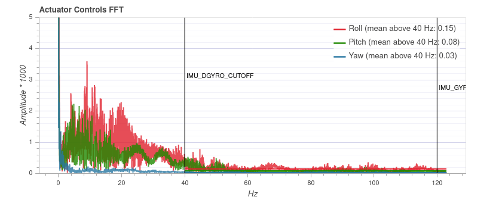
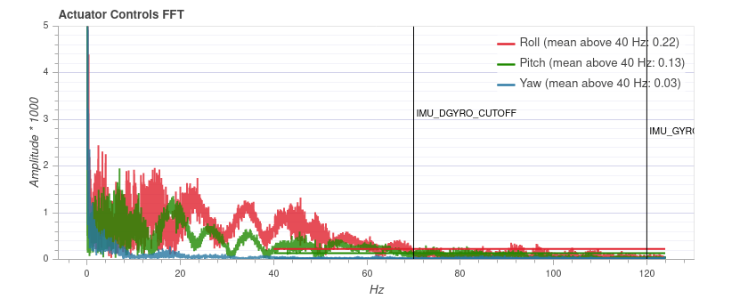
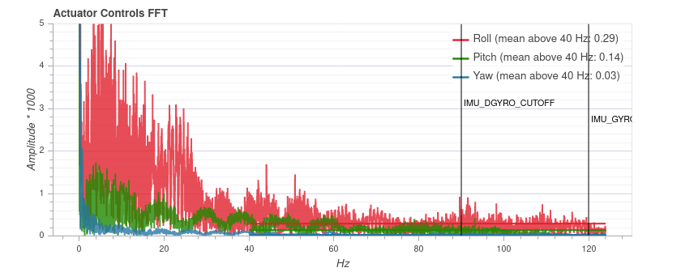
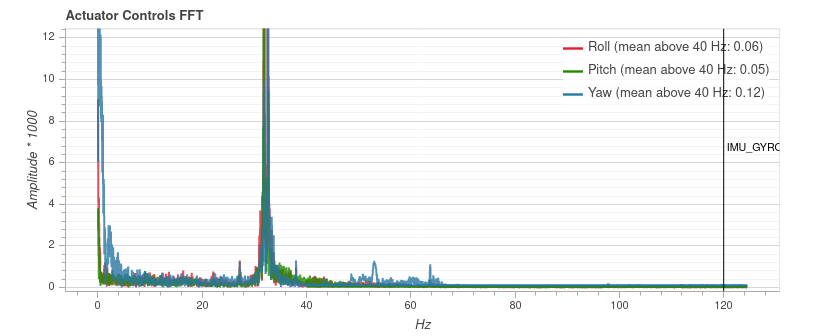

# MC Filter Tuning & Control Latency

Filters can be used to trade off [control latency](#control-latency), which affects flight performance, and noise filtering, which impacts both flight performance and motor health.

Ця тема надає огляд затримки управління та настройки фільтрів в PX4.

:::info
Before filter tuning you should do a first pass at [Basic MC PID tuning](../config_mc/pid_tuning_guide_multicopter_basic.md).
The vehicle needs to be undertuned (the **P** and **D** gains should be set too low), such that there are no oscillations from the controller that could be interpreted as noise (the default gains might be good enough).
:::

## Затримка керування

The _control latency_ is the delay from a physical disturbance of the vehicle until the motors react to the change.

:::tip
Lowering latency allows you to increase the rate **P** gains, which results in better flight performance.
Навіть різниця в один мілісекунд може мати значний вплив.
:::

Наступні фактори впливають на затримку керування:

- М'яка конструкція або м'яка амортизація вібрацій збільшує затримку (вони діють як фільтр).
- Нижні фільтри у програмному забезпеченні та на мікросхемі датчика вимірювання компенсують збільшену затримку для покращеного фільтрування шуму.
- Внутрішні складові програмного забезпечення PX4: сигнали датчиків потрібно зчитати у драйвері, а потім пройти через контролер до виходного драйвера.
- The maximum gyro publication rate (configured with [IMU_GYRO_RATEMAX](../advanced_config/parameter_reference.md#IMU_GYRO_RATEMAX)).
  Вища частота знижує затримку, але вимагає більше обчислювальних ресурсів / може викликати голодування інших процесів.
  Частота 4 кГц або вище рекомендується лише для контролерів з процесором STM32H7 або новіше (значення 2 кГц близьке до межі для менш потужних процесорів).
- The IO chip (MAIN pins) adds about 5.4 ms latency compared to using the AUX pins (this does not apply to a _Pixracer_ or _Omnibus F4_, but does apply to a Pixhawk).
  Щоб уникнути затримки введення-виведення, підключіть мотори до додаткових контактів замість головних.
- PWM output signal: enable [Dshot](../peripherals/dshot.md) by preference to reduce latency (or One-Shot if DShot is not supported).
  The protocol is selected for a group of outputs during [Actuator Configuration](../config/actuators.md).

Нижче ми розглянемо вплив нижніх фільтрів.

## Фільтри

The filtering pipeline for the controllers in PX4 is described below.

:::info
Sampling and filtering is always performed at the full raw sensor rate (commonly 8kHz, depending on the IMU).
:::

### On-chip DLPF for the Gyro Sensor

This is disabled on all chips where it can be disabled (if not, cutoff frequency is set to the highest level of the chip).

### Notch Filters

Настройки, які мають значний спад нижньочастотного шуму (наприклад, через гармоніки на частоті проходження лопаток ротора), можуть вигідно використовувати фільтр вирівнювання, щоб очистити сигнал перед його подачею на фільтр нижніх частот (ці гармоніки мають схожий шкідливий вплив на двигуни, як і інші джерела шуму).

Without the notch filter you'd have to set the low pass filter cutoff much lower (increasing the phase lag) in order to avoid passing this noise to the motors.

#### Static Notch Filters

One or two static notch filters on the gyro sensor data that are used to filter out narrow band noise, for example a bending mode of the airframe.

The static notch filters can be configured using:

- First notch filter: [IMU_GYRO_NF0_BW](../advanced_config/parameter_reference.md#IMU_GYRO_NF0_BW) and [IMU_GYRO_NF0_FRQ](../advanced_config/parameter_reference.md#IMU_GYRO_NF0_FRQ).
- Second notch filter: [IMU_GYRO_NF1_BW](../advanced_config/parameter_reference.md#IMU_GYRO_NF1_BW) and [IMU_GYRO_NF1_FRQ](../advanced_config/parameter_reference.md#IMU_GYRO_NF1_FRQ).

:::info
Only two notch filters are provided.
Airframes with more than two frequency noise spikes typically clean the first two spikes with the notch filters, and subsequent spikes using the low pass filter.
:::

#### Dynamic Notch Filters

Dynamic notch filters use ESC RPM feedback and/or the onboard FFT analysis.
The ESC RPM feedback is used to track the rotor blade pass frequency and its harmonics, while the FFT analysis can be used to track a frequency of another vibration source, such as a fuel engine.

ESC RPM feedback requires ESCs capable of providing RPM feedback such as [DShot](../peripherals/esc_motors.md#dshot) with telemetry connected, a bidirectional DShot set up ([work in progress](https://github.com/PX4/PX4-Autopilot/pull/23863)), or [UAVCAN/DroneCAN ESCs](../dronecan/escs.md).
Before enabling, make sure that the ESC RPM is correct.
You might have to adjust the [pole count of the motors](../advanced_config/parameter_reference.md#MOT_POLE_COUNT).

The following parameters should be set to enable and configure dynamic notch filters:

| Параметр                                                                                                                                                                     | Опис                                                                                                                                     |
| ---------------------------------------------------------------------------------------------------------------------------------------------------------------------------- | ---------------------------------------------------------------------------------------------------------------------------------------- |
| [IMU_GYRO_DNF_EN](../advanced_config/parameter_reference.md#IMU_GYRO_DNF_EN)    | Enable IMU gyro dynamic notch filtering. `0`: ESC RPM, `1`: Onboard FFT. |
| [IMU_GYRO_FFT_EN](../advanced_config/parameter_reference.md#IMU_GYRO_FFT_EN)    | Enable onboard FFT (required if `IMU_GYRO_DNF_EN` is set to `1`).                                     |
| [IMU_GYRO_DNF_MIN](../advanced_config/parameter_reference.md#IMU_GYRO_DNF_MIN) | Minimum dynamic notch frequency in Hz.                                                                                   |
| [IMU_GYRO_DNF_BW](../advanced_config/parameter_reference.md#IMU_GYRO_DNF_BW)    | Bandwidth for each notch filter in Hz.                                                                                   |
| [IMU_GYRO_DNF_HMC](../advanced_config/parameter_reference.md#IMU_GYRO_NF0_BW)  | Number of harmonics to filter.                                                                                           |

### Low-pass Filter

A low pass filter on the gyro data can be configured with the [IMU_GYRO_CUTOFF](../advanced_config/parameter_reference.md#IMU_GYRO_CUTOFF) parameter.

Для зменшення затримки керування ми хочемо збільшити частоту відсічки для фільтрів нижніх частот.
The effect on latency of increasing `IMU_GYRO_CUTOFF` is approximated below.

| Cutoff (Hz) | Затримка (мс) |
| ------------------------------ | -------------------------------- |
| 30                             | 8                                |
| 60                             | 3.8              |
| 120                            | 1.9              |

However this is a trade-off as increasing `IMU_GYRO_CUTOFF` will also increase the noise of the signal that is fed to the motors.
Шум на двигунах має наступні наслідки:

- Двигуни та регулятори обертання можуть нагріватися до такого рівня, коли вони пошкоджуються.
- Зменшення часу польоту, оскільки двигуни постійно змінюють свою швидкість.
- Видимі випадкові невеликі дрібні подергування.

### Low-pass Filter on D-term

Термін D найбільш схильний до шуму, при цьому незначне збільшення затримки не негативно впливає на продуктивність.
For this reason the D-term has a separately-configurable low-pass filter, [IMU_DGYRO_CUTOFF](../advanced_config/parameter_reference.md#IMU_DGYRO_CUTOFF).

### Slew-rate Filter on Motor Outputs

An optional slew-rate filter on the motor outputs.
This rate may be configured as part of the [Multicopter Geometry](../config/actuators.md#motor-geometry-multicopter) when configuring actuators (which in turn modifies the [CA_Rn_SLEW](../advanced_config/parameter_reference.md#CA_R0_SLEW) parameters for each motor `n`).

## Налаштування фільтра

:::info
Найкращі налаштування фільтра залежать від транспортного засобу.
За замовчуванням вони налаштовані консервативно - так, щоб вони працювали і на менш якісних налаштуваннях.
:::

First make sure to have the high-rate logging profile activated ([SDLOG_PROFILE](../advanced_config/parameter_reference.md#SDLOG_PROFILE) parameter).
[Flight Review](../getting_started/flight_reporting.md) will then show an FFT plot for the roll, pitch and yaw controls.

:::warning

- Не намагайтеся виправити транспортний засіб, який страждає від високих вібрацій, за допомогою налаштування фільтра!
  Замість цього виправте налаштування апаратного забезпечення транспортного засобу.
- Переконайтеся, що коефіцієнти PID, зокрема D, не встановлені занадто високо, оскільки це може виявитися як вібрації.

:::

Налаштування фільтрування найкраще виконувати, переглядаючи журнали польотів.
Ви можете зробити кілька польотів один за одним з різними параметрами, а потім перевірити всі журнали, але переконайтеся, що роззброїлись між ними, щоб створювалися окремі файли журналів.

The performed flight manoeuvre can simply be hovering in [Stabilized mode](../flight_modes_mc/manual_stabilized.md) with some rolling and pitching to all directions and some increased throttle periods.
Загальна тривалість не повинна перевищувати 30 секунд.
In order to better compare, the manoeuvre should be similar in all tests.

First tune the gyro filter [IMU_GYRO_CUTOFF](../advanced_config/parameter_reference.md#IMU_GYRO_CUTOFF) by increasing it in steps of 10 Hz while using a low D-term filter value ([IMU_DGYRO_CUTOFF](../advanced_config/parameter_reference.md#IMU_DGYRO_CUTOFF) = 30).
Upload the logs to [Flight Review](https://logs.px4.io) and compare the _Actuator Controls FFT_ plot.
Встановіть частоту відсічки на значення, перше, ніж шум стане помітно зростати (для частот приблизно 60 Гц і вище).

Then tune the D-term filter (`IMU_DGYRO_CUTOFF`) in the same way.
Note that there can be negative impacts on performance if `IMU_GYRO_CUTOFF` and `IMU_DGYRO_CUTOFF` are set too far apart (the differences have to be significant though - e.g. D=15, gyro=80).

Below is an example for three different `IMU_DGYRO_CUTOFF` filter values (40Hz, 70Hz, 90Hz).
При 90 Гц загальний рівень шуму починає збільшуватися (особливо для крену), тому частота відсічки 70 Гц є безпечним налаштуванням.

:::info
The plot cannot be compared between different vehicles, as the y axis scale can be different.
На тому ж транспортному засобі вона є послідовною і незалежною від тривалості польоту.
:::

Якщо графіки польоту показують значні піки низької частоти, подібні до показаного на діаграмі нижче, ви можете видалити їх за допомогою фільтра позбавлення.
In this case you might use the settings: [IMU_GYRO_NF0_FRQ=32](../advanced_config/parameter_reference.md#IMU_GYRO_NF0_FRQ) and [IMU_GYRO_NF0_BW=5](../advanced_config/parameter_reference.md#IMU_GYRO_NF0_BW) (note, this spike is narrower than usual).
Низкочастотні фільтри та фільтр позбавлення можна налаштовувати незалежно (тобто вам не потрібно встановлювати фільтр позбавлення перед збором даних для налаштування низкочастотного фільтра).

## Додаткові поради

1. Прийнятна затримка залежить від розміру транспортного засобу та очікувань.
  FPV racers typically tune for the absolute minimal latency (as a ballpark `IMU_GYRO_CUTOFF` around 120, `IMU_DGYRO_CUTOFF` of 50 to 80).
  For bigger vehicles latency is less critical and `IMU_GYRO_CUTOFF` of around 80 might be acceptable.

2. You can start tuning at higher `IMU_GYRO_CUTOFF` values (e.g. 100Hz), which might be desirable because the default tuning of `IMU_GYRO_CUTOFF` is set very low (30Hz).
  Однак вам потрібно бути обізнаними з ризиками:
  - Не літайте більше 20-30 секунд
  - Перевірте, що двигуни не нагріваються занадто сильно
  - Слухайте дивні звуки та симптоми надмірного шуму, як обговорено вище.
