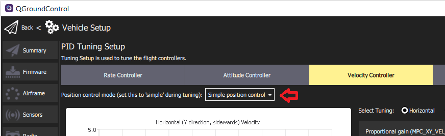

# Інструкція з налаштування мультикоптера PID (Manual/Basic)

This tutorial explains how to _manually_ tune the PID loops on PX4 for all [multicopter setups](../airframes/airframe_reference.md#copter) (Quads, Hexa, Octo etc).

:::tip
[Autotune](../config/autotune_mc.md) is recommended for most users, as it is far faster, easier and provides good tuning for most frames.
Рекомендується ручна настройка для кадрів, де автоналаштування не працює, або де важлива дотюнінг.
:::

Generally if you're using an appropriate [supported frame configuration](../airframes/airframe_reference.md#copter), the default tuning should allow you to fly the vehicle safely.
Tuning is recommended for all new vehicle setups to get the _very best_ performance, because relatively small hardware and assembly changes can affect the gains required tuning gains for optimal flight.
Наприклад, різні ESC або двигуни змінюють оптимальні налаштування коефіцієнтів настройки.

## Введення

PX4 uses **P**roportional, **I**ntegral, **D**erivative (PID) controllers (these are the most widespread control technique).

The _QGroundControl_ **PID Tuning** setup provides real-time plots of the vehicle setpoint and response curves.
The goal of tuning is to set the P/I/D values such that the _Response_ curve matches the _Setpoint_ curve as closely as possible (i.e. a fast response without overshoots).

Контролери рівні, що означає, що контролер більш високого рівня передає свої результати контролеру нижчого рівня.
The lowest-level controller is the **rate controller**, followed by the **attitude controller**, and finally the **velocity & position controller**.
Налаштування PID потрібно виконати в тому ж порядку, починаючи з регулятора швидкості, оскільки воно вплине на всі інші регулятори.

The testing procedure for each controller (rate, attitude, velocity/position) and axis (yaw, roll, pitch) is always the same: create a fast setpoint change by moving the sticks very rapidly and observe the response.
Потім налаштуйте слайдери (як обговорено нижче), щоб покращити відстеження реакції на задане значення.

:::tip

- Налаштування регулятора швидкості є найважливішим, і якщо воно налаштовано добре, інші регулятори часто не потребують жодних або лише незначних корекцій
- Зазвичай для кочення і тангажу можна використовувати ті ж самі коефіцієнти налаштування.
- використовуйте режим Acro/Stabilized/Altitude для налаштування контролера швидкості
- Use [Position mode](../flight_modes_mc/position.md) to tune the _Velocity Controller_ and the _Position Controller_.
  Make sure to switch to the _Simple position control_ mode so you can generate step inputs.
  

:::

## Передумови

- You have selected the closest matching [default frame configuration](../config/airframe.md) for your vehicle.
  Це повинно дати вам транспортний засіб, який вже літає.

- You should have done an [ESC calibration](../advanced_config/esc_calibration.md).

- If using PWM outputs their minimum values should be set correctly in the [Actuator Configuration](../config/actuators.md).
  These need to be set low, but such that the **motors never stop** when the vehicle is armed.

  This can be tested in [Acro mode](../flight_modes_mc/acro.md) or in [Stabilized mode](../flight_modes_mc/manual_stabilized.md):

  - Видаліть пропелери
  - Збройте транспортний засіб і знизьте оберти до мінімуму
  - Нахиліть транспортний засіб у всі напрямки, близько 60 градусів
  - Перевірте, чи не вимикаються мотори

- Використовуйте високошвидкісне телеметричне з'єднання, таке як WiFi, якщо це взагалі можливо (типовий телеметричний радіо з невеликим діапазоном не є достатньо швидким для отримання реального часу зворотнього зв'язку та графіків).
  Це особливо важливо для регулятора швидкості.

- Disable [MC_AIRMODE](../advanced_config/parameter_reference.md#MC_AIRMODE) before tuning a vehicle (there is an options for this in the PID tuning screen).

:::warning
Poorly tuned vehicles are likely to be unstable, and easy to crash.
Make sure to have assigned a [Kill switch](../config/safety.md#emergency-switches).
:::

## Параметри налаштування

Параметри налаштування такі:

1. Arm the vehicle, takeoff, and hover (typically in [Position mode](../flight_modes_mc/position.md)).

2. Open _QGroundControl_ **Vehicle Setup > PID Tuning**
  

3. Select the **Rate Controller** tab.

4. Confirm that the airmode selector is set to **Disabled**

5. Set the _Thrust curve_ value to: 0.3 (PWM, power-based controllers) or 1 (RPM-based ESCs)

  ::: info
  For PWM, power-based and (some) UAVCAN speed controllers, the control signal to thrust relationship may not be linear.
  Як результат, оптимальне налаштування при потужності утримання може бути не ідеальним, коли транспортний засіб працює на вищій потужності.

  Значення кривої тяги може бути використане для компенсації цієї нелинійності:

  - For PWM controllers, 0.3 is a good default (which may benefit from [further tuning](../config_mc/pid_tuning_guide_multicopter.md#thrust-curve)).
  - Для контролерів на основі RPM використовуйте 1 (додаткове налаштування не потрібно, оскільки вони мають квадратичну криву тяги).

  For more information see the [detailed PID tuning guide](../config_mc/pid_tuning_guide_multicopter.md#thrust-curve).

:::

6. Set the _Select Tuning_ radio button to: **Roll**.

7. (Optionally) Select the **Automatic Flight Mode Switching** checkbox.
  This will _automatically_ switch from [Position mode](../flight_modes_mc/position.md) to [Stabilised mode](../flight_modes_mc/manual_stabilized.md) when you press the **Start** button

8. For rate controller tuning switch to _Acro mode_, _Stabilized mode_ or _Altitude mode_ (unless automatic switching is enabled).

9. Select the **Start** button in order to start tracking the setpoint and response curves.

10. Rapidly move the _roll stick_ full range and observe the step response on the plots.
  :::tip
  Stop tracking to enable easier inspection of the plots.
  Це відбувається автоматично, коли ви збільшуєте/панорамуєте.
  Use the **Start** button to restart the plots, and **Clear** to reset them.

:::

11. Modify the three PID values using the sliders (for roll rate-tuning these affect `MC_ROLLRATE_K`, `MC_ROLLRATE_I`, `MC_ROLLRATE_D`) and observe the step response again.
  Значення зберігаються на транспортний засіб, як тільки переміщуються слайдери.
  ::: info
  The goal is for the _Response_ curve to match the _Setpoint_ curve as closely as possible (i.e. a fast response without overshoots).

:::
  The PID values can be adjusted as follows:
  - P (пропорційне) або К підсилення:
    - збільште це для більшої реакції
    - зменшити, якщо відповідь перевищує і / або коливається (до певної міри збільшення значення D також допомагає).
  - D (похідне) надходження:
    - це можна збільшити, щоб заглушити перевищення та коливання
    - збільшуйте це лише настільки, наскільки це потрібно, оскільки це підсилює шум (і може призвести до нагрітих моторів)
  - I (інтегральний) коефіцієнт отримання:
    - використовується для зменшення поміченої похибки стану рівноваги
    - якщо значення занадто низьке, відповідь може ніколи не досягти заданої точки (наприклад, у вітрових умовах)
    - якщо занадто високий, можуть виникнути повільні коливання

12. Повторіть процес налаштування вище для крена та курсу:
  - Use _Select Tuning_ radio button to select the axis to tune
  - Перемістіть відповідні палички (тобто паличку крена для крена, паличку риштування для риштування).
  - Для налаштування крену почніть з тих самих значень, що й для крену.
    :::tip
    Use the **Save to Clipboard** and **Reset from Clipboard** buttons to copy the roll settings for initial pitch settings.

:::

13. Повторіть процес налаштування контролера нахилу для всіх осей.

14. Повторіть процес налаштування контролерів швидкості та позицій (на всіх осях).

  - Використовуйте режим позиції при налаштуванні цих контролерів
  - Select the **Simple position control** option in the _Position control mode ..._ selector (this allows direct control for the generation of step inputs)

    

Готово!
Пам'ятайте увімкнути повітряний режим перед виходом з налаштувань.
