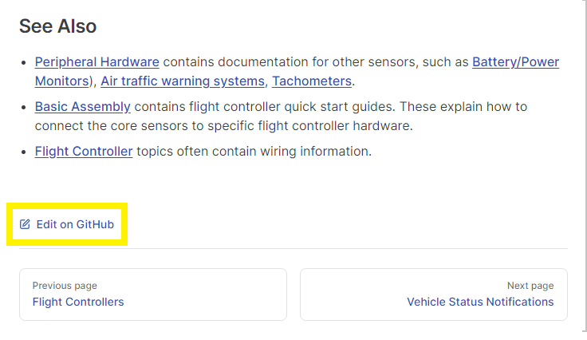

# Доповнення до документації

Внески до Керівництва користувачів PX4 дуже вітаються; від простих виправлень до правопису та граматики, до створення абсолютно нових секцій.

Ця тема пояснює, як зробити та протестувати зміни.
В кінці є посібник з базового стилю.

:::tip
Note
You will need a (free) [GitHub](https://github.com/) account to contribute to the guides.
:::

## Швидкі зміни в Github

Simple changes to _existing content_ can be made by clicking the **Edit on GitHub** link that appears at the bottom of every page (this opens the page on Github for editing).



To edit an existing English page:

1. Відкрийте сторінку
2. Click the **Edit on GitHub** link below the page content.
3. Зробіть необхідні зміни.
4. Below the Github page editor you'll be prompted to create a separate branch and then guided to submit a _pull request_.

Команда документації перегляне запит і або об'єднає його, або працює з вами, щоб оновити його.

Note that you can only make changes to the English version directly in the source.
[Translations are handled in Crowdin](../contribute/translation.md).

## Changes using Git

Більш суттєві зміни, включаючи додавання нових сторінок або додавання/зміну зображень, не такі прості для внесення (або належним чином протестувати) на Github.

For these kinds of changes we suggest using the same approach as for _code_:

1. Use the _git_ toolchain to get the PX4 source code onto your local computer.
2. Внесіть потрібні зміни в документацію (додайте, змініть, видаліть).
3. _Test_ that it builds properly using Vitepress.
4. Create a branch for your changes and create a pull request (PR) to pull it back into the [PX4-Autopilot](https://github.com/PX4/PX4-Autopilot.git) repo.

Нижче пояснено, як отримати вихідний код, побудувати локально (для тестування) та внести зміни в код.

### Get Documentation Source Code

Documentation sources are in the [PX4-Autopilot](https://github.com/PX4/PX4-Autopilot/) repo, alongside all the other PX4 source code.
The sources are markdown files located the [/docs](https://github.com/PX4/PX4-Autopilot/tree/main/docs) subdirectory.
The English source files are in the [/docs/en/](https://github.com/PX4/PX4-Autopilot/tree/main/docs/en) subdirectory and can be edited directly.
[Translation](../contribute/translation.md) sources are in language specific subdirectories, such as `ko` for korean and `zh` for Chinese: these are edited via the Crowdin tool, and should not be edited directly.

:::tip
If you already have a clone of the [PX4-Autopilot](https://github.com/PX4/PX4-Autopilot/) you can ignore this section.
:::

Щоб отримати джерела бібліотеки(ів) на свій локальний комп'ютер, вам потрібно використовувати інструментарій git.
Нижче наведено інструкції, як отримати git і використовувати його на своєму локальному комп'ютері.

1. Download git for your computer from [https://git-scm.com/downloads](https://git-scm.com/downloads)

2. [Sign up](https://github.com/join) for Github if you haven't already

3. Create a copy (Fork) of the [PX4-Autopilot repo](https://github.com/PX4/PX4-Autopilot) on Github ([instructions here](https://docs.github.com/en/get-started/quickstart/fork-a-repo)).

4. Клонуйте ваш форкнутий репозиторій на локальний комп'ютер:

  ```sh
  cd ~/wherever/
  git clone https://github.com/<your git name>/PX4-Autopilot.git
  ```

  For example, to clone PX4 source fork for a user with Github account "john_citizen":

  ```sh
  git clone https://github.com/john_citizen/PX4-Autopilot.git
  ```

5. Перейдіть до свого локального сховища:

  ```sh
  cd ~/wherever/PX4-Autopilot
  ```

6. Add a _remote_ called "upstream" to point to the "official" PX4 version of the library:

  ```sh
  git remote add upstream https://github.com/PX4/PX4-Autopilot.git
  ```

  :::tip
  A "remote" is a handle to a particular repository.
  The remote named _origin_ is created by default when you clone the repository, and points to _your fork_ of the guide.
  Above you create a new remote _upstream_ that points to the PX4 project version of the documents.

:::

### Make/Push Documentation Changes

Within the repository you created above:

1. Bring your copy of the repository `main` branch up to date:

  ```sh
  git checkout main
  git fetch upstream main
  git pull upstream main
  ```

2. Create a new branch for your changes:

  ```sh
  git checkout -b <your_feature_branch_name>
  ```

  This creates a local branch on your computer named `your_feature_branch_name`.

3. Внести зміни до документації за необхідною (загальний посібник по цьому в наступних розділах)

4. Коли ви будете задоволені своїми змінами, ви можете додати їх до вашої локальної гілки за допомогою "commit":

  ```sh
  git add <file name>
  git commit -m "<your commit message>"
  ```

  For a good commit message, please refer to the [Source Code Management](../contribute/code.md#commits-and-commit-messages) section.

5. Натисніть "Push" вашу локальну гілку (включаючи додані до неї коміти) у вашу репозиторію-форк на Github.

  ```sh
  git push origin your_feature_branch_name
  ```

6. Go to your forked repository on Github in a web browser, e.g.: `https://github.com/<your git name>/PX4-Autopilot.git`.
  Там ви маєте побачити повідомлення, що нова гілка була відправлена у вашу репозиторію-форк.

7. Створіть запит на витягнення (Pull Request, PR):

  - On the right hand side of the "new branch message" (see one step before), you should see a green button saying "Compare & Create Pull Request".
    Натисніть на неї.
  - Буде створено шаблон запиту на витягнення.
    Він буде перераховувати ваші коміти, і ви можете (маєте) додати значущий заголовок (у випадку одного коміту PR, це зазвичай повідомлення про коміт) та повідомлення (<span style="color:orange">поясніть, що ви зробили і для якої причини. </span>.
    Check [other pull requests](https://github.com/PX4/PX4-Autopilot/pulls) for comparison).
  - Add the "Documentation" label.

8. Готово!

  Редактори PX4 User Guide зараз переглянуть вашу співпрацю і вирішать, чи хочуть вони інтегрувати її.
  Періодично перевіряйте, чи є у них питання по вашим змінам.

### Побудова бібліотеки локально

Побудуйте бібліотеку локально, щоб перевірити, що будь-які зміни, які ви внесли, відображені належним чином:

1. Install the [Vitepress prerequisites](https://vitepress.dev/guide/getting-started#prerequisites):

  - [Nodejs 18+](https://nodejs.org/en)
  - [Yarn classic](https://classic.yarnpkg.com/en/docs/install)

2. Navigate to your local repository and the `/docs` subdirectory:

  ```sh
  cd ~/wherever/PX4-Autopilot/docs
  ```

3. Встановити залежності (включаючи Vuepress):

  ```sh
  yarn install
  ```

4. Попередній перегляд і обслуговування бібліотеки:

  ```sh
  yarn docs:dev
  ```

  - Одного разу, коли сервер розробки / попереднього перегляду побудує бібліотеку (менше хвилини вперше), він покаже вам URL-адресу, за допомогою якої ви можете переглянути сайт.
    This will be something like: `http://localhost:5173/px4_user_guide/`.
  - Stop serving using **CTRL+C** in the terminal prompt.

5. Open previewed pages in your local editor:

  First specify a local text editor file using the `EDITOR` environment variable, before calling `yarn start` to preview the library.
  For example, on Windows command line you can enable VSCode as your default editor by entering:

  ```sh
  set EDITOR=code
  ```

  The **Open in your editor** link at the bottom of each page will then open the current page in the editor (this replaces the _Open in GitHub_ link).

6. Побудуйте бібліотеку за допомогою:

  ```sh
  # Ubuntu
  yarn docs:build

  # Windows
  yarn docs:buildwin
  ```

:::tip
Use `yarn start` to preview changes _as you make them_ (documents are updated and served very quickly).
Before submitting a PR you should also build it using `yarn docs:build`, as this can highlight issues that are not visible when using `yarn start`.
:::

### Структура Вихідного Коду

The guide uses the [Vitepress](https://vitepress.dev/) toolchain.

На огляд:

- Сторінки записуються окремими файлами, використовуючи markdown.
  - Синтаксис майже такий самий, як і Github wiki.
  - Vitepress also supports some [markdown extensions](https://vitepress.dev/guide/markdown#markdown-extensions).
    We try and avoid using these, except for [tips, warning, etc.](https://vitepress.dev/guide/markdown#default-title).
    Це можна переглянути – є кілька цікавих варіантів!

- This is a [multilingual](https://vitepress.dev/guide/i18n) book:
  - Сторінки для кожної мови зберігаються в папці з назвою для асоційованого мовного коду (наприклад, "zh" для китайської, "ko" для корейської).
  - Only edit the ENGLISH (`/en`) version of files.
    We use [Crowdin](../contribute/translation.md) to manage the translations.

- All pages must be in an appropriately named sub-folder of `/en` (e.g. this page is in folder `en/contribute/`).
  - Це полегшує створення посилань, оскільки інші сторінки і зображення завжди будуть на тому ж рівні

- The _structure_ of the book is defined in `SUMMARY.md`.

  - Якщо ви додаєте нову сторінку до посібника, вам також потрібно додати запис до цього файлу!

    :::tip
    This is not "standard vitepress" way to define the sidebar (the summary file is imported by [.vitepress/get_sidebar.js](https://github.com/PX4/PX4-user_guide/blob/main/.vitepress/get_sidebar.js)).

:::

- Images must be stored in a sub folder of `/assets`.
  Це на два рівні нижче від папок з вмістом, тому якщо ви додаєте зображення, ви посилаєтеся на нього так:

  ```plain
  
  ```

- A file named **package.json** defines any dependencies of the build.

- Веб-хук використовується для відстеження моменту злиття файлів у головну гілку цього репозиторію, що призводить до перебудови книги.

### Додавання нових сторінок

When you add a new page you must also add it to `en/SUMMARY.md`!

## Інструкція зі стилістичного оформлення

1. Назви файлів/файлів

  - Put new markdown files in an appropriate sub-folder of `/en/`, such as `/en/contribute/`.
    Не створюйте додаткових вкладених папок.
  - Put new image files in an appropriate nested sub-folder of `/assets/`.
    Deeper nesting is allowed/encouraged.
  - Use descriptive names for folders and files.
    In particular, image filenames should describe what they contain (don't name as "image1.png")
  - Use lower case filenames and separate words using underscores (`_`).

2. Зображення

  - Використовуйте найменший розмір і найнижчу роздільну здатність, яка все ще робить зображення корисним (це зменшує вартість завантаження для користувачів із слабким інтернет-з'єднанням).
  - New images should be created in a sub-folder of `/assets/` (so they can be shared between translations).
  - SVG files are preferred for diagrams.
    PNG files are preferred over JPG for screenshots.

3. Контент

  - Use "style" (**bold**, _emphasis_, etc.) consistently and sparingly (as little as possible).
    - **Bold** for button presses and menu definitions.
    - _Emphasis_ for tool names such as _QGroundControl_ or _prettier_.
    - `code` for file paths, and code, parameter names that aren't linked, using tools in a command line, such as `prettier`.
  - Headings and page titles should use "First Letter Capitalisation".
  - The page title should be a first level heading (`#`).
    All other headings should be h2 (`##`) or lower.
  - Не додавати ніяких стилів до заголовків.
  - Don't translate the text indicating the name of an `info`, `tip` or `warning` declaration (e.g. `::: tip`) as this precise text is required to render the aside properly.
  - Break lines on sentences by preference.
    Don't break lines based on some arbitrary line length.
  - Format using _prettier_ (_VSCode_ is a has extensions can be used for this).

4. Videos:

  - Youtube videos can be added using the format `<lite-youtube videoid="<youtube-video-id>" title="your title"/>` (supported via the [https://www.npmjs.com/package/lite-youtube-embed](https://www.npmjs.com/package/lite-youtube-embed) custom element, which has other parameters you can pass).
    - Use instructional videos sparingly as they date badly, and are hard to maintain.
    - Cool videos of airframes in flight are always welcome.

## Де я можу додати зміни?

Add new files in folders that cover similar topics.
Then reference them in the sidebar (`/en/SUMMARY.md`) in line with the existing structure!

## Переклади

For information about translation see: [Translation](../contribute/translation.md).

## Ліцензія

All PX4/Dronecode documentation is free to use and modify under terms of the permissive [CC BY 4.0](https://creativecommons.org/licenses/by/4.0/) license.
