# Зонд налагодження STLink

The [STLinkv3-MINIE](https://www.st.com/en/development-tools/stlink-v3minie.html) is a cheap, fast and highly capable debug probe that can serve as a stand-alone debug and console communicator for a PX4 developer:

- Тільки єдине USB-C з'єднання для Reset, SWD, SWO та послідовного входу у дуже компактному виконанні!
- З'єднання по протоколах SWD та SWO - до 24 МГц.
  Послідовне з'єднання - до 16 мега бод. Цільова напруга від 1.65В до 3.6В.
  З'єднання по високошвидкісному протоколу USB2 до 480 Мбіт/c.
- Керований програмним забезпеченням STLink або OpenOCD із широкою підтримкою пристроїв.
- Набагато дешевше (<15€) ніж адаптер відладки Pixhawk (~20€) з JLink EDU mini (~55€) або JLink BASE (~400€) при кращих технічних характеристиках апаратного забезпечення.

Зонд STLink постачається без адаптера для роботи з контролерами польоту Pixhawk.
The [Pixhawk Debug Port Adapter](#pixhawk-debug-port-adapter) section below explains how you can create your own (some soldering required).

:::info
The [CUAV C-ADB Pixhawk Debugging Adapter](../debug/swd_debug.md#cuav-c-adb-pixhawk-debug-adapter) (~65€) comes with an STLinkv3-MINIE!
This has a connector for the [Pixhawk Debug Full](../debug/swd_debug.md#pixhawk-debug-full) 10-pin SH port (but not the [Pixhawk Debug Mini](../debug/swd_debug.md#pixhawk-debug-mini)).
:::

## Налаштування налагодження

The STLink provides the [GDB server via OpenOCD](https://openocd.org/doc-release/html/index.html):

```sh
# Ubuntu
sudo apt install openocd
# macOS
brew install open-ocd
```

Ви можете запустити сервер GDB в новому терміналі:

```sh
openocd -f interface/stlink.cfg -f target/stm32f7x.cfg
```

Файл налаштувань повинен бути:

- FMUv2-v4: `-f target/stm32f4x.cfg`
- FMUv5: `-f target/stm32f7x.cfg`
- FMUv6: `-f target/stm32h7x.cfg`

Потім можна під'єднатися до порту 3333 через GDB:

```sh
arm-none-eabi-gdb build/px4_fmu-v5x_default/px4_fmu-v5x_default.elf -ex "target extended-remote :3333"
```

See the [Embedded Debug Tools][emdbg] for more advanced debug options.

## Адаптер порту налагодження Pixhawk

To connect to the Pixhawk Debug Port, you need to solder an adapter (unless using the [CUAV Debug Adaptor](../debug/swd_debug.md#cuav-c-adb-pixhawk-debug-adapter)).

Для цієї інструкції паяння вам знадобиться:

- 1x [STLinkv3-MINIE](https://www.st.com/en/development-tools/stlink-v3minie.html).

- 1x cable connector for mating with [JST SM10B (Full)](https://www.digikey.com/products/en?keywords=A10SR10SR30K203A) or [JST SM06B (Mini)](https://www.digikey.com/products/en?keywords=A06SR06SR30K152A).

  Рекомендуємо купувати повністю зібрані кабелі з двома роз'ємами з обох боків.

- 1x паяльник та припій.

- Щипці, плоскогубці та пінцет.

The [Pixhawk Debug Port is standardized in DS-009](https://github.com/pixhawk/Pixhawk-Standards/blob/master/DS-009%20Pixhawk%20Connector%20Standard.pdf) and needs to be connected to the STLinkv3-MINIE Board-To-Board (BTB) card edge connector CN2.
Зіставлення контактів описано тут:

| № контакту SM10B (Full) | № контакту SM06B (Mini) | Порт Pixhawk                          | STLinkv3                      | № контакту BTB |
| -----------------------------------------: | -----------------------------------------: | :------------------------------------ | :---------------------------- | -------------: |
|                                          1 |                                          1 | **VREF**                              | VCC                           |             10 |
|                                          2 |                                          2 | TX консолі (вихід) | TX (вхід)  |              8 |
|                                          3 |                                          3 | RX консолі (вхід)  | RX (вихід) |              7 |
|                                          4 |                                          4 | **SWDIO**                             | TMS                           |              3 |
|                                          5 |                                          5 | **SWCLK**                             | CLK                           |              4 |
|                                          6 |                                            | SWO                                   | TDO                           |              5 |
|                                          7 |                                            | GPIO1                                 |                               |                |
|                                          8 |                                            | GPIO2                                 |                               |                |
|                                          9 |                                            | nRST                                  | RST                           |              9 |
|                                         10 |                                          6 | **GND**                               | GND                           |              6 |

Контакти GPIO1/2 не підтримуються STLinkv3 та ми рекомендуємо користуватись цифровим ITM профілюванням через SWO що є найбільш гнучким та підтримує точний вимір часу між циклами.

Ви можете спаяти короткий або довгий кабель для BTB роз'єму.
Короткий кабель краще підходить для високошвидкісного зв'язку, але його складніше паяти.
Ми рекомендуємо спочатку спаяти довгий кабель і перевірити, наскільки швидким буде з'єднання з цільовим об'єктом.

:::info
This guide is written for the full 10-pin debug port.
Якщо ви хочете спаяти мініверсію з 6 контактами, просто пропустіть сигнали, яких у вас немає.
STLink підтримує будь-який інтерфейс налагодження на основі SWD/JTAG, тому ви можете адаптувати цю інструкцію для будь-якого роз'єму, який у вас є.
Зонди налагодження настільки дешеві, що ви можете мати по одному на кожен роз'єм замість використання адаптерів.
:::

STLinkv3-MINIE постачається ось таким чином.

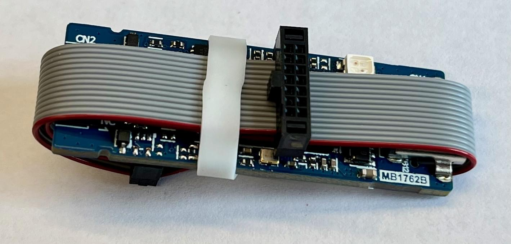

Розпакуйте плату і перевірте її на наявність пошкоджень.
Під'єднайте її до живлення та переконайтеся, що вона вмикається правильно.

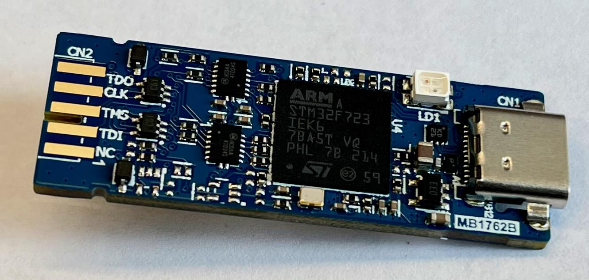

### Короткий кабель

Короткий кабель потребує інструмент для обрізання та зачистки кабелю та трохи більше навичок пайки.
Однак це робить увесь зонд налагодження ще меншим.

Зберіть 10-контактний роз'єм без GPIO1/2. Якщо у вас вже є зібраний кабель, обережно видаліть два дроти GPIO1/2 за допомогою пінцета, піднімаючи штирі, які утримують їх на місці.
Відріжте дроти на невелику довжину у приблизно 2 см (1 дюйм) та зачистить їх.

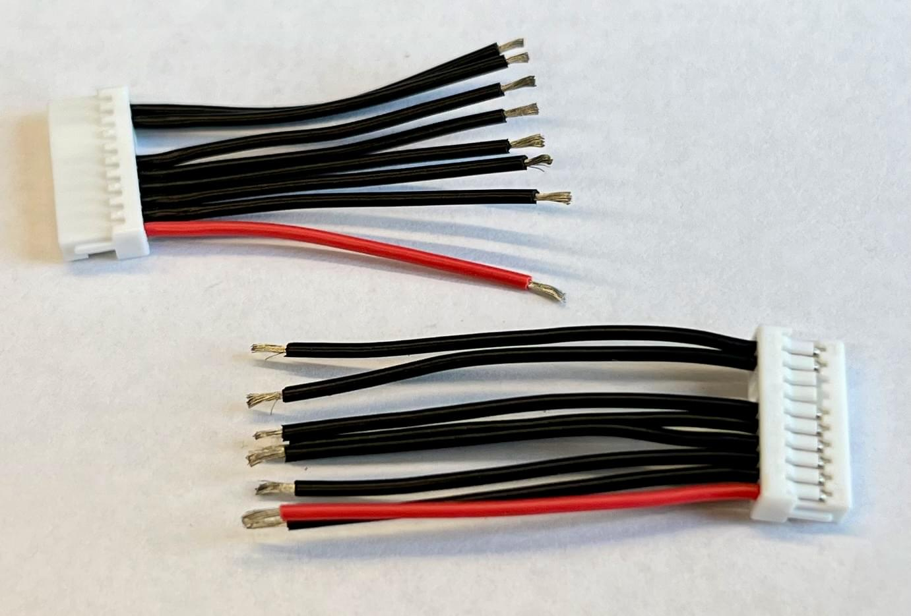

Залудіть як роз'єм BTB на STLink так і кабелі.

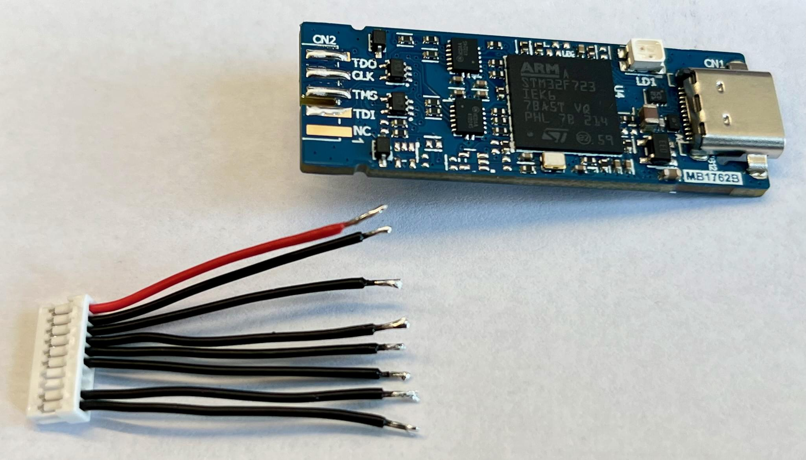

Спочатку припаяйте сигнальні дроти для GND та VCC, щоб вирівняти роз'єм паралельно до краю.
Потім припаяйте контакти TX та RX. Припаяйте з'єднання RST останнім.

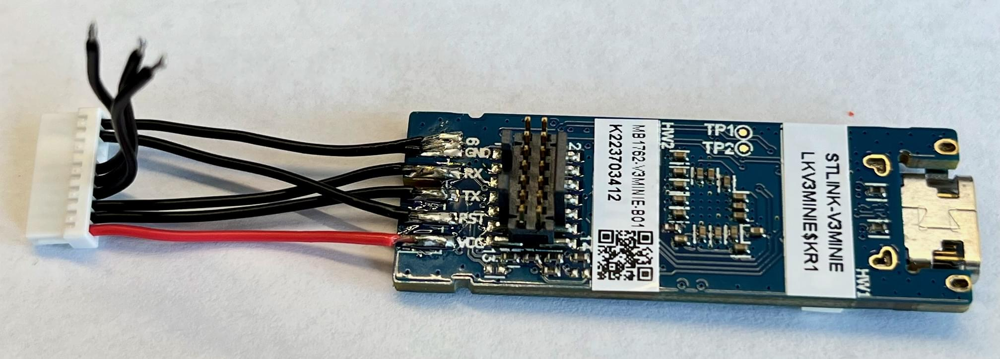

Переверніть STLink і припаяйте три дроти, що залишились.
Start with SWDIO->TMS, then SWCLK->CLK, and finally SWO->TDO.

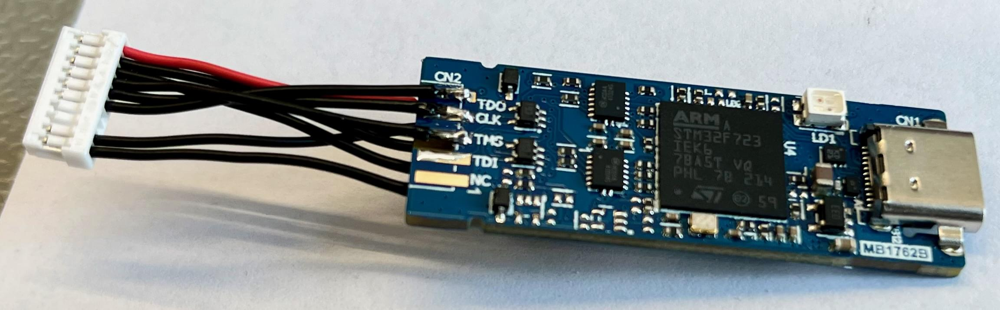

### Довгий кабель

Довгий кабель особливо корисний, якщо ви використовуєте вже зібрані кабелі, оскільки він усуває потребу в обрізанні або знятті ізоляції з проводів.

Обережно вийміть два дроти GPIO1/2 з одного роз'єму кабелю.
Потім від'єднайте всі дроти від іншого роз'єму.
У вас залишилось вісім обжатих роз'ємів на кінці дротів.

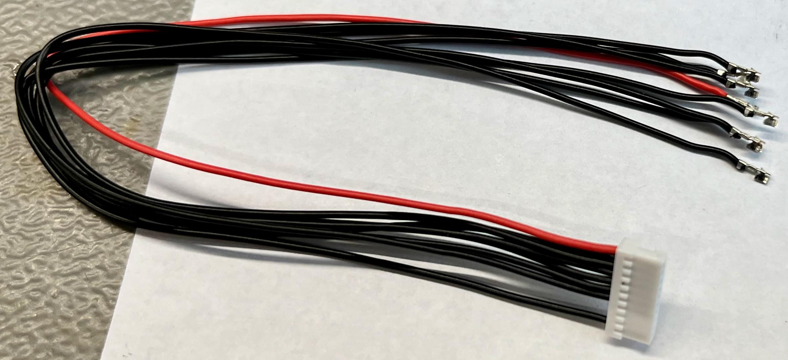

Залудіть обжаті роз'єми та роз'єм BTB та припаяйте обжаті роз'єми безпосередньо до STLinkv3.
Будьте обережні, щоб не створити коротке замикання між дротами, оскільки обжаті роз'єми досить великі.

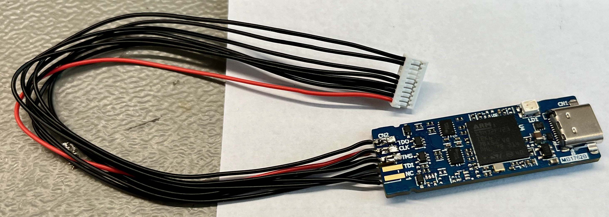

### Тестування

Тепер слід протестувати зонд для налагодження, щоб переконатися, що немає жодних коротких замикань.

1. Під'єднайте зонд до цілі через роз'єм налагодження Pixhawk.
2. Перевірте послідовний порт за допомогою програми за вибором.
3. Test the SWD and RST connection via [OpenOCD][https://openocd.org] or [STLink](https://www.st.com/en/development-tools/stsw-link004.html) software.
4. Перевірте підключення SWO за допомогою [Orbuculum][https://github.com/orbcode/orbuculum].

See the [Embedded Debug Tools][emdbg] for more information about software support for the PX4 FMUv5 and FMUv6 flight controllers.

### Зменшення зонду

Цей крок видаляє 14-контактний інтерфейс для налагодження на задній частині STLinkv3-MINIE та додає термоусадку навколо всього пристрою для поліпшення поводження та запобігання короткому замиканню STLink на металеві деталі або плати.
Цей крок є виключно необов'язковим та потребує:

- 1x Термоусадка діаметром 20 мм та довжиною приблизно 5 см.
- 1x плаский затискач для утримання STLinkv3 за порт USB-C.
- 1x дрібні плоскогубці або паяльник.
- 1x паяльний фен.

Використайте плоскогубці, щоб обережно витягнути пластикову частину роз'єму STDC14.
Залишаться тільки контакти роз'єму.

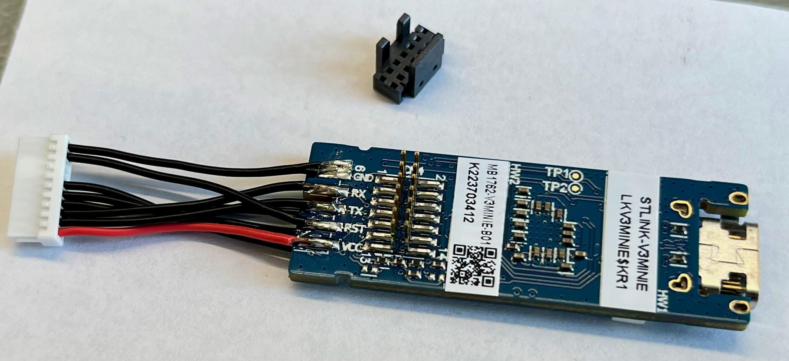

За допомогою дрібних плоскогубців відріжте контакти роз'єму дуже обережно, щоб не пошкодити плату або будь-які компоненти на платі.
Або ж ви можете випаяти ці контакти роз'єму з плати, але це може зайняти більше часу.

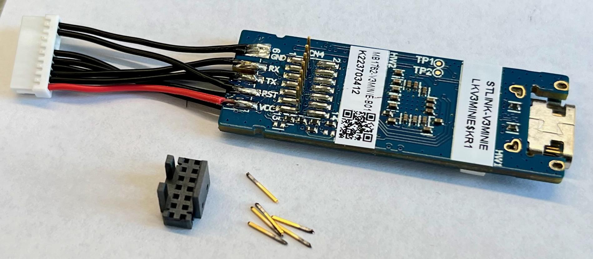

Поверніть STLinkv3, щоб обрізати інший ряд контактів, знову дуже обережно, щоб нічого не пошкодити.

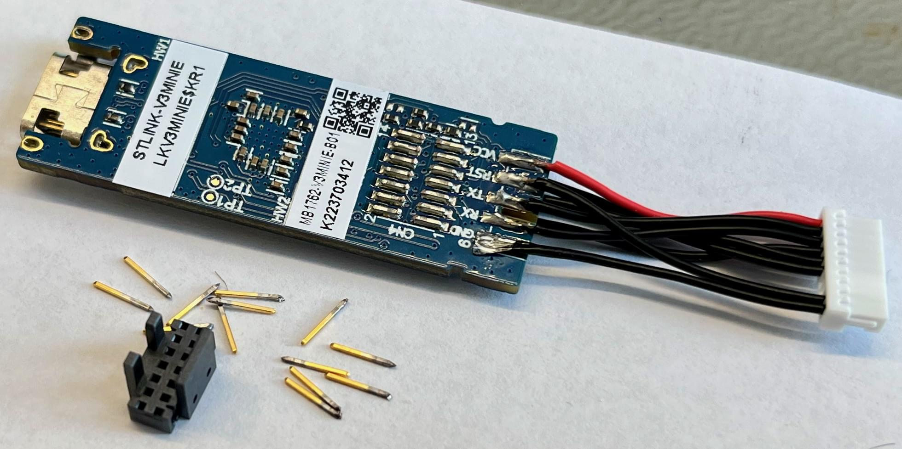

Відріжте кусок термоусадки довжиною приблизно 5 см (2 дюйми).
Він повинен бути вирівняний з роз'ємом USB-C і трохи виступати за межі краю.

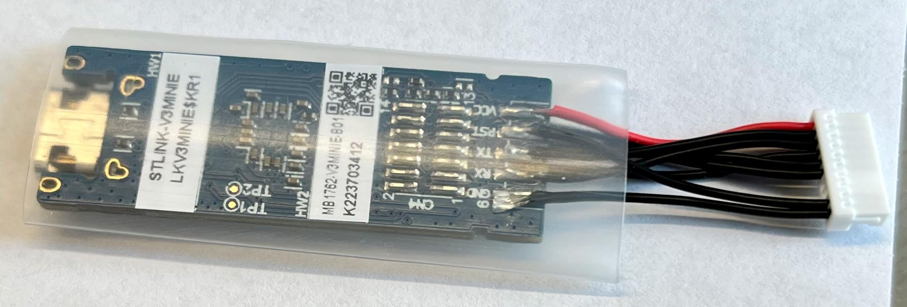

Hold both the PCB and the shrink tube with the flat tongs by the **bottom** metal part of the USB-C connector.
Будьте обережні, щоб помилково не стиснути середню пластикову частину роз'єму USB-C!

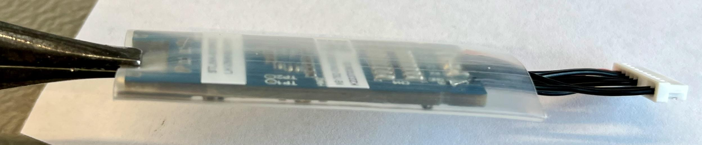

За допомогою фену зменште термоусадку навколо зонду налагодження.
Переконайтеся, що усадка рівномірно стиснута і захищає всю плату.

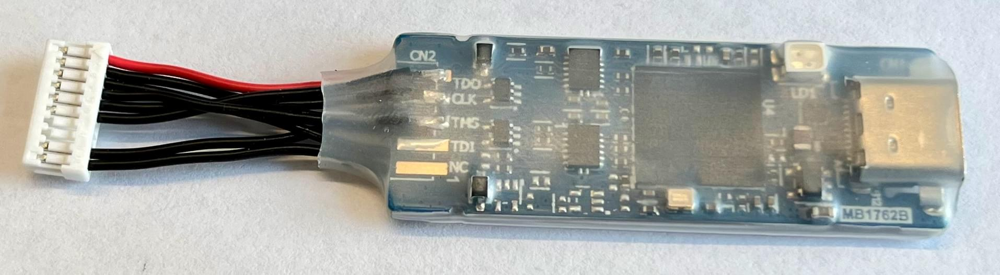

За бажанням, ви можете додати логотип за вибором, надрукований на папері та обрізаний за розміром.
Зверніть увагу, що нагрів може призвести до плину чорнил, тому може знадобитися поекспериментувати з налаштуваннями фену, які працюють з вашим принтером.

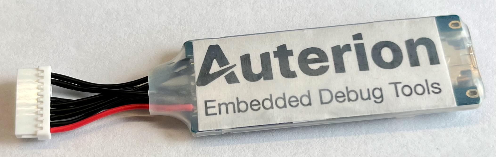

[emdbg]: https://pypi.org/project/emdbg/

## Дивись також

- [STLINK-V3MINIE debugger/programmer tiny probe for STM32 microcontrollers](https://www.st.com/resource/en/user_manual/um2910-stlinkv3minie-debuggerprogrammer-tiny-probe-for-stm32-microcontrollers-stmicroelectronics.pdf) (User Manual)
