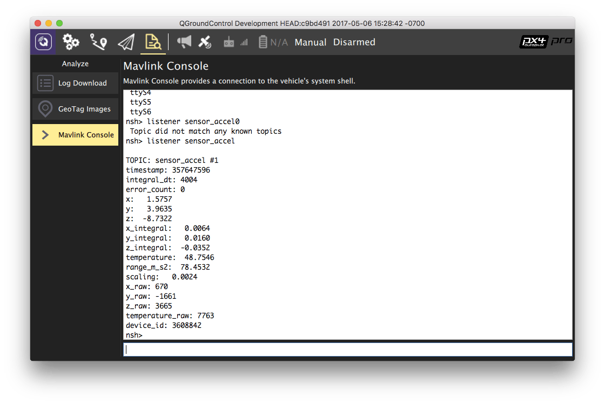

# Sensor/Topic Debugging using the Listener Command

The uORB is an asynchronous `publish()` / `subscribe()` messaging API used for
inter-thread/inter-process communication. The `listener` command can be used from the _QGroundControl MAVLink Console_ to inspect topic (message) values, including the current values published by sensors.

:::tip
Це потужний інструмент для відлагодження, оскільки його можна використовувати навіть тоді, коли QGC підключений через бездротове з'єднання (наприклад, коли транспортний засіб летить).
:::

:::info
The `listener` command is also available through the [System Console](../debug/system_console.md) and the [MAVLink Shell](../debug/mavlink_shell.md).
:::

:::tip
To check what topics are available at what rate, just use the `uorb top` command.
:::

The image below demonstrates _QGroundControl_ being used to get the value of the acceleration sensor.

For more information about how to determine what topics are available and how to call `listener` see: [uORB Messaging > Listing Topics and Listening in](../middleware/uorb.md#listing-topics-and-listening-in).
