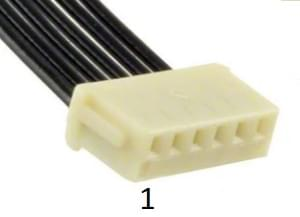
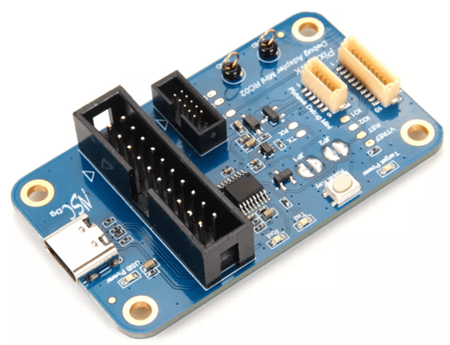
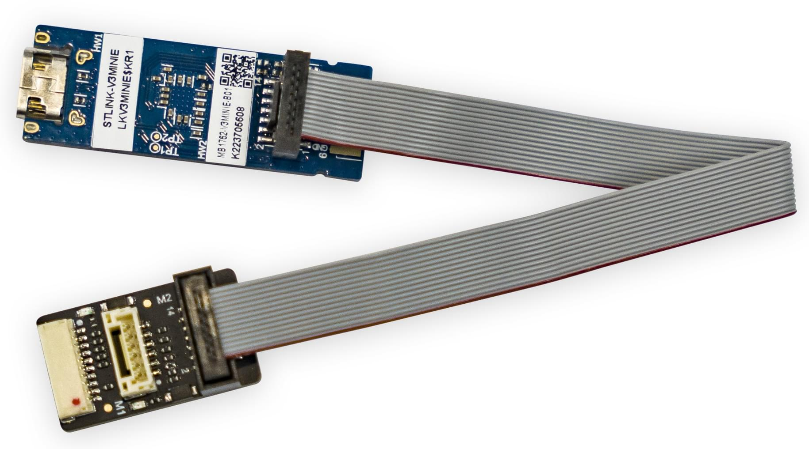
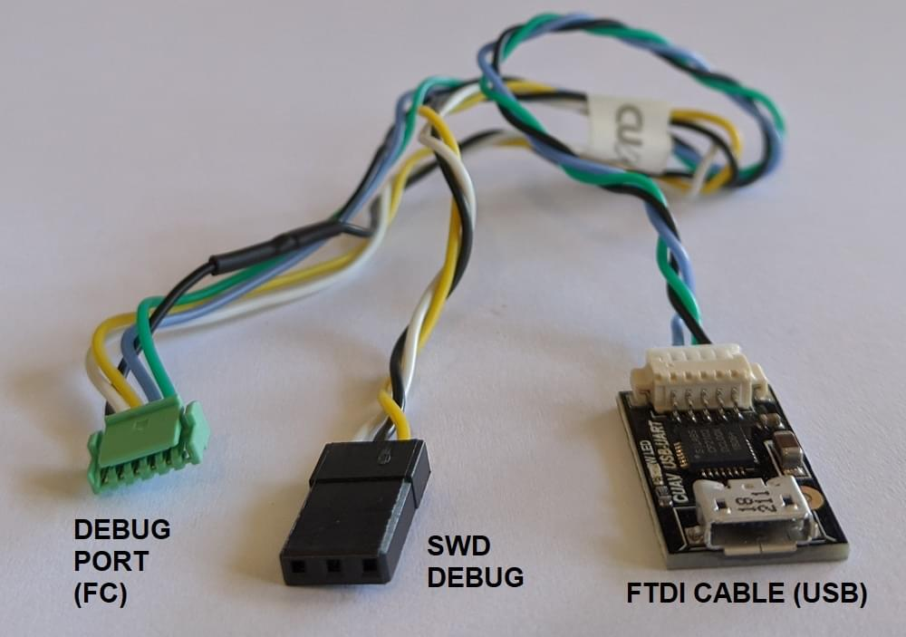

# Порт для налагодження SWD

PX4 runs on ARM Cortex-M microcontrollers, which contain dedicated hardware for interactive debugging via the [_Serial Wire Debug (SWD)_][swd] interface and non-invasive profiling and high-bandwidth tracing via the [_Serial Wire Ouput (SWO)_][itm] and [_TRACE_ pins][etm].

Інтерфейс відладки SWD дозволяє прямий, низькорівневий, апаратний доступ до процесора мікроконтролера та периферійних пристроїв, тому він не залежить від будь-якого програмного забезпечення на пристрої.
Отже, його можна використовувати для налагодження завантажувальних програм та операційних систем, таких як NuttX.

## Налагодження сигналів

Чотири сигнали необхідні для відлагодження (в жирному шрифті), а решту лише рекомендується.

| Назва                                                           | Тип    | Опис                                                                                                         |
| :-------------------------------------------------------------- | :----- | :----------------------------------------------------------------------------------------------------------- |
| **GND**                                                         | Power  | Спільний потенціал, спільна основа.                                                          |
| **VREF**                                                        | Power  | Цільове довідкове напруга дозволяє засоби налагодження використовувати рівнеміри на сигнали. |
| **SWDIO**                                                       | I/O    | Пін даних для послідовного знавантаження через мережу.                                       |
| **SWCLK**                                                       | Вхід   | Пін годинника для послідовного знавантаження через мережу.                                   |
| nRST                                                            | Вхід   | PIN скидання є необов’язковим (n = активним низьким).                     |
| SWO                                                             | Output | Однопровідний шлейф асинхронних даних з можливістю виведення даних ITM та DWT.               |
| TRACECK                                                         | Output | Трасування годинника для паралельної шини.                                                   |
| TRACED[0-3] | Output | Трасування синхронної шини даних з 1, 2 чи 4 бітами.                                         |

Пін скидання апаратного забезпечення є необов'язковим, оскільки більшість пристроїв також можуть бути скинуті через лінії SWD. Однак швидке скидання пристрою за допомогою кнопки може бути великим плюсом для розробки.

SWO-пін може випромінювати дані профілювання в реальному часі з наносекундним відмітками часу, тому настійно рекомендується мати доступ до нього для відлагодження.

Піни TRACE потребують спеціалізованих засобів відлагодження для роботи з високою пропускною здатністю та наступним декодуванням потоку даних.
Зазвичай вони недоступні і зазвичай використовуються лише для відлагодження дуже конкретних питань з часом.

## Порти налагодження автопілота

Flight controllers commonly provide a single debug port that exposes both the [SWD Interface](#debug-signals) and [System Console](system_console).

The [Pixhawk Connector Standards](#pixhawk-standard-debug-ports) formalize the port that must be used in each FMU version.
However there are still many boards that use different pinouts or connectors, so we recommend you check the [documentation for your autopilot](../flight_controller/index.md) to confirm port location and pinout.

Місцезнаходження порту налагодження та роз'єми для підмножини автопілотів зв'язані нижче:

| Автопілот                                                                                              | Відладочний порт                                                                                                                                                  |
| :----------------------------------------------------------------------------------------------------- | :---------------------------------------------------------------------------------------------------------------------------------------------------------------- |
| Holybro Pixhawk 6X-RT (FMUv6X-RT)                                                   | [Pixhawk Debug Full](#pixhawk-debug-full)                                                                                                                         |
| Holybro Pixhawk 6X (FMUv6x)                                                         | [Pixhawk Debug Full](#pixhawk-debug-full)                                                                                                                         |
| Holybro Pixhawk 5X (FMUv5x)                                                         | [Pixhawk Debug Full](#pixhawk-debug-full)                                                                                                                         |
| [Holybro Durandal](../flight_controller/durandal.md#debug-port)                                        | [Pixhawk Debug Mini](#pixhawk-debug-mini)                                                                                                                         |
| [Holybro Kakute F7](../flight_controller/kakutef7.md#debug-port)                                       | Паяльні майданчики                                                                                                                                                |
| [Holybro Pixhawk 4 Mini](../flight_controller/pixhawk4_mini.md#debug-port) (FMUv5)  | [Pixhawk Debug Mini](#pixhawk-debug-mini)                                                                                                                         |
| [Holybro Pixhawk 4](../flight_controller/pixhawk4.md#debug_port) (FMUv5)            | [Pixhawk Debug Mini](#pixhawk-debug-mini)                                                                                                                         |
| [Drotek Pixhawk 3 Pro](../flight_controller/pixhawk3_pro.md#debug-port) (FMU-v4pro) | [Pixhawk Debug Mini](#pixhawk-debug-mini)                                                                                                                         |
| [CUAV V5+](../flight_controller/cuav_v5_plus.md#debug-port)                                            | 6-pin JST GH Digikey: [BM06B-GHS-TBT(LF)(SN)(N)][bm06b-ghs-tbt(lf)(sn)(n)] (vertical mount), [SM06B-GHS-TBT(LF)(SN)(N)][sm06b-ghs-tbt(lf)(sn)(n)] (side mount) |
| [CUAV V5nano](../flight_controller/cuav_v5_nano.md#debug_port)                                         | 6-pin JST GH Digikey: [BM06B-GHS-TBT(LF)(SN)(N)][bm06b-ghs-tbt(lf)(sn)(n)] (vertical mount), [SM06B-GHS-TBT(LF)(SN)(N)][sm06b-ghs-tbt(lf)(sn)(n)] (side mount) |
| [3DR Pixhawk](../flight_controller/pixhawk.md#swd-port)                                                | ARM 10-pin JTAG Connector (also used for FMUv2 boards including: _mRo Pixhawk_, _HobbyKing HKPilot32_).        |

## Стандарт роз'ємів Pixhawk Debug Портів

Проект Pixhawk визначив стандартну схему виводів та тип роз'єму для різних випусків Pixhawk FMU:

:::tip
Check your [specific board](#port-information) to confirm the port used.
:::

| Версія FMU | Версія Pixhawk                                                  | Відладочний порт                          |
| :--------- | :-------------------------------------------------------------- | :---------------------------------------- |
| FMUv2      | [Pixhawk / Pixhawk 1](../flight_controller/pixhawk.md#swd-port) | 10 pin ARM Debug                          |
| FMUv3      | Pixhawk 2                                                       | 6 pin SUR Debug                           |
| FMUv4      | Pixhawk 3                                                       | [Pixhawk Debug Mini](#pixhawk-debug-mini) |
| FMUv5      | Pixhawk 4 FMUv5                                                 | [Pixhawk Debug Mini](#pixhawk-debug-mini) |
| FMUv5X     | Pixhawk 5X                                                      | [Pixhawk Debug Full](#pixhawk-debug-full) |
| FMUv6      | Pixhawk 6                                                       | [Pixhawk Debug Full](#pixhawk-debug-full) |
| FMUv6X     | Pixhawk 6X                                                      | [Pixhawk Debug Full](#pixhawk-debug-full) |
| FMUv6X-RT  | Pixhawk 6X-RT                                                   | [Pixhawk Debug Full](#pixhawk-debug-full) |

:::info
There FMU and Pixhawk versions are (only) consistent after FMUv5X.
:::

### Pixhawk Debug Mini

The [Pixhawk Connector Standard](https://github.com/pixhawk/Pixhawk-Standards/blob/master/DS-009%20Pixhawk%20Connector%20Standard.pdf) defines the _Pixhawk Debug Mini_, a _6-Pin SH Debug Port_ that provides access to both SWD pins and the [System Console](system_console).

Це використовується в FMUv4 та FMUv5.

Схема виводів показана нижче (виводи, необхідні для налагодження, виділені жирним шрифтом):

| Pin | Сигнал     |
| --: | :--------- |
|   1 | **VREF**   |
|   2 | Console TX |
|   3 | Console RX |
|   4 | **SWDIO**  |
|   5 | **SWDCLK** |
|   6 | **GND**    |

Визначення порту налагодження містить наступні припояні пластины (на платі поряд із роз'ємом):

| Pad | Сигнал | Напруга               |
| --: | :----- | :-------------------- |
|   1 | nRST   | +3.3V |
|   2 | GPIO1  | +3.3V |
|   3 | GPIO2  | +3.3V |

The socket is a _6-pin JST SH_ - Digikey number: [BM06B-SRSS-TBT(LF)(SN)](https://www.digikey.com/products/en?keywords=455-2875-1-ND) (vertical mount), [SM06B-SRSS-TBT(LF)(SN)](https://www.digikey.com/products/en?keywords=455-1806-1-ND)(side mount).

You can connect to the debug port using a [cable like this one](https://www.digikey.com/products/en?keywords=A06SR06SR30K152A).

### Порти відладки Pixhawk Full

The [Pixhawk Connector Standard](https://github.com/pixhawk/Pixhawk-Standards/blob/master/DS-009%20Pixhawk%20Connector%20Standard.pdf) defines _Pixhawk Debug Full_, a _10-Pin SH Debug Port_ that provides access to both SWD pins and the [System Console](system_console).
This essentially moves the solder pads from beside the [Pixhawk Debug Mini](#pixhawk-debug-mini) into the connector, and also adds an SWO pin.

Цей порт вказаний для використання в FMUv5x, FMUv6, FMUv6x.

Схема виводів показана нижче (виводи, необхідні для налагодження, виділені жирним шрифтом):

| Pin | Сигнал     |
| --: | :--------- |
|   1 | **VREF**   |
|   2 | Console TX |
|   3 | Console RX |
|   4 | **SWDIO**  |
|   5 | **SWDCLK** |
|   6 | SWO        |
|   7 | GPIO1      |
|   8 | GPIO2      |
|   9 | nRST       |
|  10 | **GND**    |

Піни GPIO1/2 є вільними пінами, які можуть бути використані для генерації сигналів у програмному забезпеченні для аналізу часу з логічним аналізатором.

The socket is a _10-pin JST SH_ - Digikey number: [BM10B-SRSS-TB(LF)(SN)](https://www.digikey.com/products/en?keywords=455-1796-2-ND) (vertical mount) or [SM10B-SRSS-TB(LF)(SN)](https://www.digikey.com/products/en?keywords=455-1810-2-ND) (side mount).

You can connect to the debug port using a [cable like this one](https://www.digikey.com/products/en?keywords=A10SR10SR30K203A).

<!-- FIXME: better to have image showing proper connections for SWD+SWO -->

## Зонди налагодження для апаратного забезпечення PX4

Flight controllers commonly provide a [single debug port](#autopilot-debug-ports) that exposes both the [SWD Interface](#debug-signals) and [System Console](system_console).

Є кілька зондів відлагодження, які були перевірені та підтримуються для підключення до одного або обох цих інтерфейсів:

- [SEGGER J-Link](../debug/probe_jlink.md): commercial probe, no built-in serial console, requires adapter.
- [Black Magic Probe](../debug/probe_bmp.md): integrated GDB server and serial console, requires adapter.
- [STLink](../debug/probe_stlink): best value, integrated serial console, adapter must be soldered.
- [MCU-Link](../debug/probe_mculink): best value, integrated serial console, requires adapter.

Адаптер для підключення до роз'єму відладки може поставлятися разом із вашим контролером польоту або відлагоджувальним зондом.
Інші варіанти наведено нижче.

## Адаптери для відлагоджування

### Адаптер відлагодження Holybro Pixhawk

The [Holybro Pixhawk Debug Adapter](https://holybro.com/products/pixhawk-debug-adapter) is _highly recommended_ when debugging controllers that use one of the Pixhawk-standard debug connectors.

Це найлегший спосіб підключення:

- Flight controllers that use either the [Pixhawk Debug Full](#pixhawk-debug-full) (10-pin SH) or [Pixhawk Debug Mini](#pixhawk-debug-mini) (6-pin SH) debug port.
- SWD debug probes that support the 10-pin ARM compatible interface standard used by the [Segger JLink EDU mini](../debug/probe_jlink.md) or 20-pin compatible with the Segger JLink or STLink.

### Адаптер відлагодження CUAV C-ADB Pixhawk

The [CUAV C-ADB Secondary Development Pixhawk Flight Controller Debug Adapter](https://store.cuav.net/shop/cuav-c-adb/) comes with an [STLinkv3-MINIE Debug Probe](../debug/probe_stlink.md).

This has a ports for connecting to the [Pixhawk Debug Full](#pixhawk-debug-full) (10-pin SH) and CUAV-standard DSU interface (but not the [Pixhawk Debug Mini](../debug/swd_debug.md#pixhawk-debug-mini) (6-pin SH)).

The M2 connector on the adaptor is 14-pin CN4 STDC14 (see the [STLinkv3-MINIE User Manual](https://www.st.com/resource/en/user_manual/um2910-stlinkv3minie-debuggerprogrammer-tiny-probe-for-stm32-microcontrollers-stmicroelectronics.pdf) for more information).
Кабель, який використовується для підключення M2 та STLinkv3-MINIE, постачається з адаптером.

### Адаптери для відлагоджування

Some SWD [debug probes](#debug-probes) come with adapters/cables for connecting to common Pixhawk [debug ports](#debug-ports).
Зонди, про які відомо, що поставляються з роз'ємами, перераховані нижче:

- [DroneCode Probe](../debug/probe_bmp.md#dronecode-probe): comes with a connector for attaching to the [Pixhawk Debug Mini](#pixhawk-debug-mini)

### Адаптери, специфічні для плати

Some manufacturers provide cables to make it easy to connect the SWD interface and [System Console](../debug/system_console).

- [CUAV V5nano](../flight_controller/cuav_v5_nano.md#debug_port) and [CUAV V5+](../flight_controller/cuav_v5_plus.md#debug-port) include this debug cable:

### Користувацькі кабелі

Ви також можете створити власні кабелі для підключення до різних плат або зондів:

- Connect `SWDIO`, `SWCLK` and `GND` pins on the debug probe to the corresponding pins on the debug port.
- Підключіть контакт VREF, якщо його підтримує засіб відлагодження.
- Підключіть залишкові контакти, якщо вони є.

See the [STLinkv3-MINIE](probe_stlink) for a guide on how to solder a custom cable.

:::tip
Where possible, we highly recommend that you create or obtain an adapter board rather than custom cables for connecting to SWD/JTAG debuggers and computers.
Це зменшує ризик неправильного підключення проводів, що призводить до проблем з налагодженням, і має перевагу в тому, що адаптери зазвичай надають спільний інтерфейс для підключення до кількох популярних плат керування польотом.
:::

<!-- Reference links used above -->

[swd]: https://developer.arm.com/documentation/ihi0031/a/The-Serial-Wire-Debug-Port--SW-DP-
[itm]: https://developer.arm.com/documentation/ddi0403/d/Appendices/Debug-ITM-and-DWT-Packet-Protocol?lang=en
[etm]: https://developer.arm.com/documentation/ihi0064/latest/
[bm06b-ghs-tbt(lf)(sn)(n)]: https://www.digikey.com/products/en?keywords=455-1582-1-ND
[sm06b-ghs-tbt(lf)(sn)(n)]: https://www.digikey.com/products/en?keywords=455-1568-1-ND
