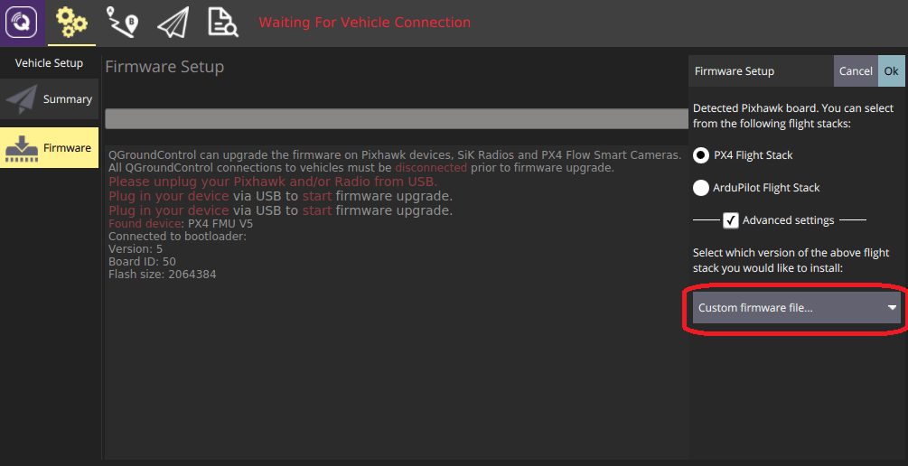

# Adding a Frame Configuration

PX4 [frame configuration files](#configuration-file-overview) are shell scripts that set up some (or all) of the parameters, controllers and apps needed for a particular vehicle frame, such as a quadcopter, ground vehicle, or boat.
These scripts are executed when the corresponding [airframe is selected and applied](../config/airframe.md) in _QGroundControl_.

The configuration files that are compiled into firmware for NuttX targets are located in the [ROMFS/px4fmu_common/init.d](https://github.com/PX4/PX4-Autopilot/tree/main/ROMFS/px4fmu_common/init.d) folder (configuration files for POSIX simulators are stored in [ROMFS/px4fmu_common/init.d-posix](https://github.com/PX4/PX4-Autopilot/tree/main/ROMFS/px4fmu_common/init.d-posix/airframes)).
Папка містить як повні конфігурації для конкретних транспортних засобів, так і часткові "загальні конфігурації" для різних типів транспортних засобів.
Загальні конфігурації часто використовуються як вихідна точка для створення нових файлів конфігурації.

Додатково, файл конфігурації рами також може бути завантажений з SD-карти.

:::info
You can also "tweak" the current frame configuration using text files on the SD card.
This is covered in [System Startup > Customizing the System Startup](../concept/system_startup.md#customizing-the-system-startup) page.
:::

:::info
To determine which parameters/values need to be set in the configuration file, you can first assign a generic airframe and tune the vehicle, and then use [`param show-for-airframe`](../modules/modules_command.md#param) to list the parameters that changed.
:::

## Налаштування кадру в розробці

Рекомендований процес розробки нової конфігурації кадру:

1. Start by selecting an appropriate "generic configuration" for the target vehicle type in QGC, such as _Generic Quadcopter_.
2. Configure the [geometry and actuator outputs](../config/actuators.md).
3. Perform other [basic configuration](../config/index.md).
4. Налаштуйте транспортний засіб.
5. Run the [`param show-for-airframe`](../modules/modules_command.md#param) console command to list the parameter difference compared to the original generic airframe.

Після того, як ви маєте параметри, ви можете створити новий файл конфігурації рами, скопіювавши файл конфігурації для загальної конфігурації та додавши нові параметри.

Alternatively you can just append the modified parameters to the startup configuration files described in [System Startup > Customizing the System Startup](../concept/system_startup.md#customizing-the-system-startup) ("tweaking the generic configuration").

## Як додати конфігурацію до прошивки

Як додати конфігурацію до прошивки:

1. Create a new config file in the [init.d/airframes](https://github.com/PX4/PX4-Autopilot/tree/main/ROMFS/px4fmu_common/init.d/airframes) folder.
   - Give it a short descriptive filename and prepend the filename with an unused autostart ID (for example, `1033092_superfast_vtol`).
   - Оновіть файл з параметрами конфігурації та програмами (див. вище).
2. Add the name of the new frame config file to the [CMakeLists.txt](https://github.com/PX4/PX4-Autopilot/blob/main/ROMFS/px4fmu_common/init.d/airframes/CMakeLists.txt) in the relevant section for the type of vehicle.
3. [Build and upload](../dev_setup/building_px4.md) the software.

## Як додати конфігурацію на SD-карту

Файл конфігурації рами, що буде запущений з SD-карти, такий самий, як той, що зберігається в прошивці.

To make PX4 launch with a frame configuration, renamed it to `rc.autostart` and copy it to the SD card at `/ext_autostart/rc.autostart`.
PX4 знайде будь-які пов’язані файли у мікропрограмі.

## Огляд файлу конфігурації

Файл конфігурації складається з кількох основних блоків:

- Documentation (used in the [Airframes Reference](../airframes/airframe_reference.md) and _QGroundControl_).
  Специфічні налаштування параметрів планера
  - The configuration and geometry using [control allocation](../concept/control_allocation.md) parameters
  - [Tuning gains](#tuning-gains)
- Контролери та програми, які мають запускатися, такі як контролери багатороторників або фіксованих крил, детектори посадки та інше.

Ці аспекти в основному незалежні, що означає, що багато конфігурацій використовують ту саму фізичну конструкцію літального апарату, запускають ті ж самі додатки і відрізняються переважно у своїх налаштуваннях.

:::info
New frame configuration files are only automatically added to the build system after a clean build (run `make clean`).
:::

## Force Reset of Airframe Parameters on Update

To force a reset to the airframe defaults for all users of a specific airframe during update, increase the `PARAM_DEFAULTS_VER` variable in the airframe configuration.
It starts at `1` in [rcS](https://github.com/PX4/PX4-Autopilot/blob/main/ROMFS/px4fmu_common/init.d/rcS#L40).
Add `set PARAM_DEFAULTS_VER 2` in your airframe file, increasing the value with each future reset needed.

This value is compared to [SYS_PARAM_VER](https://github.com/PX4/PX4-Autopilot/pull/advanced_config/parameter_reference.md#SYS_PARAM_VER) during PX4 updates.
If different, user-customized parameters are reset to defaults.

Note that system parameters primarily include those related to the vehicle airframe configuration.
Parameters such as accumulating flight hours, RC and sensor calibrations, are preserved.

### Приклад - загальна конфігурація рами квадрокоптера

The configuration file for a generic Quad X copter is shown below ([original file here](https://github.com/PX4/PX4-Autopilot/blob/main/ROMFS/px4fmu_common/init.d/airframes/4001_quad_x)).
Це дуже просто, оскільки воно визначає лише мінімальні налаштування, загальні для всіх квадрокоптерів.

Перший рядок — це shebang, який повідомляє операційній системі NuttX (на якій працює PX4), що файл конфігурації є виконуваним сценарієм оболонки.

```c
#!/bin/sh
```

Далі йде кадрова документація.
The `@name`, `@type` and `@class` are used to identify and group the frame in the [API Reference](../airframes/airframe_reference.md#copter_quadrotor_x_generic_quadcopter) and QGroundControl Airframe Selection.

```plain
# @name Generic Quadcopter
#
# @type Quadrotor x
# @class Copter
#
# @maintainer Lorenz Meier <lorenz@px4.io>
#
```

The next line imports generic parameters that are appropriate for all vehicles of the specified type (see [init.d/rc.mc_defaults](https://github.com/PX4/PX4-Autopilot/blob/main/ROMFS/px4fmu_common/init.d/rc.mc_defaults)).

```plain
. ${R}etc/init.d/rc.mc_defaults
```

Finally the file lists the control allocation parameters (starting with `CA_` that define the default geometry for the frame.
These may be modified for your frame geometry in the [Actuators Configuration](../config/actuators.md), and output mappings may be added.

```sh
param set-default CA_ROTOR_COUNT 4
param set-default CA_ROTOR0_PX 0.15
param set-default CA_ROTOR0_PY 0.15
param set-default CA_ROTOR1_PX -0.15
param set-default CA_ROTOR1_PY -0.15
param set-default CA_ROTOR2_PX 0.15
param set-default CA_ROTOR2_PY -0.15
param set-default CA_ROTOR2_KM -0.05
param set-default CA_ROTOR3_PX -0.15
param set-default CA_ROTOR3_PY 0.15
param set-default CA_ROTOR3_KM -0.05
```

### Example - HolyBro QAV250 Complete Vehicle

A more complete configuration file for a real vehicle is provided below.
This is the configuration for the [HolyBro QAV250](../frames_multicopter/holybro_qav250_pixhawk4_mini.md) quadrotor ([original file here](https://github.com/PX4/PX4-Autopilot/blob/main/ROMFS/px4fmu_common/init.d/airframes/4052_holybro_qav250)).

The shebang and documentation sections are similar to those for the generic frame.
Here we also add a `@url` link to the vehicle documentation, a `@maintainer`, and additional board exclusions.

```sh
#!/bin/sh
#
# @name HolyBro QAV250
#
# @url https://docs.px4.io/main/en/frames_multicopter/holybro_qav250_pixhawk4_mini
#
# @type Quadrotor x
# @class Copter
#
# @maintainer Beat Kueng <beat-kueng@gmx.net>
#
# @board px4_fmu-v2 exclude
# @board bitcraze_crazyflie exclude
# @board px4_fmu-v6x exclude
# @board ark_fmu-v6x exclude
#
```

Next, we source the multicopter defaults.

```sh
. ${R}etc/init.d/rc.mc_defaults
```

Then we define configuration parameters and [tuning gains](#tuning-gains):

```sh
# The set does not include a battery, but most people will probably use 4S
param set-default BAT1_N_CELLS 4

param set-default IMU_GYRO_CUTOFF 120
param set-default IMU_DGYRO_CUTOFF 45

param set-default MC_AIRMODE 1
param set-default MC_PITCHRATE_D 0.0012
param set-default MC_PITCHRATE_I 0.35
param set-default MC_PITCHRATE_MAX 1200
param set-default MC_PITCHRATE_P 0.082
param set-default MC_PITCH_P 8
param set-default MC_ROLLRATE_D 0.0012
param set-default MC_ROLLRATE_I 0.3
param set-default MC_ROLLRATE_MAX 1200
param set-default MC_ROLLRATE_P 0.076
param set-default MC_ROLL_P 8
param set-default MC_YAWRATE_I 0.3
param set-default MC_YAWRATE_MAX 600
param set-default MC_YAWRATE_P 0.25
param set-default MC_YAW_P 4

param set-default MPC_MANTHR_MIN 0
param set-default MPC_MAN_TILT_MAX 60
param set-default MPC_THR_CURVE 1
param set-default MPC_THR_HOVER 0.25
param set-default MPC_THR_MIN 0.05
param set-default MPC_Z_VEL_I_ACC 1.7

param set-default THR_MDL_FAC 0.3
```

Last of all, the file defines the control allocation parameters for the geometry and the parameters that set which outputs map to different motors.

```sh
# Square quadrotor X PX4 numbering
param set-default CA_ROTOR_COUNT 4
param set-default CA_ROTOR0_PX 1
param set-default CA_ROTOR0_PY 1
param set-default CA_ROTOR1_PX -1
param set-default CA_ROTOR1_PY -1
param set-default CA_ROTOR2_PX 1
param set-default CA_ROTOR2_PY -1
param set-default CA_ROTOR2_KM -0.05
param set-default CA_ROTOR3_PX -1
param set-default CA_ROTOR3_PY 1
param set-default CA_ROTOR3_KM -0.05

param set-default PWM_MAIN_FUNC1 101
param set-default PWM_MAIN_FUNC2 102
param set-default PWM_MAIN_FUNC3 103
param set-default PWM_MAIN_FUNC4 104
```

## Додавання нової групи планера

Airframe "groups" are used to group similar airframes for selection in [QGroundControl](https://docs.qgroundcontrol.com/master/en/qgc-user-guide/setup_view/airframe.html) and in the [Airframe Reference](../airframes/airframe_reference.md).
Кожна група має назву та пов'язаний з нею зображення у форматі Svg, яке показує загальну геометрію, кількість двигунів та напрямок обертання двигунів для повітряних каркасів, що належать до цієї групи.

The airframe metadata files used by _QGroundControl_ and the documentation source code are generated from the airframe description, via a script, using the build command: `make airframe_metadata`

For a new frame belonging to an existing group, you don't need to do anything more than provide documentation in the airframe description located at
[ROMFS/px4fmu_common/init.d](https://github.com/PX4/PX4-Autopilot/tree/main/ROMFS/px4fmu_common/init.d).

If the airframe is for a **new group** you additionally need to:

1. Add the svg image for the group into user guide documentation (if no image is provided a placeholder image is displayed): [assets/airframes/types](https://github.com/PX4/PX4-user_guide/tree/master/assets/airframes/types)

2. Add a mapping between the new group name and image filename in the [srcparser.py](https://github.com/PX4/PX4-Autopilot/blob/main/Tools/px4airframes/srcparser.py) method `GetImageName()` (follow the pattern below):

   ```python
   def GetImageName(self):
       """
       Get parameter group image base name (w/o extension)
       """
       if (self.name == "Standard Plane"):
           return "Plane"
       elif (self.name == "Flying Wing"):
           return "FlyingWing"
        ...
    ...
       return "AirframeUnknown"
   ```

3. Update _QGroundControl_:
   - Add the svg image for the group into: [src/AutopilotPlugins/Common/images](https://github.com/mavlink/qgroundcontrol/tree/master/src/AutoPilotPlugins/Common/Images)
   - Add reference to the svg image into [qgcimages.qrc](https://github.com/mavlink/qgroundcontrol/blob/master/qgcimages.qrc), following the pattern below:

     ```xml
     <qresource prefix="/qmlimages">
        ...
        <file alias="Airframe/AirframeSimulation">src/AutoPilotPlugins/Common/Images/AirframeSimulation.svg</file>
        <file alias="Airframe/AirframeUnknown">src/AutoPilotPlugins/Common/Images/AirframeUnknown.svg</file>
        <file alias="Airframe/Boat">src/AutoPilotPlugins/Common/Images/Boat.svg</file>
        <file alias="Airframe/FlyingWing">src/AutoPilotPlugins/Common/Images/FlyingWing.svg</file>
        ...
     ```

     ::: info
     The remaining airframe metadata should be automatically included in the firmware (once **srcparser.py** is updated).

:::

## Підвищення налаштування

Наступні теми пояснюють, як налаштувати параметри, які будуть вказані у конфігураційному файлі:

- [Autotuning (Multicopter)](../config/autotune_mc.md) (or [Multicopter PID Tuning Guide](../config_mc/pid_tuning_guide_multicopter.md))
- [Autotuning (Fixed-wing)](../config/autotune_fw.md) (or [Fixed-wing PID Tuning Guide](../config_fw/pid_tuning_guide_fixedwing.md))
- [Autotuning (VTOL)](../config/autotune_vtol.md) ([VTOL Configuration](../config_vtol/index.md))

## Додайте фрейм до QGroundControl

To make a new airframe available for section in the _QGroundControl_ [frame configuration](../config/airframe.md):

1. Make a clean build (e.g. by running `make clean` and then `make px4_fmu-v5_default`)
2. Open QGC and select **Custom firmware file...** as shown below:



You will be asked to choose the **.px4** firmware file to flash (this file is a zipped JSON file and contains the airframe metadata).

1. Navigate to the build folder and select the firmware file (e.g. **PX4-Autopilot/build/px4_fmu-v5_default/px4_fmu-v5_default.px4**).
2. Press **OK** to start flashing the firmware.
3. Restart _QGroundControl_.

The new frame will then be available for selection in _QGroundControl_.
