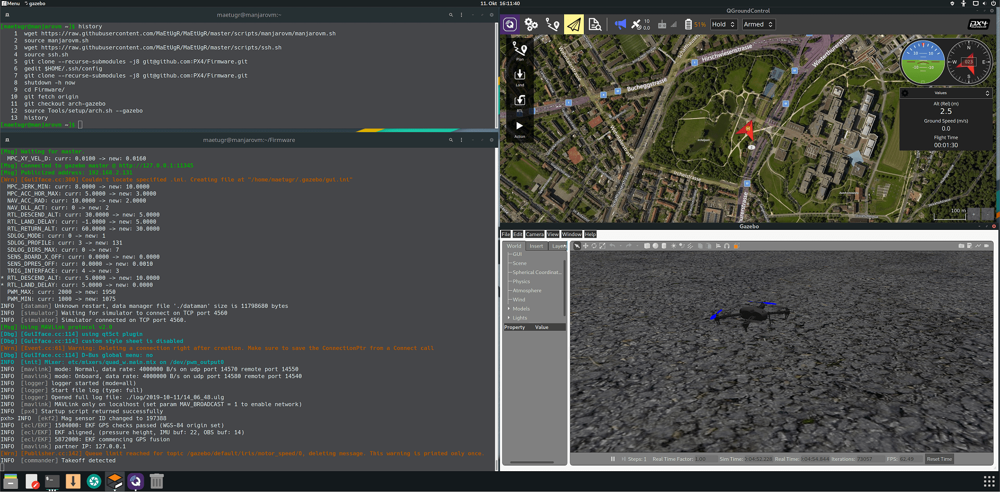

# Середовище розробки Arch Linux

:::warning
This development environment is [community supported and maintained](../advanced/community_supported_dev_env).
Це може працювати або не працювати з поточними версіями PX4.

Дивіться [Встановлення інструментарію](../dev_setup/dev_env.md) для інформації про середовища та інструменти, що підтримуються основною командою розробників.
:::

The PX4-Autopilot repository provides a convenient script to set your Arch installation up for PX4 development: [Tools/setup/arch.sh](https://github.com/PX4/PX4-Autopilot/blob/main/Tools/setup/arch.sh). <!-- NEED px4_version -->

The script installs (by default) all tools to build PX4 for NuttX targets and run simulation with [JMAVSim](../sim_jmavsim/index.md).
You can additionally install the [Gazebo Classic](../sim_gazebo_classic/index.md) simulator by specifying the command line argument: `--gazebo`.



:::info
The instructions have been tested on [Manjaro](https://manjaro.org/) (Arch based distribution) as it is much easier to set up than Arch Linux.
:::

Щоб отримати та запустити скрипти, виконайте одне із наступного:

- [Download PX4 Source Code](../dev_setup/building_px4.md) and run the scripts in place:

  ```sh
  git clone https://github.com/PX4/PX4-Autopilot.git
  bash PX4-Autopilot/Tools/setup/arch.sh
  ```

- Завантажте лише необхідні скрипти та запустіть їх:

  ```sh
  wget https://raw.githubusercontent.com/PX4/PX4-Autopilot/main/Tools/setup/arch.sh
  wget https://raw.githubusercontent.com/PX4/PX4-Autopilot/main/Tools/setup/requirements.txt
  bash arch.sh
  ```

Скрипт приймає наступні параметри:

- `--gazebo`: Add this parameter to install Gazebo from the [AUR](https://aur.archlinux.org/packages/gazebo/).

  ::: info
  Gazebo gets compiled from source.
  It takes some time to install and requires entering the `sudo` password multiple times (for dependencies).

:::

- `--no-nuttx`: Do not install the NuttX/Pixhawk toolchain (i.e. if only using simulation).

- `--no-sim-tools`: Do not install jMAVSim/Gazebo (i.e. if only targeting Pixhawk/NuttX targets)
