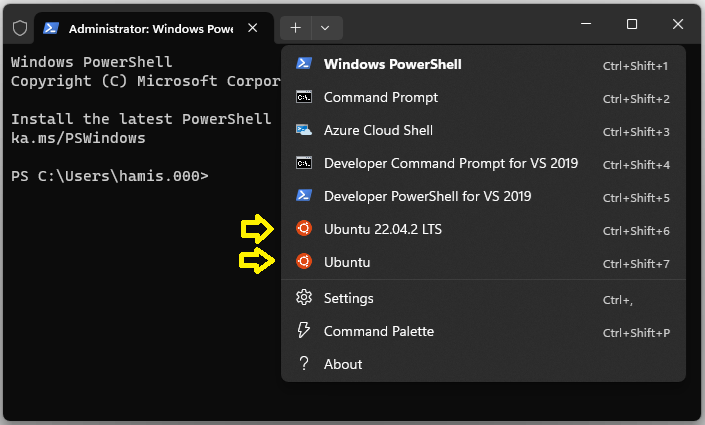
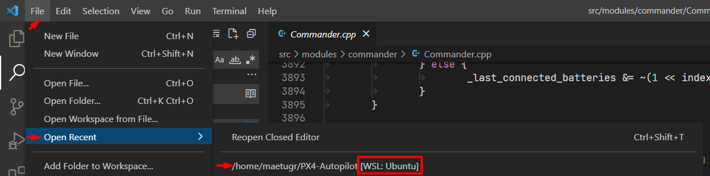

# Середовище розробки Windows (засноване на WSL2)

The following instructions explain how to set up a PX4 development environment on Windows 10 or 11, running on Ubuntu Linux within [WSL2](https://docs.microsoft.com/en-us/windows/wsl/about).

Це середовище може бути використане для збірки PX4 для:

- [Pixhawk and other NuttX-based hardware](../dev_setup/building_px4.md#nuttx-pixhawk-based-boards)
- [Gazebo Simulation](../sim_gazebo_gz/index.md)
- [Gazebo-Classic Simulation](../sim_gazebo_classic/index.md)

:::tip
This setup is supported by the PX4 dev team.
Середовище в теорії має бути здатне збирати будь-яку ціль збірки, яку можна зібрати на Ubuntu.
The list above are those targets that are regularly tested.
:::

## Загальний огляд

The [Windows Subsystem for Linux](https://docs.microsoft.com/en-us/windows/wsl/about) ([WSL2](https://docs.microsoft.com/en-us/windows/wsl/compare-versions)) allows users to install and run the [Ubuntu Development Environment](../dev_setup/dev_env_linux_ubuntu.md) on Windows, _almost_ as though we were running it on a Linux computer.

В цьому середовищі розробники можуть:

- Build any simulator or hardware target supported by [Ubuntu Development Environment](../dev_setup/dev_env_linux_ubuntu.md) in the WSL Shell.
  (Ubuntu є платформою розробки PX4, яка підтримується та протестована найкраще).
- Debug code in [Visual Studio Code](dev_env_windows_wsl.md#visual-studio-code-integration) running on Windows.
- Monitor a _simulation_ using _QGroundControl for Linux_ running in WSL.
  QGC для Linux автоматично під'єднується до симуляції.

_QGroundControl for Windows_ is additionally required if you need to:

- [Update firmware](#flash-a-flight-control-board) on a real vehicle.
- Спостерігати за справжнім засобом.
  Note that you can also use it to monitor a simulation, but you must manually [connect to the simulation running in WSL](#qgroundcontrol-on-windows).

:::info
Connecting to a USB device from within WSL is not supported, so you can't update firmware using the [`upload`](../dev_setup/building_px4.md#uploading-firmware-flashing-the-board) option when building on the command line, or from _QGroundControl for Linux_.
:::

:::info
The approach is similar to installing PX4 in your _own_ virtual machine, as described in [Windows VM-Hosted Toolchain](../dev_setup/dev_env_windows_vm.md).
Перевага WSL2 полягає в тому, що її віртуальна машина глибоко інтегрована в Windows, керується системою та оптимізована для ефективності.
:::

## Встановлення

### Встановлення WSL2

Щоб встановити WSL2 з Ubuntu на новій установці Windows 10 або 11:

1. Переконайтеся, що функція віртуалізації увімкнена в BIOS вашого комп'ютера.
  Зазвичай її називають "Virtualization Technology", "Intel VT-x" чи "AMD-V" відповідно.

2. Open _cmd.exe_ as administrator.
  This can be done by pressing the start key, typing `cmd`, right-clicking on the _Command prompt_ entry and selecting **Run as administrator**.

3. Виконайте наступні команди для встановлення WSL2 та певної версії Ubuntu:

  - Версія за замовчуванням (Ubuntu 22.04):

    ```sh
    wsl --install
    ```

  - Ubuntu 20.04 ([Gazebo-Classic Simulation](../sim_gazebo_classic/index.md))

    ```sh
    wsl --install -d Ubuntu-20.04
    ```

  - Ubuntu 22.04 ([Gazebo Simulation](../sim_gazebo_gz/index.md))

    ```sh
    wsl --install -d Ubuntu-22.04
    ```

  ::: info
  You can also install[Ubuntu 20.04](https://www.microsoft.com/store/productId/9MTTCL66CPXJ) and [Ubuntu 22.04](https://www.microsoft.com/store/productId/9PN20MSR04DW) from the store, which allows you to delete the application using the normal Windows Add/Remove settings:

:::

4. WSL запитає про ім'я користувача та пароль для встановлення Ubuntu.
  Запишіть ці облікові дані, оскільки вони знадобляться пізніше!

Тепер командний рядок є терміналом в нововстановленому середовищі Ubuntu.

### Відкриття оболонки WSL

Всі операції для встановлення та збірки PX4 повинні бути виконані в оболонці WSL (можна використати ту саму оболонку в якій встановлювалася WSL2 або відкрити нову).

If you're using [Windows Terminal](https://learn.microsoft.com/en-us/windows/terminal/install) you can open a shell into an installed WSL environment as shown, and exit it by closing the tab.



Щоб відкрити оболонку WSL за допомогою командного рядка:

1. Відкрийте командний рядок:

  - Press the Windows **Start** key.
  - Type `cmd` and press **Enter** to open the prompt.

2. Щоб запустити WSL і отримати доступ до WSL оболонки, виконайте команду:

  ```sh
  wsl -d <distribution_name>
  ```

  Наприклад:

  ```sh
  wsl -d Ubuntu
  ```

  ```sh
  wsl -d Ubuntu-20.04
  ```

  If you only have one version of Ubuntu, you can just use `wsl`.

Введіть наступні команди, щоб спочатку закрити WSL оболонку, а потім завершити WSL:

```sh
exit
wsl -d <distribution_name> --shutdown
```

Alternatively, after entering `exit` you can just close the prompt.

### Встановлення інструментарію PX4

Next we download the PX4 source code within the WSL2 environment, and use the normal _Ubuntu installer script_ to set up the developer environment.
This will install the toolchain for Gazebo Classic simulation and Pixhawk/NuttX hardware.

Щоб встановити інструментарій розробки:

1. [Open a WSL2 Shell](#opening-a-wsl-shell) (if it is still open you can use the same one that was used to install WSL2).

2. Execute the command `cd ~` to switch to the home folder of WSL for the next steps.

  :::warning
  This is important!
  Якщо ви працюєте за межами файлової системи WSL, то ви стикнетесь з такими проблемами, як дуже повільне виконання та помилки прав доступу/дозволів.

:::

3. Download the PX4 source code using `git` (which is already installed in WSL2):

  ```sh
  git clone https://github.com/PX4/PX4-Autopilot.git --recursive
  ```

  ::: info
  The environment setup scripts in the source usually work for recent PX4 releases.
  If working with an older version of PX4 you may need to [get the source code specific to your release](../contribute/git_examples.md#get-a-specific-release).

:::

4. Run the **ubuntu.sh** installer script and acknowledge any prompts as the script progresses:

  ```sh
  bash ./PX4-Autopilot/Tools/setup/ubuntu.sh
  ```

  ::: info
  This installs tools to build PX4 for Pixhawk and either Gazebo or Gazebo Classic targets:

  - You can use the `--no-nuttx` and `--no-sim-tools` options to omit the NuttX and/or simulation tools.
  - Other Linux build targets are untested (you can try these by entering the appropriate commands in [Ubuntu Development Environment](../dev_setup/dev_env_linux_ubuntu.md) into the WSL shell).

:::

5. Перезапустіть "комп'ютер WSL" після завершення скрипту (вийти з оболонки, вимкнути WSL та перезапустити WSL):

  ```sh
  exit
  wsl --shutdown
  wsl
  ```

6. Перейдіть в репозиторій PX4 в домашній директорії WSL:

  ```sh
  cd ~/PX4-Autopilot
  ```

7. Зберіть ціль PX4 SITL та перевірте середовище:

  ```sh
  make px4_sitl
  ```

For more build options see [Building PX4 Software](../dev_setup/building_px4.md).

## Інтеграція з Visual Studio Code

VS Code на Windows добре інтегрований з WSL.

Для налаштування інтеграції:

1. [Download](https://code.visualstudio.com/) and install Visual Studio Code (VS Code) on Windows,

2. Open _VS Code_.

3. Install the extension called [Remote - WSL](https://marketplace.visualstudio.com/items?itemName=ms-vscode-remote.remote-wsl) (marketplace)

4. [Open a WSL shell](#opening-a-wsl-shell)

5. У WSL оболонці перейдіть у директорію PX4:

  ```sh
  cd ~/PX4-Autopilot
  ```

6. В оболонці WSL запустіть VS Code:

  ```sh
  code .
  ```

  Це відкриє IDE повністю інтегроване в WSL оболонку.

  Переконайтеся, що ви завжди відкриваєте PX4 репозиторій у режимі Remote WSL.

7. Next time you want to develop WSL2 you can very easily open it again in Remote WSL mode by selecting **Open Recent** (as shown below).
  Це запустить WSL.

  

  Зверніть увагу, що IP-адреса віртуальної машини WSL буде змінена, так що ви не зможете контролювати симуляцію з QGC для Windows (ви все ще можете використовувати QGC для Linux)

## QGroundControl

Для підключення до запущеної симуляції, ви можете запустити QGroundControl або в WSL або у Windows.
If you need to [flash a flight control board](#flash-a-flight-control-board) with new firmware you can only do this from the QGroundControl for Windows.

### QGroundControl у WSL

Найпростіший спосіб налаштувати та використовувати QGroundControl - це завантажити версію для Linux у WSL.

Це можна зробити з оболонки WSL.

1. In a web browser, navigate to the QGC [Ubuntu download section](https://docs.qgroundcontrol.com/master/en/qgc-user-guide/getting_started/download_and_install.html#ubuntu)

2. Right-click on the **QGroundControl.AppImage** link, and select "Copy link address".
  This will be something like _https://d176td9ibe4jno.cloudfront.net/builds/master/QGroundControl.AppImage_

3. [Open a WSL shell](#opening-a-wsl-shell) and enter the following commands to download the appimage and make it executable (replace the AppImage URL where indicated):

  ```sh
  cd ~
  wget <the_copied_AppImage_URL>
  chmod +x QGroundControl.AppImage
  ```

4. Запустіть QGroundControl:

  ```sh
  ./QGroundControl.AppImage
  ```

QGroundControl запуститься та автоматично приєднається до запущеної симуляції, що дозволить вам спостерігати та контролювати ваші рухомі засоби.

Ви не зможете використовувати його для встановлення прошивки PX4, оскільки WSL не надає доступу до послідовних пристроїв.

### QGroundControl on Windows

Install [QGroundControl on Windows](https://docs.qgroundcontrol.com/master/en/qgc-user-guide/getting_started/download_and_install.html#windows) if you want to be able to update hardware with firmware created within PX4.

Ці кроки описують, як ви можете під'єднатися до симуляції, яке працює в WSL:

1. [Open a WSL shell](#opening-a-wsl-shell)

2. Check the IP address of the WSL virtual machine by running the command `ip addr | grep eth0`:

  ```sh
  $ ip addr | grep eth0

  6: eth0: <BROADCAST,MULTICAST,UP,LOWER_UP> mtu 1500 qdisc mq state UP group default qlen 1000
      inet 172.18.46.131/20 brd 172.18.47.255 scope global eth0
  ```

  Copy the first part of the `eth0` interface `inet` address to the clipboard.
  In this case: `172.18.46.131`.

3. In QGC go to **Q > Application Settings > Comm Links**

4. Add a UDP Link called "WSL" to port `18570` of the IP address copied above.

5. Збережіть і під'єднайтеся до нього.

:::info
You will have to update the WSL comm link in QGC every time WSL restarts (because it gets a dynamic IP address).
:::

## Прошивка плати керування польотом

Flashing a custom built PX4 binary has to be done using [QGroundControl for Windows](#qgroundcontrol-on-windows).

:::info
WSL2 does not natively offer direct access to serial/USB devices like Pixhawk flight controllers connected to your computer.
That means you can't connect QGC running inside WSL2 to a flight controller to install firmware, or use the `upload` command to [upload firmware as it is built](../dev_setup/building_px4.md#uploading-firmware-flashing-the-board).
Instead you connect [QGroundControl for Windows](#qgroundcontrol-on-windows) to PX4 running in WSL2 and to the Flight controller in order to upload the firmware.
:::

Зробіть наступні кроки для прошивки вашого бінарного файлу, зібраного у WSL:

1. If you haven't already built the binary in WSL e.g. with a [WSL shell](dev_env_windows_wsl.md#opening-a-wsl-shell) and by running:

  ```sh
  cd ~/PX4-Autopilot
  make px4_fmu-v5
  ```

  ::: tip
  Use the correct `make` target for your board.
  `px4_fmu-v5` can be used for a Pixhawk 4 board.

:::

2. Detach the USB cable of your Pixhawk board from the computer if it was connected.

3. Open QGC and navigate to **Q > Vehicle Setup > Firmware**.

4. Plug your Pixhawk board via USB

5. Once connected select "PX4 Flight Stack", check **Advanced settings** and choose _Custom firmware file ..._ from the drop down below.

6. Continue and select the firmware binary you just built in WSL.

  У відкритому діалозі знайдіть розташування "Linux" з іконкою пінгвіна на лівій панелі.
  Зазвичай, вона в самому низу.
  Choose the file in the path: `Ubuntu\home\{your WSL user name}\PX4-Autopilot\build\{your build target}\{your build target}.px4`

  ::: info
  You can add the folder to the favourites to access it quickly next time.

:::

7. Почніть прошивку.

For more information see [Installing PX4 Main, Beta or Custom Firmware (Loading Firmware)](../config/firmware.md#installing-px4-main-beta-or-custom-firmware).

## Усунення проблем

If you have any problems with your setup, check the current [Microsoft WSL installation documentation](https://learn.microsoft.com/en-us/windows/wsl/install).

We also recommend that you have the latest Windows GPU drivers installed and also install a recent version of [kisak mesa](https://launchpad.net/~kisak/+archive/ubuntu/kisak-mesa) in your Ubuntu environment so that most OpenGL features get emulated:

```sh
sudo add-apt-repository ppa:kisak/kisak-mesa
sudo apt update
sudo apt upgrade
```
