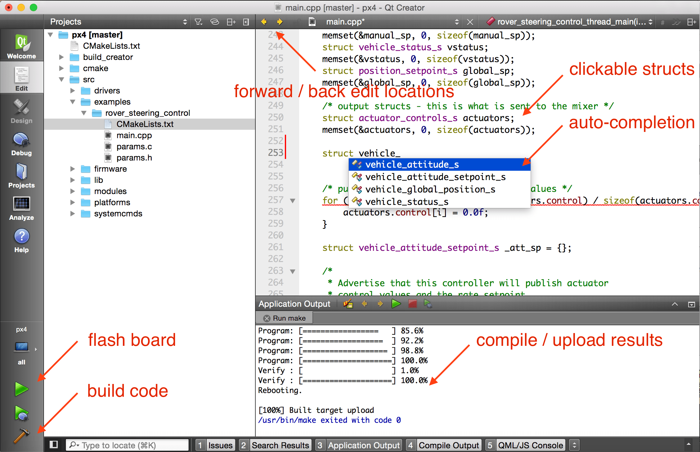

# Qt Creator IDE

:::warning
This development environment is [community supported and maintained](../advanced/community_supported_dev_env.md).
Це може працювати або не працювати з поточними версіями PX4.

Qt Creator has been replaced by [VSCode](../dev_setup/vscode.md) as the officially supported (and recommended) IDE for PX4 development.
Дивіться [Встановлення інструментарію](../dev_setup/dev_env.md) для інформації про середовища та інструменти, що підтримуються основною командою розробників.
:::

[Qt Creator](https://www.qt.io/download-open-source) is a popular cross-platform open-source IDE that can be used to compile and debug PX4.

## Функціональні можливості Qt Creator

Qt creator пропонує роботу із символами мови Сі за допомогою миші, автодоповнення для всієї бази коду, збірки та запису прошивки.



Наведене нижче відео показує, як воно використовується.

<lite-youtube videoid="Bkk8zttWxEI" title="(Qt Creator) PX4 Flight Stack Build Experience"/>

## Налаштування IDE

### Qt Creator на Linux

Before starting Qt Creator, the [project file](https://gitlab.kitware.com/cmake/community/-/wikis/doc/cmake/Generator-Specific-Information#codeblocks-generator) needs to be created:

```sh
cd ~/src/PX4-Autopilot
mkdir ../Firmware-build
cd ../Firmware-build
cmake ../PX4-Autopilot -G "CodeBlocks - Unix Makefiles"
```

Then load the CMakeLists.txt in the root PX4-Autopilot folder via **File > Open File or Project** (Select the CMakeLists.txt file).

After loading, the **play** button can be configured to run the project by selecting 'custom executable' in the run target configuration and entering 'make' as executable and 'upload' as argument.

### Qt Creator на Windows

:::info
Windows has not been tested for PX4 development with Qt Creator.
:::

### Qt Creator на macOS

Before starting Qt Creator, the [project file](https://gitlab.kitware.com/cmake/community/-/wikis/doc/cmake/Generator-Specific-Information#codeblocks-generator) needs to be created:

```sh
cd ~/src/PX4-Autopilot
mkdir -p build/creator
cd build/creator
cmake ../.. -G "CodeBlocks - Unix Makefiles"
```

Ось і все! Start _Qt Creator_ and then set up the project to build.

<!-- note, video here was removed/made private, and in any case out of date. Just hoping people can work it out -->
