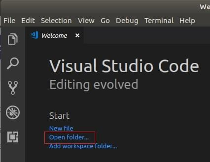
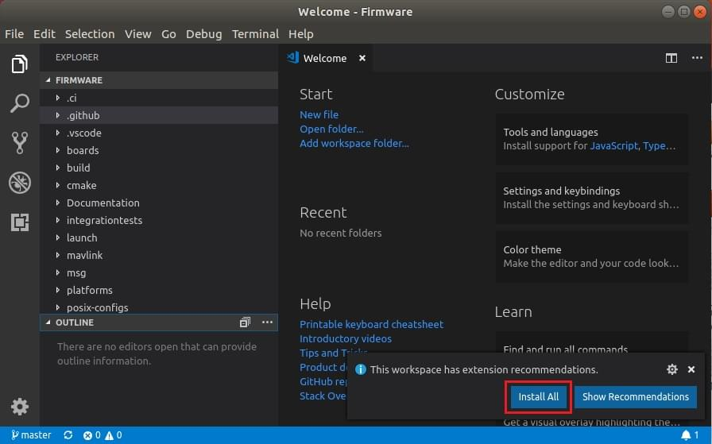
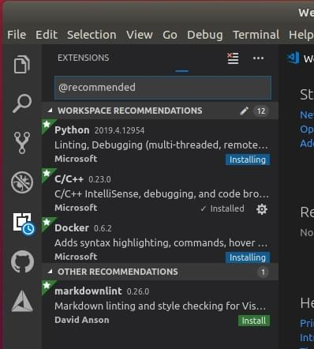
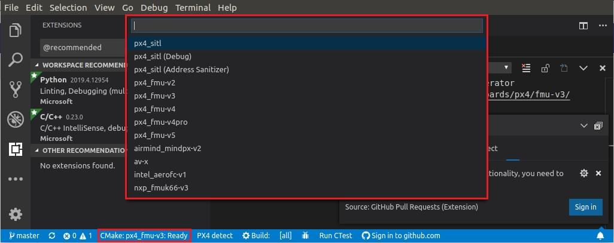
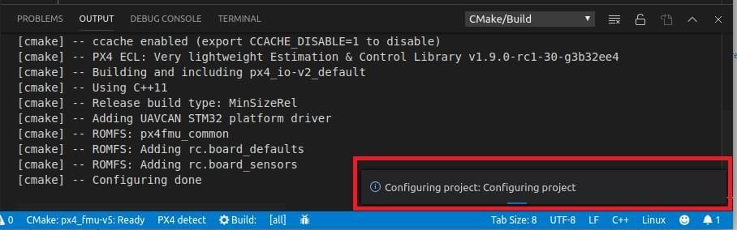
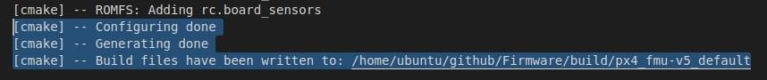
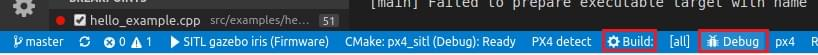
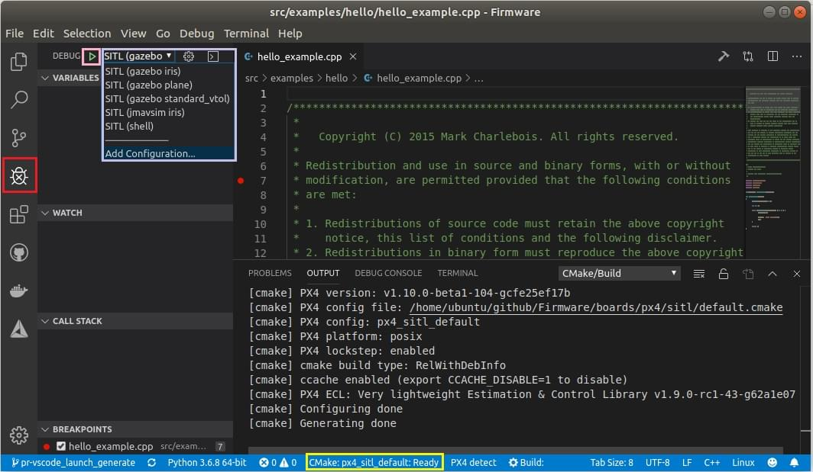
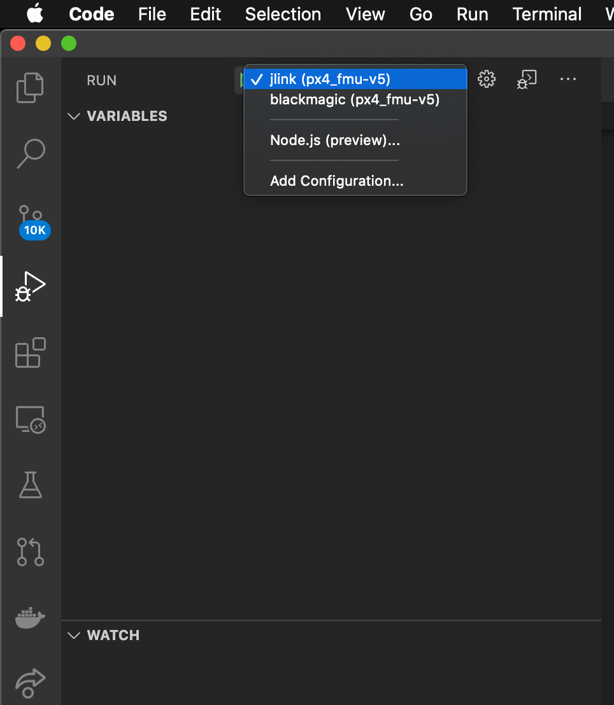
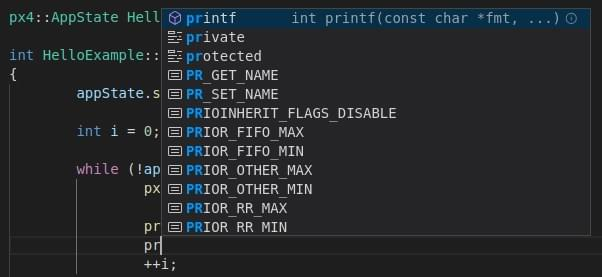

# Visual Studio Code IDE (VSCode)

[Visual Studio Code](https://code.visualstudio.com/) is a powerful cross-platform source code editor/IDE that can be used for PX4 development on Ubuntu, Windows, and macOS.

Є багато причин використання VSCode для розробки PX4:

- Getting setup _really_ only takes a few minutes.
- A rich extension ecosystem that enables a huge range of tools needed for PX4 development: C/C++ (with solid _cmake_ integration), _Python_, _Jinja2_, ROS messages, and even DroneCAN dsdl.
- Чудова інтеграція з Github.

Цей розділ пояснює, як налаштувати IDE і почати розробку.

:::info
There are other powerful IDEs, but they typically take more effort to integrate with PX4.
With _VScode_, configuration is stored in the PX4/PX4-Autopilot tree ([PX4-Autopilot/.vscode](https://github.com/PX4/PX4-Autopilot/tree/main/.vscode)) so the setup process is as simple as adding the project folder.
:::

## Передумови

You must already have installed the command line [PX4 developer environment](../dev_setup/dev_env.md) for your platform and downloaded the _Firmware_ source code repo.

## Installation & Setup

1. [Download and install VSCode](https://code.visualstudio.com/) (you will be offered the correct version for your OS).

2. Відкрийте VSCode і додайте вихідний код PX4:

   - Select _Open folder ..._ option on the welcome page (or using the menu: **File > Open Folder**):
      
   - З'явиться діалогове вікно вибору файлу.
      Select the **PX4-Autopilot** directory and then press **OK**.

   The project files and configuration will then load into _VSCode_.

3. Press **Install All** on the _This workspace has extension recommendations_ prompt (this will appear on the bottom right of the IDE).
   

   VSCode will open the _Extensions_ panel on the left hand side so you can watch the progress of installation.

   

4. Багато повідомлень/підказок може з'явитися в правому нижньому куті

   :::tip
   If the prompts disappear, click the little "alarm" icon on the right of the bottom blue bar.

:::

   - If prompted to install a new version of _cmake_:
      - Say **No** (the right version is installed with the [PX4 developer environment](../dev_setup/dev_env.md)).
   - If prompted to sign into _github.com_ and add your credentials:
      - Це ваш розсуд! Це забезпечує глибоку інтеграцію між Github та IDE, що може спростити ваш робочий процес.
   - Інші підказки необов'язкові та можуть бути встановлені, якщо вважаються корисними. <!-- perhaps add screenshot of these prompts -->

## Збірка PX4

Для збірки:

1. Оберіть свою ціль збірки ("cmake build config"):

   - The current _cmake build target_ is shown on the blue _config_ bar at the bottom (if this is already your desired target, skip to next step).
      

      ::: info
      The cmake target you select affects the targets offered for when [building/debugging](#debugging) (i.e. for hardware debugging you must select a hardware target like `px4_fmu-v6`).

:::

   - Натисніть на ціль на панелі config, щоб показати інші параметри та вибрати ту, яка вам потрібна (це замінить обрану ціль).

   - _Cmake_ will then configure your project (see notification in bottom right).
      

   - Зачекайте, поки налаштування завершиться.
      When this is done the notification will disappear and you'll be shown the build location:
      .

2. You can then kick off a build from the config bar (select either **Build** or **Debug**).
   

After building at least once you can now use [code completion](#code completion) and other _VSCode_ features.

## Відлагодження

### Налагодження SITL

Для налагодження PX4 в SITL:

1. Select the debug icon on the sidebar (marked in red) to display the debug panel.
   

2. Then choose your debug target (e.g. _Debug SITL (Gazebo Iris)_) from the top bar debug dropdown (purple box).

   ::: info
   The debug targets that are offered (purple box) match your build target (yellow box on the bottom bar).
   Наприклад, для налагодження цілей збірки SITL, ваша ціль повинна містити SITL.

:::

3. Почніть налагодження, натиснувши стрілку "play" налагодження (поруч із ціллю налагодження у верхній панелі - позначено рожевою рамкою).

Під час налагодження ви можете встановити точки зупинки, переходити до коду, на відміну від нормального процесу розробки.

### Апаратне налагодження

The instructions in [SWD Debug Port](../debug/swd_debug.md) explain how to connect to the SWD interface on common flight controllers (for example, using the Dronecode or Blackmagic probes).

After connecting to the SWD interface, hardware debugging in VSCode is then the same as for [SITL Debugging](#debugging_sitl) except that you select a debug target appropriate for your debugger type (and firmware) - e.g. `jlink (px4_fmu-v5)`.

:::tip
To see the `jlink` option you must have selected a [cmake target for building firmware](#building-px4).
:::

## Автодоповнення коду

In order for the code completion to work (and other IntelliSense magic) you need an active configuration and to have [built the code](#building).

Після того, як це зроблено, вам не потрібно нічого робити; інструментарій автоматично запропонує вам символи мови поки ви друкуєте.

## Усунення проблем

Цей розділ включає вказівки для помилок з налаштування та збірки.

### Ubuntu 18.04: "Visual Studio Code не може спостерігати за змінами в коді у великому робочому середовищі"

Ця помилка з'являється при старті.
On some systems, there is an upper-limit of 8192 file handles imposed on applications, which means that VSCode might not be able to detect file modifications in `/PX4-Autopilot`.

Ви можете збільшити цей ліміт, щоб уникнути помилки, коштом споживання пам'яті.
Follow the [instructions here](https://code.visualstudio.com/docs/setup/linux#_visual-studio-code-is-unable-to-watch-for-file-changes-in-this-large-workspace-error-enospc).
Значення 65536 має бути більш ніж достатнім.
